## Table of contents
{: .no_toc .text-delta }

1. TOC
{:toc}
---

## **HTTP 기본**

**HTTP 역사**
{: .fh-default .fs-4 }

- HTTP/0.9 1991년 : GET메서드만 지원 , HTTP 헤더 X
- HTTP/1.0 1996년 : 메서드 , 헤더 추가
- **HTTP/1.1 1997년 : 가장 많이 사용 , 우리에게 가장 중요한 버전**
  - RFC2068(1997) → RFC2616(1999) →RFC7230~7235(2014)
- HTTP/2 2015년 : 성능 개선
- **HTTP/3 진행중 : TCP 대신에 UDP 사용 , 성능 개선**

**기반 프로토콜**
{: .fh-default .fs-4 }

- **TCP** : HTTP/1.1 , HTTP/2
- **UDP** : HTTP/3
- **현재 HTTP/1.1 주로 사용**
  - HTTP/2 , HTTP/3도 점점 증가
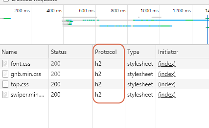

### 📌 HTTP 특징
{: .fh-default .fs-5 }

- **클라이언트 서버 구조**
- **무상태 프로토콜(stateless) , 비연결성**
- **HTTP 메시지**
- 단순함 , 확장 가능

##### 클라이언트 서버 구조
{: .fh-default .fs-4 }
- **`Request` `Response` 구조**
- **클라이언트는 서버에 요청을 보내고 , 응답을 대기**
- 서버가 요청에 대한 결과를 만들어서 응답
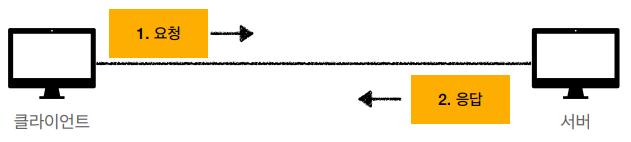

##### Stateless(무상태 프로토콜)
{: .fh-default .fs-4 }
- **서버가 클라이언트의 상태를 보존하지 않는다.**
- **장점 : 서버 확장성 높음 (스케일 아웃)**
- **단점 : 클라이언트가 추가 데이터 전송**
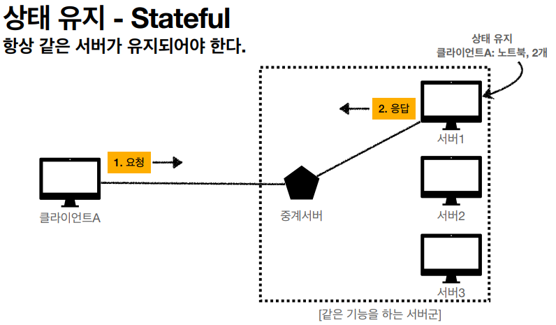
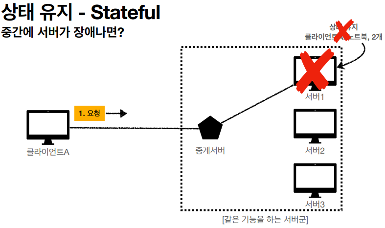
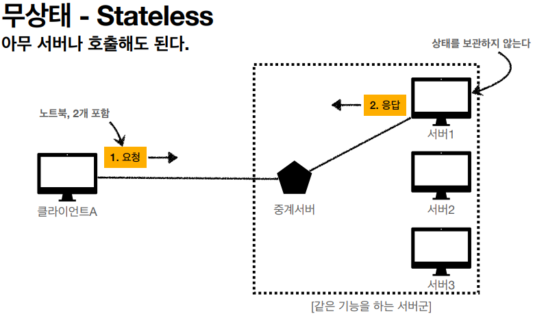
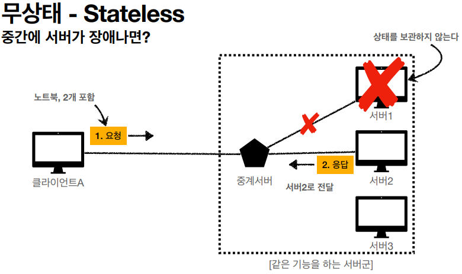
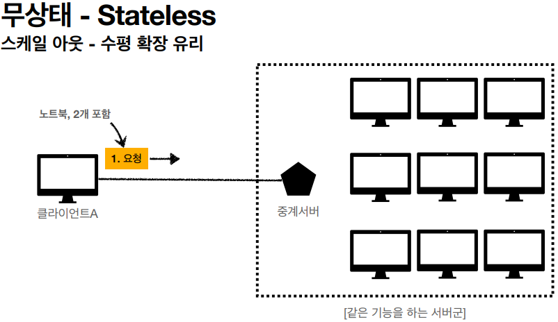

> ✋ **Stateless 실무 한계**
> - 모든 것을 무상태로 설계 할 수 있는 경우도 있고 없는 경우도 있다.
> - **무상태**
>   - 예) 로그인이 필요 없는 단순한 서비스 소개 화면
> - **상태 유지**
>   - 예) 로그인
> - **로그인한 사용자의 경우 로그인 했다는 상태를 서버에 유지**
> - **일반적으로 브라우저 쿠키와 서버 세션등을 사용해서 상태 유지**
> - **상태 유지는 최소한만 사용**

##### Connectionless(비 연결성)
{: .fh-default .fs-4 }
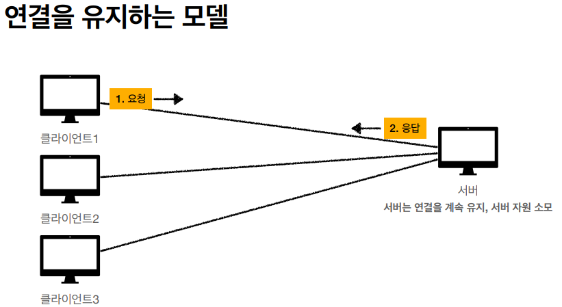
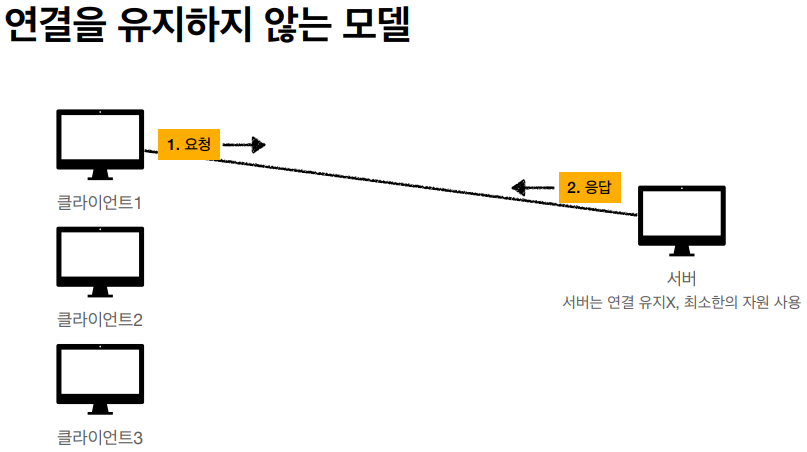
- **HTTP는 기본이 연결을 유지하지 않는 모델**
- **일반적으로 초 단위 이하의 빠른 속도로 응답**
- **1시간 동안 수천명이 서비스를 사용해도 실제 서버에서 동시에 처리하는 요청은 수십개 이하로 매우 작음**
- **서버 자원을 매우 효율적으로 사용할 수 있음**

###### 비 연결성 - 한계와 극복
{: .fh-default .fs-4 }
- **TCP/IP 연결을 새로 맺어야함 - 3 way handshake 시간 추가**
- **웹 브라우저로 사이트를 요청하면 HTML뿐만 아니라 자바스크립트 , CSS , 추가 이미지 등등 수많은 자원이 함께 다운로드**
- **지금은 HTTP 지속 연결 "[Persistent Connections](https://brunch.co.kr/@sangjinkang/4)"으로 문제 해결**
- HTTP/2 , HTTP/3에서 더 많은 최적화
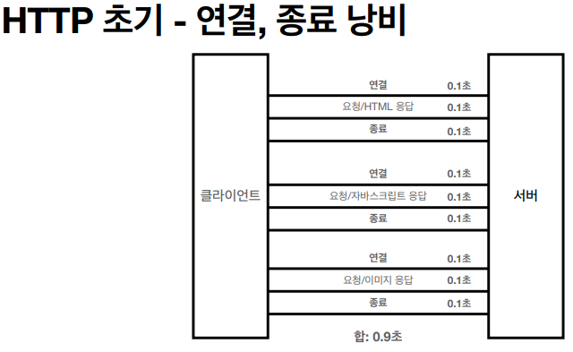
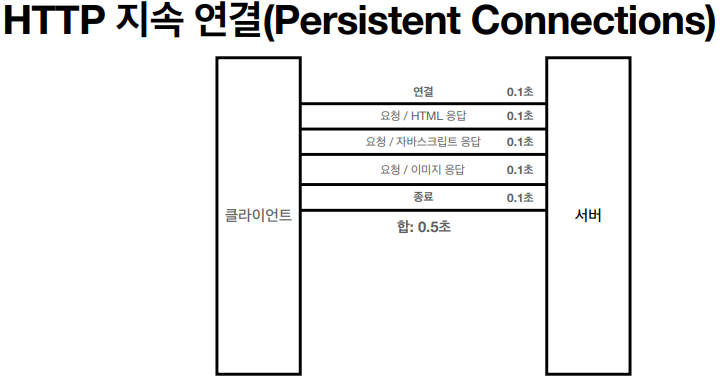

**Stateless를 기억하자**
- 서버 개발자들이 어려워 하는 업무
- 같은 시간에 딱 맞추어 발생하는 대용량 트래픽

### 📌 HTTP 메시지
{: .fh-default .fs-5 }

**HTTP 메시지에 모든 것을 전송**
- HTML , TEXT
- IMAGE, 음성 , 영상 , 파일
- JSON , XML(API)
- **거의 모든 형태의 데이터 전송 가능**
- **서버간에 데이터를 주고 받을 때도 대부분 HTTP 사용**
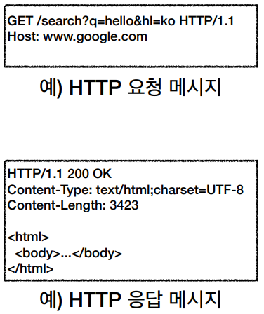
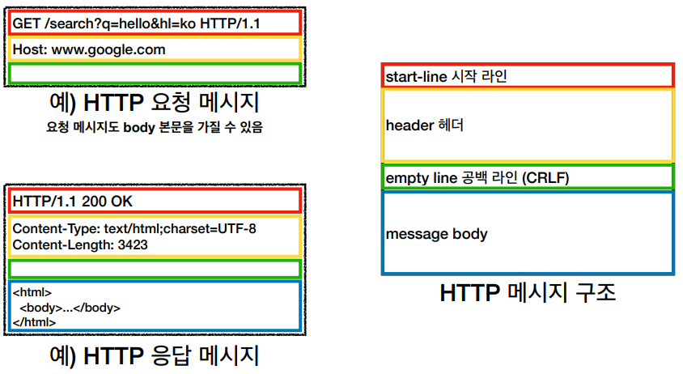
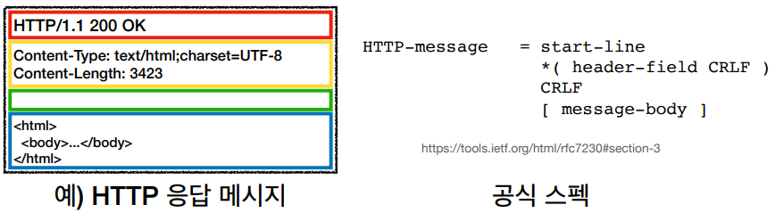

###### 시작 라인
{: .fh-default .fs-4 }

**요청 메시지**
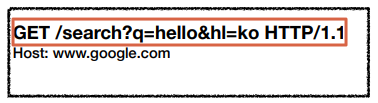
- request-line이라 한다.
- **request-line** / status-line
- **request-line** = **method** SP(공백) **request-target** SP **HTTP-version** CRLF(엔터)
  - **HTTP 메서드 (GET : 조회) 중요!**
    - 종류 : GET , POST , PUT , DELETE ...
    - 서버가 수행해야 할 동작 지정
      - GET :  리소스 조회
      - POST : 요청 내역 처리
  - **요청 대상** (/search?q=hello&hl=ko)
    - absolute-path[?query]  (절대경로[?쿼리])
    - 절대경로 :  "/"로 시작하는 경로
  - **HTTP Version**

**응답 메시지**
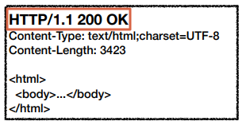
- status-line이라 한다.
- request-line / **status-line**
- **status-line** = **HTTP-version** SP **status-code** SP **reason-pharse** CRLF
  - HTTP 버전
  - HTTP 상태 코드 : 요청 성공 , 실패를 나타냄
    - 200 : 성공
    - 400 : 클라이언트 요청 오류
    - 500 : 서버 내부 오류
  - 이유 문구 : 사람이 이해할 수 있는 짧은 상태 코드 설명 글

###### HTTP 헤더
{: .fh-default .fs-4 }
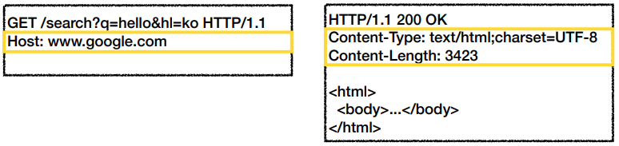
- header-field = field-name ":" OWS field-value OWS  (OWS : 띄어쓰기 허용)
- field-name은 대소문자 구분 없음

**용도**
- HTTP 전송에 필요한 모든 부가정보
  - 예) 메시지 바디의 내용 , 메시지 바디의 크기 , 압축 , 인증 , 요청 클라이언트(브라우저) 정보, 서버 애플리케이션 정보 , 캐시 관리 정보 ....
- 표준 헤더가 너무 많음
- 필요시 임의의 헤더 추가 가능
  - helloworld : hihi

###### HTTP 메시지 바디
{: .fh-default .fs-4 }
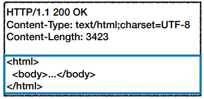

**용도**
- **실제 전송할 데이터**
- **❗ HTML 문서 , 이미지 , 영상 JSON 등등 byte로 표현할 수 있는 모든 데이터 전송 가능**
