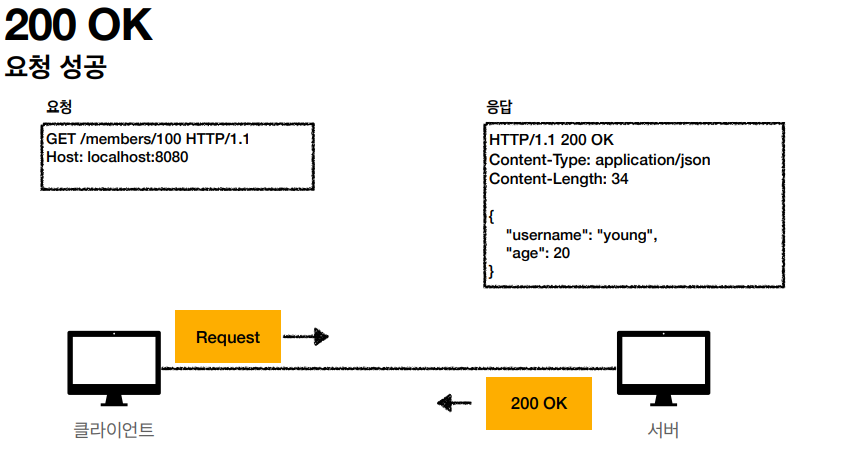
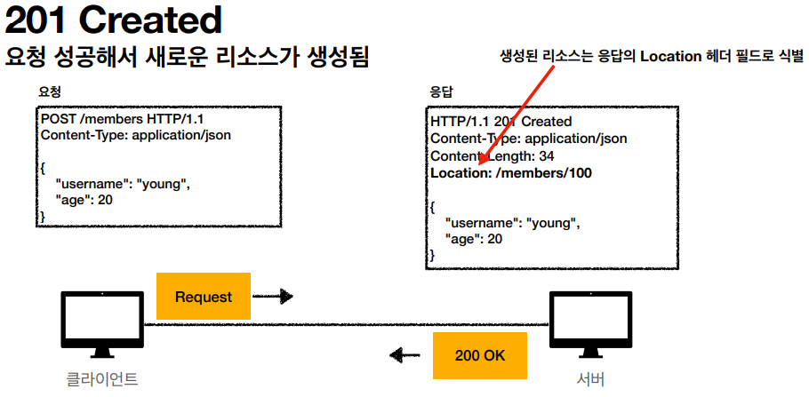
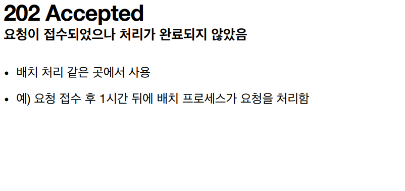
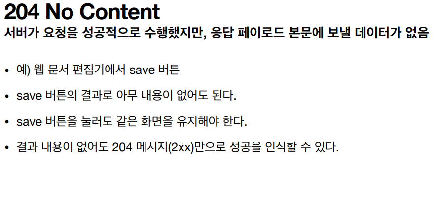
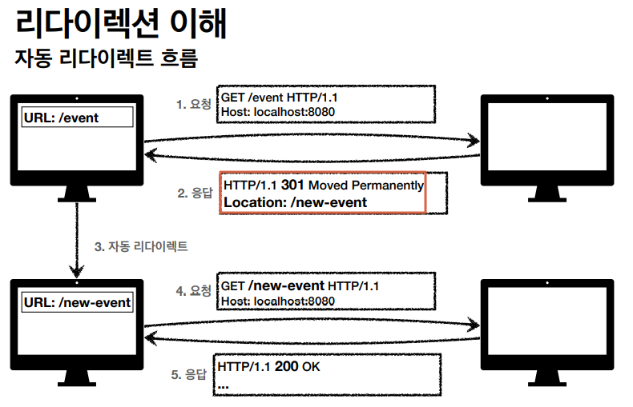
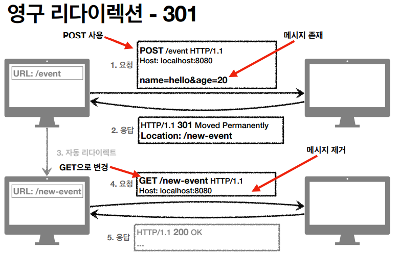
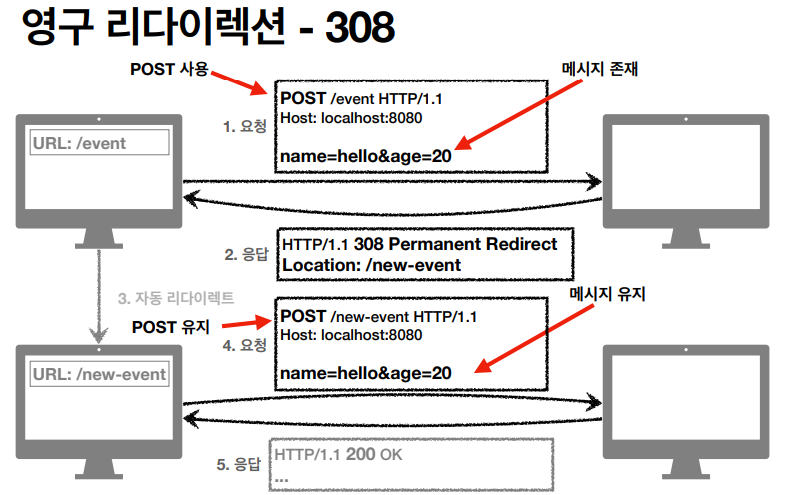
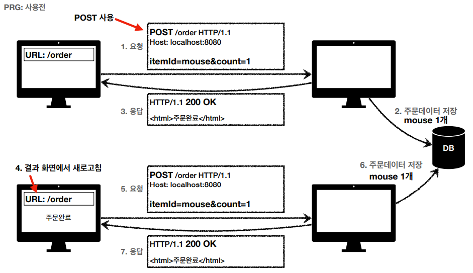
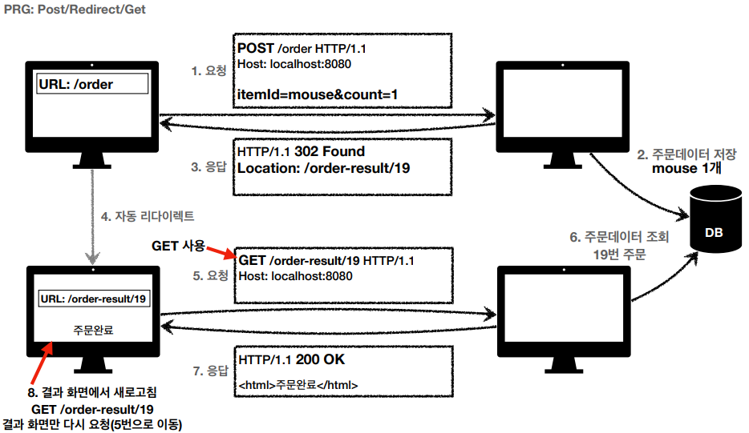

## Table of contents
{: .no_toc .text-delta }

1. TOC
{:toc}
---

**클라이언트가 보낸 요청의 처리 상태를 응답에서 알려주는 기능**
{: .fh-default .fs-5 }

-   **1xx (Informational) : 요청이 수신되어 처리중**
-   **2xx (Successful) : 요청 정상 처리**
-   **3xx (Redirection) : 요청을 완료하려면 추가 행동이 필요**
-   **4xx (Client Error) : 클라이언트 오류 , 잘못된 문법 등으로 서버가 요청을 수행할 수 없음**
-   **5xx (Server Error) : 서버 오류 , 서버가 정상 요청을 처리하지 못함**

**만약 모르는 상태 코드가 나타나면 ??**

-   클라이언트는 상위 상태코드로 해석해서 처리
-   예 ) 299 -> 2xx (Successful)

## **1xx (Informational)**

✅**거의 사용되지 않아 생략**

***

## **2xx (Successful)**

***

## **3xx (Redirection)**

✅**요청을 완료하기 위해 유저 에이전트(주로 웹 브라우저)의 추가 조치 필요**
✅**웹 브라우저는 3xx 응답의 결과에 Location 헤더가 있으면 Location 위치로 자동 이동**

### 영구 리다이렉션
-   리소스의 URI가 영구적으로 이동
-   원래의 URL을 사용 하지 않는다. 검색 엔진 등에서도 변경을 인지한다.
-   **301 Moved Permanently**
    -   **리다이렉트시 요청 메서드가 GET으로 변하고 , 본문이 제거될 수 있음**
-   **308 Permanent Redirect**
    -   301과 기능은 같음
    -   **리다이렉트시 요청 메서드와 본문 유지(처음 POST를 보내면 리다이렉트도 POST유지)**

### 일시적인 리다이렉션

-   리소스의 URI가 일시적으로 변경
-   따라서 검색 엔진 등에서 URL을 변경하면 안됨
-   **302 Found**
    -   **리다이렉트시 요청 메서드가 GET으로 변하고 , 본문이 제거될 수 있음 (MAY)**
-   **307 Temporary Redirect**
    -   302와 기능은 같음
    -   **리다이렉트시 요청 메서드와 본문 유지(요청 메서드를 변경하면 안된다.)**
-   **303 See Other**
    -   302와 기능은 같음
    -   **리다이렉트시 요청 메서드가 GET으로 변경**
-   **그래서 뭘 써야 하나요?**
    -   **302 Found ➜ GET으로 변할 수 있음**
    -   **307 Temporary Redirect ➜ 메서드가 변하면 안됨**
    -   **303 See Ohter ➜ 메서드가 GET으로 변경**
    -   **역사**
        -   처음 302 스펙의 의도는 HTTP메서드를 유지하는 것
        -   그런데 웹 브라우저들이 대부분 GET으로 바꾸어버림 (일부는 다르게 동작)
        -   **그래서 모호한 302를 대신하는 명확안 307 , 303이 등장함 (301 대응으로 308도 등장)**
    -   **현실**
        -   307 , 303을 권장하지만 현실적으로 이미 많은 애플리케이션 라이브러리들이 302를 기본 값으로 사용
        -   자동 리다이렉션시에 GET으로 변해도 되면 그냥 302를 사용해도 큰 문제 없음
-   **언제 쓸까?**
    -   PRG : Post / Redirect / Get
    -   POST로 주문후에 웹 브라우저를 새로고침하면?
        -   새로고침은 다시 요청 ➜ 중복 주문이 될 수 있다.

-   **POST로 주문후에 새로 고침으로 인한 중복 주문 방지**
-   **POST로 주문후에 주문 결과 화면을 GET메서드로 리다이렉트**
-   **새로고침해도 결과 화면을 GET으로 조회**
-   **중복 주문 대신에 결과 화면만 GET으로 다시 요청**

-   **PRG**
    -   **URL이 이미 POST ➜ GET으로 리다이렉트됨**
    -   **새로 고침 해도 GET으로 결과 화면만 조회**

### 기타 리다이렉션

-   ~~300 Multiple Choices~~ : 안쓴다.
-   304 Not Modified
    -   **캐시를 목적으로 사용**
    -   **클라이언트에게 리소스가 수정되지 않았음을 알려준다. 따라서 클라이언트는 로컬PC에 저장된 캐시를 재사용한다.(캐시로 리다이렉트 한다.)**
    -   **304 응답은 응답에 메시지 바디를 포함하면 안된다. (로컬 캐시를 사용해야 하므로)**
    -   **조건부 GET , HEAD 요청 시 사용**

***

## **4xx (Client Error)**

-   클라이언트의 요청에 잘못된 문법등으로 서버가 요청을 수행할 수 없음
-   **오류의 원인이 클라이언트에 있음**
-   **중요! 클라이언트가 이미 잘못된 요청 , 데이터를 보내고 있기 때문에 , 똑같은 재시도가 실패함**

### 400 Bad Request

✅**클라이언트가 잘못된 요청을 해서 서버가 요청을 처리할 수 없음**

-   요청 구문 , 메시지 등등 오류
-   클라이언트는 요청 내용을 다시 검토하고 , 보내야함

### 401 Unauthorized

✅**클라이언트가 해당 리소스에 대한 인증이 필요함**

-   인증(Authentication)되지 않음
-   401 오류 발생 시 응답에 WWW-Authenticate 헤더와 함께 인증 방법을 설명
-   참고
    -   **인증(Authentication)** : 본인이 누구인지 확인 , (로그인)
    -   **인가(Authorization)** : 권한 부여(ADMIN 권한 처럼 특정 리소스에 접근할 수 있는 권한 , 인증이 있어야 인가가 있음)
    -   오류 메시지가 Unauthorized 이지만 인증 되지 않음

### 403 Forbidden

✅**서버가 요청을 이해했지만 승인을 거부함**

-   **주로 인증 자격 증명은 있지만 , 접근 권한이 불충분한 경우**
-   **예) 어드민 등급이 아닌 사용자가 로그인은 했지만 , 어드민 등급의 리소스에 접근하는 경우**

### 404 Not Found

✅**요청 리소스를 찾을 수 없음**

-   **요청 리소스가 서버에 없음**
-   **또는 클라이언트가 권한이 부족한 리소스에 접근할 때 해당 리소스를 숨기고 싶을 때**

---

## **5xx (Server Error)**

✅**서버 오류**

-   **서버 문제로 오류 발생**
-   **서버에 문제가 있기 때문에 재시도하면 성공할 수도 있음**

### 500 Internal Server Error

✅**서버 문제로 오류 발생 , 애매하면 500 오류**

### 503 Service Unavailable

✅**서비스 이용 불가**

-   **서버가 일시적인 과부하 또는 예정된 작업으로 잠시 요청을 처리할 수 없음**
-   **Retry-After 헤더 필드로 얼마뒤에 복구되는지 보낼 수도있음**
