## Table of contents
{: .no_toc .text-delta }

1. TOC
{:toc}
---

# **HTTP 헤더**

## HTTP 헤더 개요
**header-field = field-name ":" {OWS} field-value {OWS} (OWS : 띄어쓰기 허용)**

**(field-name은 대소문자 구분 없음)**

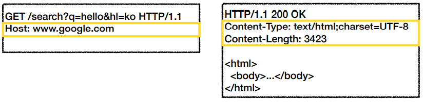

***

## HTTP 헤더 용도
-   **HTTP 전송에 필요한 모든 부가 정보**
    -   예) 메시지 바디의 내용 , 메시지 바디의 크기 , 압축 , 인증 , 요청 클라이언트 , 서버 정보 , 캐시 관리 정보 등..
-   **표준 헤더가 너무 많음**
    -   [List of HTTP header fields - Wikipedia](https://en.wikipedia.org/wiki/List_of_HTTP_header_fields)
-   **필요시 임의의 헤더 추가 가능**
    -   helloworld : hihi

***

## HTTP 헤더 표준

~~RFC2616~~(과거) - 폐기됨
{: .fh-default .fs-5 }
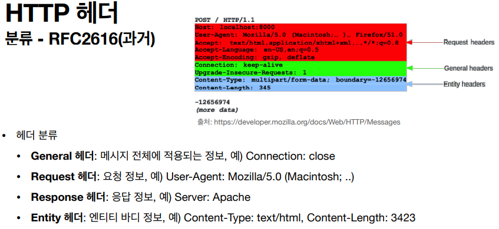
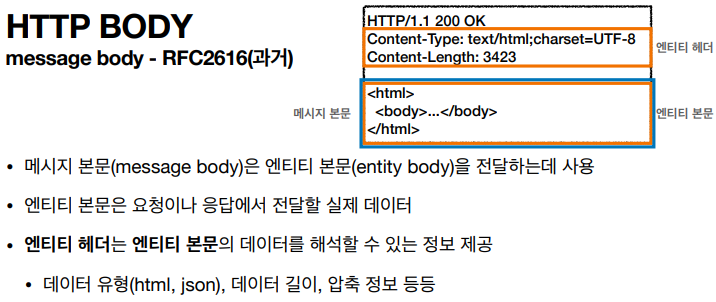

**2014년 RFC7230 ~ RFC7235 등장**
{: .fh-default .fs-5 }

### RFC723X 변화
-   엔티티(Entity) -> 표현(Representation)
-   Representation = representation Metadata + Representation Data
-   표현 = 표현 메타데이터 + 표현 데이터 

### RFC7230(최신)

**message body**
{: .fh-default .fs-5 }

- 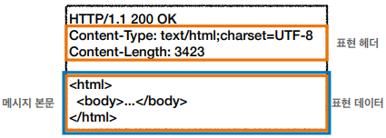
-   메시지 본문 = 페이로드(payload)
-   **표현**은 요청이나 응답에서 전달할 실제 데이터
-   **표현 헤더는 표현 데이터를 해석할 수 있는 정보 제공**
    -   **데이터 유형(html , json) , 데이터 길이 , 압축 정보 등**
-   **참고** : **표현 헤더는 표현 메타데이터와 , 페이로드 메시지를 구분해야 하지만 여기서는 생략**

**📌 표현**
{: .fh-default .fs-5 }

- 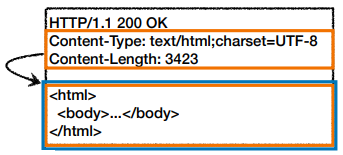
-   **Content-Type** : 표현 데이터의 형식
-   **Content-Encoding** : 표현 데이터의 압축 방식
-   **Content-Language** : 표현 데이터의 자연 언어
-   **Content-Length** : 표현 데이터의 길이
-   표현 헤더는 전송 , 응답 둘 다 사용

**Content-Type**

- 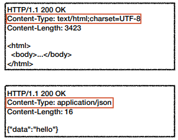
-   미디어 타입 , 문자 인코딩
-   예)
    -   text/html; charset=utf-8
    -   application/json
    -   image/png

**Content-Encoding**

- 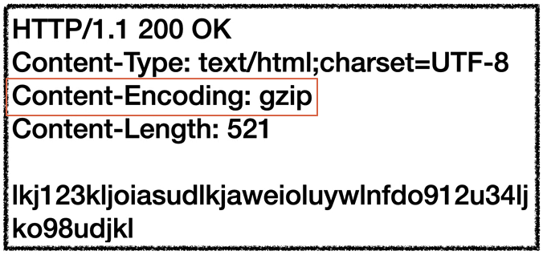
-   표현 데이터를 압축하기 위해 사용
-   데이터를 전달하는 곳에서 압축 후 인코딩 헤더 추가
-   데이터를 읽는 쪽에서 인코딩 헤더의 정보로 압축 해제
-   예)
    -   gzip
    -   deflate
    -   identity

**Content-Language**

- 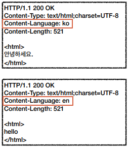
-   표현 데이터의 자연 언어를 표현
-   예)
    -   ko
    -   en
    -   en-US

**Content-Length**

- 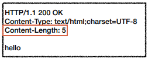
-   표현 데이터의 길이
-   바이트 단위
-   Transfer-Encoding(전송 코딩)을 사용하면 Content-Length를 사용하면 안됨

### 협상 과 우선순위 (콘텐츠 네고시에이션)

**클라이언트가 선호하는 표현 요청**
{: .fh-default .fs-5 }
-   **Accept : **클라이언트가 선호하는 미디어 타입 전달
-   **Accept-Charset :** 클라이언트가 선호하는 문자 인코딩
-   **Accept-Encoding :** 클라이언트가 선호하는 압축 인코딩
-   **Accept-Language :** 클라이언트가 선호하는 자연 언어

> ✋ **협상 헤더는 요청시에만 사용**

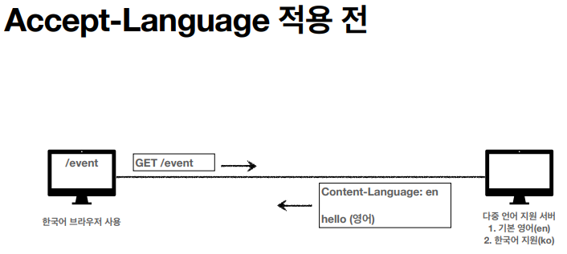
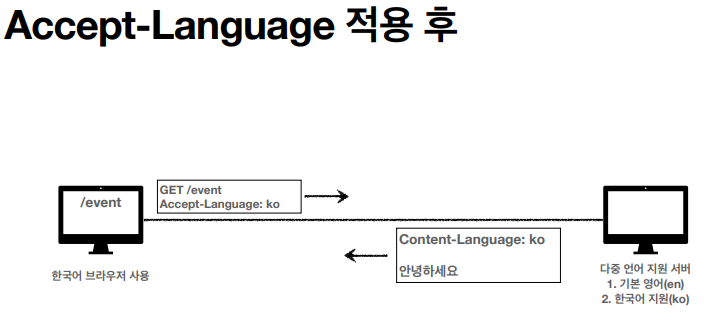
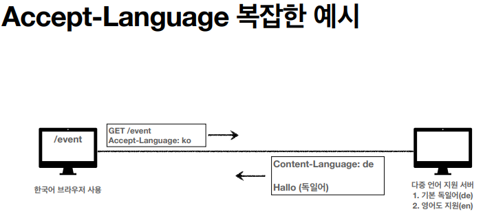
- 한국어를 요청하였지만 지원하지 않기 때문에 기본(독일어)가 제공된다. 이러한 문제 때문에 우선 순위가 필요하다.

**협상과 우선순위 1**
{: .fh-default .fs-5 }

**Quality Values(q)**
- 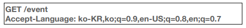
-   **Quality Values(q) 값 사용**
-   **0 ~ 1 , 클수록 높은 우선순위**
-   생략하면 1
-   **Accpet Language : ko-KR,ko;q=0.9,en-US;q=0.8,en;q=0.7**
    -   **우선순위** 
        -   **1\. ko-KR;q=1** (q생략)
        -   **2\. ko;q=0.9**
        -   **3\. en-US;q=0.8**
        -   **4\. en;q=0.7**
- 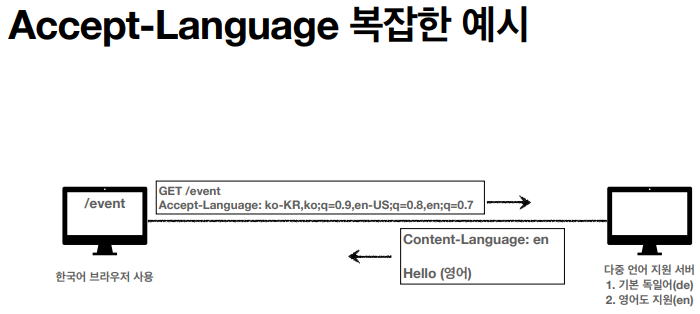

**협상과 우선순위 2**
{: .fh-default .fs-5 }

- 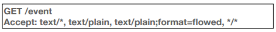
-   **구체적인 것이 우선한다.**
-   **Accept: text/\* , text/plain , text/plain;format=flowed, \*/\***
    -   **우선순위**
        -   **1.text/plain;format=flowed**
        -   **2.text/plain**
        -   **3.text/\***
        -   **4.\*/\***

**협상과 우선순위 3**
{: .fh-default .fs-5 }

**Quality Values(q)**

- 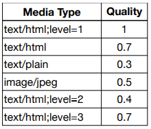
- **구체적인 것을 기준으로 미디어 타입을 맞춘다.**
- Accept : **text/\***;q=0.3, **text/html**;q=0.7, **text/html;level=1**, **text/html;level=2;**q=0.4, **\*/\***;q=0.5

### 전송 방식

-   **단순 전송**
-   **압축 전송**
-   **분할 전송**
-   **범위 전송**

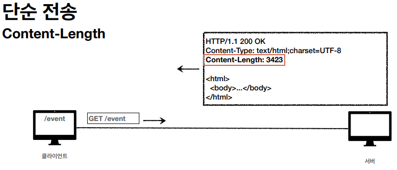
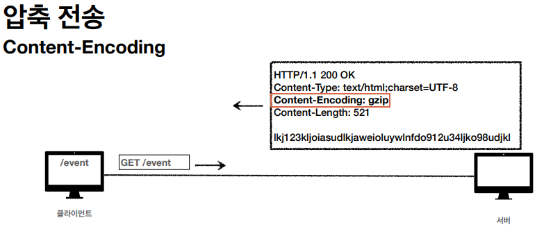
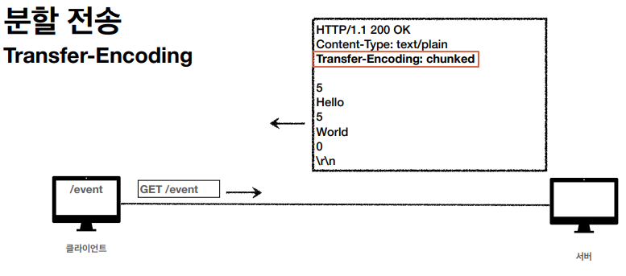
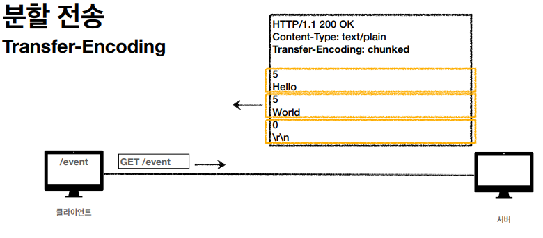
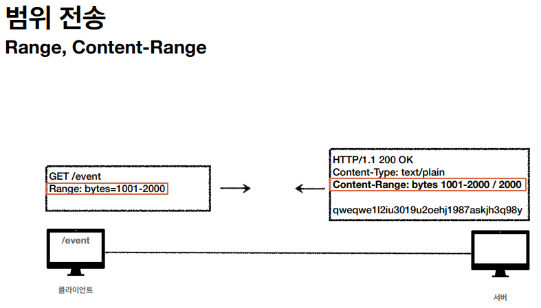

***

## **HTTP 헤더 - 일반 정보**

### From
-   **유저 에이전트의 이메일 정보**
-   일반적으로 잘 사용되지 않음
-   검색 엔진 같은 곳에서 , 주로 사용
-   요청에서 사용

### Referer
-   **이전 웹 페이지 주소**
-   현재 요청된 페이지의 이전 웹 페이지 주소
-   A -> B로 이동하는 경우 B를 요청할 때 Referer : A를 포함해서 요청
-   Referer를 사용해서 유입 경로 분석 가능
-   요청에서 사용
-   referer는 단어 referrer의 오타
- 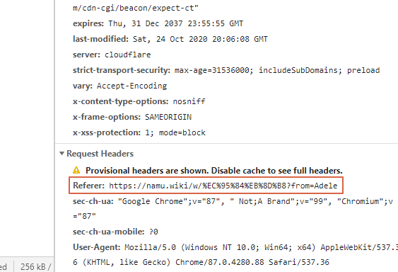

### User-Agent
-   **유저 에이전트 웹 애플리케이션 정보**
-   **클라이언트의 애플리케이션 정보(웹 브라우저 정보 , 등등)**
-   **통계 정보**
-   **어떤 종류의 브라우저에서 장애가 발생하는지 파악 가능**
-   **요청에서의 사용**
- 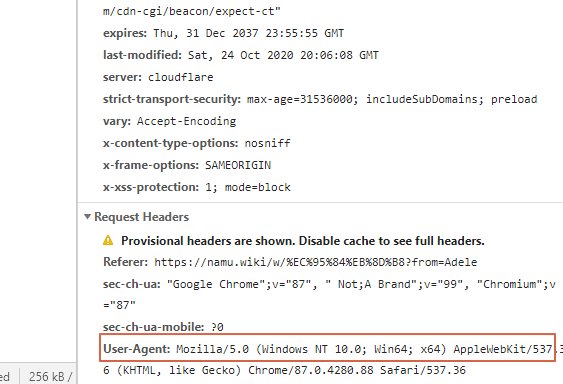

### Server
-   **요청을 처리하는 오리진 서버의 소프트 웨어 정보**
-   HTTP 요청을 보내면 여러 프록시,캐시 서버를 거치게 된다.
-   요청을 실제 처리하는 서버 정보이다.

### Date
-   **메시지가 발생한 날짜와 시간**
-   **응답에서 사용**

***

## **HTTP 헤더 - 특별한 정보**

### Host

- 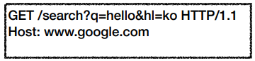
-   **요청한 호스트 정보(도메인)**
-   요청에서 사용
-   **필수**
-   **하나의 서버가 여러 도메인을 처리해야 할 때**
-   **하나의 IP 주소에 여러 도메인이 적용 되어 있을 때**

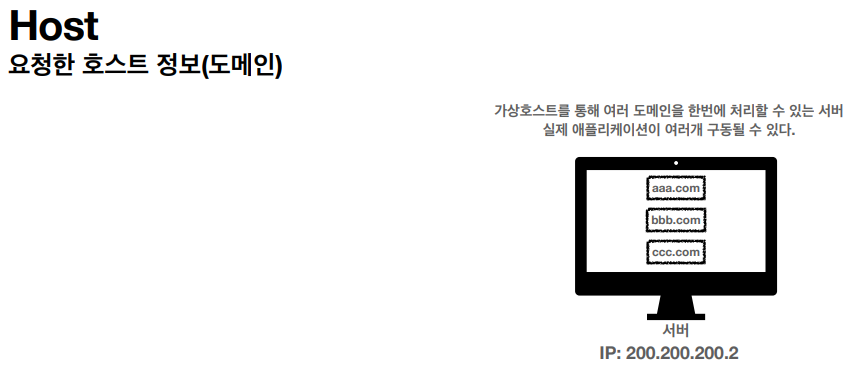
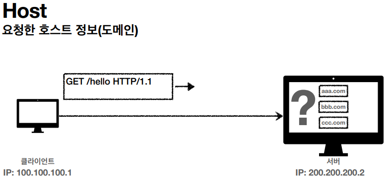
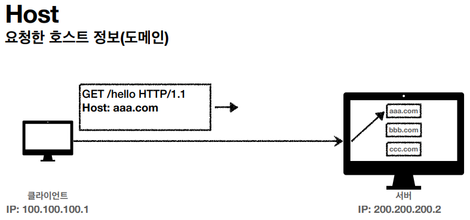

### Location

-   **페이지 리다이렉션**
-   웹 브라우저는 3xx응답의 결과에 Location 헤더가 있으면 , Location 위치로 자동 이동(리다이렉트)
-   [응답코드 3xx에서 설명](https://write-read.tistory.com/entry/HTTP-%EC%83%81%ED%83%9C-%EC%BD%94%EB%93%9C?category=905101)
-   201 Created : Location 값은 요청에 의해 생성된 리소스 URI
-   3xx Redirection : Location 값은 요청을 자동으로 리다이렉션하기 위한 대상 리소스를 가리킴

### Allow
-   **허용 가능한 HTTP 메서드**
-   **405 Method Not Allowed 에서 응답에 포함해야함**
-   **Allow : GET , HEAD , PUT**

### Retry-After
-   유저 에이전트가 다음 요청을 하기까지 기다려야 하는 시간
-   503 Service Unavailable : 서비스가 언제까지 불능인지 알려줄 수 있음
-   날짜 , 초단위 표기

***

## **HTTP 헤더 - 인증**

-   **Authorization : 클라이언트 인증 정보를 서버에 전달**
-   **WWW-Authenticate : 리소스 접근시 필요한 인증 방법 접의**

### Authorization

-   **클라이언트 인증 정보를 서버에 전달**
-   **예)OAuth 인증 등**

### WWW-Authenticate

-   **리소스 접근 시 필요한 인증 방법 정의**
-   401 Unauthorized
-   예)`WWW-Authenticate: Newauth realm="apps", type=1, title="Login to \\"apps\\"", Basic realm="simple"`
