## Table of contents
{: .no_toc .text-delta }

1. TOC
{:toc}
---

## **인터넷 네트워크**
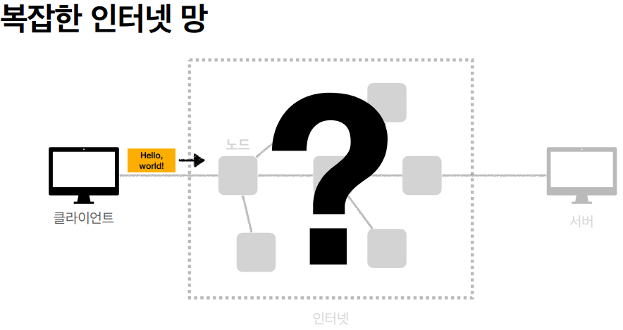

### IP(인터넷 프로토콜)
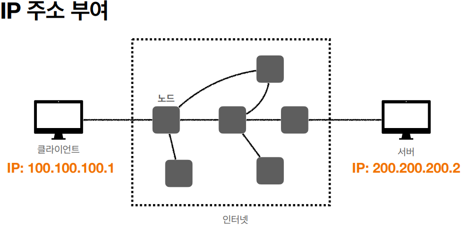
- 지정한 IP 주소 (IP Address)에 데이터 전달
- 패킷(Packet)이라는 통신 단위로 데이터 전달
  - 출발지 IP , 목적지 IP , 전송 데이터 , 기타 ...

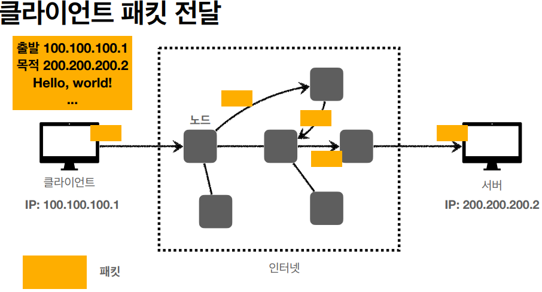
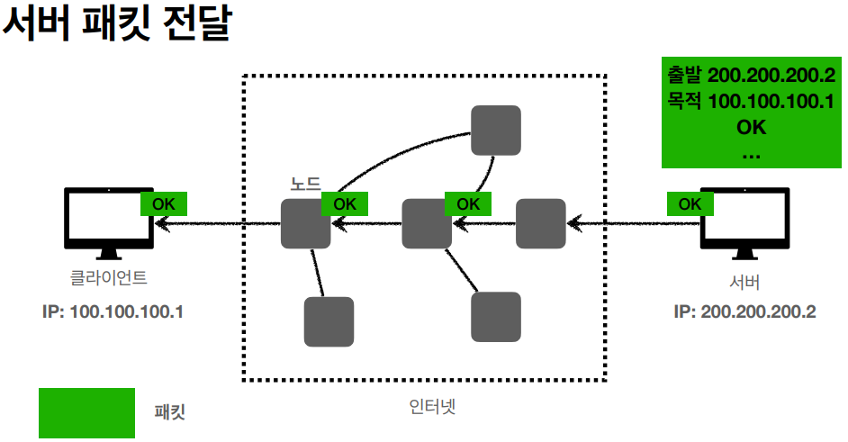
- **요청과 응답이 서로 다른 경로로 전달 될 수 있다.**

***

### IP 프로토콜의 한계
- **비연결성**
  - 받을 대상이 없거나 서비스 불능 상태여도 패킷 전송
- **비신뢰성**
  - 중간에 패킷이 사라지면?
  - 패킷이 순서대로 안오면?
- **프로그램 구분**
  - 같은 IP를 사용하는 서버에서 통신하는 애플리케이션이 둘 이상이면?

***

### TCP 프로토콜
**IP 프로토콜의 문제점(한계)을 해결한다.**
  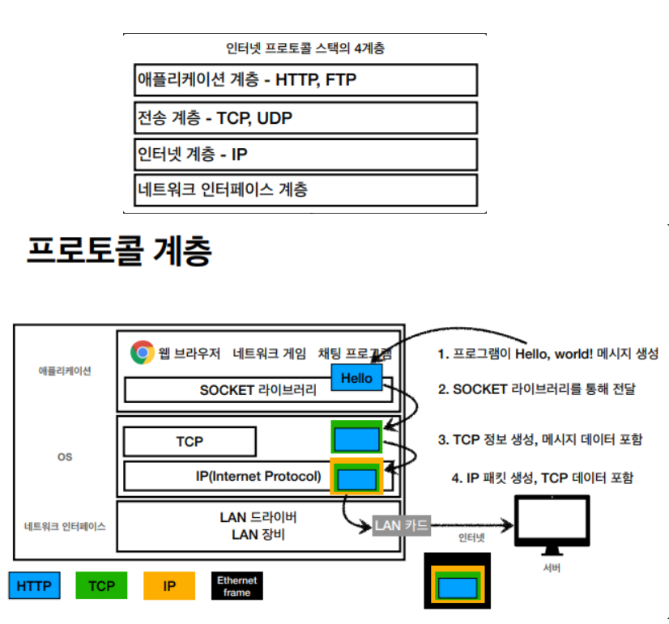

1. 소켓 라이브러리를 통해 OS계층에다가 메세지를 넘긴다.
1. OS계층에서 메세지에다가 TCP 정보로 감싼다.
1. IP계층에서 메세지에다가 IP 정보로 감싼다.
1. 네트워크 인터페이스에서 (MAC주소 등등) 정보를 메세지에 넣어주고 LAN카드를 통해 서버로 나간다.

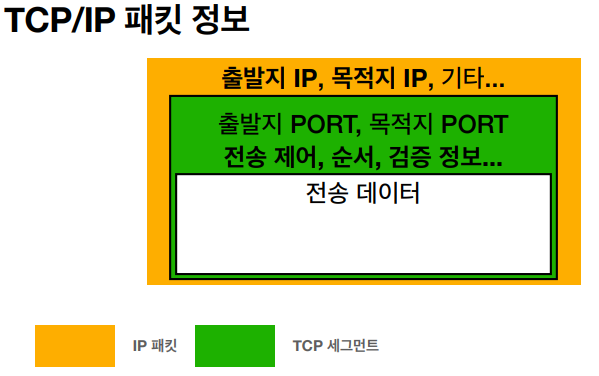

***

### TCP 특징
**전송 제어 프로토콜(Transmission Control Protocol)**
- 연결 지향 - TCP 3 way Handshake(가상 연결)
- 데이터 전달 보증
- 순서 보장
- 신뢰할 수 있는 프로토콜
- 현재는 대부분 TCP 사용

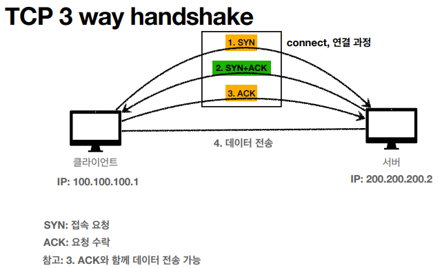
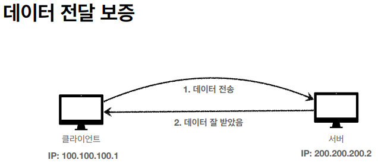
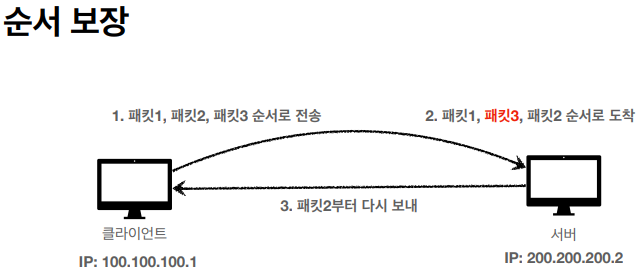

***

### UDP 특징
**사용자 데이터그램 프로토콜(User Datagram Protocol)**
- 하얀 도화지에 비유 (기능이 거의 없음)
- 연결 지향 - TCP 3 way handshake ❌
- 데이터 전달 보증 ❌
- 순서 보장 ❌
- 데이터 전달 및 순서가 보장 되지 않지만 , 단순하고 빠름
- **정리**
  - **IP와 거의 같다. (PORT , CheckSum 정도만 추가)**
  - **애플리케이션에서 추가 작업 필요**
- **HTTP3 스펙이 추가되면서 최적화 작업(TCP 3 way handshake없애보자)이 진행되어 요즘 각광받고 있다.**

***

### PORT
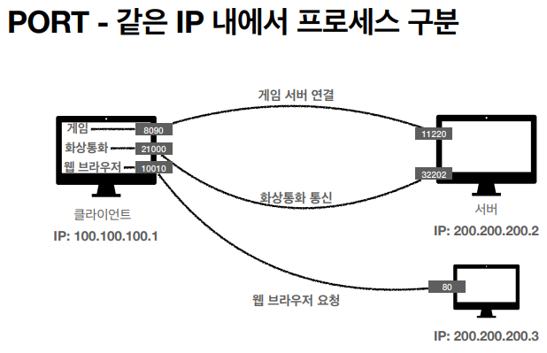
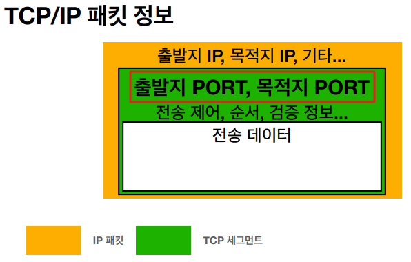
- 0 ~ 65535 할당 가능
- 0 ~ 1023 : 잘 알려진 포트 , 사용하지 않는 것이 좋음
  - FTP - 20 ,21
  - TELNET - 23
  - HTTP - 80
  - HTTPS - 443

***

### DNS (도메인 네임 시스템 - Domain Name System)
**IP는 기억하기 어렵고 , 변경될 수 있다.**
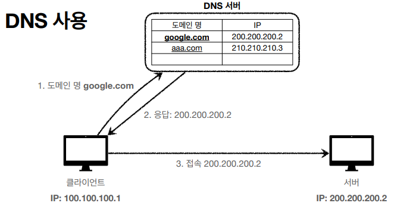

***

## **URI와 웹 브라우저 요청 흐름**

### URI (Uniform Resource Identifier)
**"URI는 로케이터(Locator) , 이름(Name) 또는 둘 다 추가로 분류 될 수 있다."**
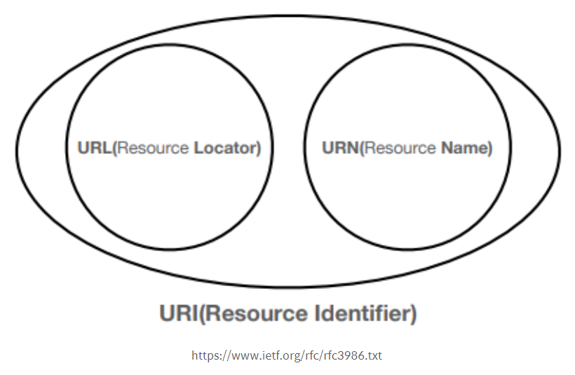
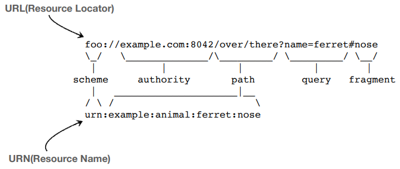

- **Uniform** : 리소스를 식별하는 통일된 방식
- **Resource** : 자원 , URI로 식별할 수 있는 모든 것(제한 없음)
- **Identifier** : 다른 항목과 구분하는데 필요한 정보

***

### URL , URN
- **URL - Locator : 리소스가 있는 위치를 지정**
- **URN - Name : 리소스에 이름을 부여**
- **위치는 변할 수 있지만 , 이름은 변하지 않는다.**
- **URN 이름만으로 실제 리소스를 찾을 수 있는 방법이 보편화 되지 않음**

> ✋ 이 다음 부터는 URI를 URL과 같은 의미로 정의한다.

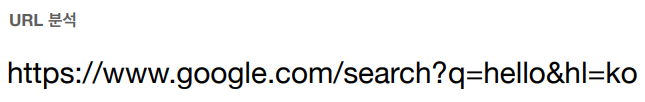

***

##### URL 전체 문법

**`scheme://[userinfo@]host[:port][/path][?query][#fragment]`**
{: .fh-default .fs-6 }
**`https://www.google.com:443/search?q=hello&hl=ko`**
{: .fh-default .fs-6 }

|:-------------|:------------------|
| 프로토콜 | https |
| 호스트명 | www.google.com   |
| 포트 번호| 443 |
| 패스       | /search |
| 쿼리 파라미터 | q=hello&hl=ko |

**scheme**
{: .fh-default .fs-6 }

scheme `//[userinfo@]host[:port][/path][?query][#fragment]`
{: .fh-default .fs-5 }
https `//www.google.com:443/search?q=hello&hl=ko`
{: .fh-default .fs-5 }

-   주로 프로토콜 사용
-   프로토콜 : 어떤 방식으로 자원에 접근할 것인가 하는 약속 규칙
    -   http , https , ftp 등등
-   http는 80포트 , https는 443포트를 주로 사용 (포트는 생략 가능)
-   https는 http에 보안 추가(HTTP Secure)

**userinfo**
{: .fh-default .fs-6 }

scheme //**`[userinfo@]`** host[:port][/path][?query][#fragment]
{: .fh-default .fs-5 }

-   URL에 사용자정보를 포함해서 인증
-   거의 사용하지 않음

**host**
{: .fh-default .fs-6 }

scheme //[userinfo@]**`host`**[:port][/path][?query][#fragment]
{: .fh-default .fs-5 }
https //**`www.google.com`**:443/search?q=hello&hl=ko
{: .fh-default .fs-5 }

-   호스트명
-   도메인명 또는 IP주소를 직접 사용 가능

**port**
{: .fh-default .fs-6 }

scheme //[userinfo@]host **`[:port]`**[/path][?query][#fragment]
{: .fh-default .fs-5 }
https //www.google.com:**`443`**/search?q=hello&hl=ko
{: .fh-default .fs-5 }

-   포트 (PORT)
-   접속 포트
-   일반적으로 생략 (생략 시 http는 80 , https는 443)

**path**
{: .fh-default .fs-6 }

scheme //[userinfo@]host[:port]**`[/path]`**[?query][#fragment]
{: .fh-default .fs-5 }
https //www.google.com:443/**`search`**?q=hello&hl=ko
{: .fh-default .fs-5 }

-   리소스 경로 , 계층적 구조
-   예)
    -   `/home/file1.jpg`
    -   `/members`
    -   `/members/100`
    -   `/items/iphone12`

**query**
{: .fh-default .fs-6 }

scheme //[userinfo@]host[:port][/path]**`[?query]`**[#fragment]
{: .fh-default .fs-5 }
https //www.google.com:443/search?**`q=hello&hl=ko`**
{: .fh-default .fs-5 }

-   key = value 형태
-   ?로 시작 , &로 추가 가능 
    -   ?keyA=valueA&keyB=valueB
-   query parameter , query string등으로 불림
-   웹 서버에 제공하는 파라미터 , 문자 형태

**fragment**
{: .fh-default .fs-6 }

scheme //[userinfo@]host[:port][/path][?query]**`[#fragment]`**
{: .fh-default .fs-5 }
https //docs.spring.io/spring-boot/docs/current/reference/html/gettingstarted.html **`getting-started-introducing-spring-boot`**
{: .fh-default .fs-5 }

-   html 내부 북마크 등에 사용
-   서버에 전송하는 정보 아님

***

### 웹 브라우저 요청 흐름
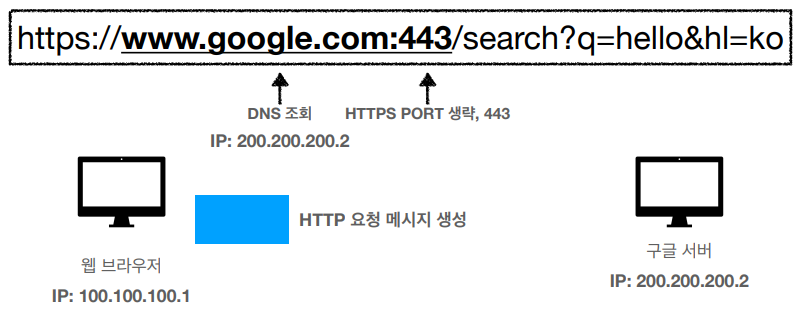
**DNS 서버 조회 → IP와 포트 정보를 찾아냄 → HTTP 요청 메시지 생성**

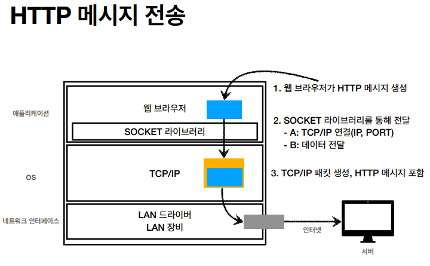
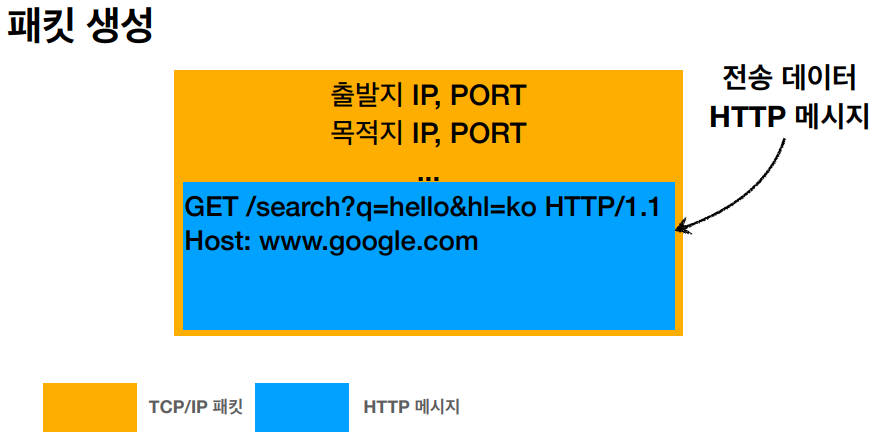
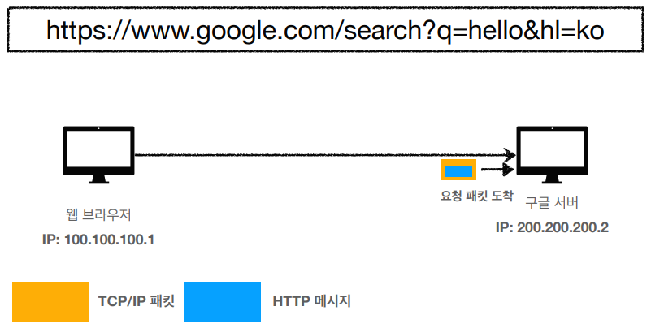
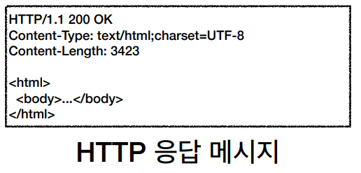
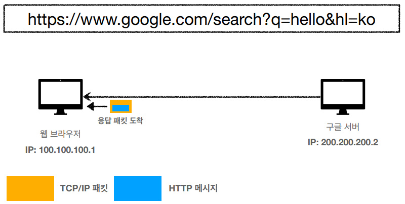
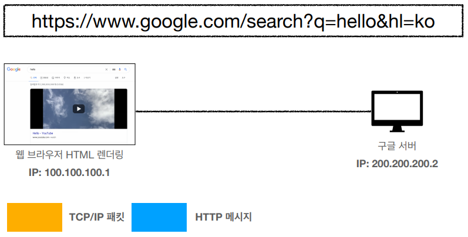
