## Table of contents
{: .no_toc .text-delta }

1. TOC
{:toc}
---

# **CPU 스케줄링**
- **다중 프로그래밍된 운영 체제의 기초**
- 다중 프로그래밍의 목적은 일부 프로세스가 항상 실행되도록 하려면 CPU 사용률을 최대화 해야한다.

> ✋ **[CPU Burst VS I/O Burst](https://jhnyang.tistory.com/25)**

# **CPU 스케줄러**
- 메모리의 프로세스에서 프로세스 선택
- 실행할 준비가 되어 있고 해당 프로세스에 CPU를 할당한다
- **그러면 다음 프로세스를 어떻게 선택할 수 있을까?**
  - 연결 리스트? 이진 트리?
  - FIFO 대기열: 선입선출
  - 우선 순위 큐: 프로세스의 우선 순위를 어떻게 결정할 수 있을까?

  ## **Preemptive 선점 vs Non-preemptive 비선점**
  - **Non-preemptive 비선점 스케줄링**
    - 프로세스가 CPU를 해제할 때까지 CPU를 유지한다
    - 이미 할당된 자원을 다른 프로세스가 가져갈 수 없다.
    - **덜 중요한 작업이 자원을 할당 받으면 중요한 작업이 와도 먼저 처리 될 수 없다.**
  - **Preemptive 선점 스케줄링**
    - 우선순위가 높은 프로세스를 빠르게 처리할 수 있다.
    - 어떤 프로세스가 자원을 사용하고 있을 때 우선순위가 더 높은 프로세스가 올 경우 자원을 가져갈 수 있다.
    - **빠른 응답 시간을 요구하는 시스템에서 사용**
    - 오버헤드가 크다

> ✋ **[선점 , 비선점 스케줄링](https://colomy.tistory.com/120)**

## **CPU 스케줄링 선점 , 비선점 결정**
1. 프로세스가 실행 중에서 대기 상태로 전환될 때
1. 프로세스가 실행 중에서 준비 상태로 전환될 때
1. 프로세스가 대기 상태에서 준비 상태로 전환될 때
1. 프로세스가 종료되는 경우.
- **1번 과 4번 - 선택할 수 없다 -> 비선점**
- **2번 과 3번 - 선택할 수 있다 -> 선점형 또는 비선점형**

## **Dispatcher 디스패처**
- **CPU의 코어를 제어하는 모듈**
- **디스패처의 기능**
  - **한 프로세스에서 다른 프로세스로 컨텍스트 전환**
  - 사용자 모드로 전환
  - 사용자 프로그램을 재개하기 위해 적절한 위치로 점프
- **모든 컨텍스트 전환 중에 호출되기 때문에 디스패처는 가능한 빨라야 한다**
- **디스패처 지연시간(Dispatcher Latency)은 한 프로세스를 중지하고 다른 실행을 시작하는 시간**
  - **[PCB (Process Control Block)](https://jwprogramming.tistory.com/16)** 를 저장하고 새로운 블록을 실행한다.

## **Scheduling Criteria 스케줄링 기준**
- **CPU Utilization - CPU 사용률** : CPU를 최대로 사용하자.
- **Throughput - 처리량** : 단위 시간 내에 프로세스를 최대한 빠르게 처리하자.
- **Turnaround Time - 처리 시간** : 실행에서 종료까지의 시간을 최소화하자.
- **📌 Waiting Time - 대기 시간** : 프로세스가 준비 대기열 Ready Queue 에서 대기하는 데 소비하는 시간을 최소화 하자
- **Response Time - 응답 시간** : 응답을 시작하는 데 걸리는 시간

## **준비 대기열 Ready Queue에 있는 어느 프로세스에게 CPU의 코어를 할당하나?**

### **FCFS(First-Come, First-Served)**
- 선착순
- **FIFO 대기열로 쉽게 구현**
- **비선점형**
- **Convoy Effect (호송 효과)**
  - 다른 모든 프로세스는 하나의 큰 프로세스가 CPU에서 나올 때까지 기다린다.
  - CPU 및 장치 사용률이 낮다.

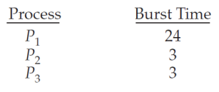

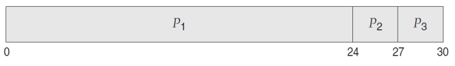

- Waiting Time for 𝑃1 = 0, 𝑃2 = 24, 𝑃3 = 27
- **Total Waiting Time** : (0 + 24 + 27) = 51
- **Average Waiting Time** : 51/3 = 17

**Turnaround Time(소요 시간)**
- Turnaround Time for 𝑃1 = 24, 𝑃2 = 27, 𝑃3 = 30
- **Total Turnaround Time** : (24 + 27 + 30) = 81
- **Average Turnaround Time** : 81/3 = 27

### **SJF(Shortest Job First)**
- 가장 짧은 작업 우선 (SRTF : 가장 짧은 남은 시간 우선)
- CPU Burst가 가장 작은 프로세스에 할당 된다.
- ***(이론적으로)* 최적임이 입증 되었다.**
- **두 개 이상의 프로세스가 똑같을 시 FCFS 사용**
- **선점형(preemptive)** 또는 **비선점형(non-preemptive)**이 될 수 있다.
  - **새로운 프로세스가 Ready Queue에 도착했을 때**,
  - 이전 프로세스가 새로 도착한 프로세스 보다 사용률이 낮을 때는?
  - **컨텍스트 스위칭의 비용**이 고려 유무에 따라 다르지만 **선점형**이 더 유리하다.
    - *하지만 실행중인 프로세스의 남은 사용률을 어떻게 계산할까?*

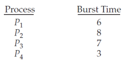

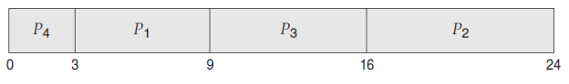

- Waiting Time for 𝑃1 = 3, 𝑃2 = 16, 𝑃3 = 9, 𝑃4 = 0
- **Total Waiting Time** : (3 + 16 + 9 + 0) = 28
- **Average Waiting Time** : 28/4 = 7

- **이 알고리즘을 구현할 수 있을까?**
  - 다음 프로세스의 CPU 사용률을 알 수 있는 방법이 뭘까?
- **대략적으로 계산해보자.**
  - **이전 CPU 버스트의 측정된 길이 (지수 평균)**
  - **𝝉𝒏 + 𝟏 = 𝜶𝝉𝒏 + (𝟏 - 𝜶) 𝝉𝒏**
    - **𝜏𝑛는 *n*번째 CPU 버스트의 길이**
    - **𝜏𝑛 + 1은 다음 CPU 버스트에 대한 예측 값**
    - **𝛼는 0과 1사이의 가중치 파라미터** (0 ≤ 𝛼 ≤ 1)

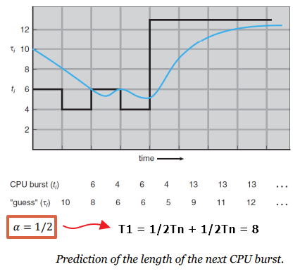

- **이론적으로만 Optimal(최적) 이지만  실제로 사용하는 알고리즘은 아니다.**

### **SRTF(Shortest-Remaining-Time-First)** - Preemptive SJF scheduling (선점형 SJF 스케줄링)
- **새로 도착한 프로세스의 CPU 사용률 보다 실행 중인 프로세스의 잔여 CPU 사용률이 더 높을시에는 선점 한다.**
- 비선점형 SJF는 CPU 버스트를 완료하도록 허용한다.

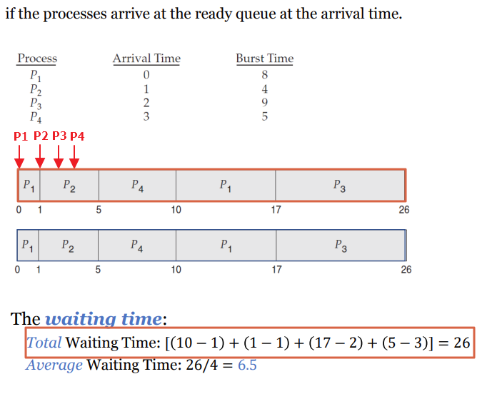

### **RR(Round Robin)** - 시분할 시스템을 위해 설계된 선점형 스케줄링
- **프로세스들 사이에 우선순위를 두지 않고 , 순서대로 시간단위(Time Quantum/Slice)로 CPU를 할당하는 방식의 CPU 스케줄링 알고리즘**
- 컴퓨터 자원을 사용할 수 있는 기회를 프로세스들에게 공정하게 부여하기 위한 한 방법
- **평균 대기 시간이 긴 경우가 많다.**
- **할당된 시간이 지나면 그 프로세스는 잠시 보류한 뒤 다른 프로세스에게 기회를 준다.**
  - **보통 시간 단위는 `10ms ~ 100ms` 정도**
  - **문맥 전환의 오버헤드가 큰 반면에 응답시간이 짧아지는 장점이 있어 실시간 시스템에 유리**
- **CPU 사용 시간이 라운드 로빈의 시간 단위보다 짧을 때는 자발적으로 해제한다.**
- **CPU 사용 시간이 라운드 로빈의 시간 단위보다 길 때는**
  - Watch Dog가 꺼지고 OS에 인터럽트가 발생한다.
  - 컨텍스트 스위칭이 발생한다.
  - 프로세스는 준비 대기열의 맨 뒤에 놓인다.

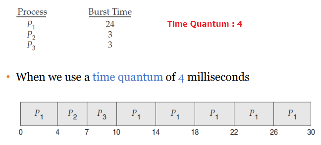

- **The waiting time**
  - Waiting Time for 𝑃1 = 10 − 4 = 6, 𝑃2 = 4, 𝑃3 = 7
  - Total Waiting Time: (6 + 4 + 7) = 17
  - Average Waiting Time: 17/3 = 5.66

- **Time Quantum을 얼마로 줬냐에 따라 RR의 성능이 많이 바뀐다.**
  - Time Quantum이 무한이면 `FCFS`

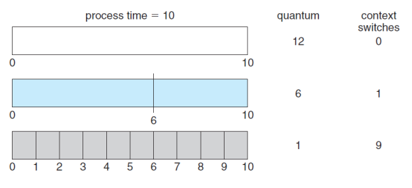

## **Priority-based** - 우선순위 기반
- **각 프로세스에는 우선순위가 존재하며 , 가장 높은 우선순위를 가진 프로세스에 할당한다.**
  - 우선순위가 같다면 `FCFS`로 스케줄링 한다.
- `SJF`는 **우선순위 기반 스케줄링의 특별한 경우이다.**

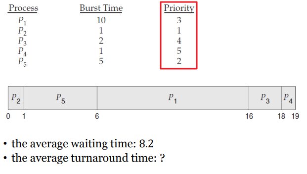

- **기아 문제 (indefinite blocking)**
  - 일부 낮은 우선 순위 프로세스는 무기한 대기할 수 있다.
- 기아 문제의 해법은 **aging** *(노화)* 이다.
  - 시스템에서 오랫동안 기다리면 프로세스의 우선순위를 점차적으로 높혀주자

- 일반적으로 **RR 과 Priority Scheduling** 섞어 쓴다.
  - *우선순위 스케줄링을 사용하되 우선순위가 같다면 라운드로빈을 사용한다.*

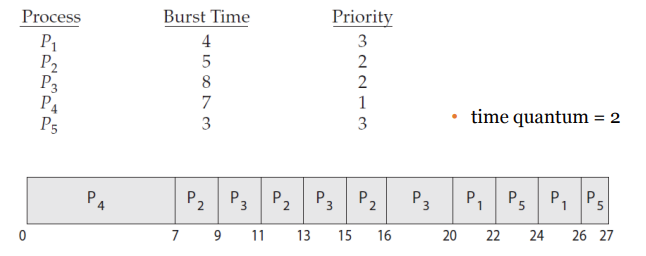

### **MLQ(Multi-Level Queue)** - 다단계 대기열

- 휴대폰 게임을 하고 있다면 ,
  - 네트워크 데이터 , 사운드 , 디스플레이 , 카톡 , 전화 등등 각각 우선순위가 다 다르다
- **'n'개의 우선순위** 를 두고 각각 **Ready Queue**를 두자

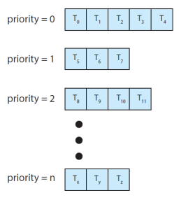

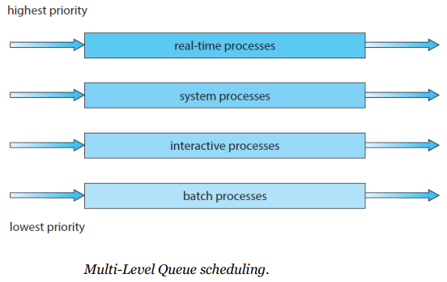

### **MLFQ(Multi-Level Feedback Queue)** - 다단계 피드백 대기열

- **실전O/S**의 CPU 스케줄링 알고리즘이다. (+ Multicore)

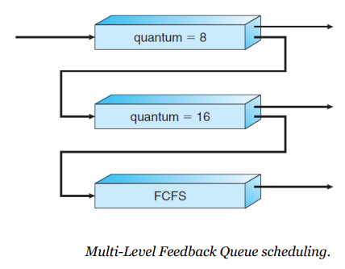

> -  규칙 1 : 우선순위가 높은 프로세스들을 먼저 수행한다.
> - 규칙 2 : 작업들이 같은 우선순위를 갖는다면 RR로 수행한다.
> - 규칙 3 : 새로운 프로세스가 시스템에 들어가면 가장 높은 우선순위를 부여한다.
> - 규칙 4 : 작업은 모든 우선순위에서 주어진 time slice를 모두 사용하면 우선순위가 감소한다.
> - 규칙 5 : 일정 시간 후 시스템의 모든 작업을 우선순위가 가장 높은 큐로 이동한다.
> - 출처: [PinguiOS](https://icksw.tistory.com/124)
