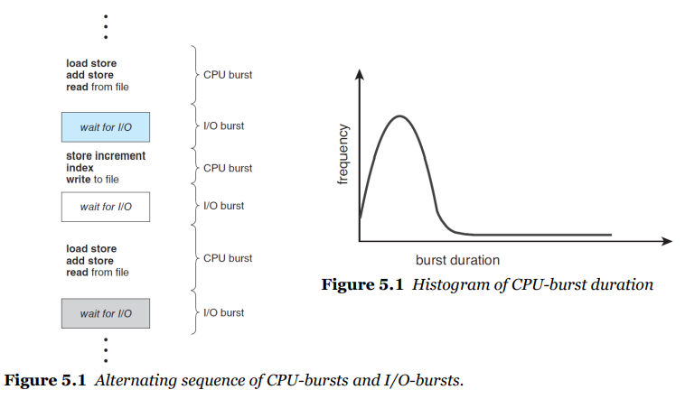
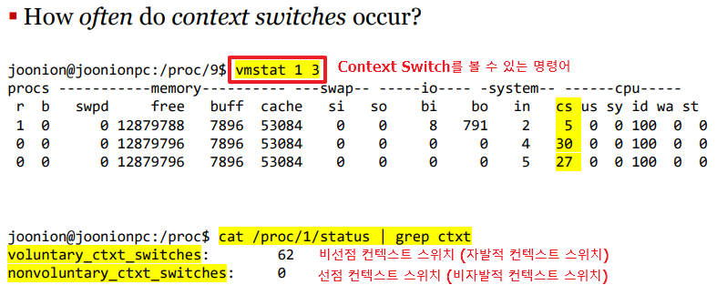

## Table of contents
{: .no_toc .text-delta }

1. TOC
{:toc}
---

# **CPU 스케줄링**
- **다중 프로그래밍된 운영 체제의 기초**
- 다중 프로그래밍의 목적은 일부 프로세스가 항상 실행되도록 하려면 CPU 사용률을 최대화 해야한다.

> ✋ **[CPU Burst VS I/O Burst](https://jhnyang.tistory.com/25)**

# **CPU 스케줄러**
- 메모리의 프로세스에서 프로세스 선택
- 실행할 준비가 되어 있고 해당 프로세스에 CPU를 할당한다
- **그러면 다음 프로세스를 어떻게 선택할 수 있을까?**
  - 연결 리스트? 이진 트리?
  - FIFO 대기열: 선입선출
  - 우선 순위 큐: 프로세스의 우선 순위를 어떻게 결정할 수 있을까?

  ## **Preemptive 선점 vs Non-preemptive 비선점**
  - **Non-preemptive 비선점 스케줄링**
    - 프로세스가 CPU를 해제할 때까지 CPU를 유지한다
    - 이미 할당된 자원을 다른 프로세스가 가져갈 수 없다.
    - **덜 중요한 작업이 자원을 할당 받으면 중요한 작업이 와도 먼저 처리 될 수 없다.**
  - **Preemptive 선점 스케줄링**
    - 우선순위가 높은 프로세스를 빠르게 처리할 수 있다.
    - 어떤 프로세스가 자원을 사용하고 있을 때 우선순위가 더 높은 프로세스가 올 경우 자원을 가져갈 수 있다.
    - **빠른 응답 시간을 요구하는 시스템에서 사용**
    - 오버헤드가 크다

> ✋ **[선점 , 비선점 스케줄링](https://m.blog.naver.com/PostView.naver?isHttpsRedirect=true&blogId=rlaauddlf200&logNo=30141162460)**

## **CPU 스케줄링 선점 , 비선점 결정**
1. 프로세스가 실행 중에서 대기 상태로 전환될 때
1. 프로세스가 실행 중에서 준비 상태로 전환될 때
1. 프로세스가 대기 상태에서 준비 상태로 전환될 때
1. 프로세스가 종료되는 경우.
- **1번 과 4번 - 선택할 수 없다 -> 비선점**
- **2번 과 3번 - 선택할 수 있다 -> 선점형 또는 비선점형**

## **Dispatcher 디스패처**
- **CPU의 코어를 제어하는 모듈**
- **디스패처의 기능**
  - **한 프로세스에서 다른 프로세스로 컨텍스트 전환**
  - 사용자 모드로 전환
  - 사용자 프로그램을 재개하기 위해 적절한 위치로 점프
- **모든 컨텍스트 전환 중에 호출되기 때문에 디스패처는 가능한 빨라야 한다**
- **디스패처 대기 시간은 한 프로세스를 중지하고 다른 실행을 시작하는 시간**
  - **[PCB (Process Control Block)](https://jwprogramming.tistory.com/16)** 를 저장하고 새로운 블록을 실행한다.

