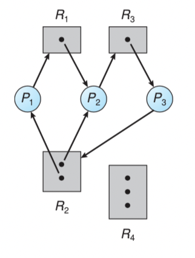
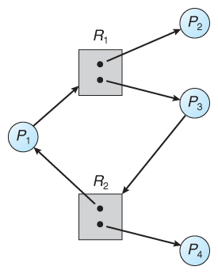

## Table of contents
{: .no_toc .text-delta }

1. TOC
{:toc}
---

- 아래의 강의를 참고하여 작성하였습니다
  - [반효경 [운영체제] Deadlock](http://www.kocw.net/home/search/kemView.do?kemId=1046323)
  - [[OS] Deadlock Prevention and Deadlock Avoidance](https://operatingsystems.tistory.com/entry/OS-Deadlock-Prevention-and-Deadlock-Avoidance)

# **Deadlock**
- 일련의 프로세스들이 각자 자원을 점유하고 있는 상태에서 **서로가 서로의 자원에 접근하기 위해 blocking된 상태(무한정 대기 상태)**이다.
- `Resource`
  1. 하드웨어 , 소프트웨어 등을 포함하는 개념
  2. `I/O device` , `CPU Cycle` , `Memory Space` , `Semaphore` 등..
  3. 절차 : **Request** ➔ **Allocate** ➔ **Use** ➔ **Release**

# **Deadlock 발생의 4가지 조건**

1. 상호배제 `Mutual Exclustion`
   - 매 순간 하나의 프로세스만이 자원을 사용할 수 있다
2. 비선점 `No Preemtion`
   - 프로세스는 자원을 스스로 내어놓을 뿐 강제로 빼앗기지 않는다
3. 점유 대기 `Hold and Wait`
   - 자원을 가진 프로세스가 다른 자원을 기다릴 때 보유 자원을 놓지 않고 계속 가지고 있다
4. 순환 대기 `Circular Wait`
   - 자원을 기다리는 프로세스간에 사이클이 형성되어야 한다

<br>



- 데드락이 발생했는지를 알아보기 위해서는 **자원할당그래프 `Resource-Allocation Graph`**를 통해 알 수 있다
1. `P` : 프로세스
2. `R` : 시스템 내 자원 유형
3. `R 안의 동그라미` : 인스턴스
4. `P ➔ R` : **Request Edge** 프로세스가 해당 자원을 요청
5. `R ➔ P` : **Assignment Edge** 해당 자원이 프로세스에 할당되어 있는 것
- 위의 유향 그래프에서 **Cycle**이 생기면 **Deadlock**이 발생할 가능성이 높다

```
사이클 2개 존재, 교착 상태임
1. P1 ➔ R1 ➔ P2 ➔ R3 ➔ P3 ➔ R2 ➔ P1
2. P2 ➔ R3 ➔ P3 ➔ R2 ➔ P2
```



```
사이클 1개 존재하지만 교착 상태가 아니다
1. R2 ➔ P1 ➔ R1 ➔ P3 ➔ R2 

R2의 인스턴스가 1개 였다면 Deadlock이지만 , 
P4가 R2의 자원을 사용하고 반납하면 해결된다
```

# **Deadlock의 처리 방법**

## **Deadlock Prevention**
- Deadlock의 4가지 특징인 `Mutual Exclusion` , `Hold and Wait` , `Preemtion` , `Circular Wait`가 동시에 만족하지 못 하도록 하는 것
  - *결과적으로는 **Device**의 활용도를 낮추며 , 시스템 성능을 좋지 않게 한다* 
<br>

1. `Mutual Exclusion`
   - 자원을 서로 동시에 사용하지 못 하도록 하는 것이 상호 배제의 개념인데 , 공유해서는 안되는 자원의 경우는 상호 배제가 성립되어야 하지만 **Deadlock Prevention**을 위해서 `Mutual Exclusion`을 허용 하지 않으면 공유를 가능하도록 만들어 준다는 것이다 
2. `Hold and Wait`
   - 프로세스가 어떤 자원을 점유하고 있다면 , 다른 자원을 요청하지 못하게 만드는 방법
   - **방법 1**. 프로세스 시작시 모든 필요한 자원을 할당받게 하는 방법
   - **방법 2**. 자원이 필요할 경우 보유 자원을 모두 놓고 다시 요청
   
3. `No Preemtion`
   - 프로세스가 어떤 자원을 기다려야 하는 경우 이미 보유한 자원이 선점된다 *(빼앗길 수 있게)*
   - 모든 필요한 자원을 얻을 수 있을 때 그 프로세스는 다시 시작된다
   - **상태**를 쉽게 `save`하고 `restore`할 수 있는 자원에서 주로 사용 (`CPU` , `Memory`)
4. `Circular Wait`
   - 모든 자원 유형에 할당 순서를 정하여 정해진 순서대로만 자원 할당
   - 순서가 3인 자원 `Rn`를 보유 중인 프로세스가 순서가 1인 자원 `Rm`을 할당받기 위해서는 우선 `Rn`을 반납 해야한다 (순서가 낮은 자원을 갖기 위해서는 순서가 높은 자원을 반납한다)

<br>

**utilization 이용률 저하** , **throughput 처리량 감소** , **starvation 기아 문제**

## **Deadlock Avoidance**
- 자원 요청에 대한 부가적인 정보를 이용해서 **자원이 Deadlock으로 부터 안전한지를 동적으로 조사해서 안전한 경우에만 할당**
  - *가장 단순하고 일반적인 모델은 프로세스들이 필요로 하는 각 자원별 최대 사용량을 미리 선언하도록 하는 방법*

<br>

1. `Safe State`
   - 시스템 내의 프로세스들에 대한 `Safe Sequence`가 존재하는 상태
   - 여러 개의 프로세스가 있는데 어떤 특정 순서대로 자원을 요청할 때 아무런 문제 없이 자원을 할당받을 수 있는 경우
2. `Safe Sequence`
   - 프로세스의 Sequence `<P1 , P2 , P3 , ... Pn>`이 **Safe**하려면 `Pi(1 <= i <= n>)`의 자원 요청이 **가용 자원 + 모든 `Pj(j < i)`의 보유 자원**에 의해 충족 되어야 한다
   - `Pi`의 자원 요청이 즉시 충족될 수 없으면 모든 `Pj(j < i)`가 종료될 때 까지 기다린다
   - `Pi - 1`이 종료되면 `Pi`의 자원요청을 만족시켜 수행한다

- 자원 유형 1개 당 1개의 인스턴스 존재 → **자원 할당 그래프 알고리즘**
- 자원 유형 1개 당 2개 이상의 인스턴스 존재 → **은행원 알고리즘**

## **Deadlock Detection and Recovery**

## **Deadlock Ignorance** *대부분의 OS가 채택*