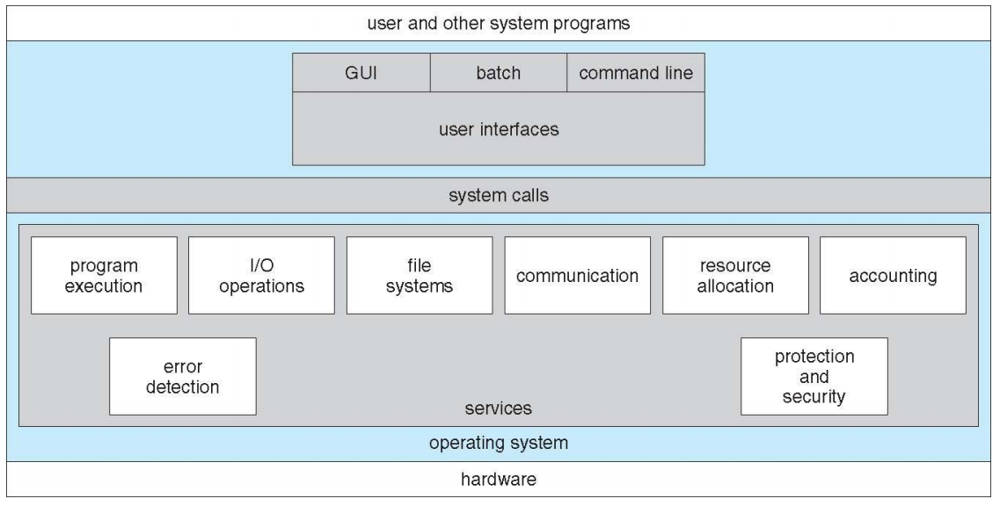
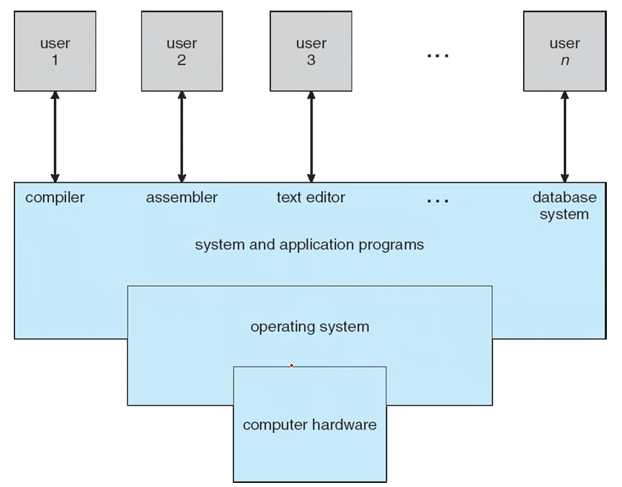
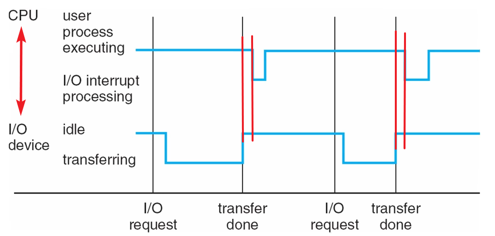
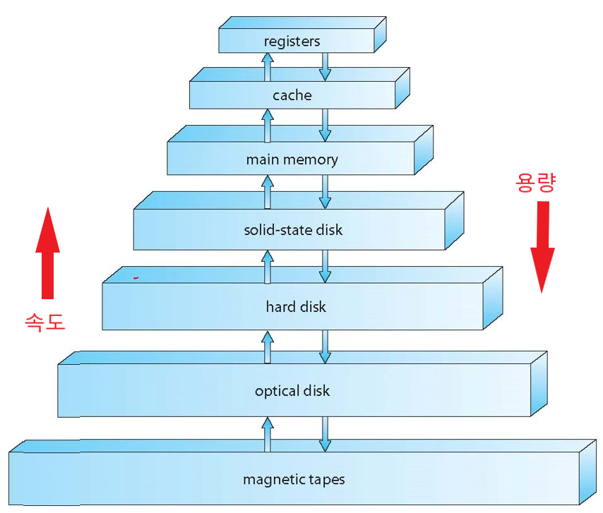
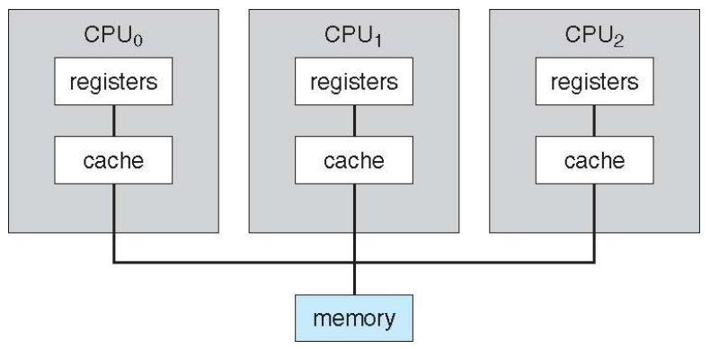
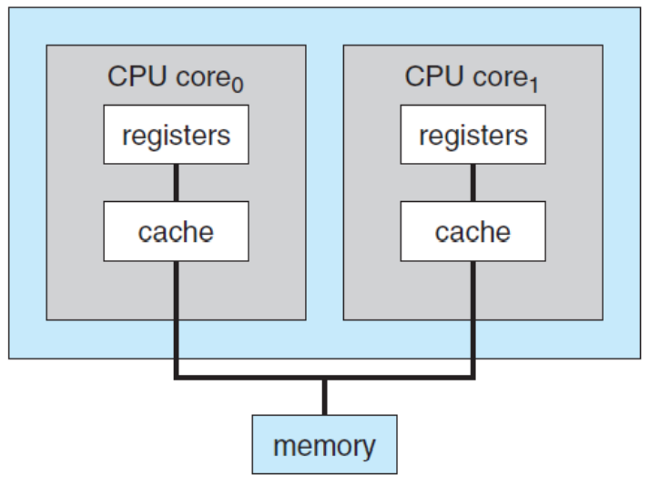
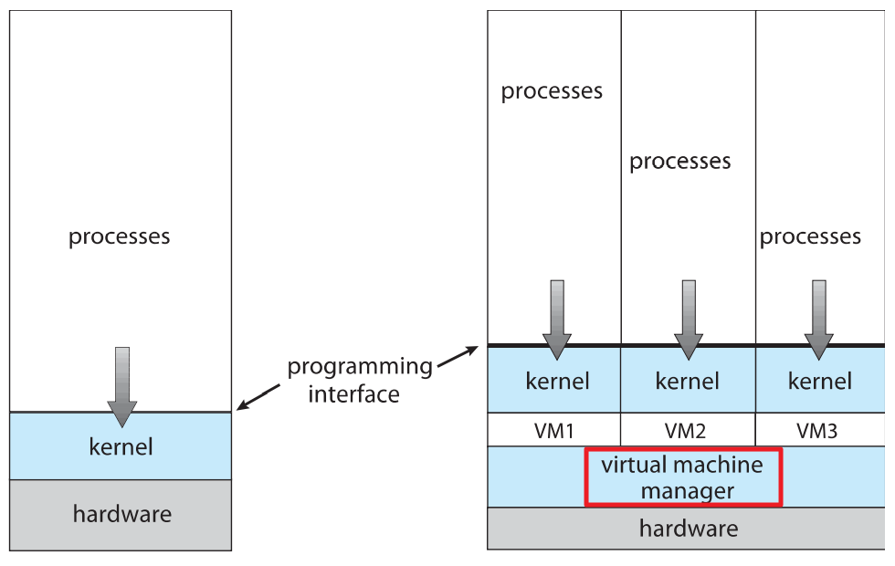
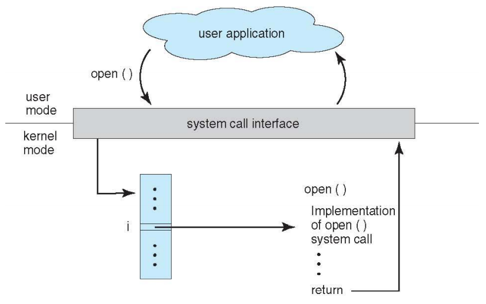

## Table of contents
{: .no_toc .text-delta }

1. TOC
{:toc}
---

- **정보의 최소 단위** : bit
- **정보의 처리** : 정보의 상태 변환 (0에서 로 , 1에서 0으로)
- **부울 대수(Boolean Algebra)** : NOT , AND , OR
- **논리 게이트** : NOT , AND , OR , XOR , NAND , NOR
- **논리 회로** : IC , LSI , VLSI , ULSI , SoC , ...
- **정보의 저장과 전송** : 플립-플롭 , 데이터 버스

## **컴퓨터가 정보를 어떻게 처리하나**

- **덧셈은?** 반가산기 , 전가산기
- **뺄셈은?** 2의 보수 표현법
- **곱셈과 나눗셈은?** 덧셈과 뺄셈의 반복
- **실수 연산은?** 부동 소수점 표현법
- **함수는?** GOTO

## **운영체재의 핵심은 [커널(Kernel)](https://www.redhat.com/ko/topics/linux/what-is-the-linux-kernel)**
- Linux 커널은 Linux 운영 체제(OS)의 주요 구성 요소이며 컴퓨터 하드웨어와 프로세스를 잇는 핵심 인터페이스이다.
- 커널이라는 이름은 단단한 껍질 안의 씨앗처럼 OS 내에 위치하고 전화기, 노트북, 서버 또는 컴퓨터 유형에 관계없이 하드웨어의 **모든 주요 기능을 제어**하기 때문에 붙은 이름이다.

> ✋ **부팅 (Booting) =  부트스트랩핑(Bootstrapping)의 줄임말**
> - 시스템(컴퓨터 등)을 사용가능 상태(운영체제의 동작)로 되도록 하는 일련의 과정
>     - **운영체제 커널을 메모리에 적재**하고 컴퓨터를 시동하는 초기화 과정
> - 통상, 전원이 켜질 때 자동으로 실행되며, 이러한 실행(부팅) 과정이 저장된 프로그램을 부트 프로그램(또는 Bootstrap)이라고 함

## **[인터럽트 (Interrupts)](https://whatisthenext.tistory.com/147)**

- **I/O Device**가 **CPU**한테 **System Bus**를 통해 신호를 보내는 방법

## **[폰 노이만 구조 (Von Neumann architecture)](https://velog.io/@ckstn0777/%EC%BB%B4%ED%93%A8%ED%84%B0-%EA%B5%AC%EC%A1%B0)**

## **Storage Systems**

- 용량과 속도에 따라 여러 개의 계층 구조로 이루어져 있다.

## **대칭형 멀티 프로세싱 - Symmetric Multiprocessing (SMP)**
- **Register** 와 **Cache** 를 독립적으로 가진 여러개의 **CPU가 1개의 메모리에 연결된 구조**
- 하나의 메인 메모리를 여러 CPU가 공유하는 시스템

## **Multi-Core Design**
- **CPU 칩 내부**에 **Register** 와 **Cache**를 갖고 있는 **Core** 만 따로 회로를 구성한 구조

> ✋ **[CPU vs 프로세서 vs 코어](https://velog.io/@nnnyeong/OS-%EB%A9%80%ED%8B%B0%ED%94%84%EB%A1%9C%EC%84%B8%EC%8A%A4-%EB%A9%80%ED%8B%B0%EC%8A%A4%EB%A0%88%EB%93%9C-%EB%A9%80%ED%8B%B0-%ED%94%84%EB%A1%9C%EA%B7%B8%EB%9E%98%EB%B0%8D-%EB%A9%80%ED%8B%B0%ED%94%84%EB%A1%9C%EC%84%B8%EC%8A%A4-%EB%A9%80%ED%8B%B0%EC%8A%A4%EB%A0%88%EB%93%9C%EC%97%90%EC%84%9C%EC%9D%98-%EB%8D%B0%EC%9D%B4%ED%84%B0-%ED%86%B5%EC%8B%A0)**
> - **프로세서**
>   - 컴퓨터 운영을 위해 기본적인 명령어들을 처리하고, 반응하기 위한 논리 회로
>   - control unit(신호를 보내는 제어장치) + ALU (사칙 연산, 논리 연산)
>   - CPU라는 용어를 대체해오고 있다.
> - **CPU**
>   - 디바이스가 해야할 일을 총 지휘하는 프로세서로, 기억 연산 제어 3대 기능을 종합하는 장치
> - **코어**
>   - 각종 연산을 하는 CPU의 핵심 요소

## **📌 Multiprogramming**

- **한 개의 프로세서(CPU) 상에서 한 개 이상의 프로그램이 메모리에 적재되어 실행 되는 것**
- 동시 처리가 아닌 **병렬 처리**이며 , CPU의 사용률과 처리량을 높일 수 있다.
- 하나의 **CPU**가 여러 프로그램을 **Time-Sharing(시분할)** 하여 사용하는 것이다.

> ✋ **Time-Sharing(시분할)**
> - 여러 개의 작업을 빠르게 바꿔가면서 CPU가 동시에 여러 개의 작업을 수행하게 만든다.
> - 사용자의 입장에서는 동시에 여러 개의 작업을 하는 것처럼 보이게 하기 위해서는 시간을 잘 나누어서 각 작업을 수행하게 만들어야 한다.
> - 하나의 작업에 너무 오랜 시간을 사용하면 다른 작업들은 멈춘 것처럼 보이기 때문에, 시간 분배를 잘 해야 한다.
> - **이 시간 분배를 잘 해주는 것이 바로 운영체제의 일부인 스케쥴러(scheduler)이다.**
> - [출처](https://neos518.tistory.com/112)

> ✋ **멀티 프로그래밍이 가능하다면**
> - **Multitasking (= Multiprocessing)** 이 가능하다.

## **Virtualization(가상화)**

- 단일 컴퓨터의 하드웨어를 추상화 하고 **VMM(Virtual Machine Manager)** 를 사용하여 여러 개의 운영체제를 사용할 수 있다.

## **📌System Calls(시스템 호출)**
- 운영체제는 **커널 모드** , **사용자 모드**로 나뉘어 구동 된다.
- 운영체제에서 프로그램이 구동되는데 있어 파일을 읽어오거나 , 파일을 쓰거나 , 혹은 화면에 메시지를 출력하는 등 많은 부분이 커널 모드를 사용한다.
- 이러한 커널 영역의 기능을 사용자 모드가 사용 가능하게, **즉 프로세스가 하드웨어에 직접 접근해서 필요한 기능을 사용할 수 있게 해준다.**
- 각 시스템 콜에는 번호가 할당되고 시스템 콜 인터페이스는 이러한 번호에 따라 인덱스 되는 테이블을 유지된다.
- 아래 그림은 open() 시스템 콜을 호출 했을 때 운영체제에서 어떻게 처리되는지를 보여준다.

> ✋ **C 표준 라이브러리 ➜ printF 실행**

