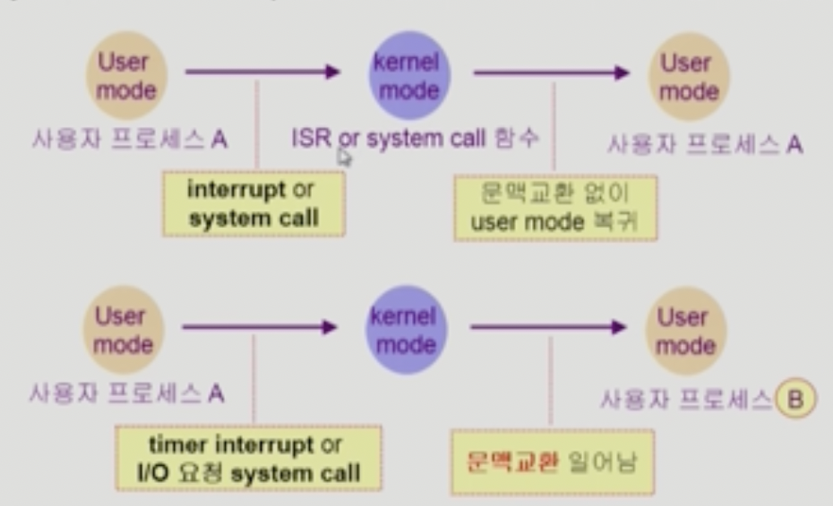
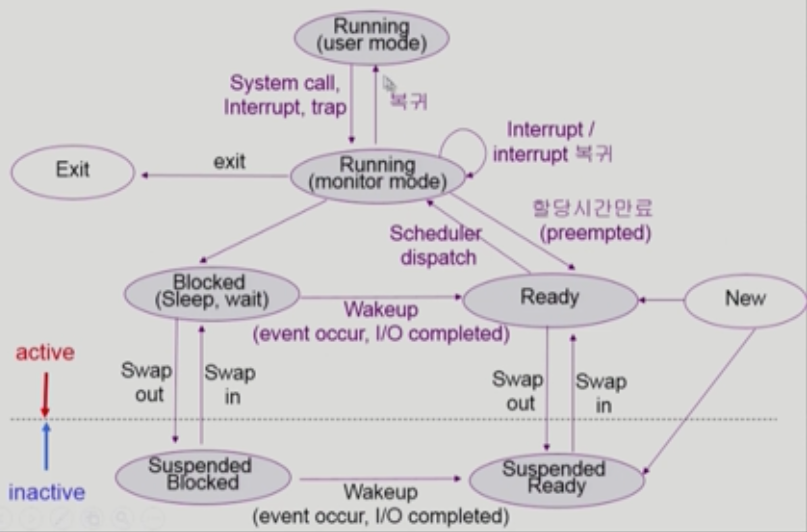
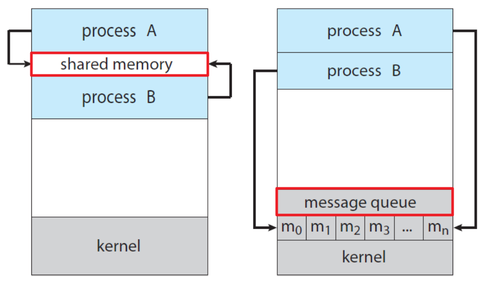
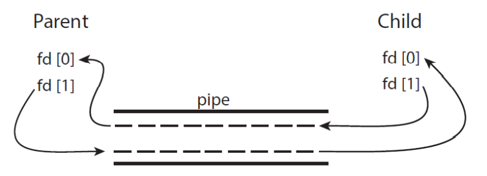
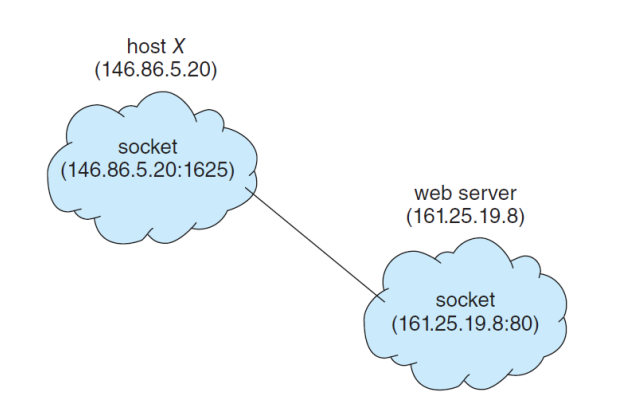

## Table of contents
{: .no_toc .text-delta }

1. TOC
{:toc}
---

# **프로세스의 이해**

## **프로세스 (`Process`)**
- 실행 중인 프로그램을 **Processs** 라고 한다.
- **단일 스레드**를 수행하는 프로그램이다. (한 번에 하나의 작업만 수행한다.)
  - ✋ **여러 스레드의 실행도 허용 한다. (챕터 4장에서 자세히 설명한다.)**
- 프로세스들은 해당 작업을 수행하기 위해 아래와 같은 자원들이 필요하다.
- 아래의 자원들은 **보통 프로세스가 실행되는 동안 할당**된다.
  - CPU time
  - Memory
  - Resource
    - files
    - I/O devices

> **CPU가 Memory에 올라가있는 정보를 fecth 해서 execute 하는 것**

## **프로세스의 메모리 레이아웃**

- **Text Section** : 실행 가능한 코드
- **Data Section** : 전역변수
- **Heap Section** : 프로그램이 실행 되는 동안의 동적 할당 메모리
- **Stack Section** : 함수 파라미터 , 복귀 주소 또는 지역변수 등등..
- `Stack` , `Heap` 섹션은 프로그램 실행 중에 동적으로 줄어들거나 커질 수 있다.


> ✋ **사이즈를 직접 확인할 수 있다.**


## **프로세스의 생명주기**

- **New**
  - 프로세스가 생성 중
- **Running** 
  - (시분할을 통하여) `CPU`를 점유하고 있는 상태 , 명령어들 또는 `instruction`이 실행되고 있다
- **Blocked** (`Waiting` , `Sleep`) 
  - 자신이 요청한 `event`가 만족되면 `Ready`로 변경된다
  - `CPU`를 주어도 당장 `instruction`을 수행할 수 없는 상태
  - **다른 프로세스의 작업** 이나 **I/O** 또는 **이벤트를 기다리고 있는 상태**
- **Ready**
  - (Ready Queue에 들어가) 메모리 등 다른 조건을 모두 만족하고 `CPU`를 기다리는 상태
  - `CPU`를 점유할 준비가 되어있는 상태
- **Terminated** 
  - 프로세스의 실행이 종료된 상태
- **Suspended** (`Stopped`) 📌
  - 외부(**Swapper**)적인 이유로 프로세스의 수행이 정지된 상태
    - 외부에서 `resume`해 주어야 `Active`
  - 프로세스는 통째로 디스크에 `swap out`된다
    - 사용자가 프로그램을 일시 정지 시킨 경우 (`break key`)
    - *메모리에 너무 많은 프로세스가 올라와 있을 때* 시스템이 여러 이유로 프로세스를 잠시 중단시킴


## **PCB (`Process Control Block`)** or TCB (`Task Control Block`)
- 운영체제가 **각 프로세스를 관리하기 위해 프로세스당 유지하는 정보**

1. **OS**가 관리상 사용하는 정보
   - `Process State` , `Process ID`
   - `Scheduling Information` , `Priority` 
2. **CPU** 수행 관련 하드웨어 값 
   - `Program Counter` , `Registers`
3. 메모리 관련
   - `Code` , `Data` , `Stack`의 위치 정보 
4. 파일 관련
   - `Open File Descriptors`


## **Process Scheduling**

- **Multiprogramming**
- **Time Sharing**
- **Scheduling Queues**
  - `Job Queue`
    - **현재 시스템내에 있는 모든 프로세스의 집합**
  - `Ready Queue`
    - 현재 메모리 내에 있으면서 **CPU**를 잡아서 실행되기를 기다리는 프로세스의 집합
  - `Device Queues`
    - `I/O device`의 처리를 기다리는 프로세스의 집합


> ✋ **Queueing Diagram**


## **Context Switch**

- **PCB** 정보를 **Context (문맥)** 이라 한다.
- **CPU**를 한 프로세스에서 다른 프로세스로 넘겨주는 과정


> 1. **CPU 코어를 다른 프로세스로 전환한다.**
> 2. **현재 프로세스의 상태를 저장한다.**
> 3. **다른 프로세스의 상태를 복원한다.**

- **인터럽트가 발생하면**
  - 시스템은 실행 중인 프로세스의 현재 컨텍스트를 저장한다.
  - 나중에 다시 시작해야 할 때 해당 컨텍스트를 복원한다.


- `System call`이나 `Interrupt`발생 시 반드시 **Context Switch**가 일어나는 것은 아니다.
- **사용자 프로세스가 운영 체제 커널로 넘어가는것을 Context Switch라고 말하진 않는다.**
  - 이후에 , `CPU`가 다른 프로세스한테 넘겨주는 경우가 있다. 이 경우를 **Context Switch**라고 한다.



## **스케줄러 (`Scheduler`)**

### `Long-term Scheduler` : **장기 스케줄러** 또는 **Job Scheduler**
- 시작 프로세스 중 어떤 것 들을 `Ready Queue`로 보낼지 결정
  - *`new`* 에서 *`ready`* 넘어올 때의 **admitted** 단계
- 프로세스에 `Memory (및 각종 자원)`를 주는 문제
- `Degree Of Multiprogramming`을 제어
  - 메모리에 올라가있는 프로세스의 개수를 제어
  - `Degree Of Multiprogramming`이 **9**라면 메모리에 올라가 있는 프로세스의 개수는 9개다
- 요즘 시스템 `Time Sharing System`에는 **보통 장기 스케줄러가 없다** *무조건 `ready`* 📌
  - 그렇다면 `Degree Of Multiprogramming`을 어떻게 제어할까??
    - **아래의 `Medium-term Scheduler`가 해결해준다.**


### `Short-term Scheduler` : **단기 스케줄러** 또는 **CPU Scheduler**
- **어떤 프로세스를 다음번에 `Running`시킬지 결정**
- 프로세스에 **CPU**를 주는 문제
- 충분히 빨라야 한다.

### `Medium-term Scheduler` : **중기 스케줄러** 또는 **Swapper**
- **여유공간 마련을 위해 프로세스를 통째로 메모리에서 디스크로 쫓아냄** 📌
- 프로세스에게서 `Memory`를 뺏는 역할
- `Degree Of Multiprogramming`을 제어



## **프로세스가 새로운 프로세스를 생성할 수 있다.**
- ex : `fork()`


- **두 가지 실행 가능성**
  - 부모 프로세스는 자식 프로세스와 동시에 계속 실행된다.
  - 부모 프로세스는 자식 프로세스의 일부 또는 전체가 종료될 때까지 기다린다.
- **두 가지 주소 공간 가능성**
  - 자식 프로세스는 부모 프로세스와 같은 주소 공간을 사용한다.
  - 자식 프로세스가 새로 로드된다.
- 프로세스가 마지막 명령을 수행한 후 운영체제에 이를 알려준다 - **`exit`시스템 콜**
  - 자식이 부모에게 `output data`를 보냄 - **`wait`시스템 콜**
  - 프로세스의 각종 자원들이 운영체제에게 반납됨
- 부모 프로세스가 자식의 수행을 종료시키는 경우 - **`abort`시스템 콜**
  - 자식이 할당 자원의 한계치를 넘어설 경우
  - 자식에게 할당된 태스크가 더 이상 필요하지 않을 경우
  - **부모가 종료 `exit`하는 경우**
    - 운영체제는 부모 프로세스가 종료하는 경우 자식이 더 이상 수행 되도록 두지 않는다
    - **단계적인 종료**
- `Copy-On-Write` 🚩
  - 메모리 효율성을 위해 자식 프로세스의 내용이 수정되면 그 때 부모 프로세스의 공유하던 정보를 복사한다.


> ✋
> - **Q** 새로운 프로그램을 **process**에 올리는 것도 `fork()`라는 **시스템 콜**에 의해 진행 되는 것인가요?
> - **A**
>   - 맞습니다.
>   -  `fork()` 시스템 콜은 리눅스 기준으로 질문한 것과 같이 동작합니다.
>   - 운영체제 커널이 먼저 `fork()`를 하고,  `fork()`를 한 프로세스 영역에 실행을 요청한 프로세스의 코드와 데이터 영역을 덮어 쓰는 것이죠.
>
> - **Q** 최초의 복제 되상이 되는 parent는 무엇인가요?
> - **A**
>    - `fork()`를 할 때는 **자기 자신을 복제**합니다.
>    - 메모장을 실행했을 때 `fork()`를 호출하는 프로세스를 복제하겠지요?
>    - 메모장 실행을 요청하는 것은 GUI의 마우스 클릭을 하겠지만, 이것은 커맨드창에서 memo.exe를 입력한 것과 동일합니다.
>    - 따라서, 리눅스라면 쉘 프로세스(sh, bash, zsh 등)가 parent 프로세스가 되어 메모장을 위한 child process를 생성하는 것이라 보면 됩니다.

## **Zombie and Orphan**
- **좀비 프로세스**
  - **자식 프로세스가 종료 되었지만 `부모 프로세스가 자식 프로세스의 종료 상태를 회수하지 않았을 경우`**
  - 자식 프로세스가 **exit 시스템 콜**을 호출 하면서 종료되면 이 프로세스에 관련된 모든 메모리와 리소스가 해제되어 다른 프로세스에서 사용할 수 있게 된다.
  - 자식 프로세스가 종료된 이후에 부모 프로세스가 자식 프로세스의 상태를 알고 싶을 수 있기 때문에 커널은 자식 프로세스가 종료되더라도 최소한의 정보(프로세스 ID, 프로세스 종료 상태 등)를 가지고 있게 된다.
  - 부모 프로세스가 좀비 프로세스의 종료상태를 회수하게 되면(**wait 시스템콜**을 통하여) 좀비 프로세스는 제거된다.
  - 부모 프로세스는 **wait 시스템 콜** 함수를 사용하여 자식 프로세스의 종료 상태를 읽어들이는 것이 필요하다.
- **고아 프로세스**
  - 부모 프로세스가 자식 프로세스 보다 먼저 종료된 경우
  - 부모 프로세스가 자식 프로세스보다 먼저 종료되면 **init 프로세스**가 자식 프로세스 새로운 부모 프로세스가 된다.
  - **고아 프로세스가 작업을 종료하면 init 프로세스가 wait함수를 호출하여 고아 프로세스의 종료 상태를 회수 하여 좀비 프로세스가 되는 것을 방지한다.**

> ✋ **init 프로세스**
> - 유닉스 계열의 운영체제에서 부팅 과정 중 생성되는 **최초의 프로세스** 이며 ,
> - 시스템이 종료 될 때 까지 계속 살아있는 **데몬 프로세스** 이다.

***

# **프로세스와 관련한 시스템 콜**

## create a child (copy) `fork()` 

- **fork()** **System call**에 의해 새로운 프로세스가 생성된다.
- **프로세스의 리턴 코드가 0이면 자식 프로세스 이고 , 0이 아니면 부모 프로세스이다.**

> - 부모 프로세스의 주소 정보를 복사한다.
> - 부모 프로세스는 계속 진행된다.
> - **wait()** 을 사용하여 자식 프로세스가 진행 되는 동안 기다릴 수 있다.  (Wait queue에서 대기한다)


```c
#include <stdio.h>
#include <unistd.h>
#include <sys/wait.h>

int main()
{
    pid_t pid;
    pid = fork();
    printf("Hello , Process %d \n" , pid);

    return 0;
}
// Hello, Process 296
// Hello, Process 0
```

### **예제 1 - 자식 프로세스 `value += 15`**

```c
#include <stdio.h>
#include <unistd.h>
#include <sys/wait.h>

int value = 5;

int main()
{
    pid_t pid;
    pid = fork();
    if(pid == 0) {
        wait(NULL);
        value += 15;
    }
    else if(pid > 0){
        printf("Hello , Parent Process %d \n", value);
    }

    return 0;
}
// Hello , Parent Process 5
```

> ✋ **위의 value 값이 5가 나오는 이유**
> - 자식 프로세스의 value 값이 20으로 증가하고 , 부모 프로세스의 value 값은 5 그대로 이다.

### **예제 2 - 연속 fork()**

```c
#include <stdio.h>
#include <unistd.h>
#include <wait.h>

    /**
     *  How many processes are created?
    */
    int main()
{
    fork(); // fork a child process , 2개
    fork(); // fork another child process , 4개
    fork(); // and fork another 8개
    printf("process \n");
    return 0;
}
// process
// process
// process
// process
// process
// process
// process
// process
```

### **예제 3 - `value += 5` , 연속 fork()**

```c
#include <stdio.h>
#include <unistd.h>
#include <wait.h>

    int value = 0;

    int main()
{
    pid_t pid;
    value += 5;
    pid = fork();
    printf("Process : %d -> %d\n", pid, value);
    value += 5;
    pid = fork();
    printf("Process : %d -> %d\n", pid, value);
    value += 5;
    pid = fork();
    printf("Process : %d -> %d\n" , pid , value);

    return 0;
}

// Process : 581 -> 5
// Process : 0 -> 5
// Process : 582 -> 10
// Process : 0 -> 10
// Process : 583 -> 15
// Process : 0 -> 15
// Process : 584 -> 15
// Process : 585 -> 10
// Process : 0 -> 15
// Process : 0 -> 10
// Process : 586 -> 15
// Process : 587 -> 15
// Process : 0 -> 15
// Process : 0 -> 15
```

### **예제 4 - `getpid()`**

```c
#include <stdio.h>
#include <unistd.h>
#include <wait.h>

    int value = 0;

    int main()
{
    pid_t pid , pid1;
    pid = fork();

    if(pid == 0){ // child process
        pid1 = getpid();
        printf("child : pid = %d\n" , pid);
        printf("child : pid1 = %d\n", pid1);
    }
    else if(pid > 0){   // parent process
        wait(NULL);
        pid1 = getpid();
        printf("parent : pid = %d\n", pid);
        printf("parent : pid1 = %d\n", pid1);
    }

    return 0;
}
// child : pid = 0
// child : pid1 = 706
// parent : pid = 706
// parent : pid1 = 705
```

### **예제 5 - `int nums[size] = {0 , 1 , 2 , 3 , 4}`**

```c
#include <stdio.h>
#include <unistd.h>
#include <wait.h>

#define SIZE 5
int nums[SIZE] = {0, 1, 2, 3, 4};

int main()
{
    pid_t pid;
    int i;
    pid = fork();

    if(pid == 0){ // child process
        for(i = 0 ; i < SIZE ; i++){
            nums[i] *= i;
            printf("CHILD : %d \n" , nums[i]);
        }

    }
    else if(pid > 0){   // parent process
        wait(NULL);
        for (i = 0 ; i < SIZE ; i++){
            printf("PARENT : %d \n", nums[i]);
        }
    }

    return 0;
}
// CHILD : 0
// CHILD : 1
// CHILD : 4
// CHILD : 9
// CHILD : 16
// PARENT : 0
// PARENT : 1
// PARENT : 2
// PARENT : 3
// PARENT : 4
```

## overlay new image `execlp()`
- 프로세스를 생성하지만 `fork()`와 달리 **완전히 새로운 프로세스를 생성한다.**

### **자식 프로세스 `execlp("/bin/ls" , "ls" , NULL);`**

```c
#include <stdio.h>
#include <unistd.h>
#include <wait.h>

    int value = 0;

    int main()
{
    pid_t pid;
    pid = fork();

    if(pid == 0){ // child process
        execlp("/bin/ls" , "ls" , NULL);
        printf("LINE J\n");
    }
    else if(pid > 0){
        wait(NULL);
        printf("Child Complete \n");
    }

    return 0;
}
// a.out hello.c
// Child Complete
```

>  ✋ `printf("LINE J\n");` 는 실행되지 않는다.

## sleep until process is done `wait()`
- `wait()`를 실행한 프로세스를 **sleep**시킨다 (`block` 상태)
- 다른 프로세스가 종료되면 자고 있던 프로세스를 깨운다 (`ready` 상태)

```c
#include <stdio.h>
#include <unistd.h>
#include <sys/wait.h>

int main()
{
    pid_t pid;
    pid = fork();
    if(pid > 0) wait(NULL);
    printf("Hello , Process %d \n" , pid);

    return 0;
}
// Hello , Process 0
// Hello , Process 306
```

## frees all the resources , notify parent `exit()`
- **자발적 종료**
  1. 마지막 `statement`수행 후 `exit()`시스템 콜을 호출
     - *프로그램에 명시적으로 적어주지 않아도 `main`함수가 리턴되는 위치에 컴파일러가 넣어줌*
- **비자발적 종료**
  1. 부모 프로세스가 자식 프로세스를 강제로 종료시키는 경우
      - *자식 프로세스가 한계치를 넘는 자원을 요청하거나 , 태스크가 더 이상 필요하지 않을 떄*
  2. 키보드로 `kill` , `break`등을 친 경우
  3. 부모가 종료하는 경우
      - *부모 프로세스가 종료하기 전에 자식들이 먼저 종료된다.* 

***

# **독립적 프로세스 `Independant Process`**
- 프로세스는 각자의 주소 공간을 가지고 수행되므로 원칙적으로 하나의 프로세스는 다른 프로세스의 수행에 영향을 미치지 못한다.

# **협력 프로세스 `Cooperating Process`**
- 프로세스 협력 메커니즘을 통해 하나의 프로세스가 다른 프로세스의 수행에 영향을 미칠 수 있다.

# **프로세스간 협력 메커니즘 `IPC : Inter-Process Communication`**
- <span style="color:red; font-weight:bold">어떤 프로세스가 메세지와 데이터를 공유할 때 이 문제를 어떻게 해결할 것 인가?</span>
- 위와 같이 프로세스가 협력할 때 **IPC 메커니즘**이 필요하다.

## **IPC의 두 가지 기본 모델**


### **공유 메모리 `Shared Memory`**
- **생산자-소비자 문제 `Producer-Consumer Problem`**
  - Producer(생산자)는 정보를 생산 하고 , Consumer(소비자)는 정보를 소비한다.
  - `컴파일러는 어셈블리 코드를 생성하고 어셈블러는 이를 사용한다.`
  - `웹 서버는 HTML 파일을 생성하고 브라우저는 HTML 파일을 사용한다.`
  - 생산자와 소비자가 **동시(Concurrently)에 실행 되도록**한다.
  - **버퍼(Buffer)** 도 메모리 영역이다.
  - **버퍼(Buffer)** 를 **Shared Memory (공유 메모리)** 로 만들어 생산자는 버퍼를 채우고 , 소비자는 버퍼를 비우도록 한다.
  - 소비자는 버퍼가 비어있다면 `wait`한다.
- 메모리 영역을 공유 하고 , 공유 메모리에 액세스하고 조작하기 위한 아래와 같은 코드를 프로그래머가 명시 해야한다.

```c
#define BUFFER_SIZE 10

typedef struct{
  ...
} item

item buffer [BUFFER_SIZE];
int in = 0;   // 생산자용 인덱스
int out = 0;  // 소비자용 인덱스
item next_produced;

while(true){

  /* produce an item in next_produced */

  while(((in + 1) % BUFFER_SIZE) == out) ; /* do nothing*/

  buffer[in] = next_produced;
  in = (in + 1) % BUFFER_SIZE;
}

item next_consumed;

while(true){
  while(in == out) ; /* do nothing */

  next_consumed = buffer[out];
  out = (out + 1) % BUFFER_SIZE;

  /* consume the item in next_consumed*/
}
```

### **메시지 전달 `Message Passing`**
- **O/S가 서로 협력 하는 프로세스를 위해 제공 하는 기능**
- `send(message)`
- `receive(message)`
- 서로 메세지를 주고 받으면 된다.
- **프로세스의 통신 방법**
  - 사용자 프로세스 끼리는 뭔가를 전달할 수 없고 중간에 운영체제 커널이 껴있다
  - **직접 커뮤니케이션 `Direct Communication`**
    - 통신의 수신자 또는 발신자의 `이름을 명시적으로 지정`해야 한다.
    - **send(𝑃, message)** - 프로세스 𝑃 에 메시지를 보낸다.
    - **receive(𝑄, message)** - 프로세스 𝑄에서 메시지를 받는다.
    - **속성**
      - 링크는 자동으로 설정되고 정확히 두 개의 프로세스와 연결된다.
      - 각 프로세스 사이에는 하나의 링크만 존재한다.
  - **간접 커뮤니케이션 `Indirect Communication`**
    - 메시지는 `메일박스` 또는 `포트`에서 **송수신**된다.
    - 사서함(포트라고도 함)
    - 추상적으로 객체로 볼 수 있다.
    - **send(𝐴, message)** - 메일함 𝐴으로 메시지를 보냅니다.
    - **receive(𝐴, message)** - 편지함 𝐴에서 메시지를 받습니다.
    - **속성**
      - 한 쌍의 프로세스 간에 링크가 설정된다.
      - 쌍의 두 구성원이 공유 사서함을 가지고 있는 경우에만 가능하다.
      - 링크는 두 개 이상의 프로세스와 연관될 수 있다.
      - 각 프로세스 쌍 사이에 서로 다른 여러 링크가 존재할 수 있다.
      - 각 링크는 하나의 사서함에 해당한다.

- **동기 및 비동기 통신 `Synchronous and Asynchronous Communication`**
  - **Blocking or Non-blocking** ↔︎ **Synchronous or Asynchronous**
  - **Blocking send** : 메시지를 받을 때까지 보낸 사람이 블록된다.
  - **Non-blocking send** : 보낸 사람이 메시지를 보내고 계속된다.
  - **Blocking receive** : 받는 사람은 메시지를 사용할 수 있을 때까지 블록된다.
  - **Non-blocking receive**

  - **Automatic or Explicit Buffering - 자동 또는 명시적 버퍼링**

***

# **프로세스간 통신 사례**

## Shared Memory : **POSIX Shared Memory**
- **POSIX** - Portable Operating System Interface (for Unix)
- 메모리 매핑된 파일을 사용하여 구성한다.
- **공유 메모리 영역을 파일과 연결**

1. 먼저 공유 메모리 개체를 만든다.
  - `fd = shm_open(name, O_CREAT | ORDWR, 0666);`
2. 개체의 크기를 바이트 단위로 구성한다.
  - `ftruncate(fd, 4096);`
3. 마지막으로 메모리 매핑된 파일을 설정한다.
  - `mmap(0, SIZE, PROT_READ | PROT_WRITE, MAP_SHARED, fd, 0);`

### Producer - 생산자

```c
#include <stdio.h>
#include <stdlib.h>
#include <string.h>
#include <fcntl.h>
#include <unistd.h>
#include <sys/shm.h>
#include <sys/stat.h>
#include <sys/mman.h>

int main()
{
    const int SIZE = 4096;   // 공유 메모리의 사이즈
    const char *name = "OS"; // 공유 메모리의 이름
    const char *message_0 = "Hello , ";
    const char *message_1 = "Shared Memory!\n";

    int shm_fd;
    char *ptr; // 공유 메모리의 포인터

    // 공유 메모리 생성
    shm_fd = shm_open(name, O_CREAT | O_RDWR, 0666);

    // 공유 메모리 사이즈 설정
    ftruncate(shm_fd, SIZE);

    // 공유 메모리 매핑
    ptr = (char *)mmap(0, SIZE, PROT_READ | PROT_WRITE, MAP_SHARED, shm_fd, 0);

    // 공유 메모리 Write
    sprintf(ptr, "%s", message_0);
    ptr += strlen(message_0);
    sprintf(ptr, "%s", message_1);
    ptr += strlen(message_1);

    return 0;
}
```

### Consumer - 소비자

```c
#include <stdio.h>
#include <stdlib.h>
#include <string.h>
#include <fcntl.h>
#include <unistd.h>
#include <sys/shm.h>
#include <sys/stat.h>
#include <sys/mman.h>

int main()
{
    const int SIZE = 4096;   // 공유 메모리의 사이즈
    const char *name = "OS"; // 공유 메모리의 이름
    const char *message_0 = "Hello , ";
    const char *message_1 = "Shared Memory!\n";

    int shm_fd;
    char *ptr; // 공유 메모리의 포인터

    // 공유 메모리 생성
    shm_fd = shm_open(name, O_CREAT | O_RDWR, 0666);

    // 공유 메모리 사이즈 설정
    ftruncate(shm_fd, SIZE);

    // 공유 메모리 매핑
    ptr = (char *)mmap(0, SIZE, PROT_READ | PROT_WRITE, MAP_SHARED, shm_fd, 0);

    // 공유 메모리 Read
    printf("%s", (char *)ptr);

    // 공유 메모리 삭제
    shm_unlink(name);

    return 0;
}
```
- 재실행 시 출력되지 않는다.
```
jeongdalma@DESKTOP-LBC6EVJ:~/testwsl$ ./a.out
Hello , Shared Memory!
jeongdalma@DESKTOP-LBC6EVJ:~/testwsl$ ./a.out
jeongdalma@DESKTOP-LBC6EVJ:~/testwsl$ ./a.out
```


## Message Passing : `Pipes`
- **UNIX 시스템의 초기 IPC 메커니즘 중 하나**
- 두 개의 프로세스가 소통하는 것
- **Pipe 구현 시 고려해야할 사항**
  - **unidirectional (단방향)** 인지 **bidirectional (양방향)** 인지?
  - **half-duplex (반이중)** 인지 **full-duplex(전이중)** 인지?
  - 소통하는 프로세스간에 관계가 존재해야하는지? (parent , child)
  - 파이프가 네트워크를 통해 통신할 수 있는지?

### **두 가지의 일반적인 파이프 유형**
- **Ordinary Pipes** - 일반 파이프
  - 생성한 프로세스 외부에서 액세스할 수 없다.
  - 일반적으로 상위 프로세스가 파이프를 생성하여 사용한다.
  - 생성한 자식 프로세스와 통신한다.
  - 두 프로세스가 **생산자-소비자 방식**으로 통신할 수 있도록 합다.



**단방향**
```c
#include <stdio.h>
#include <string.h>
#include <unistd.h>
#include <sys/types.h>

#define BUFFER_SIZE 25
#define READ_END 0
#define WRITE_END 1

int main()
{
    char write_msg[BUFFER_SIZE] = "Greetings";
    char read_msg[BUFFER_SIZE];

    int fd[2];
    pid_t pid;

    /* 파이프 생성 */
    pipe(fd);
    pid = fork(); // 자식 프로세스 생성

    if(pid > 0){ // 0 이상이면 부모 프로세스
        close(fd[READ_END]);

        /* 쓰기 */
        write(fd[WRITE_END], write_msg, strlen(write_msg) + 1);
        close(fd[WRITE_END]);
    }
    else if(pid == 0){ // 0이면 자식 프로세스
        close(fd[WRITE_END]);

        /* 읽기 */
        read(fd[READ_END] , read_msg , BUFFER_SIZE);
        printf("read %s\n" , read_msg);
        close(fd[READ_END]);
    }

    return 0;
}
```

```
read Greetings
```

**양방향**

```c
#include <stdio.h>
#include <string.h>
#include <unistd.h>
#include <sys/wait.h>
#include <sys/types.h>

#define BUFFER_SIZE 25
#define READ_END 0
#define WRITE_END 1

int main()
{
    char write_msg1[BUFFER_SIZE] = "HIGH";
    char write_msg2[BUFFER_SIZE] = "LOW";
    char read_msg[BUFFER_SIZE];

    int fd[2];
    pid_t pid , pid1;


    /* 파이프 생성 */
    pipe(fd);
    pid = fork(); // 자식 프로세스 생성

    if(pid > 0){ // 0 이상이면 부모 프로세스
        pid1 = getpid();
        /* 쓰기 */
        write(fd[WRITE_END], write_msg1, strlen(write_msg1) + 1);

        wait(NULL);
        /* 읽기 */
        read(fd[READ_END], read_msg, BUFFER_SIZE);
        printf("parent read %d - %s\n", pid1 , read_msg);

        close(fd[READ_END]);
        close(fd[WRITE_END]);
    }
    else if(pid == 0){ // 0이면 자식 프로세스
        /* 읽기 */
        read(fd[READ_END] , read_msg , BUFFER_SIZE);
        printf("child read %d - %s\n" , pid , read_msg);

        write(fd[WRITE_END], write_msg2, strlen(write_msg2) + 1);
    }

    return 0;
}
```

```
child read 0 - HIGH
parent read 1075 - LOW
```
- **Named Pipes** - 명명된 파이프
  - 부모-자식 관계 없이 접근 가능


## **클라이언트-서버 시스템의 두 가지 다른 전략**

### **Socket : 소켓**
- 통신을 위한 양종단으로 정의 된다.
- IP로 양 쪽 시스템을 특정하고 , 양 쪽 시스템의 파이프를 특정할 때는 포트로 특정한다.
- 양 쪽 시스템 환경의 다름으로 인한 문제를 해결하기 위해 **RPCs**가 등장했다.



- **자바 제공**
  - 소켓에 대한 훨씬 쉬운 인터페이스 및 세 가지 유형의 소켓 제공
    - 📌 **소켓 클래스** : 연결 지향(TCP)
    - **DatagramSocket 클래스** : 비연결(UDP) , 브로드캐스팅
    - **MulticastSocket 클래스** : 특정 멀티 컨테이너

```java
import java.io.*;
import java.net.ServerSocket;
import java.net.Socket;
import java.util.*;

public class dateServer {
    public static void main(String[] args) throws Exception {
        ServerSocket server = new ServerSocket(7078);

        /* 6013 포트로 들어오는 요청을 기다린다 listener */
        while(true){
            System.out.println("..... Listening");
            Socket client = server.accept();
            PrintWriter pout = new PrintWriter(client.getOutputStream());
            System.out.println("..... New client is Connected....");
            /* 현재 일자를 전송 */
            pout.println(new java.util.Date().toString());

            /* 전송할 때 사용한 클라이언트를 닫는다. */
            client.close();
        }
    }
}
```

```java
import java.io.BufferedReader;
import java.io.IOException;
import java.io.InputStream;
import java.io.InputStreamReader;
import java.net.Socket;

public class dateClient {
    public static void main(String[] args) throws IOException {

        /* 서버 소켓 커넥션을 생성한다. */
        Socket socket = new Socket("127.0.0.1" , 7078);

        InputStream in = socket.getInputStream();
        BufferedReader br = new BufferedReader(new InputStreamReader(in));

        /* 소켓을 통해 받은 정보를 출력한다. */
        String line = null;
        while((line = br.readLine()) != null){
            System.out.println(line);
        }

        /* 소켓 커넥션을 닫는다. */
        socket.close();
    }
}
```

### **`RPCs - Remote Procedure Calls` 원격 프로시저 호출**
- **네트워크로 연결된 시스템의 프로세스 간의 프로시저 호출**
- 의사 소통을 가능하게 하는 세부 사항을 숨긴다.
- 클라이언트 측에서 **스텁**을 제공함으로써. 클라이언트 측의 스텁은 서버를 찾고 매개변수를 **마샬링** 한다.
- 서버 측의 스텁이 이 메시지를 수신하면. 마샬링된 매개변수의 압축을 풀고 서버에서 절차를 수행한다.

> - **Stub** - 상대 시스템의 함수 정보
> - **[직렬화 vs 마샬링](https://hyesun03.github.io/2019/09/08/marshalling-vs-serialization/)**
