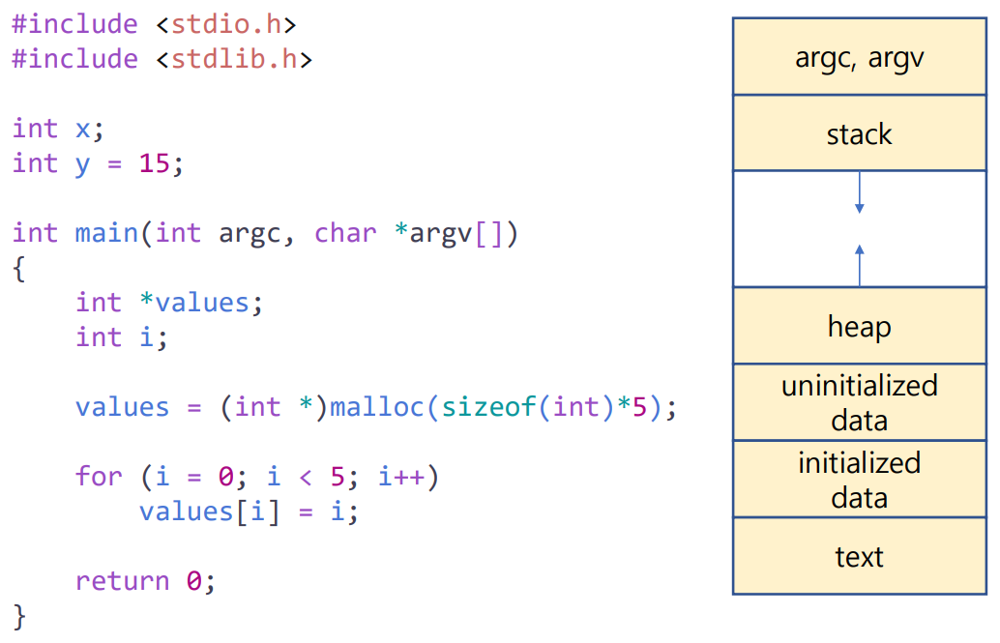
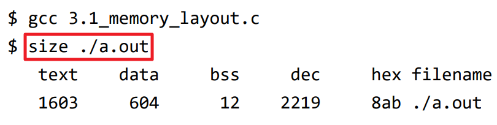
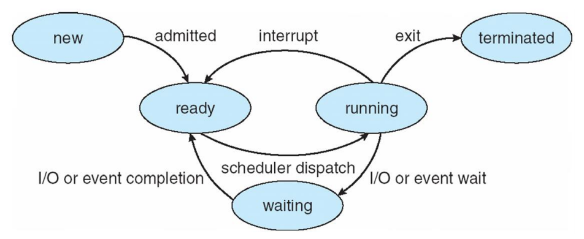
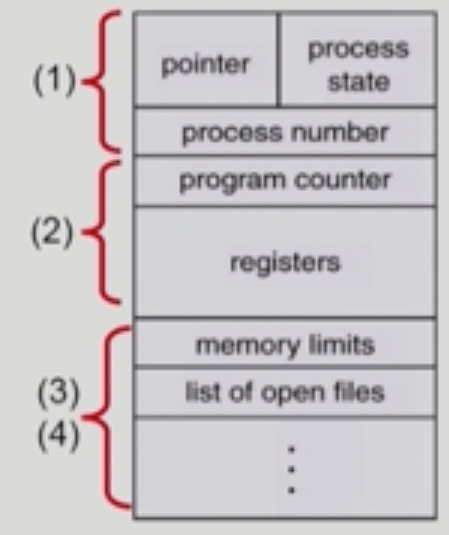
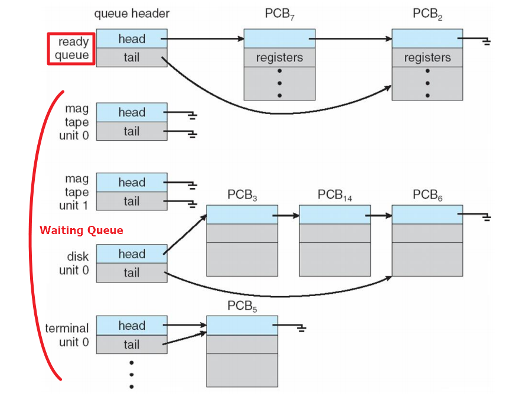
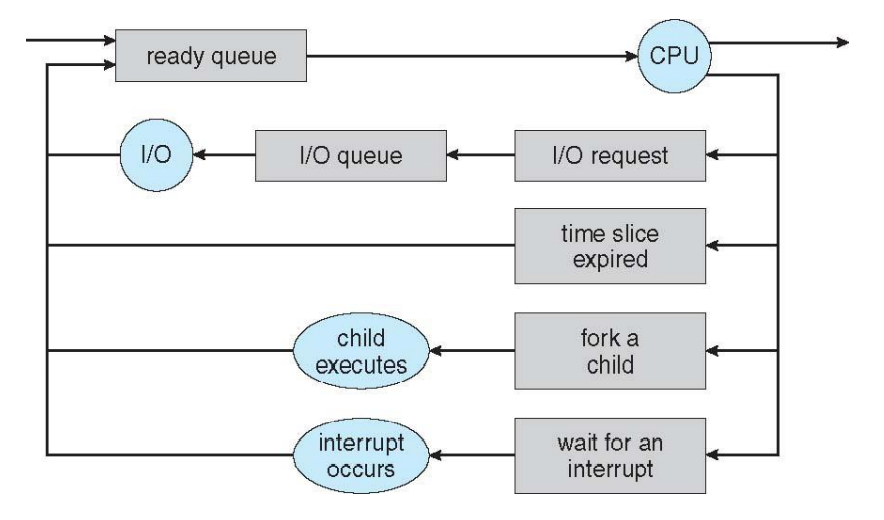
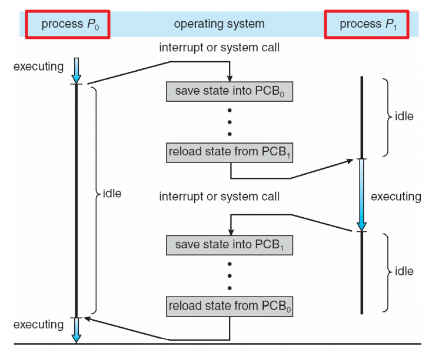
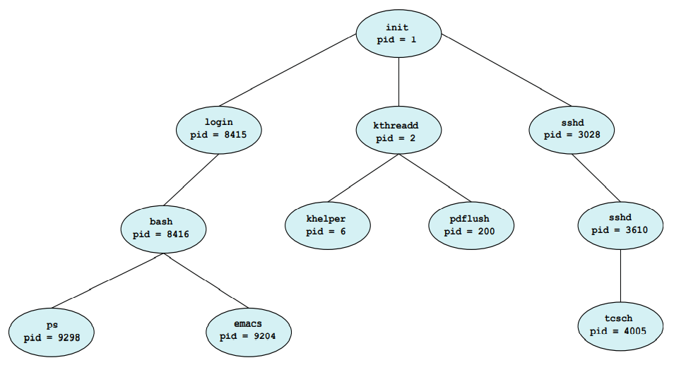
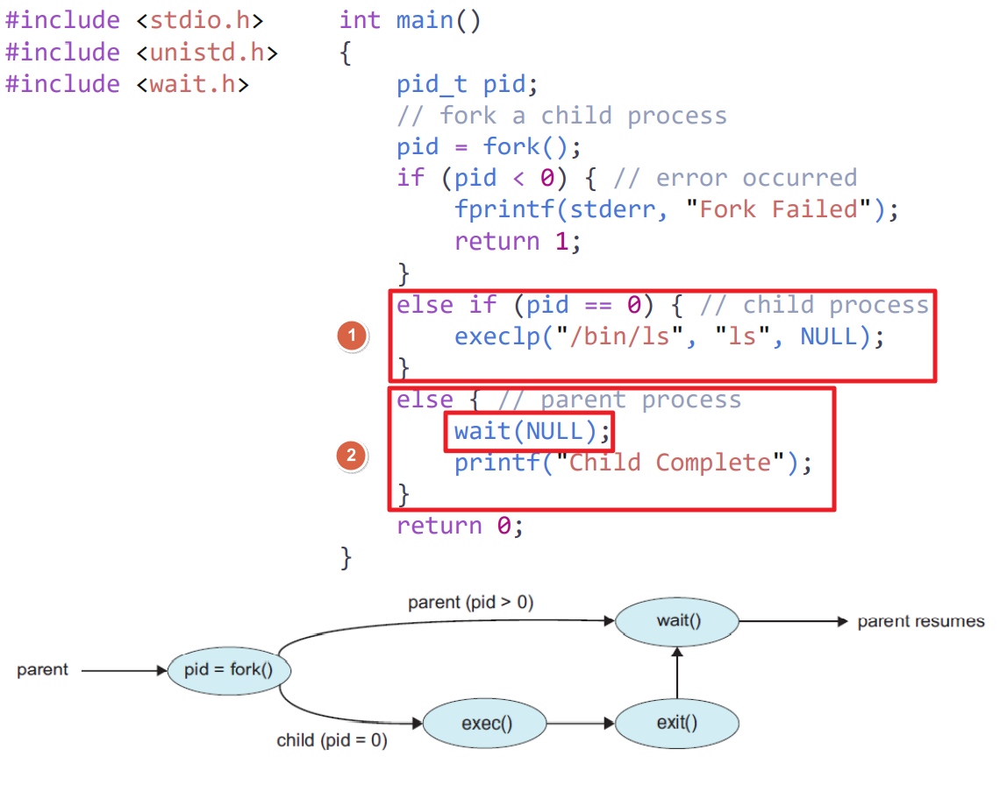

## Table of contents
{: .no_toc .text-delta }

1. TOC
{:toc}
---

# **프로세스의 이해**

## **프로세스(Process)**
- 실행 중인 프로그램을 **프로세스(Processs)** 라고 한다.
- **단일 스레드**를 수행하는 프로그램이다. (한 번에 하나의 작업만 수행한다.)
  - ✋ **여러 스레드의 실행도 허용 한다. (챕터 4장에서 자세히 설명한다.)**
- 프로세스는 해당 작업을 수행하기 위해 자원들이 필요하다.
  - CPU time
  - Memory
  - Resource
    - files
    - I/O devices

> **CPU가 Memory에 올라가있는 정보를 fecth 해서 execute 하는 것**

## **프로세스의 메모리 레이아웃**

- **Text Section** : 실행 가능한 코드
- **Data Section** : 전역변수
- **Heap Section** : 프로그램이 실행 되는 동안의 동적 할당 메모리
- **Stack Section** : 함수 파라미터 , 복귀 주소 또는 지역변수 등등..

> ✋ **사이즈를 직접 확인할 수 있다.**

## **프로세스의 생명주기**

- **New** : 생성된 상태
- **Running** : (시분할을 통하여) CPU를 점유하고 있는 상태
- **Waiting** : 다른 프로세스의 작업 이나 I/O 또는 이벤트를 기다리고 있는 상태
- **Ready** : (Ready Queue에 들어가) CPU를 점유할 준비가 되어있는 상태
- **Terminated** : 프로세스의 실행이 종료된 상태

## **PCB (Process Control Block)** or TCB (Task Control Block)

- 각 프로세스가 가져야 할 정보를 저장 해놓는 것
  - **Process state** : 상태
  - **Program Counter** : 메모리 주소
  - CPU Registers
  - CPU - Scheduling 정보
  - 메모리 관리 정보
  - 사용자 계정 정보
  - I/O 상태 정보
  - ...

## **Process Scheduling**

- **Multiprogramming**
- **Time Sharing**
- **Scheduling Queues**
  - **Ready Queue**
  - **Waiting Queue**

> ✋ **Queueing Diagram**

## **Context Switch**

- **PCB** 정보를 **Context (문맥)** 이라 한다.
> 1. **CPU 코어를 다른 프로세스로 전환한다.**
> 2. **현재 프로세스의 상태를 저장한다.**
> 3. **다른 프로세스의 상태를 복원한다.**

- **인터럽트가 발생하면**
  - 시스템은 실행 중인 프로세스의 현재 컨텍스트를 저장한다.
  - 나중에 다시 시작해야 할 때 해당 컨텍스트를 복원한다.

## **프로세스가 새로운 프로세스를 생성할 수 있다.**
- ex : fork()

- **두 가지 실행 가능성**
  - 부모 프로세스는 자식 프로세스와 동시에 계속 실행된다.
  - 부모 프로세스는 자식 프로세스의 일부 또는 전체가 종료될 때까지 기다린다.
- **두 가지 주소 공간 가능성**
  - 자식 프로세스는 부모 프로세스와 같은 주소 공간을 사용한다.
  - 자식 프로세스가 새로 로드된다.

> ✋
> **Q** 새로운 프로그램을 process에 올리는 것도 fork()라는 시스템 콜에 의해 진행 되는 것인가요?
> **A**
> 맞습니다. fork() 시스템 콜은 리눅스 기준으로 질문한 것과 같이 동작합니다.
> 운영체제 커널이 먼저 fork()를 하고,  fork()를 한 프로세스 영역에 실행을 요청한 프로세스의 코드와 데이터 영역을 덮어 쓰는 것이죠.
>
> **Q** 최초의 복제 되상이 되는 parent는 무엇인가요?
> **A**
> fork()를 할 때는 자기 자신을 복제합니다.
> 메모장을 실행했을 때 fork()를 호출하는 프로세스를 복제하겠지요?
> 메모장 실행을 요청하는 것은 GUI의 마우스 클릭을 하겠지만, 이것은 커맨드창에서 memo.exe를 입력한 것과 동일합니다.
> 따라서, 리눅스라면 쉘 프로세스(sh, bash, zsh 등)가 parent 프로세스가 되어 메모장을 위한 child process를 생성하는 것이라 보면 됩니다.

## **Zombie and Orphan**
- **좀비 프로세스**
  - 자식 프로세스가 종료 되었지만 부모 프로세스가 자식 프로세스의 종료 상태를 회수하지 않았을 경우
  - 자식 프로세스가 **exit 시스템 콜**을 호출 하면서 종료되면 이 프로세스에 관련된 모든 메모리와 리소스가 해제되어 다른 프로세스에서 사용할 수 있게 된다.
  - 자식 프로세스가 종료된 이후에 부모 프로세스가 자식 프로세스의 상태를 알고 싶을 수 있기 때문에 커널은 자식 프로세스가 종료되더라도 최소한의 정보(프로세스 ID, 프로세스 종료 상태 등)를 가지고 있게 된다.
  - 부모 프로세스가 좀비 프로세스의 종료상태를 회수하게 되면(**wait 시스템콜**을 통하여)  좀비 프로세스는 제거된다.
  - 부모프로세스는 **wait 시스템 콜** 함수를 사용하여 자식 프로세스의 종료 상태를 읽어들이는 것이 필요하다.
- **고아 프로세스**
  - 부모 프로세스가 자식 프로세스 보다 먼저 종료된 경우
  - 부모 프로세스가 자식 프로세스보다 먼저 종료되면 **init 프로세스**가 자식 프로세스 새로운 부모 프로세스가 된다.
  - **고아 프로세스가 작업을 종료하면 init 프로세스가 wait함수를 호출하여 고아 프로세스의 종료 상태를 회수 하여 좀비 프로세스가 되는 것을 방지한다.**

> ✋ **init 프로세스**
> - 유닉스 계열의 운영체제에서 부팅 과정 중 생성되는 최초의 프로세스 이며 ,
> - 시스템이 종료 될 때 까지 계속 살아있는 데몬 프로세스 이다.
