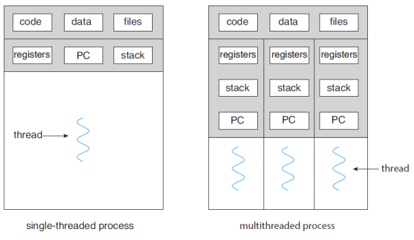
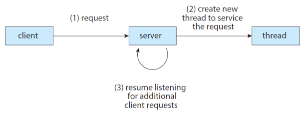

## Table of contents
{: .no_toc .text-delta }

1. TOC
{:toc}
---

- 지금까지 우리는 프로세스가 단일 제어 스레드로 실행중인 프로그램이라고 가정했다.
- 하지만 **프로세스는 여러 스레드를 포함 할 수 있다.**

# **Thread - 스레드**
- **Light Weight Process** - 경량 프로세스
- CPU 활용의 기본 단위
- **스레드 ID, 프로그램 카운터, 레지스터 세트 및 스택으로 구성된다.**





## **멀티 스레드 프로그래밍 장점**
- **반응성** - 지속적인 실행을 허용할 수 있음
- **자원 공유** - 스레드는 프로세스의 자원을 공유하고, 공유 메모리 또는 메시지 전달보다 쉽다
- **경제성** - 프로세스 생성보다 저렴
  - **스레드 스위칭은 컨텍스트 스위칭보다 오버헤드가 낮다.**
- **확장성** : 프로세스는 멀티 프로세서 아키텍처를 활용할 수 있다

## **Java에서 스레드를 명시적으로 생성하는 세 가지 기술**.

### **Thread 클래스에서 상속**
- Thread 클래스에서 파생된 새 클래스를 만든다.
- `public void run()` 메서드를 재정의한다.

```java
public class MyThread extends Thread{
    @Override
    public void run() {
        try{
            while(true){
                System.out.println("Hello , Thread");
                Thread.sleep(500);
            }
        }
        catch(InterruptedException ie){
            System.out.println("--------Interrupted");
        }
    }
}
```

```java
import java.io.IOException;

class Main {
    public static void main(String[] args) throws IOException {
        MyThread thread = new MyThread();
        thread.start();
        System.out.println("Hello , my child");
    }
}
```


### **Runnable 인터페이스 구현**
- Runnable 인터페이스를 구현하는 새 클래스를 정의한다.
- `public void run()` 메서드를 재정의한다.

```java
public class MyThread implements Runnable{
    @Override
    public void run() {
        try{
            while(true){
                System.out.println("Hello , Runnable");
                Thread.sleep(500);
            }
        }
        catch(InterruptedException ie){
            System.out.println("--------Interrupted");
        }
    }
}
```

```java
import java.io.IOException;

class Main {
    public static void main(String[] args) throws IOException {
        Thread thread = new Thread(new MyThread());
        thread.start();
        System.out.println("Hello , my child");
    }
}
```

### **Lambda 표현식 사용(Java 버전 1.8부터)**
- 새로운 클래스를 정의하지 않고 대신 **Runnable의 람다 식을 사용**한다.
- 참고 - **[JAVA8 Concurrent Programming](https://jeongcode.github.io/docs/java/concurrent/)**

```java
class Main {
    public static void main(String[] args){
        Runnable task = () -> {
            try{
                while(true){
                    System.out.println("Hello , Lambda Runnable");
                    Thread.sleep(500);
                }
            }
            catch(InterruptedException ie){
                System.out.println("--------Interrupted");
            }
        };
        Thread thread = new Thread(task);
        thread.start();
        System.out.println("Hello , my child");
    }
}
```

### **부모 쓰레드의 대기**

```java
class Main {
    public static void main(String[] args){
        Runnable task = () -> {
            for(int i = 0 ; i < 5 ; i++){
                System.out.println("Hello , Lambda Runnable");
            }
        };
        Thread thread = new Thread(task);
        thread.start();
        try{
            thread.join();
        }
        catch(InterruptedException ie){
            System.out.println("Parent thread is interrupted");
        }
        System.out.println("Hello , My Joined Child");
    }
}
```
