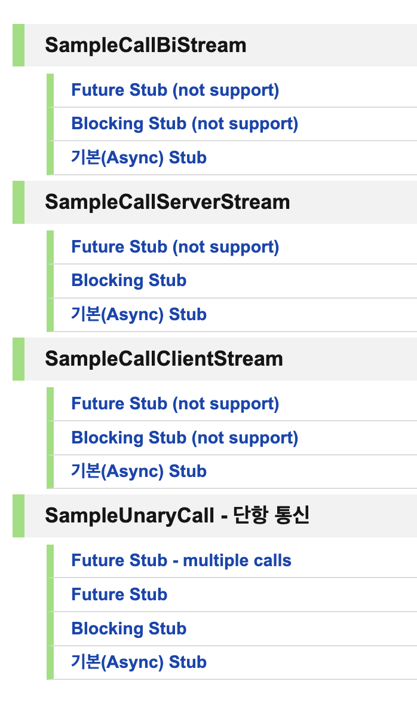

{: .no_toc }

<details open markdown="block">
  <summary>
    Table of contents
  </summary>
  {: .text-delta }
1. TOC
{:toc}
</details>

---

# **12월 첫째 주 회고**

## 트레이닝 프로젝트

[조사한 내용 정리](https://jdalma.github.io/docs/algorithmTheory/etc)  
**1차. 서버 템플릿 구축하기**  
`proto` 
- protoc
- proto buffer
- stub

`HTTP/2`    
- 용어 설명
- HOL Block
- 스트리밍

`gRPC`  
- 채널
  - 서버의 클라이언트 객체를 생성할 때 채널이 생성된다
  - service stub은 스레드에 안전하고, 
- gRPC의 stream 옵션
- 실제 클라이언트가 서버에 요청하는 순서

`Armeria` ( + Spring Tomcat )   
- Reactive Streams의 백프레셔
  - 풀 방식
- REST로 접근할 수 있는 healthcheck Web API가 있다
- StreamObserver
  - 주요 메소드
  - ClientCallStreamObserver
  - ServerCallStreamObserver

## [자바에서 코틀린으로](https://github.com/jdalma/java-to-kotlin) 읽기 모임 1주차

- 코틀린 컴파일러가 자바로 변환할 때 `final class`로 해준다 
  - **자바 변환기를 사용할 때 `final class`를 인식하고 사용해라**
- `require()`를 사용하는 건 어떻게 생각하냐
  - 자바는 예외를 밖으로 밀어내는 컨셉이다
    - 사용당하는 함수는 자기 책임에만 맞는 내용에 집중한다
  - 코틀린은 모든 예외를 **런타임 예외**로 바꾼다
    - `null`을 예외 대신 쓰기도 한다
    - `try-catch`를 통해 예외를 풍부하게 알려주려고 하는 개발자도 있고 `null`로 처리하는 개발자도 있다.
- 자바는 확장을 가능하게 모두 열어두지만 **코틀린은 필요할 때만 확장하게 하려는 컨셉**
- **생성자와 팩토리 메소드가 `서로 같은 처리를 하지 않는다면` 생성자를 감춰야 한다**
- 코틀린에 있는 `substring()`은 인덱스가 범위를 벗어난다면 **런타임 예외**를 바로 던진다.
- `"코틀린에서는 최상위 상태와 함수 ..."` -> 코틀린에서는 클래스 밖에 선언이 가능하다
- 자바 클래스를 코틀린에서 쓸 때 컴파일러가 프로퍼티를 자바빈즈 규약에 맞는 `getXXX()`로 변환한다
- `data class`는 왜 캡슐화를 제공하지 않는가? -> `copy()`가 자동으로 제공되기 때문에 생성자를 거치지 않고 가능해서 그렇다
  - 필드 수 만큼 `component`도 만들어준다

```kotlin
data class A(val a:String, val b:String)
val (a, b) = A("a", "b")
```

- 코틀린의 `Iterator`와 `Iterable`은 자바의 호환성을 위해서만 존재한다
  - `Opreator.next()`와 `Opreator.hasNext()`로도 구분한다
- 리팩토링은 **시그니처를 변경하지 않고 내부 로직을 변경하는 것**
  - [ParallelChange](https://martinfowler.com/bliki/ParallelChange.html?fbclid=IwAR2fmOvTcYzV6n4J7xm1H3WKdZU4CV4oOKc7bDUseB4o-Cp1sodleMI5pGw)
- 코틀린으로는 컬렉션 가지고 제어문을 작성하려 하지마라 **유틸리티가 넘쳐난다.**

**책의 내용은 모두 이해했다는 전제로 토론 준비를 해가자**

## 차주 목표

- 현재까지 테스트를 `java`로 진행했는데 `kotlin`으로 마이그레이션 하기
- `Netty Event Loop`의 Channel과 `gRPC`의 Channel의 관계 조사
- `ClientCallStreamObserver` 및 `ServerCallStreamObserver` 를 통한 흐름 제어 조사
- [스레드 안전성 특성화](https://web.archive.org/web/20210125044505/https://www.ibm.com/developerworks/java/library/j-jtp09263/index.html)
  - 이펙티브 자바 52 item
- 토프링 9장 나머지 읽고 회고 쓰기 (별로 중요하지 않음)
- 정리가 필요한 패턴
  1. 프록시 패턴
  2. 어댑터 패턴
  3. 템플릿 메소드 패턴
  4. 메멘토 패턴
  5. 커맨드 패턴

이번 주는 서버 템플릿 구축을 위한 조사를 진행했다.  
전회사와 다르게 서비스에 기술을 적용할 때 그냥 쓰는 것이 아니라 적용할 때 필요한 지식을 조사하기 위한 기간을 주기 때문에 새로운 것을 배우고 적용할 기회이기 때문에 재밌게 하고 있다.  
**회사일이 재밌다고 느끼는 것이 오랜만이다.**  

현회사 도메인 교육(1주차)과 서비스 교육(차주 부터 진행)이 겹쳐서 코틀린 읽기모임만 해도 시간이 빠듯하다.  
코틀린 읽기모임은 **자바에서 코틀린으로**라는 책으로 진행하지만 코틀린에 대한 기초가 부족해서 필요할 때 **코틀린 인 액션**도 같이 보고 있어 다른 걸 할 수 있을진 모르겠지만..  
`Netty Channel`의 관계 조사와 `이펙티브 자바 52item`도 조사하려 노력해보자  


# **12월 둘째 주 회고**

- [ktor](https://ktor.io/)
- [`inpa` 리스코프 치환 원칙](https://inpa.tistory.com/entry/OOP-%F0%9F%92%A0-%EC%95%84%EC%A3%BC-%EC%89%BD%EA%B2%8C-%EC%9D%B4%ED%95%B4%ED%95%98%EB%8A%94-LSP-%EB%A6%AC%EC%8A%A4%EC%BD%94%ED%94%84-%EC%B9%98%ED%99%98-%EC%9B%90%EC%B9%99#%EB%A6%AC%EC%8A%A4%EC%BD%94%ED%94%84_%EC%B9%98%ED%99%98_%EC%9B%90%EC%B9%99_-_LSP_(Liskov_Substitution_Principle))
  - **서브 타입은 언제나 기반 타입으로 교체할 수 있어야 한다**
  - 자식 클래스는 최소한 자신의 부모 클래스에서 가능한 행뉘는 수행이 보장되어야 한다
- 코틀린과 롬복 문제점
  - [`Naver D2` Kotlin 도입 과정에서 만난 문제와 해결 방법](https://d2.naver.com/helloworld/6685007)
- [`baeldung` Kotlin 로깅 가이드](https://www.baeldung.com/kotlin/kotlin-logging-library)
- [`우아한` 스프링에서 코틀린 스타일 테스트 코드 작성하기](https://techblog.woowahan.com/5825/)
- `implementation("org.springframework:spring-webmvc:6.0.2")` 이 의존성을 받으면 아르메리아에서 스프링을 실행시키지 못한다
  - `implementation("org.springframework.boot:spring-boot-starter-web")`이 의존성을 사용해야 한다

## [자바에서 코틀린으로](https://github.com/jdalma/java-to-kotlin) 읽기 모임 2주차

함수형이냐 객체지향형이냐 중요하지 않다.  
**값 컨텍스트(메모리 안의 값이 기준)**냐 **객체 컨텍스트(메모리 주소 기준)**냐가 더 중요하다  
값 컨텍스트를 쓴다고 하더라도 멀티 쓰레드 프로그래밍은 어렵다 왜냐 각각의 쓰레드는 사본 메모리를 쓰겠지만 근본적으로는 기존 메모리를 동시에 쓰는 것이 관건이다  
MVP 모델, 뷰, 프레젠터  
객체의 내부 필드들이 가변 객체들을 함부로 getter,setter를 만들어도 되는것일까? 객체 전파를 쉽게 생각해도 되는걸까?
- setter는 더더욱 안되지만 해당 필드들은 getter도 더더욱 안된다

함수형 자료구조  
컴파일러의 매직으로 인해 코틀린에서 일반적으로 대입을 시키거나 필드 참조를 하면 setter,getter로 변경된다  

**데이터베이스의 인스턴스는 모든 프로퍼티가 불변임에도 불구하고 값이 아니다. 왜 그럴까?**
- 값 객체는 메소드 호출의 결과가 항상 같아야한다
    - 이것이 `값`과 `값 객체`의 차이이다
- DBConnection의 객체가 있다고 가정한다면 `isConnected()`의 결과가 항상 같은 결과를 반환할까?
- 함부로 값 객체가 되기가 힘들다

불변 참조는 내부 필드 동기화에 대한 문제를 부르지만 내부 필드 동기화가 문제를 덜 일으킨다  

## if kakao 2022

### JVM warm up

- 오라클에서는 JIT Compiler를 Hotspot이라고 부른다
  - JDK 1.3부터 반영되어 있다
- Graal JIT
- AOT(Ahead of time) Compile
- **JIT internals**
  1. Method
  2. Profiling
  3. Tiered Compilation
     - C1 : optimization
     - C2 : fully optimization


### DDD

1. Bounded Context
2. Context Map
3. Aggregate
   1. RootEntity

**아키텍처**
1. Layered 아키텍처
   1. User Interface
   2. Application
   3. Domain
   4. Infrastructure
2. Clean 아키텍처
   1. External Interace (Web, DB, UI, Device)
   2. Interface Adapter (Controller, Gateway)
   3. Use Case (Business Logic)
   4. Entity (유효성 검사, 도메인 계층)
3. Hexagonal 아키텍처
   1. Port라는 구현 개념, Port & Adapter
   2. 비즈니스 로직이 표현 로직이나 데이터 접근 로직에 의존하지 않도록 하는게 목표이다

- Domain과 JPA Entity 사이에 Mapper를 둔다고?
  - 서로 같은 객체로 사용했었는데

## 트레이닝 프로젝트

[Netty 정리](https://jdalma.github.io/docs/algorithmTheory/netty/) 중 
`kotlin`으로 마이그레이션 후 테스트 코드 작성  



아르메리아 gRPC 통신 시 생기는 채널 기준으로 클라이언트,서버 각각 스레드가 한 개씩 지정되는 줄 알았는데, 잘못알고 있었다.  
EventLoop에 대한 이해가 더 필요하다.

## 차주 목표

- `Netty Event Loop`의 Channel과 `gRPC`의 Channel의 관계 조사, 아르메리아 서버 스레드는 어떤 기준으로 요청을 처리하는지
  - **네티 인 액션 정리**
  - [비동기 서버에서 이벤트 루프를 블록하면 안 되는 이유](https://engineering.linecorp.com/ko/blog/do-not-block-the-event-loop-part1)

***

# **12월 셋째 주 회고**

## [자바에서 코틀린으로](https://github.com/jdalma/java-to-kotlin) 읽기 모임 3주차

함수 경계에서 매번 방어적 복사를 수행한다는 말은 함수를 호출하기전에 객체를 복사하여 복사한 객체를 넘기는 것이다.  
코틀린의 컴파일러는 암묵적 타입을 계산하는게 시간이 많이 들기 때문에 직접 명시하면 더 빨라질 것이다.  
`"래퍼타입을 사용하는게 실용적인 패치라 할 수 있다."` 불변에 대한 박싱  
- 하지만 래퍼타입을 쓰면 다운 캐스팅을 명시해야해서 리스코프 치환원칙을 어기게 된다.

**객체 상태는 해당 객체 내부에서만 수정가능하게하고, 외부로 참조를 돌려줄 때는 불변으로 노출한다.**  
이때 외부에서는 `MutableList`로 다운캐스팅을해서 사용해서는 안된다.  

`Arrays.asList()`는 기존 자바에서 알던 ArrayList와는 다르다.  
`Arrays.sort()`와 `Collections.sort()`차이  
`asSequence()`  

순수함수는 **인메모리 (내부 인스턴스, 내부 메서드 스코프)** 내부에서만 작동해야하고 참조무결성을 거치더라도 **외부 I/O를 활용해서는 절대 안된다.**  
- 엄밀히 따지면 덧셈 함수에 그 덧셈 결과를 출력하는 로직만 있어도 순수함수가 아니다.

런타임에러를 찾을 수 있다는 것은 테스트가 가능하고 재연이 가능할 때를 말한다.    
- 계산은 디버깅이 쉽고, 동작은 디버깅이 어렵다  
- 위와 같은 이유로 `"동작을 시스템 진입점에 가까운 위치로 당겨오도록 노력해야 한다."`라는 말은 동작을 외부로 계속 밀어내다보면 내부는 계산만 남게되어 디버깅도 쉬워질 것이다. 

## 트레이닝 프로젝트

분석 내용 최종 리뷰와 데모 개발, 시연을 마쳤다.

1. Armeria가 요청을 어떻게 처리하는지
2. Armeria Thread가 어떤 기준으로 생성되고 소멸되는지
3. Armeria가 논블로킹, 블로킹 처리를 어떻게 하는지
4. Java NIO의 Selector와 Netty의 EventLoop
5. gRPC(+ HTTP/2) 통신과 ProtocolBuffers를 어떻게 사용하는지
6. Wireshark와 Visual VM을 사용하여 패킷이나 스레드가 어떻게 처리되는지 분석

등등의 내용들을 배우게 되었다.  
팀장님이 생각하셨던 것보다 흥미를 느끼신다고 하셨고 "산출물이 기대했던 것 보다 잘 나왔다"고 하셨지만  
스스로 생각하기에는 완벽한 이해나 분석을 했다고 볼 수 없다고 느꼇다. (+ 진행하면서 `OS와 네트워크의 중요성`을 느꼇다)


개인적으로 위 이미지의 빨간 영역 관련해서 더 학습해야할 내용들은

1. **Java NIO의 Selector가 SelectionKeys를 반환하는 과정**
   - TCP Buffer에 패킷들이 다 적재되어 사용할 수 있는 상황이 되면 User영역에 옮기는 처리를 한다고 하는데 명확한 이해가 되지 않는다
2. **Socket File Discriptor에 대한 이해**
   - 어떤 과정으로 Socket과 Channel이 생겨나는지
3. **Armeria Server Thread가 생성되는 기준에 대한 이해**
   - 한 호스트의 동일한 Port에서 10초 간격으로 요청을 보내면 한 개의 Armeria Server Thread로 처리하지만
   - 11초 간격으로 보내면 클라이언트의 Port가 바뀌면서 각기 다른 Armeria Server Thread가 처리한다
   - 마지막 RST flag를 보내면서 서버에서 Socket이 닫히면서 EventLoop와 Channel이 소멸된다고 생각하고 있다

궁극적으로는 Socket Programming에 대한 이해가 떨어지는 것 같다.  
네티 인 액션을 정독할 생각이다.

## 차주목표

1. 2차 트레이닝 프로젝트
2. 자바에서 코틀린으로 읽기 모임 참여 (+ 코틀린 인 액션)
3. 네티 인 액션 1장 정독

***

# **12월 넷째 주 회고**

## [자바에서 코틀린으로](https://github.com/jdalma/java-to-kotlin) 읽기 모임 4주차

1. 정적 메서드를 최상위 함수로 바꿔야 할까? 최상위 함수를 언제 써야 할까?
   - 함수를 찾기가 힘들다
   - 오현석님은
     - 자바에서도 `{namespace}.max`를 치면 static으로 된 메소드가 엄청 많다
     - 최상위 함수로 빼는 것과 클래스 내에 선언하는 것과 큰 차이가 없다고 생각
     - 하지만 유틸리티들을 싱글턴 클래스에 으로 가둬서 사용하는게 보편적이다
     - 쓸거면 목적에 맞게 패키지를 구조적으로 사용하면 좋을 것 같다. 하지만 어렵다 패키지를 나열해주진 않으니까 
   - 맹대표님은 최상위 함수는 확잠 항수에 대한 빌드업 같다고 생각
2. "JVM에서는 최상위 코드나 데이터를 표현할 방법이 없다." 144p
   - JVM에는 함수가 없고 메소드만 있다. 바이트 코드 자체에는 클래스, 메소드, 필드만 존재하기 때문이다
   - 코틀린에서 작성하는 최상위 함수는 클래스를 선언하지 않고 작성하지만 실제로 컴파일 되면 자동으로 클래스로 래핑한다
3. "클래스를 우리가 소유하지 않아서 메서드를 해당 클래스에 추가할 수 없기 때문이다." 144p
   - `Collections`에 유틸리티 메서드들을 모아놓은 것이 대표적인 예다
4. "클래스 안에서 정적 행동 방식과 비정적 행동 방식을 조합해야 하는 경우나, `MyType.of(...)` 스타일의 팩터리 메서드를 작성해야 하는 경우에만 동반 객체의 메서드로 함수를 정의해야 한다." 146p
   - `companion object`와 `object` 키워드들의 의도
5. Java -> Kotlin 변환 시 정적 함수에 `@JvmStatic`을 붙여주는지 여부는 해당 정적 함수가 가리키는 자바 함수가 있느냐에 따라 달라진다.
6. `String`의 확장 함수로 `URL`객체로
7. 맹대표님은 확장 함수를 잘 안만드는 이유
   1. 객체 지향의 은닉에 실패한다
   2. 확장 함수는 `public`에만 접근 가능하기 때문
8. 값 객체는 불변이라 내부를 보여줘도 상관 없다 라고 생각하시는데.
9. **지연 컬렉션**을 배우면 함수형 프로그래밍에 도움이 많이 된다.
10. 9장 이름 : 다중식 함수에서 단일식 함수로 → 문에서 식으로
    - 9장의 예제들은 문이 포함되어있는 식이다.
11. `when`은 어떨 때 ?
    - 바이너리 케이스일 때는 `if`
    - 여러 케이스가 있다면 `when`으로 의도를 드러낸다
12. 코드에도 DB처럼 트랜잭션 개념이 있다는 걸 인지해라
    - 변수를 인자에 할당하지 말고 인라인을 시켜야 한다
    - 변수는 함부로 만들지마라. 코드의 트랜잭션을 망친다
    - `let`과 `also`는 스코프를 지킬 수 있다. 그 스코프는 트랜잭션 구간이 된다
    - **코틀린 문법과 인라인에 익숙해진다면 개입할 수 있는 구간을 안만들게 될 것이다.**

***

# **12월 다섯째 주 회고**

## [자바에서 코틀린으로](https://github.com/jdalma/java-to-kotlin) 읽기 모임 5주차

1. `"함수는 타입 위에 정의되지 않고"` 178p
   - 함수는 클래스나 인터페이스 안에 정의되어야 하기 때문에 타입 위에 존재할 수 없다
2. `fun nameForMarketing(customer: Customer) = “${customer.familyName.uppercase()}, $customer.givenName}”`
   - 객체지향에서는 상상할 수 없는 객체의 내부를 드러내는 위의 함수는 해당 `Cusotmer`가 **불변 값 객체**라는 것을 암시할 수 있다.(정상적이라면)
3. 함수형에서는 **은닉성**을 찾을 수 없다
   - 값을 모아 놓은 구조체와 해당 값을 사용하는 함수밖에 없다
   - 맹대표님은 객체의 내부를 다 까면서까지 확장함수를 만들진 않는다 (객체지향을 더 중요하게 생각하심)
4. 객체지향의 **헐리웃 원칙**
5. `"가능한 한 작게 유지하고 핵심이 아닌 연산을 외부 함수로 만드는게 낫다"` 180p
   - 해당 객체의 연산 메소드는 외부 함수로 빼서 만드는 것이 좋다는 말이다. 
6. 코틀린의 함수는 **일급 시민 객체**이다.
7. 확장 함수를 일반 람다에 대입할 수 있지만, 일반 람다를 확장 함수에 대입할 수는 없다.
   - 람다에 메서드 참조도 전달할 수 있다
8. 확장 함수에서 다형성을 적용할 때는 `fun <T:VerySpecialType> T.xx(){}` 이 정도는 되어야 한다.
9. 객체지향의 내적 동질성, 대체 가능성
10. 자바의 `Virtual Call` ❓
11. 확장 함수와 객체지향 메서드의 다형성 예제 작성 필요 ❓
12. 백지훈님은 DTO와 Entity간 변환할 때 유틸 클래스를 따로 만들어서 변환 함수를 정적 함수로 작성하신다고 한다.
13. 객체 지향의 [**디미터 법칙**](https://johngrib.github.io/wiki/law-of-demeter/) 📌
    - 메서드 체이닝이 디미터의 법칙을 위반하는 것
14. `?.let{...}`과 `?.{함수}()` 중 전자를 사용하는 것이 좋다
    - 무슨 타입들이 연산되는지를 알 수 있다
15. `run`을 쓸꺼면 `let`을 쓰고, `apply`를 쓸꺼면 `also`를 써라 **인자가 안보이기 때문이다**
    - `this`로 숨는 계열들은 금지시키셨다고 한다
    - 코틀린에서 `this`와 `it`의 차이 ❓
16. `"비공개 확장이 다른 곳에서도 유용하다는 사실이 드러나곤 했고, 그럴 때마다 비공개 확장을 더 쉽게 공유할 수 있는 공통 모듈로 옮겼다."` 188p
    - 공통 모듈에서 벗어나야 한다. 하지만 클래스간의 의존성을 한 곳에 몰아넣을 수 있다는 장점도 있긴하다. 코틀린도 그렇게 되어 있다 (맹)
17. **10.7** 📌
    1. `Nullable`한 클래스의 확장 함수를 만들어도 될까, 안될까? **난 안만들 것 같다** 
    2. `Nullable`한 클래스의 확장 함수에서 반환 값은 `null`을 반환해도 될까? **난 안된다**
    3. `Nullable`한 클래스의 확장 함수를 만들었으니 `null`을 반환해도 된다라는 의견도 존재, 반반이였음
18. 자바의 `null`은 타입들을 무력화시키기 때문에 위험하다
19. `this`의 다중 컨텍스트 → 스코프 얘기인 것 같다
20. **10.9** 📌
    - 캡슐화를 지키면서 확장함수를 사용할 수 있다
    - 하지만 코틀린의 **Overload Resolution**을 확실히 설명할 수 있는 정도일 때 사용해라 (다중 컨텍스트)
21. 시니어 개발자로 가는 중요한 코드 아키텍처의 능력은 **SRP** 단일책임원칙이다