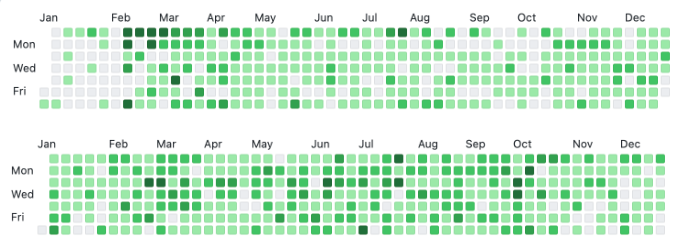

{: .no_toc }

  

    Table of contents
  

  {: .text-delta }
1. TOC
{:toc}

---

# **들어가며**

개발자로 지내면서 연말회고는 처음 작성하지만  
이번 연도는 무슨 일들이 있었는지?   
잘한 점, 부족한 점, 보람찼던 점     
**잊고 싶지 않은 올해의 이벤트들과 내 심정을 기록하기 위해 작성한다**   

# **블로그**

블로그를 시작하게 된 계기는  
1. **스스로에 대한 동기부여**
2. 글쓰기 훈련 (코딩도 언어만 다르지 결국 글쓰기라고 생각하기 때문이다)
3. 유명한 개발자들의 블로그
   - [종립 님의 블로그](https://johngrib.github.io/)나 [향로 님의 블로그](https://jojoldu.tistory.com/) 영향이 컷다
4. 유명한 회사들의 기술 블로그

`2021년 2월 20일`부터 시작하여 대략 2년 정도 블로그에 글을 작성하고 있다.  
블로그를 관리하면서 얻은 첫 번째 장점은 **스스로에 대한 동기부여**이다.  

2021,2022년 커밋 내역이다.  
위의 모든 커밋들이 유의미한 커밋이라고 말할 수도 없고 대부분 앵무새 글(강의,책 내용 정리)들 이지만,  
**학습 능력을 기르고 학습 습관**을 잡는 것에는 큰 도움이 되었다.  

두 번째 장점으로는 **메타인지를 높일 수 있는 기회**이다.  
머리에 담긴 `파편적인 지식들을 연결시켜가며` 글로 작성하면서 모르는 내용들이나 키워드들을 발견하게 된다.  
그리고 작성한 게시글을 시간이 흐른뒤에 보면 내가 무엇을 알고 무엇을 모르는지 알게될 기회가 많다.  
(알고리즘 공부하면서 많이 느꼇다.)

위의 장점들을 보면 블로그를 하는게 무조건 이득일 것 같지만, 단점도 존재한다.  

첫 번째 단점은 **죽은 문서**들이다.  
게시글을 작성하는 재미에 빠져 학습한 내용들을 많이 작성하게 되지만, 그때만 유효하고 그 글들을 계속 관리하지 않기 때문이다.  
학습 내용을 정리하여 글로 작성하면 그 내용들이 내것이 된 것 마냥 신경쓰지 않고 내버려두게 된다.  
*(그렇다고 지우기에는 아까워 `저장강박증`이 생겼다..)*  

이 죽은 문서들을 살리기 위한 노력과 시간이 추가로 필요하다.  
*(어떤 분들은 글들을 리팩토링하는 즐거움이 있다고 한다)*

종립님은 이 문제를 해결하기위해 블로그에 **랜덤 버튼**을 추가하여 죽은 문서들이 없게 노력하고 계신다고 하였다.  

두 번째 단점은 **블로그는 양날의 검**이다.  
이력서를 작성할 때 블로그 링크를 당당하게 작성하게 되는데, 블로그가 독이 될 때도 있다.  
첫 번째 단점과 연관이 있는데, 학습 내용들을 확실히 이해하지 않고 넘어가거나 중요한 포인트를 간과하고 블로그에 마구마구 작성하면서 `죽은 문서들`은 불어난다.  
면접관분들은 블로그를 보고 질문을 추가로 생각하게 될텐데 그 질문에 잘 대답하면 본전이고 대답을 못하게 된다면 큰 마이너스가 된다  
그때부터 블로그의 게시글들은 신뢰가 떨어진다.  

**위의 단점을 해결하기 위해 `개인 학습 공간 블로그`와 `개인 기술 블로그`를 분리할 생각이다.**  
분리하면서 게시글들도 정리해야 할 것이다. (2023년 목표이다)  

그럼에도 불구하고 주변에 블로그를 시작할지 고민하는 사람이 있다면 **강력 추천**할 것이다.  

# **알고리즘**

이직을 고민하면서 알고리즘을 하게 되었다.  
- 어떤 한 분이 `"알고리즘 한 문제에 5만원이라고 생각해라"`라고 한게 갑자기 떠올랐다  

SI 업무에 찌들어 있을 때, 알고리즘 푸는게 재밌다라고 느꼈었다.  
문제를 고민하고 해결하는게 진짜 개발자 같다라고 생각이 들었다. *(스스로가 멋져보이기도 했다)*  

처음에는 [인프런 강의](https://www.inflearn.com/course/%EC%9E%90%EB%B0%94-%EC%95%8C%EA%B3%A0%EB%A6%AC%EC%A6%98-%EB%AC%B8%EC%A0%9C%ED%92%80%EC%9D%B4-%EC%BD%94%ED%85%8C%EB%8C%80%EB%B9%84/dashboard)로 기본을 떼고 운이 좋게 [스터디](https://github.com/jdalma/Algorithm-Study/tree/main)에 참가하게 되었다.  
이 스터디에 [알고리즘 랭커분](https://solved.ac/profile/opera_tive)이 계셨는데 엄청 큰 도움이 되었다.  

단순히 알고리즘 공부를 떠나서 `"이렇게 열심히 하시는 분도 있구나"` 라는 생각에 동기도 많이 되었다.  
*(세그먼트 트리 주제로 교육을 한 번 해주셨는데 절대 잊을 수가 없다..)*  

목표는 이번년도 플레티넘 가는 것이 목표였지만 `골드 1 (1541점)` 59점을 남겨놓고 멈췄다.   
기업용 코테를 통과하는게 목적이였는데   
1. 특정 깊이 이상으로 파고들기에는 가성비가 떨어진다. (시간 소모가 너무 크다)
2. 문제해결능력보단 solved.ac 티어와 점수에 집착을 하게 된다.

# **스터디와 읽기모임**

# **코드숨**

# **이직**

# **그 외**

# **소감**

# **2023년 목표**