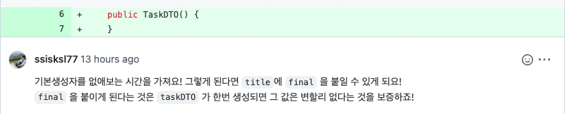

{: .no_toc }

<details open markdown="block">
  <summary>
    Table of contents
  </summary>
  {: .text-delta }
1. TOC
{:toc}
</details>

---

[알고리즘 스터디]: https://github.com/jdalma/Algorithm-Study

## **08.01 (월)**

**Fact**
{: .fh-default .fs-6 }

- **코드숨 1주차 과제 시작**
  - **[SDK](https://johngrib.github.io/wiki/sdkman/)**를 사용하여 자바 버전 관리
  - 처음으로 gradle을 사용하여 프로젝트 시작
    - `./gradlew run`
    - `./gradlew test`
  - `HttpServer` API를 사용하여 로컬 서버 테스트

- **[알고리즘 스터디][알고리즘 스터디]** 
  - 금주 주제 `브루트 포스`를 통하여 **조합**과 **순열**의 차이 구분
  - 테트로미노 문제 실패

<br>

**Feeling**
{: .fh-default .fs-6 }

- `HttpServer` API를 처음 접해보았다
  - *임베디드 HTTP 서버를 구축하는 데 사용할 수있는 간단한 고급 Http 서버 API*
  - [오라클 문서 HttpServer](https://docs.oracle.com/en/java/javase/11/docs/api/jdk.httpserver/com/sun/net/httpserver/package-summary.html)
  - [번역 문서 HttpServer](https://runebook.dev/ko/docs/openjdk/jdk.httpserver/com/sun/net/httpserver/package-summary)
- 자바 버전 관리하는게 항상 어렵게 느껴졌는데 SDK를 통해 편하게 느껴졌다
  - *SDK를 전 직장 동료들에게 알려줬다 ㅎㅎ*
- 생에 첫 코드리뷰를 종립님에게 받아 감격스럽다..

<br>

**Finding**
{: .fh-default .fs-6 }

- **HttpServer**를 사용하는 걸 보고 처음 접하는 API라서 당황했다...
  - 공식 문서를 찾으면 될 것을 Servlet과의 차이점을 찾으려하여 시간 낭비를 했다
- **교육에서 제공하는 참고 링크들은 꼭 진득하게 읽어보자**

<br>

- 참고 링크
   - [MDN - HTTP](https://developer.mozilla.org/en-US/docs/Web/HTTP)
   - [MDN - HTTP response status codes](https://developer.mozilla.org/en-US/docs/Web/HTTP/Status)
   - [MDN - HTTP request methods](https://developer.mozilla.org/en-US/docs/Web/HTTP/Methods)
   - [MDN - Identifying resources on the Web](https://developer.mozilla.org/en-US/docs/Web/HTTP/Basics_of_HTTP/Identifying_resources_on_the_Web)
   - curl명령을 더 편하게 [httpie](https://httpie.io/)
   - [REST](https://en.wikipedia.org/wiki/Representational_state_transfer)
   - [HATEOAS](https://en.wikipedia.org/wiki/HATEOAS)
   - [Introducing JSON](https://www.json.org/json-en.html)
   - [the Java JSON library - Jackson](https://github.com/FasterXML/jackson) 

***

## **08.02 (화)**

**Fact**
{: .fh-default .fs-6 }
- **코드숨 1주차 과제**
  - Jackson ObjectMapper를 사용하여 **ToDo REST API 진행**
- 프로그래머스 알고리즘 2문제 실패

<br>  

**Feeling**
{: .fh-default .fs-6 }
- 리소스 경로 받아 안전하게 접근하는 방법, 비즈니스 로직 분리 방법 , 예외 전달 방법을 고민만 해보았다

<br> 

**Finding**
{: .fh-default .fs-6 }
- [Baeldung - Jackson ObjectMapper](https://www.baeldung.com/jackson-object-mapper-tutorial)
- [ObjectMapper를 재사용해도 될까?](https://joyykim.tistory.com/21)
- 오늘 실패한 문제 내일 오전에 다시 시도해보자
  - *파라메트릭 서치 아이디어를 떠올리기가 어렵다*

***

## **08.03 (수)**

**Fact**
{: .fh-default .fs-6 }
- 어제 실패했던 프로그래머스 알고리즘 완료
- **코드숨 1주차 과제**
  - HTTP 상태 코드 **Enum**으로 변경
  - `Task` 객체의 Setter 제거
  - `TaskConverter` 싱글톤 클래스 추가
  - URL문자열을 잘라 **resource** , **pathVariable**을 저장하는 `Path`클래스를 추가
  - 동시성 이슈와 효율성 관련하여 `LinkedList` → `ConcurrentHashMap`으로 변경
  - **taskId**는 동시성을 위해 `AtomicLong`으로 관리
  - [RFC 7231](https://datatracker.ietf.org/doc/html/rfc7231#section-6.3.1)
    - [RFC 란?](https://www.lesstif.com/software-architect/rfc-request-for-comments-129007717.html)
    - [요구 사항 수준을 나타내기 위해 RFC에서 사용하는 키워드](https://datatracker.ietf.org/doc/html/rfc2119)
  - **Logger.getLogger({name})**
    - 해당 `{name}`으로 로거가 있다면 해당 로거를 반환한다
    - `ConcurrentHashMap namedLoggers`로 관리되고 있다

<br>  

**Feeling**
{: .fh-default .fs-6 }
- 객체의 Setter를 제거하게 되면 객체가 생성된 후 값을 넣어줘야할 때는 어떻게 해야할지 고민
  - [Java Program to Create an Immutable Class](https://www.programiz.com/java-programming/examples/create-immutable-class) **불변 클래스**
-  `Path`클래스에서는 **pathVariable**에 접근할 때 해당 필드가 비어있다면 예외를 던지게 만들었다
  - [[Java] Exception vs RuntimeException](https://medium.com/@hongseongho/java-exception-vs-runtimeexception-af58f11aa452)을 참고하여 `getPathVariable()`을 호출할 때는 강제로 예외를 잡아 처리하게 만들었다
- [What is the difference between `atomic` / `volatile` / `synchronized`?](https://stackoverflow.com/questions/9749746/what-is-the-difference-between-atomic-volatile-synchronized)
  - [Java volatile이란?](https://nesoy.github.io/articles/2018-06/Java-volatile)

<br> 

**Finding**
{: .fh-default .fs-6 }
- RFC를 지나가면서 얼핏 봤던 것 같은데 뭔지 확실히 알게 되었다
- [AWS도 Setter를 사용하지 않는다](https://blog.sogoagain.com/posts/2019/aws-also-doesnt-use-setters/)

> 💡
>  -  외부에 객체의 상태를 변경할 방법을 제공하는 것이기 때문에 객체의 상태가 언제 어디서 어떻게 변할지 예측할 수 없다. 
>  -  복잡한 비즈니스 로직을 제공하는 서비스나 협업하는 상황에서는 setter를 제공하는 객체의 상태 변화에 대한 추적이 더욱 어려워진다.


***

## **08.04 (목)**

**Fact**
{: .fh-default .fs-6 }
- **코드숨 1주차 과제**
  1. `getXXX`로 클래스의 필드를 가져오는것이 아니라 클래스에게 비교할 정보를 주고 결과만 반환받게 수정
     - *ex)* `Path.resourceEquals({비교 문자열})`
  2. `HttpMethod` enum 추가
     - `equal`메서드를 추가하여 **1번**과 같이 비교할 문자열을 enum에서 받아 결과를 반환하는 메서드를 추가
  3. `Path` 클래스에 원본 문자열을 저장하는 **필드 추가**
     - 리뷰 내용 *Path 클래스는 path를 감싸서 특정한 서비스를 제공하는 녀석입니다. 원본을 갖고 있다면 디버깅할 때 유용할 거에요.*
  4. `JSON` ↔︎ `Task` 작업
     - Reflection을 사용하여 `Task`의 필드에 접근
     - [정규표현식](https://www.nextree.co.kr/p4327/)을 사용하여 `JSON`을 나눠보았다
- [AutoCloseable 클래스](https://velog.io/@sa1341/AutoCloseable-%ED%81%B4%EB%9E%98%EC%8A%A4)를 알게되었다
  - [[Java] try-with-resources](https://medium.com/@hongseongho/java-try-with-resources-cdd547181e0)
- 2022 카카오 블라인드 양궁문제 실패..

**Feeling**
{: .fh-default .fs-6 }

1. 외부에서 정보를 꺼내쓰기 보다는 객체 내부에서 판단이 가능하다면 내부에서 처리하게 하자
2. 오늘은 정규표현식 찾는 것에 시간을 많이 할애 하였다..


***

## **08.05 (금)**

**Fact**
{: .fh-default .fs-6 }

- **코드숨 1주차 과제**
  - 의사결정을 글로 작성하는 연습 ([URI의 경로를 클래스화 시켜보자](https://jdalma.github.io/docs/lab/pathClass/))
    - *종립님이 남겨주신 [리뷰](https://github.com/CodeSoom/spring-week1-assignment-1/pull/115#discussion_r937853195)*
  - `HttpMethod` , `HttpResponse` enum에 [JavaDoc 주석](https://velog.io/@ming/JavaDoc-%EC%A3%BC%EC%84%9D-%EC%95%8C%EA%B3%A0%EC%93%B0%EC%9E%90)작성
  - `Task`를 **JSON문자열**로 변경할 때 변경해주는 메서드는 어디에 작성하면 좋을까?
    - `Task` model 내부?? , `TaskConverter` 컨버터안에??
    - Task를 위한 `Converter`라는 클래스가 따로 존재하니 일단 `TaskConveter`에 작성
  - **응답 헤더 Content-Type 설정**
    - 객체 → JSON을 직접 반환하니 한글이 깨졌다

**Feeling**
{: .fh-default .fs-6 }

> 종립님 [리뷰](https://github.com/CodeSoom/spring-week1-assignment-1/pull/115#discussion_r937859664) 중
> **그냥 기계를 굴러가게 하기만 하는 것이 아닙니다.**
> 
> **레퍼런스 문서를 토대로 실천하는 활동이기도 하다는 점을 곱씹어보세요.**
> 
> **공식 문서의 힘을 끌어다 내 코드에 연결할 수 있다고 생각해 보세요.**

- SI회사를 다니며 기계를 굴러가기만 하게 만들었는데... 중요한 포인트를 간과하며 개발하고 공부하였다

***

## **8월 첫 째주 회고**

퇴사 후 **코드숨 공부방**에 다니며 **코드숨 1주차 과제**를 진행했다<br>
  - *과제를 위주로 회고를 해볼려고 한다*

**배운 것**
{: .fh-default .fs-6 }

1. SDK를 사용한 자바 버전 관리
2. 스프링이 아닌 자바만을 사용하여 REST API를 개발
3. 모델의 Setter를 제거하고 불변 클래스로 만들기
4. Exception과 RuntimeException 차이
5. `volatile` 키워드
6. enum
7. RFC (Request For Comments)
8. JavaDoc 작성
   - **확실한 문서를 레퍼런스로 남길 것**
   - 그냥 개발이 아니라 레퍼런스 문서를 토대로 실천하는 활동이다
9. **의사결정을 글로 작성하는 연습**
   - [URI 경로를 클래스화 시켜보자](https://jdalma.github.io/docs/lab/pathClass/)
10. Jacskon을 사용할 때는 모델의 기본 생성자가 필요하다
11. 객체지향적 고민
    - **객체에게 데이터를 요구하지 말고 작업을 요청하라**
12. 테스트 코드 작성
    - `@DisplayName`에 대한 표현은 **분명하게 표현하도록 하자**
    - 테스트 코드를 읽을 상대의 가독성을 고려하자
13. **Return Early Pattern**
    - [Leonel Menaia의 “Return Early Pattern” 글을 번역](https://libertegrace.tistory.com/entry/Coding-Style-Return-Early-Pattern)
14. 언제부터 인지 필드에 직접 접근하는 것은 절대 안된다!라고 생각했다
    - `final`로 선언돼 있다면 `getter`를 만들지 않고 직접 접근하는것도 괜찮다
15. **[Factory (+ Pattern)](https://jdalma.github.io/docs/algorithmTheory/factory/) 정리 중** 🚩

<br>

**느낀 것**
{: .fh-default .fs-6 }

과제를 진행하면서 처음부터 좋은 코드를 작성하려 노력했던 것 같다<br>
실제로 좋은 코드도 아니었다<br>

- **점진적인 개선**
  1. `일단` 만든다
  2. `일단` 되게한다
  3. 리팩토링 한다
  4. 위의 과정을 반복한다

과제를 진행하며 위의 과정을 거치면서 **점진적인 개선**에 대해 조금 깨달은 것 같다<br>
**처음부터 너무 많은 것을 생각할 것이 아니라 위의 과정을 생각하자**<br>

현재 if else로 구현하고 과제가 끝났지만 **[팩토리 메소드 패턴](https://jdalma.github.io/docs/designPattern/objectCreationRelated/#factory-method-pattern)**을 적용해보고 싶다<br>

<br>

**교훈**
{: .fh-default .fs-6 }

1주차 과제가 끝이 났지만 내가 작성한 코드가 마음에 드는 것은 아니다<br>
고쳐야할 부분도 많지만 항상 **점진적인 개선**을 의식하자<br>

```
---- 리뷰 내용 중 ----
그냥 기계를 굴러가게 하기만 하는 것이 아닙니다.
레퍼런스 문서를 토대로 실천하는 활동이기도 하다는 점을 곱씹어보세요.
공식 문서의 힘을 끌어다 내 코드에 연결할 수 있다고 생각해 보세요.
```

그냥 기계를 굴러가게만 하는 것이 아니라는 것을 기억하자 

***

## **08.08 (월)**
- 팩토리 메소드 패턴 정리
- [`cozzin` 메타 프로그래밍 살펴보기](https://medium.com/@hongseongho/%EB%A9%94%ED%83%80%ED%94%84%EB%A1%9C%EA%B7%B8%EB%9E%98%EB%B0%8D-%EC%82%B4%ED%8E%B4%EB%B3%B4%EA%B8%B0-8c30dbe4d566)
- [자바 9 이후의 interface](https://www.notion.so/4b0cf3f6ff7549adb2951e27519fc0e6)
- [Spring Boot Reference Documentation - Getting Started](https://docs.spring.io/spring-boot/docs/current/reference/html/getting-started.html#getting-started)
- [marko.js는 빠르게 웹 애플리케이션을 만들 수 있는 유저 인터페이스 라이브러리](https://markojs.com/)
  1. npx @marko/create
  2. 프로젝트 이름 설정
  3. cd {프로젝트 이름}
  4. npm run dev
- `axios` 패키지 사용
  - Axios는 node.js와 브라우저를 위한 `Promise 기반 HTTP 클라이언트`
  - npm install axios
- **[W3 spec](https://fetch.spec.whatwg.org/#content-length-header)**
- [`mozilla` CORS](https://developer.mozilla.org/ko/docs/Web/HTTP/CORS)
  - 한 [출처](https://developer.mozilla.org/ko/docs/Glossary/Origin)에서 실행 중인 웹 애플리케이션이 다른 출처의 선택한 자원에 접근할 수 있는 권한을 부여하도록 브라우저에 알려주는 체제입니다
  - [**OPTIONS**](https://developer.mozilla.org/ko/docs/Web/HTTP/Methods/OPTIONS)
  - [**Preflight request**](https://developer.mozilla.org/en-US/docs/Glossary/Preflight_request)
  - [**HTTP 헤더**](https://developer.mozilla.org/ko/docs/Web/HTTP/Headers)
  - [**Vary**](https://developer.mozilla.org/ko/docs/Web/HTTP/Headers/Vary)
  - 2주차 과제를 진행하면서 만나게 됐다
    - **API Server Port** = `8080`
    - **Web Server Port** = `3000`
    - `3000`번에서 `8080`번에 접근하니 CORS 발생
  - [Enabling Cross Origin Requests for a RESTful Web Service](https://spring.io/guides/gs/rest-service-cors/)
    - Spring `@CrossOrigin`
- **Spring devtools** [2.3.5.RELEAS](https://docs.spring.io/spring-boot/docs/2.3.5.RELEASE/reference/html/using-spring-boot.html#using-boot-devtools)
- [`cozzin` Repository Pattern 살펴보기](https://medium.com/@hongseongho/repository-layer-%EC%82%B4%ED%8E%B4%EB%B3%B4%EA%B8%B0-4c58e4a4e505)
- [`johngrib` intellij](https://johngrib.github.io/wiki/intellij/#%ED%8C%8C%EC%9D%BC-%EB%A7%88%EC%A7%80%EB%A7%89%EC%97%90-%EC%9E%90%EB%8F%99%EC%9C%BC%EB%A1%9C-1%EA%B0%9C%EC%9D%98-%EA%B0%9C%ED%96%89-%EB%AC%B8%EC%9E%90-%EC%B6%94%EA%B0%80%ED%95%98%EA%B8%B0)


```
 grep -r '/usr/bin/chromium-browser' /Users/jeonghyeonjun/node_modules
 /usr/bin/chromium-browser by /opt/homebrew/bin/chromium
```

## **08.09 (화)**
- [리뷰](https://github.com/CodeSoom/spring-week2-assignment-1/pull/94#discussion_r940216284)에서 DTO에 대한 얘기가 나와 조사 해보았다
  - [DTO 정리](https://jdalma.github.io/docs/algorithmTheory/dto/) (`+ POJO , JavaBean`)
- [`docs` Java11 Optional](https://docs.oracle.com/en/java/javase/11/docs/api/java.base/java/util/Optional.html)
  - [Java Optional 바르게 쓰기](http://homoefficio.github.io/2019/10/03/Java-Optional-%EB%B0%94%EB%A5%B4%EA%B2%8C-%EC%93%B0%EA%B8%B0/)
  - [26 Reasons Why Using Optional Correctly Is Not Optional](https://dzone.com/articles/using-optional-correctly-is-not-optional)
- 그림으로 배우는 네트워크 1,2장

## **08.10 (수)**
1. `IdGenerator`인터페이스 추가

2. 
   - Controller에서 `@ResponseBody`로 `TaskDTO`를 JSON → 객체로 변환하여 사용하였다
   - 하지만 `TaskDTO`를 불변 클래스로 변경해보자는 리뷰를 받았다
   - AbstractJackson2HttpMessageConverter에서 **ObjectMapper**를 사용하여 변환 할 클래스의 기본 생성자를 사용하는 것을 알아 불가능한 상황인 줄 알았다
     - *그래서 `Converter`에 대해 조사하길 원하시는 줄 알았다*
   - 하지만 , [Jackson ObjectMapper에서 기본 생성자 없이 Deserialization 하기](https://velog.io/@park2348190/Jackson-ObjectMapper%EC%97%90%EC%84%9C-%EA%B8%B0%EB%B3%B8-%EC%83%9D%EC%84%B1%EC%9E%90-%EC%97%86%EC%9D%B4-Deserialization-%ED%95%98%EA%B8%B0)를 보면 가능하다고 나와있다
   - [`github` Jackson Annotations](https://github.com/FasterXML/jackson-annotations/wiki/Jackson-Annotations)
     - `@JSONCreator`
     - `@JSONProperty({name})`
   - [`github` Jackson data-bind](https://github.com/FasterXML/jackson-databind/#annotations-using-custom-constructor)
   - [`github` Jackson docs](https://github.com/FasterXML/jackson-docs)
   - [`medium` Customize your Java-JSON serialization using Jackson Annotations](https://medium.com/trabe/customize-your-serialization-using-jackson-annotations-d6b81c4785a6)
3. DTO → Domain으로 변환해주는 **Mapper**는 어느 계층에 있어야할까?
   - Converter를 사용하여 컨트롤러에서 `DTO`객체를 받았다면 컨트롤러의 역할은 끝났다고 생각하여 , 서비스에서 주입받았다
   - [DDD - which layer DTO should be implemented](https://stackoverflow.com/questions/31438286/ddd-which-layer-dto-should-be-implemented)
4. **Abstract Factory Pattern**추가
5. DDD의 Factory 조사

## **08.11 (목)**
1. `IdGenerator` 수정
   - `Long`을 반환하는 `generate`메서드 범용적으로 수정
   - `<T>`
2. `TaskServiceInterface`를 `CRUDInterface<In , Out>`으로 수정

```java
public class TaskService implements CRUDInterface<TaskDTO , Task>
```

- service에서 해당 인터페이스를 구현할 때 타입을 지정해주게 수정
- `DTO`나 `model`이 수정되거나 추가되면 **TaskDTO** , **Task**를 감쌀 수 있는 인터페이스나 상속이 추가 되어야 겠지만 일단 수정해 보았다

<br>

3. 인터페이스 주석 추가
4. **List Interface**가 **Collection**을 **확장**하고 있어서 `new ArrayList`로 공간을 새로 만들지 않고 반환 타입을 `Collection<V>`로 수정

```java
public List<Task> getAllTask(){
  return new ArrayList<>(tasks.values());
}

// public interface List<E> extends Collection<E>

public Collection<Task> selectAll(){
    return tasks.values();
}
```

## **08.12 (금)**
1. **ExceptionResolver** 복습 및 적용
   - 2주차 과제에서 상황에 맞는 응답 코드를 내려주어야 하는데 지금은 null 체크를 하며 처리해주었다
   - 스프링을 사용하여 처리하기 위해 복습
   - 스프링은 예외가 나면 **ExceptionResolver**를 뒤져서 해결할 수 있는 예외인지 확인한다
   - *해결이 가능하면 직접 해결하고 , 해결하지 못 하면 WAS까지 올라가서 WAS에서 다시 `/error`로 내려온다*
   - 과제에 `@ExceptionHandler` 적용
     - 해당 예외 클래스의 자식 클래스까지 잡을 수 있다
     - 다른 컨트롤러에 영향을 주지 않는다
2. Http 네트워크 스터디
   - 6장. HTTP 헤더
3. TDD 읽기
   - **점진적인 개선**이 강조된다
   - 불변 클래스에 대한 이야기 (`value object pattern`)
     - [`martin fowler` ValueObject](https://www.martinfowler.com/bliki/ValueObject.html)
     - [`martin fowler` Aliasing Bug](https://www.martinfowler.com/bliki/AliasingBug.html)
   - 팩토리 메서드가 사용된다


## **8월 둘 째주 회고**

**코드숨 2주차 과제**<br>

**배운 것**
{: .fh-default .fs-6 }

1. 패턴 정리 (팩토리 메소드 , 추상 팩토리)
2. CORS
3. Spring `@CrossOrigin`
4. POJO , JavaBean , **DTO**
5. 공식 문서를 보며 Optional을 간단하게 사용해 보았다
    - *단순 null체크는 Optinal을 굳이 사용하진 말자*
6. **Jackson Annotation**
7. **[`docs Spring` ResponseEntity](https://docs.spring.io/spring-framework/docs/current/javadoc-api/org/springframework/http/ResponseEntity.html)**
    - `ResponseEntity.{status}.build()`
    - `ResponseEntity.of()`
8. 이번 2주차 과제에서는 `interface`를 적극적으로 사용하면서 구현과 명세를 나누어 보았다
    - 범용적인 인터페이스 (`CRUDInterface`)를 만들어 볼려고 시도하였지만 마음에 들지 않는다
9. **ExceptionResolver** 복습 및 적용
10. 그림으로 배우는 HTTP 네트워크 1장 ~ 6장
    - 프록시 , 게이트웨이의 차이
    - 프록시의 종류
    - HTTP 헤더 종류
11. TDD 1장 ~ 10장

**느낀 것**
{: .fh-default .fs-6 }

1. **점진적인 개선**은 TDD 책에서도 계속 강조 되었다
2. Factory를 정리하면서 DDD에 대해 알게되었고 **도메인 주도 개발 시작하기**책을 구매하였다
   - *구글링해서 조사하기 보다는 책을 한번 읽어보고 싶었다*
3. **Jackson Annotation**에 대해 이번에 처음 알게 되었는데 굉장히 신기했다
   - 기본 생성자 없이 생성자를 직접 지정해주고 키 필드 이름까지 지정이 가능했다..
4. 네트워크에 대한 개념이 많이 부족하다
   - **캐시 관련 설정은 굉장히 중요하다!!!**
   - HTTP 헤더를 배워도 크게 와닿지 않는다
5. 과제를 진행하면서 자바가 부족하다는 걸 많이 느낀다
6. 가능하다면 DTO , model 정보들은 `final`을 붙이도록 노력하자
7. 내가 사용하는 메소드의 내부는 자세히 확인하자
  
```java
// 수정 전
return new ArrayList<>(tasks.values());

// 수정 후
public Collection<Task> selectAll(){
    return tasks.values();
}
```

**교훈**
{: .fh-default .fs-6 }

1. **점진적인 개선** 중요하다... 계속 강조된다
2. 피드백을 받아도 사람마다 느끼는 것이 다 다르다
   - 공부방 회고에서 비행기 조종사 피드백 이야기 ( + 통찰력)
3. **인터페이스의 모든 메소드에는 주석이 있어야 한다!!!**
4. 이번 주 리뷰의 큰 맥락은 *(스스로 느끼기엔)* **계층별 클래스의 목적과 책임**이라고 생각한다
   - 이 클래스는 어디서 주입받아 사용하는게 맞을까 ?? 어디까지 영향을 줘야할까 ??
   - 스스로 결정하며 개발하면서 맞는지 안맞는지는 확실히 잘 모른다
   - 중요한건 <span style="color:red; font-weight:bold">내가 어떤 생각으로 왜 이렇게 작성했는지 생각을 하게 되는 것 같다</span>

***

## **08.15 (월)**
1. 코드숨 3주차 과제 **스프링 테스트 작성하기** 시작
2. [`Junit5` user guide](https://junit.org/junit5/docs/current/user-guide/)
   - JVM 환경에서 테스트를 실행할 수 있도록 테스트 엔진을 제공하고, 우리가 테스트를 작성하고 실행할 수 있도록 지원하는 도구
3. **AssertJ**
   - 표현력이 풍부한 단정문을 사용하면 테스트를 더 읽기 쉬워서 테스트 코드를 더 유지보수하기 좋다
   - [`daleseo` AssertJ 소개](https://www.daleseo.com/assertj/)
   - [`github docs` AssertJ](https://assertj.github.io/doc/#assertj-overview)
4. **Fixture**란 테스트에 사용되는 데이터의 모음
5. **Spring Test**
   - [`Spring Boot docs` Testing](https://docs.spring.io/spring-boot/docs/current/reference/html/features.html#features.testing)
   - [`Spring docs` Testing the Web Layer](https://spring.io/guides/gs/testing-web/)
   - `@SpringBootTest` vs `@WebMvcTest` vs `@AutoConfigureMockMvc` 🚩
     - [`판교의 메타몽` @SpringBootTest, @AutoConfogureMockMvc, 그리고 @WebMvcTest](https://astrid-dm.tistory.com/536)
   - **`@WebMvcTest` 관련 문제**
     - `@WebMvcTest`를 사용하여 **MockMvc**를 주입받아 사용해 보았다
     - 이때, 문제는 **Controller**만 만들어준다. **Controller**는 **Service**를 주입받아 사용하지만 `@WebMvcTest`는 `@Service`를 로딩해주지 않는다
6. **[Mockito](https://site.mockito.org/)**
   - Mock(`진짜 객체 처럼 동작하지만 프로그래머가 직접 컨트롤 할 수 있는 객체`)을 지원하는 프레임워크
   - Mock 객체를 만들고 관리하고 검증 할 수 있는 방법 제공(가짜 객체를 만들어준다고 생각)
   - [`baeldung` Mockito Tutorial](https://www.baeldung.com/mockito-series) 👍
   - [`번역본` mockito docs](https://github.com/mockito/mockito/wiki/Mockito-features-in-Korean)

## **08.16 (화)**
1. [`johngrib` JUnit5로 계층 구조의 테스트 코드 작성하기](https://johngrib.github.io/wiki/junit5-nested/)참고하여 계층형 테스트 코드 작성
   - `TaskControllerNestedTest`
   - `TaskControllerWebTest`
2. [`Spring docs 2.3.5` Reference](https://docs.spring.io/spring-boot/docs/2.3.5.RELEASE/reference/html/)
3. [`Spring docs`  Auto-configured JSON Tests](https://docs.spring.io/spring-boot/docs/current/reference/html/features.html#features.testing.spring-boot-applications.json-tests)
4. [`Spring docs` Auto-configured Spring MVC Tests](https://docs.spring.io/spring-boot/docs/current/reference/html/features.html#features.testing.spring-boot-applications.spring-mvc-tests)
5. [`jojoldu` SpringBoot @MockBean, @SpyBean 소개](https://jojoldu.tistory.com/226)
6. [`cozzin`님 3주차 과제 훔쳐보기](https://github.com/CodeSoom/spring-week3-assignment-1/pull/81/files#diff-831e096ad5d8fda73c6d1a9f89e51cdf6345df4f7beb42c7a5baf01baf095b0a)

- 3주차 과제를 진행하면서 **mockito**를 사용하게 되었다
  - *실제로는 스프링이 감싼 mockito이다*
- **mockito**를 사용하는 이유를 보자

```
Mockito는 개발자가 동작을 직접 제어할 수 있는 가짜(Mock) 객체를 지원하는 테스트 프레임워크이다. 
일반적으로 Spring으로 웹 애플리케이션을 개발하면, 여러 객체들 간의 의존성이 생긴다. 
이러한 의존성은 단위 테스트를 작성을 어렵게 하는데, 이를 해결하기 위해 가짜 객체를 주입시켜주는 Mockito 라이브러리를 활용할 수 있다. 
Mockito를 활용하면 가짜 객체에 원하는 결과를 Stub하여 단위 테스트를 진행할 수 있다. 
**물론 Mock을 하지 않아도 된다면 하지 않는 것이 가장 좋다.**

[출처 MangKyu's Diary](https://mangkyu.tistory.com/145)

------------------------------------------------------------------------

Mock은 껍데기만 있는 객체를 얘기합니다.
인터페이스의 추상메소드가 메소드 바디는 없고 파라미터 타입과 리턴타입만 선언된 것처럼, Mock Bean은 기존에 사용되던 Bean의 껍데기만 가져오고 내부의 구현 부분은 모두 사용자에게 위임한 형태입니다.
즉, 해당 Bean의 어떤 메소드가 어떤 값이 입력 되면 어떤 값이 리턴 되어야 한다는 내용 모두 개발자 필요에 의해서 조작이 가능합니다.

[출처 jojoldu](https://jojoldu.tistory.com/226)
```

- 위의 글과 같이 **가짜 객체를 주입**하여 , **stub**클래스들만 만들어서 진행한다고 한다
- 그럼 지금은 `Controller` , `Service` , `Advice`나 구현이 다 된 상태이니 굳이 **mockitor**를 사용해야할까??라는 의문이 들었다
- 그러나 `MockMvc`를 사용하여 등록되는 `Controller ← Service` , `Advice 등록`과 같은 주입을 어떻게 해줘야할지 몰라서 고생했지만 cozzin님의 코드를 보았다

```java
@BeforeEach
void setup() {
    final TaskRepository repository = new TaskRepository();
    repositoryCleaner = new TaskRepositoryCleaner(repository);
    controller = new TaskController(new TaskService(repository));
    mockMvc = MockMvcBuilders
            .standaloneSetup(controller)
            .setControllerAdvice(new TaskErrorAdvice())
            .build();
}
```

- 여기서 중요한건 **MockMvcBuilders**!!!

***

## **08.17 (수)**

1. 백준 알고리즘 1문제 
2. 네트워크
   - CGI(Common Gateway Interface)의 문제점을 해결하는 기술이 Java의 **서블릿**이다
3. [Apple의 #gotofail SSL 보안 버그는 쉽게 예방할 수 있었습니다.](https://embeddedgurus.com/barr-code/2014/03/apples-gotofail-ssl-security-bug-was-easily-preventable/)
   - `if`문 내부가 한 줄이라도 중괄호는 무조건 작성하자
4. `D-C-I` 계층형 테스트 코드 작성 시 
   - **Context**는 실험을 준비하는 곳 
   - **@Test**는 실험을 실행하는 곳
   - **준비 영역과 실행 영역을 나누자**
5. [`Spring docs` MockMvcBuilders](https://docs.spring.io/spring-framework/docs/current/javadoc-api/org/springframework/test/web/servlet/setup/MockMvcBuilders.html) 
6. `@MockBean`을 사용하여 **Service**를 가짜 객체로 사용하였다

```java
@MockBean
private TaskService service;
@MockBean
private TaskErrorAdvice advice;

@BeforeEach
void setUp() {
    controller = new TaskController(service);
    mockMvc = MockMvcBuilders
            .standaloneSetup(controller)
            .setControllerAdvice(advice)
            .build();
}

List<Task> setTask(){
    List<Task> tasks = new ArrayList<>();
    Task task1 = new Task(1L , "TEST1");
    Task task2 = new Task(2L , "TEST2");
    tasks.add(task1);
    tasks.add(task2);
    given(service.getTasks()).willReturn(tasks);
    given(service.getTask(1L)).willReturn(task1);
    given(service.getTask(2L)).willReturn(task2);
    return tasks;
}
```

- 다른 `@Test`의 `@BeforeEach`에서 **setTask()**메서드를 호출한다
- 하지만 **service**는 최초 생성되고나서 계속 유지되기 때문에 각 `@Test`메소드 별로 격리가 되지 않는다
  - 다른 테스트에서 **service**에 데이터를 넣었다면 다른 테스트에서도 보인다
- [How to clean up mocks in spring tests when using Mockito](https://stackoverflow.com/questions/18164123/how-to-clean-up-mocks-in-spring-tests-when-using-mockito) ⭐️ 해결~~
  
```java
import static org.mockito.Mockito.reset;

@BeforeEach
void setUp() {
    reset(service);
    controller = new TaskController(service);
    mockMvc = MockMvcBuilders
            .standaloneSetup(controller)
            .setControllerAdvice(advice)
            .build();
}
```

7. 🚀 ⭐️ **mock** (`given`) 관련 [리뷰](https://github.com/CodeSoom/spring-week3-assignment-1/pull/58#discussion_r843930726)
8. "도메인 주도 개발 시작하기" 읽기
   - 개념 모델과 구현 모델
   - 도출된 모델의 **엔티티** , **밸류** 구분
   - `Getter` , `Setter` 문제점


***

## **08.18 (목)**

1. Parametric Search 알고리즘 1문제
   - 임계점을 구분해내는 능력이 부족하다
2. **스코프가 있는 테스트 코드 스타일**의 **논리적인 인과**를 잘 마련하자 [리뷰](https://github.com/CodeSoom/spring-week3-assignment-1/pull/83#discussion_r947858297)
3. 테스트 코드 `Context` 스코프 수정
   - 중복 제거 보다는 **논리적인 인과**에 집중하였다 
4. **Service** 유닛 테스트 코드 작성
5. **Model** 유닛 테스트 코드 작성
   - [`johngrib` java.lang.Object.hashCode 메소드](https://johngrib.github.io/wiki/java/object-hashcode/)
6. [`codechacha` Java - Runnable과 Callable의 차이점 이해하기](https://codechacha.com/ko/java-callable-vs-runnable/)

## **08.19 (금)**

1. [`JWT` RFC7519](https://www.rfc-editor.org/rfc/rfc7519)
   - [`velopert` [JWT] JSON Web Token 소개 및 구조](https://velopert.com/2389)
   - [`Awdsd` JWT 저장소에 대한 고민(feat. XSS, CSRF)](https://cjw-awdsd.tistory.com/48)
   - [`baeldung` SRF With Stateless REST API](https://www.baeldung.com/csrf-stateless-rest-api#1-credentials-are-not-persisted)
   - [세션 기반 인증과 토큰 기반 인증 (feat. 인증과 인가)](https://hudi.blog/session-based-auth-vs-token-based-auth/)
   - [토근 기반 인증에서 bearer는 무엇일까?](https://velog.io/@cada/%ED%86%A0%EA%B7%BC-%EA%B8%B0%EB%B0%98-%EC%9D%B8%EC%A6%9D%EC%97%90%EC%84%9C-bearer%EB%8A%94-%EB%AC%B4%EC%97%87%EC%9D%BC%EA%B9%8C)
2. [`tedblob` Map vs MultiValueMap differences](https://tedblob.com/map-vs-multivaluemap-differences/)
3. 알고리즘 스터디 1문제
4. **XSS** , **CSRF**
5. Spring MVC 2 - 파일 업로드 강의

***

## **8월 셋 째주 회고** - 코드숨 3주차 과제 `스프링 테스트 코드 작성하기`

**배운 것**
{: .fh-default .fs-6 }

1. **Junit5** , **AssertJ** , **Mockito**
   - MockMvc , @WebMvcTest
   - @MockBean을 reset하는 방법
   - MockMvcBuilders
   - verify
2. [`baeldung` mockito argument matcher](https://www.baeldung.com/mockito-argument-matchers)
3. `D-C-I` 계층 구조의 테스트 코드 작성
4. **XSS** , **CSRF**
   - 추가로 **JWT**를 읽어보았다
5. "도메인 주도 개발 시작하기" 읽는 중


**느낀 것**
{: .fh-default .fs-6 }

1. **mockito**를 사용하게 될 상황을 고민해봤다
   - 이번 주는 간단한 처리이기도 하고 이미 구현이 다 돼있는 상황이라서 "**mock**을 사용해야 할까?" 고민했다
   - 그래서 Spring DI , mock 둘 다 작성해봤다
   - 객체의 행위를 외부에서 지정해주니 Stub으로 껍데기만 짜고 테스트하기 편했다 *(API를 몰라서 고생했지만)* 
2. **mock**관련 [리뷰](https://github.com/CodeSoom/spring-week3-assignment-1/pull/58#discussion_r843930726)를 통해 `given`을 언제 써야할지 대략 감은 오지만 복잡한 로직의 테스트 코드를 작성해보지 않아 와닿지 않는다
3. 네트워크 스터디에서 **CSRF** 방어하는 방법을 들었다 (OAuth 2.0)
   1. **클라이언트** → **자원에 접근할 서버**
   2. **자원에 접근할 서버** → **클라이언트**에게 난수를 응답하고 난수를 세션에 저장
   3. **클라이언트** → **자원 소유 서버** (+ 난수)
   4. **자원 소유 서버** → **클라이언트**에게 난수 + 코드를 응답
   5. **클라이언트** → **자원에 접근할 서버** 난수 + 코드를 전달 (코드가 서로 일치하지 않는다면 거부됨)
   6. **자원에 접근할 서버** → **자원 소유 서버**에게 난수 + 코드를 검증받고 접근 토큰을 받는다
4. **JWT**를 왜 사용하는지 알게 되었고 `Refresh Token`의 역할을 알게 되었다


**교훈**
{: .fh-default .fs-6 }

1. `호출` ↔︎ `역할`
   - 테스트 코드를 작성할 때 호출 부분과 역할 부분을 분리해서 생각하고 작성하자
   - 리뷰의 내용이기도 하고 TDD책 에서도 이렇게 작성했다
   - 이렇게 호출해야지 라고 먼저 작성하고 후에 역할을 작성한다 *(메타포)*
2. 테스트 코드 작성 시 
   - **논리적인 인과**에 집중하자
   - 읽는 사람을 배려하자
   - 단어 선택이나 문맥을 고려하자

***

## **08.22 (월)** - 코드숨 4주차 과제 `고양이 장난감 가게 만들기` 시작

1. [`Robert C. Martin` The Clean Code Blog](https://blog.cleancoder.com/uncle-bob/2012/08/13/the-clean-architecture.html)
   - **Use Cases** : 비즈니스 로직과 연관 , 이 어플리케이션이 어떻게 작동하고 어떻게 사용한다
   - **의존성의 방향**
     - Service → Repository ← impl Repository
2. 도메인 주도 설계에서 Service라는 개념은 도메인 레이어나 DB 레이어나 여러 곳에서 사용된다 
   - Service(도메인 객체를 사용하는 곳)는 여러 곳에서 사용되기 때문에 상위 패키지를 **application**으로 정한다
   - Domain의 Entity와 RDB의 Entity는 다르다
3. [`baeldung` DAO vs Repository Pattern](https://www.baeldung.com/java-dao-vs-repository)
   - DAO는 데이터 지속성의 추상화입니다. 그러나 저장소는 개체 모음의 추상화입니다.
   - **DAO는 스토리지 시스템에 더 가까운 하위 수준 개념입니다. 그러나 Repository는 더 높은 수준의 개념으로 Domain 객체에 더 가깝습니다.**
   - DAO는 데이터 매핑/접근 계층으로 작동하여 못생긴 쿼리를 숨깁니다. 그러나 리포지토리는 도메인과 데이터 액세스 레이어 사이의 레이어로, 데이터를 대조하고 도메인 객체를 준비하는 복잡성을 숨깁니다.
   - DAO는 저장소를 사용하여 구현할 수 없습니다. 그러나 **저장소는 기본 저장소에 액세스하기 위해 DAO를 사용할 수 있습니다.**

***

## **08.23 (화)**
1. 코드숨 알고리즘 3문제 `Stack`완료
2. **Service** 테스트 작성
   - **(JPA) Repository**는 mock으로 작성
3. `ResourceNotFoundException`은 **Contoller**에서 던져야할까? **Service**에서 던져야할까?
4. **[Why should one use `Objects.requireNonNull()`?](https://stackoverflow.com/questions/45632920/why-should-one-use-objects-requirenonnull)**
5. JPA를 배울 때 **EntityManager**를 배웟는데 **Spring Data JPA**는 어떻게 작동하는거지..?
   - [JPA, Hibernate, 그리고 Spring Data JPA의 차이점](https://suhwan.dev/2019/02/24/jpa-vs-hibernate-vs-spring-data-jpa/)

***

## **08.24 (수)**
1. 코드숨 알고리즘 3문제 `Map`
2. [`Spring Docs` @DataJpaTest](https://docs.spring.io/spring-boot/docs/current/api/org/springframework/boot/test/autoconfigure/orm/jpa/DataJpaTest.html)
3. **Service.save()**메서드 테스트 코드 작성 중에 `null`객체에 대한 테스트 코드를 작성하고 있었다
   - `null`을 잡아서 예외를 **Controller**까지 던져서 잡아야할까?? 잡는다면 **Advice**에 추가해야할까??
   - 이런 고민들을 했다.. TDD를 하면서 방향을 못 잡고 있었다
   - **윤석님의 리뷰**
       1. `관심사의 분리에 대한 개념`
       2. `도메인에 대한 개념` - 학년의 도메인에 0학년 , 7학년 이런 정보가 들어올 수 없는 것처럼
       3. `불필요한 테스트 코드 작성` 
          1. 테스트 코드는 명세를 작성하는 것
          2. 불필요한 테스트 코드를 작성하면 이걸 읽는 사람들이 해당 테스트를 염려한다
       4. `TDD 작성 시 탑 다운 , 바텀 업` 
          1. 컨트롤러 테스트 코드를 작성하기 전에 서비스 테스트 코드를 작성했는데 서비스가 어떻게 쓰여야할지 확실히 정할 수 없다
          2. 계층을 넘어다니면서 테스트코드를 작성하자
4. **Service**와 **Controller** 테스트 코드를 같이 짤려고 하는데 **Controller**는 어디까지 신경써야할까??
   1. **Controller**의 메서드만?
   2. Request , Response , Advice ?
   3. 저걸 다 합치면 통합 테스트가 아닌가?
   4. 일단 **Service**를 모킹하고 **컨트롤러의 메소드에만 집중하자**
5. 위와 같이 테스트 코드를 작성하면서 윤석님에게 질문을 해봤다

> `Q` **Contoller**에서 **mock(Service)**를 해서 테스트 코드를 작성 하면서 **Service**를 개발하면 이 개발한 코드는 어떻게 입증하나요?
> 
> `A` 각각의 **유닛 테스트** (Controller , Service ...)들을 자기의 역할에만 집중해서 테스트 코드를 짜며 개발한다
> 그 후 **통합 테스트** (모킹하지 않고 Spring DI 테스트)를 진행하면 된다

***

## **08.25 (목)**
1. 코드숨 알고리즘 3문제 `String`
2. @Transactional [정리](https://jdalma.github.io/docs/algorithmTheory/transactional/)

***

## **08.26 (금)**
1. 코드숨 알고리즘 3문제 `Binary & Parametric Search`
2. **Spring Data Jpa**는 영속성 컨텍스트 flush , merge를 언제 진행할까??
   - [How do I update an entity using spring-data-jpa?](https://stackoverflow.com/questions/11881479/how-do-i-update-an-entity-using-spring-data-jpa)
    
### 이펙티브 자바 스터디
- **브릿지 패턴**
  - 구체적인 것과 추상적인 것을 분리
  - 서로 독립적으로 발전할 수 있게
- 서비스 제공자 프레임워크
    1. 서비스 제공자 인터페이스 (`SPI`) 와 서비스 제공자 (`서비스 구현체`)
    2. 서비스 제공자 등록 API (`서비스 인터페이스와 구현체를 등록하는 방법`) 
       - ex) @Configuration
    3. 서비스 접근 API (`서비스의 클라이언트가 서비스 인터페이스의 인스턴스를 가져올 때 사용하는 API`)
       - ex) ApplcationContext에서 Bean을 가져오는 것
- 스프링의 **PSA**
- [`Java 9 Docs` 서비스 로더](https://docs.oracle.com/javase/9/docs/api/java/util/ServiceLoader.html)
- **빌더 패턴**
  - 플루언트 API 혹은 메서드 체이닝
  - 불변식
  - 재귀적 타입 한정을 이용하는 제네릭 타입
    - `<T extends Builder<T>>` 🚩
  - **공변반환 타이핑**
  - **생성자나 정적 팩토리가 처리해야 할 매개변수가 많다면 빌더 패턴을 선택하는게 더 낫다**