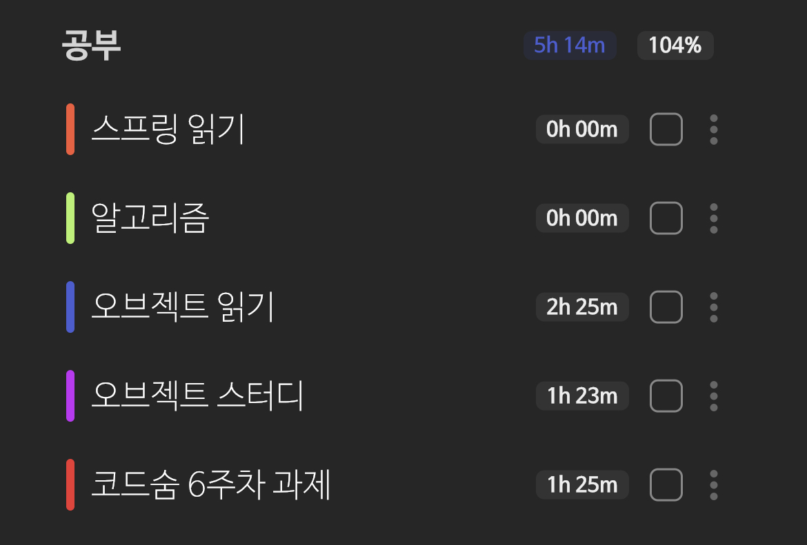

{: .no_toc }

<details open markdown="block">
  <summary>
    Table of contents
  </summary>
  {: .text-delta }
1. TOC
{:toc}
</details>

---

## 09.01 (목)
1. 코드숨 알고리즘 9일차 완료
2. 과제 주석 작성 및 수정
3. MVC 테스트 코드 작성
4. 스프링 1.1

## **9월 첫째 주 회고** 코드숨 5주차 과제 `TDD로 사용자 도메인 구현하기 (+ 유효성 검사)`

**배운 것**
{: .fh-default .fs-6 }

1. 코드숨 알고리즘
   - Sorting , BruteForce , Greedy , Heap , DynamicProgramming
2. [`docs oracle` Using Bean Validation Constraints](https://docs.oracle.com/javaee/7/tutorial/bean-validation001.htm)
3. [**`Dozer Mapper` Getting Started**](https://dozermapper.github.io/gitbook/documentation/gettingstarted.html)
   - DozerMapper의 문제점 조사하기 🚩 [리뷰](https://github.com/CodeSoom/spring-week5-assignment-1/pull/75#discussion_r961656565)
4. JSON 직렬화 , 역직렬화에서 특정 필드 무시하기
   - 자원 생성 , 수정 각 상황에 맞는 DTO 추가
5. JavaDoc을 작성하는 방법
   - 자바 빌트인 클래스들을 참조 `String.class`
   - [`johngrib` JavaDoc 작성하기](https://johngrib.github.io/wiki/java/javadoc/)
     - **목표는 특정 코드 덩어리의 대략적인 역할을 3초 안에 파악할 수 있도록 도와주는 것이다.**
     - **메소드가 무엇을 입력받아서 무엇을 리턴하는지를 반드시 설명한다.**
     - **구현과 주석이 커플링이 생기지 않도록 한다.**
     - **주석 상속 규칙**
6. [`@AllArgsConstructor`, `@RequiredArgsConstructor` 주의](https://jdalma.github.io/docs/algorithmTheory/lombok/#allargsconstructor-requiredargsconstructor-%EC%82%AC%EC%9A%A9%EA%B8%88%EC%A7%80) 정리 
7. [`@Builder`를 클래스 , 생성자에 작성 차이](https://jdalma.github.io/docs/algorithmTheory/lombok/#builder-%ED%81%B4%EB%9E%98%EC%8A%A4%EC%97%90-%EC%9E%91%EC%84%B1%ED%95%98%EB%8A%94-%EA%B2%83%EA%B3%BC-%EB%A9%94%EC%84%9C%EB%93%9C%EC%97%90-%EC%9E%91%EC%84%B1%ED%95%98%EB%8A%94-%EA%B2%83%EC%9D%98-%EC%B0%A8%EC%9D%B4%EC%A0%90) 정리
8. 모킹을 제거하고 **Controller 통합 테스트**
9. **Serivce** 목적에 맞게 분리 [리뷰](https://github.com/CodeSoom/spring-week5-assignment-1/pull/75#discussion_r958434890)
   - `QueryService`
   - `CommandService`

**느낀 것**
{: .fh-default .fs-6 }

코드숨 과제를 통해 배우고 정리했던 내용 덕분에 토프링 읽기모임에서 나왔던 내용들이 금방 이해됐다. <br>
**JavaDoc** , 주석의 필요성을 느꼇다 <br>
**주석은 구현에 의존되게 작성하지 말자** <br>
테스트 코드를 작성할 때 모킹을 쓰지 않는 환경에 적응하자 <br>
미리 테스트를 만들어 두는 경우에는 까먹지 않게 일부러 테스트를 실패하게 하자<br>

**교훈**
{: .fh-default .fs-6 }

간편해서 막 쓰는 어노테이션들을 세심하게 살펴보자 <br>
생성자 어노테이션을 막 작성한것이 그 예다 <br>
한 번에 알아볼 수 있도록 **주석**을 작성하려 노력하자 <br>
[JLS](https://docs.oracle.com/javase/specs/)를 애용하자

***

## 09.05 (월)
1. 알고리즘 3문제 BFS , 1문제 DP
2. 5주차 과제 풀의 영상 시청
3. 6주차 과제 주석 작성
4. [`johngrib` 테스트 코드와 반증가능성에 대한 메모](https://johngrib.github.io/wiki/article/test-code-and-falsifiability/)
5. 과제를 진행하면서 이해 안가는 상황이 있다..
   - **Jpa Repository**가 **Repository Interface**와 **CrudRepository Interface**를 확장하고 있다
   - **Service**클래스가 **Repository Interface**를 주입받고 사용하고 있다
   - Spring Data JPA에서 제공하는 interface를 확장하면 제공되는 쿼리를 쓸 수 있다는 것만 알았는데..
   - 그러면 **Jpa Repository**를 주입받아서 사용해야 하지 않나..?
   - 어떻게 **Repository Interface** 쓸 수 있는 것일까?
6. Spring Data JPA에서 제공하는 interface의 메서드만 확장해서 사용할 수 있는 줄 알았는데..
   - `UserRepository.existsByEmail()`이라는 메서드는 어떻게 실행되는걸까??


```
알고리즘 스터디에서 합분해를 주현님이 조합으로 푸시다가 메모이제이션을 활용했다고 하셨다
근데 조합 중 동일한 파라미터가 들어오는 경우가 있어서 자연스럽게 메모이제이션을 떠올리셨다고 한다

"DP의 중요한 포인트는 완전탐색이다!!!"
```

## 09.06 (화)
1. 코드숨 알고리즘 12일차 완료
1. 거스름돈 같은 문제는 그리디로 풀었었는데 [동전 2](https://www.acmicpc.net/problem/2294)같은 문제는 그리디로 풀 수 없다고 한다. 왜?
   - 화폐의 가치가 배수가 아니라서 그렇다
   - 그리디로 풀면 동전 개수 최소값을 구할 수 없다
   - DP배열을 초기화하는 아이디어가 부족했다
   - 화페의 인덱스에 `1`을 표시만 하려고 했지 배수로 그 금액을 만들 수 있는 화폐의 개수는 카운트 할려고 하지 않았다...

```java
Arrays.fill(dp , MAX);
dp[0] = 0;

for(int i = 1 ; i <= N ; i++){
    int coin = Integer.parseInt(br.readLine());
    for(int j = coin ; j <= K ; j++){
        dp[j] = Math.min(dp[j] , dp[j - coin] + 1);
    }
}
```

2. [포도주 시식](https://www.acmicpc.net/problem/2156)을 시도했지만 실패.. 점화식을 세우기가 어렵다

## 09.07 (수)

1. 코드숨 알고리즘 13일차 완료
2. 01BFS 정리
3. [벽 타기](https://www.acmicpc.net/problem/23563) 실패...

## 09.08 (목)
1. DP 문제 어렵다
2. [벽 타기](https://www.acmicpc.net/problem/23563) 실패...

## 09.09 (금)
1. [`johngrib` SOLID](https://johngrib.github.io/wiki/jargon/solid/)
2. 스프링 읽기

## 09.10 (토)
1. 분할 정복 1문제 완료
2. 백준 - Z 문제
   - 4분면으로 나누어 모든 경우를 다 확인하면 시간초과가 난다.
   - 분할 구역을 선택해서 나눈다.

## 09.15 (목)
1. 문자열 압축 완료
   - 문자열 단위를 나누어서 압축이 가장 짧게 된 것을 리턴

## 09.16 (금)

3. ExceptionHandler 테스트 코드 추가
4. 오브젝트 읽기
   - Getter도 염려하면서 사용하자

## 09.17 (토)



- 늦게 일어나서 많이는 못 했다..
- 오브젝트 읽기
   1. 템플릿 메소드 패턴 🚩
- 6주차 과제 인증 부분 인터셉터 적용
   1. `product` 경로에만 적용

## **9월 셋째 주 회고**

1. 스프링 읽기 모임, 오브젝트 읽기 모임, 알고리즘 스터디, 코딩 인터뷰 완전 분석 스터디... 읽어야 할 책들도 너무 많고 풀어야 할 문제도 너무 많아서 과제에 집중을 못한 것 같다
2. 과제도 재밌고 읽기 모임도 재밌어서 알고리즘 스터디를 한 달정도 쉬어야 할 것 같다
3. 자비스앤빌런즈 코테 5문제를 다 풀어서 기대된다!!

### 코드숨 6주차 과제 `JWT를 활용한 인증 구현하기`

1. **JJWT** 라이브러리를 사용하여 인코딩, 디코딩을 통해 사용자 인증하기
2. 로그인 실패 시 
   - UserNotFoundException
   - WrongPasswordException
3. 인터셉터를 추가하여 `product`경로 `GET`메서드를 제외하고 JWT 인증을 적용 시켰다
4. `@Value("${jwt.secret}") String secret`
   - application.yml에 있는 속성 정보 사용하기
5. Request에서 **헤더** Authorization  토큰 값만 꺼내기
6. [빈 검증 실패 시 에러 메세지 커스텀하기](https://github.com/CodeSoom/spring-week6-assignment-1/pull/70/commits/042eaaacc88f0ac16f0095e227c2463294421f0a)
   1. 위의 방법도 있고 **Advice**에 예외`ConstraintViolationException.class`를 정의해서 잡는 방법도 있다
7. JwtUtil 단위 테스트에서는 디코딩이 잘 되는데 왜 Product 통합 테스트에서는 예외가 발생할까..?
   - **테스트 코드에서 사용한 Secret 과 서버에서 사용한 Secret키가 달랐다....**

<br>

**느낀 것**
{: .fh-default .fs-5 }

1. JWT의 **Header** , **Payload** , **Signature** 에 대해 확실하게 알게 되었다
2. 이번 주 [과제 마지막 리뷰](https://github.com/CodeSoom/spring-week6-assignment-1/pull/70#issuecomment-1250417164)에서 `특정 도메인 서비스를 위한 한 가지의 기능만 가진 인터페이스` 얘기를 해주셨다
   1. 함수형 인터페이스 얘기도 해주셨는데 자바 8을 겉핥기 식으로 읽어서 다음 과제에서도 이어서 얘기하고 싶다 

<br>

1. [Java-JWT](https://github.com/jwtk/jjwt)
2. [`mozilla` Authorization](https://developer.mozilla.org/en-US/docs/Web/HTTP/Headers/Authorization)
3. **JWT** [RFC7519](https://www.rfc-editor.org/rfc/rfc7519)
   - [`velopert` [JWT] JSON Web Token 소개 및 구조](https://velopert.com/2389)
   - [`Awdsd` JWT 저장소에 대한 고민(feat. XSS, CSRF)](https://cjw-awdsd.tistory.com/48)
   - [`baeldung` SRF With Stateless REST API](https://www.baeldung.com/csrf-stateless-rest-api#1-credentials-are-not-persisted)
   - [세션 기반 인증과 토큰 기반 인증 (feat. 인증과 인가)](https://hudi.blog/session-based-auth-vs-token-based-auth/)
   - [토근 기반 인증에서 bearer는 무엇일까?](https://velog.io/@cada/%ED%86%A0%EA%B7%BC-%EA%B8%B0%EB%B0%98-%EC%9D%B8%EC%A6%9D%EC%97%90%EC%84%9C-bearer%EB%8A%94-%EB%AC%B4%EC%97%87%EC%9D%BC%EA%B9%8C) 
   - [JWT (JSON Web Token) 간단히 훑어보기](https://www.youtube.com/watch?v=7abbNwuCXbg&ab_channel=Taehoon)
   - [JSON Web Token이 가진 한계점들](https://www.youtube.com/watch?v=THFmV5LPE6Y&ab_channel=Taehoon)
     - **Token Expired Issue** : 순수하게 JWT만 사용하여 인증을 처리하게 된다면 다중 로그인 상황을 구분할 수가 없다
     - **When JWT is stolen..** : JWT가 유출되면 위험하다
4. [`baeldung` Custom Error Message Handling for REST API](https://www.baeldung.com/global-error-handler-in-a-spring-rest-api)
5. [REST-assured](https://github.com/rest-assured/rest-assured)

### [토프링 읽기 모임 2주차](https://github.com/jdalma/tobyspringin5/wiki/%ED%86%A0%ED%94%84%EB%A7%81-%EC%9D%BD%EA%B8%B0-%EB%AA%A8%EC%9E%84#2%EC%A3%BC%EC%B0%A8-%EB%AA%A8%EC%9E%84-%ED%85%8C%EC%8A%A4%ED%8A%B8)

### [오브젝트 읽기 모임 1주차](https://github.com/jdalma/book-object/wiki/%EC%98%A4%EB%B8%8C%EC%A0%9D%ED%8A%B8#1%EC%A3%BC%EC%B0%A8-%EC%8A%A4%ED%84%B0%EB%94%94-%EC%A7%88%EB%AC%B8)

***

## 09.19 (월)

**6주차 과제에서 인증을 인터셉터를 사용해서 했는데 이번엔 `스프링 시큐리티`에서 해보자**<br>

- 스프링 시큐리티 의존성을 추가하면 웹 접속 시 자동으로 로그인 화면이 생성된다
   - 우리는 필요 없으니 제거하자
- 스프링 시큐리티를 직접 구현하기는 힘드니 제공하고 있는 추상화 클래스[(`WebSecurityConfigurerAdapter`)](https://docs.spring.io/spring-security/site/docs/current/api/org/springframework/security/config/annotation/web/configuration/WebSecurityConfigurerAdapter.html)를 사용하자

<br>

- **JWT 인증 필터**를 구현하여 스프링 시큐리티에 등록하자
- 필터를 처음부터 구현하지 않고 `BasicAuthenticationFilter`를 상속받아 사용했다 
  - `BasicAuthenticationFilter` : HTTP 요청의 Authorization 헤더를 처리하여 SecurityContextHolder에 처리한 결과를 담습니다.
  - `AuthenticationManager` : AuthenticationManager는 Spring Security의 인증 필터를 정의할 수 있는 API입니다.
- **필터는 서블릿 단에서 처리되기 때문에 스프링 어드바이스에서 잡을 수 없다.**
  - 아래와 같이 `authenticationFilter`에서 토큰을 분석하는데 해당 필터에서 **InvalidTokenException**이 발생할 수 있기 때문에 해당 예외를 잡아주는 필터가 더 필요하다.
  - `authenticationErrorFilter`라는 전처리기 필터를 추가해서 잡아주자.

<div class="code-example" markdown="1">
**SecurityJavaConfig.class**
</div>

```java
@Override
public void configure(HttpSecurity http) throws Exception {
   Filter authenticationFilter = new JwtAuthenticationFilter(authenticationManager(), authenticationService);
   Filter authenticationErrorFilter = new AuthenticationErrorFilter();

   http.csrf().disable()
            .addFilter(authenticationFilter)
            // authenticationFilter를 필터로 등록
            // authenticationFilter의 전처리 필터 authenticationErrorFilter를 등록
            .addFilterBefore(authenticationErrorFilter , JwtAuthenticationFilter.class);
}
```

<br>

- **필터에서 토큰을 분석하고 아래와 같이 분석된 정보를 컨트롤러에서도 사용할 수 있게 담아주자**
  - 컨트롤러에서는 **Authentication** 타입을 받아주면 사용할 수 있다
  
<div class="code-example" markdown="1">
**JwtAuthenticationFilter.class**
</div>

```java
   ...

   SecurityContext context = SecurityContextHolder.getContext();
   context.setAuthentication({Authentication});

   ...
```

- **Authentication** 타입의 객체 만들기
  - [`Spring Docs` Authentication](https://docs.spring.io/spring-security/site/docs/current/api/org/springframework/security/core/Authentication.html) 인터페이스를 구현하지 말고 [`Spring Docs` AbstractAuthenticationToken](https://docs.spring.io/spring-security/site/docs/current/api/org/springframework/security/authentication/AbstractAuthenticationToken.html) 추상화 클래스를 상속받자

<br>

- **@EnableGlobalMethodSecurity**
  - 어노테이션 기반의 보안을 적용할 수 있도록 해주는 어노테이션이다.
  - `prePostEnabled` 속성을 `true`로 설정하면 우리의 메서드에 **PreAuthorize 어노테이션을 사용하여 Role기반의 제약을 사용할 수 있다.**
  - [`Spring Reference` Spring Security](https://docs.spring.io/spring-security/reference/)
  - [`Spring Reference` Access Control using @PreAuthorize and @PostAuthorize](https://docs.spring.io/spring-security/reference/servlet/authorization/expression-based.html#_access_control_using_preauthorize_and_postauthorize)
- 위의 설정을 따로 해주면 **403 Forbidden** 상태가 반환된다
- 그럼 이 상태를 그대로 반환할 것인지? 아니면 커스텀할 것인지? 결정하는 것
   - 아래와 같이 `Authentication` 관련 에러들은 뭐든지 `HttpStatus.UNAUTHORIZED` 이걸로 바꿀 수 있다

<div class="code-example" markdown="1">
**SecurityJavaConfig.class**
</div>

```java
@Override
public void configure(HttpSecurity http) throws Exception {
   Filter authenticationFilter = new JwtAuthenticationFilter(authenticationManager(), authenticationService);
   Filter authenticationErrorFilter = new AuthenticationErrorFilter();

   http.csrf().disable()
            .addFilter(authenticationFilter)
            .addFilterBefore(authenticationErrorFilter , JwtAuthenticationFilter.class)
            .exceptionHandling()
            .authenticationEntryPoint(new HttpStatusEntryPoint(HttpStatus.UNAUTHORIZED));
}
```

<br>

- [`Wikipedia` Bcrypt](https://en.wikipedia.org/wiki/Bcrypt)
  - 암호화된 메시지를 읽을 수 있도록 다시 평문으로 변환하는 것을 복호화라고 부른다. 
  - 그런데 복호화를 할 수 없는 암호화가 존재한다. 
  - 가장 대표적인 예가 **bcrypt**다. 
  - 사용자의 비밀번호를 데이터베이스에 저장할 때 주로 쓰인다. 
  - 한번 암호화된 비밀번호는 복호화 할 수 없어 원본 비밀번호를 알 수 없다.
- **해시 함수**
  - 정해지지 않은 길이의 문자열을 입력받아 `고정된 크기의 결괏값`을 출력하는 함수이다.
  - 단방향 함수(one-way function) 여야 한다. 
  - 즉 메시지 `m`을 알면 `h(m)`을 구하기는 쉽지만, `h(m)`을 을 만족하는 `x`를 찾는 것은 구할 수 없어야 한다.
  - **어떤 값을 계산할 수 있지만 그 역을 구하는 것은 어려운 함수를 말한다.**
- **충돌 저항성(collision resistance)**
  - 충돌이란 두 개의 서로 다른 입력 m1과 m2가 있을 때 `h(m1) = h(m2)`가 되는 상황을 말한다. 
  - 해시 함수의 입력은 무한하므로, 이와 같은 충돌을 수없이 만들 수 있다. 
  - 그래서 해시 함수에 완벽한 충돌 회피란 없다.
- **역상 저항성**
  - 해시 함수의 결과를 이미 알고 있다. 그때 이 결과를 만드는 입력값 m을 찾는 것이 얼마나 어려운지를 나타낸다.
- **제 2 역상 저항성**
  - 입력값 m을 이미 알고 있는 상태에서 `h(m) = x`을 만족하는 **x를 얼마나 찾기 쉬운지**를 나타낸다.

## 09.20 (화)

- [스프링 시큐리티 설정](https://jdalma.github.io/docs/algorithmTheory/httpSecurity/) 정리

- 스프링 2장 읽기

## 09.21 (수)

- [`johngrib` OAuth](https://johngrib.github.io/wiki/oauth/)
- [`buzzvill` 멀티리포 vs 모노리포](https://tech.buzzvil.com/handbook/multirepo-vs-monorepo/)


### 프로그래머스 주문 API 과제

1. **상품** 요청에 성공한다면 응답에 `success` , `erorr` 필드가 포함되어야 한다.
   - `ApiUtils.success()` static 메소드를 사용해서 반환하면 된다.
2. 로그인 시 헤더에 토큰 담아주기
   - `public class JwtAuthenticationToken extends AbstractAuthenticationToken`

### 종립님 강연 ⭐️

1. 자주 사용하는 것 자세하게
   - 내가 쓰는 라이브러리 뜯어봐라
   - ArrayList의 사이즈는 왜 1.5배로 증가할까? *이분 탐색과 관련있다*
   - GC의 Young Gen , Old Gen 오랜만에 다시 들었다
   - 스택과 **프레임**
   - 데이터간 메모리 위에서 오염을 막는 것
2. 종립님 블로그 랜덤 읽기 버튼
   - 텀을 두고 반복 읽기
3. 공부할 때 1차 창작자의 글 또는 책을 읽어라
   - **매우 공감**
   - RFC 또는 JLS 봐라
4. 알고리즘에 집중 하지마라
   - 필요한 만큼만 해라
5. 면접은 가기 싫은 순으로 많이 봐라
   - 긍정적인 에너지를 보이려고 노력해라

## 09.23(금)

코드숨 과제<br>

1. `userId -1`을 관리자로 지정
2. User 엔티티에 enum `role` 필드 추가
3. 사용자 생성 시 기본 사용자는 `USER`로 저장
4. JWT 페이로드에 `userId`와 `role` 정보를 같이 인코딩
5. 사용자 또는 상품 도메인 접근 시 JWT에 담겨 있는 `role`정보를 확인해서 인가가 가능한지 구분

## 09.25(일)

- 7주차 과제 풀이
  -  `user` 자신의 정보만 수정 가능하게
  -  ROLE 엔티티 추가 후 사용자마다 가지고 있게 변경
  -  Spring Security Filter에서 로그인 시 사용자의 ROLE 정보 모두 조회 후 **SimpleGrantedAuthority**를 추가 해줬다
- [원격 저장소에 올라간 커밋 되돌리기](https://jupiny.com/2019/03/19/revert-commits-in-remote-repository/)


## **9월 넷째 주 회고**

1. [`Spring Docs` MockMvcResultMatchers](https://docs.spring.io/spring-framework/docs/current/javadoc-api/org/springframework/test/web/servlet/result/MockMvcResultMatchers.html)
   - `jsonPath()`
   - `handler()`
2. [`Github` JsonPath](https://github.com/json-path/JsonPath)
3. [Spring Security에서 GrantedAuthority vs Role](https://www.baeldung.com/spring-security-granted-authority-vs-role)
4. [`Wikipedia` Bcrypt](https://en.wikipedia.org/wiki/Bcrypt)
5. [`MDN` CSRF](https://developer.mozilla.org/en-US/docs/Glossary/CSRF) , [`Wikipedia` CSRF](https://en.wikipedia.org/wiki/Cross-site_request_forgery)
   - **신뢰할 수 있는 사용자를 가장하여 웹사이트에 원치 않는 명령을 보내는 공격**

***

### 자비스앤빌런즈 과제 테스트

- 토요일에 진행, 6시간 동안 60~70% 한 것 같다
  - *힘들어서 코드숨 과제는 손도 못 댓다...*
- 과제가 처음이라 `구현 내용에만 집중하고 디비 스키마랑 초기 데이터들을 확인 안해서` 이상한 곳에 시간을 너무 많이 썻다...
- 다 할 수 있는 수준이였는데 과제 테스트가 처음이라 너무 당황하고 긴장도 많이 했다
- 김영한님 강의를 듣고 코드숨 교육에서 인출하고 회상하며 과제를 진행한게 과제 시험에 도움이 많이 되었다.
  - *코드숨 교육을 안들었다면 30%도 못하지 않았을까?*

***

### 코드숨 7주차 과제 `Spring Security 적용하기`

- **6주차 과제에서 인증을 인터셉터를 사용해서 했는데 이번엔 `스프링 시큐리티`를 적용했다**
- [Authorization Basic , Bearer 정리](https://jdalma.github.io/docs/algorithmTheory/authorization/)
- [공통으로 제공하는 내장 표현식 정리](https://jdalma.github.io/docs/algorithmTheory/httpSecurity/#preauthorize-%EB%B0%8F-postauthorize%EB%A5%BC-%EC%82%AC%EC%9A%A9%ED%95%9C-%EC%95%A1%EC%84%B8%EC%8A%A4-%EC%A0%9C%EC%96%B4)
- [스프링 시큐리티 설정 정리](https://jdalma.github.io/docs/algorithmTheory/httpSecurity/) 
- 정리를 통해 어떤 프레임워크인지 조금 감이 왔다
  - 해당 과제에서는 **메서드 주석** , **내장 표현식**을 사용하였다.
  - **SecurityContextHolder**를 더 이해해야 할 것 같다.

***

**테스트 코드를 작성하면서 고민했던 것**<br>
- 테스트 코드를 작성할 때 픽스처를 작성하면서 `final`로 선언할 수 있는 것들은 **클래스의 필드**나 **메소드 내**에서 선언하는 것이 `@BeforEach`에 작성하는 것보다 좋을까?
- [종립님 리뷰](https://github.com/CodeSoom/spring-week7-assignment-1/pull/74#discussion_r977584155)
  - "저는 final이 많으면 많을수록 좋다고 생각합니다. 한편 테스트에서는 @BeforeEach는 준비 작업을 명시해줄 필요가 있을 때 쓰죠. 용도보다는 가독성을 더 생각하는 쪽이 바람직하다는 관점이라 할 수 있겠어요."
- [`jojoldu` 테스트 픽스처 올바르게 사용하기](https://jojoldu.tistory.com/611)
  - **절대 테스트 메소드를 이해하기 위해 다른 부분을 찾아보게 만들어선 안된다.**
  - 테스트를 수정해도 **다른 테스트에 영향을 주어서는 안되게 하는 것이 좋은 테스트의 기본조건**이다.

두 분다 공통적으로 말씀하시는 부분은 **"가독성"**이다. <br>
그리고 **격리된 테스트 코드**를 짜는게 힘들었다. <br>
항상 `ddl-auto: create`로 설정했었는데 실무에서는 이렇게 할 수 없을 것이다.. <br>

```
스프링은 JUnit을 이용하는 테스트 컨텍스트 프레임워크를 제공한다.
```

내가 작성한 테스트 코드들이 어떤 식으로 실행되는지 이해가 부족한 것 같다 <br>

***

**Spring Security를 배우면서 중요하다고 생각되는 것들**<br>

1. [`Spring Reference` SecurityContextHolder](https://docs.spring.io/spring-security/reference/servlet/authentication/architecture.html#servlet-authentication-securitycontextholder)
2. [`RFC1945 section11.1` Basic Authentication Scheme](https://www.rfc-editor.org/rfc/rfc1945#section-11.1)
3. [`Spring Docs` OncePerRequestFilter](https://docs.spring.io/spring-framework/docs/current/javadoc-api/org/springframework/web/filter/OncePerRequestFilter.html)
4. [`Spring Reference` Access Control using @PreAuthorize and @PostAuthorize](https://docs.spring.io/spring-security/reference/servlet/authorization/expression-based.html#_access_control_using_preauthorize_and_postauthorize)

***

### 코드숨 공부방 종립님 강연

1. 자주 사용하는 것을 자세하게 들여다 봐라.
2. 블로그 게시글들을 오래 묵혀두지 않기, 텀을 두고 반복읽기
3. 1차 창작자의 글 또는 책을 읽어라
   - 과제를 진행하면서 **RFC** , **JLS**를 많이 접했다
   - 개인적으로 공감되는게 공식 문서들이 읽기는 힘들지만 습득할 때 찝찝하지가 않다
   - *영어를 읽기가 힘들긴 하다...* 적응하면 된다
4. 책 추천
   - [**생각하는 프로그래밍**](http://www.kyobobook.co.kr/product/detailViewKor.laf?mallGb=KOR&ejkGb=KOR&barcode=9788966260997) `퀵 소트 알고리즘 공동 저술자`
   - [**자바 병렬 프로그래밍**](https://www.aladin.co.kr/shop/wproduct.aspx?ItemId=2354267) 
5. 알고리즘은 필요한 만큼 해라
   - 시간도 많이 잡아먹고
     - `실무에 도움이 많이 될까?`
     - `지금 당장 나한테 도움이 많이 되는걸까?`
   - 개인적으로 그래프 알고리즘이 재밌어서 파고들다보면 위와 같은 생각이 많이 들었다
   - *그래도 알고리즘을 풀면서 자료구조 내부 구현들을 많이 들여다 봤던 것 같다* `이건 이득`
   - 지금은 알고리즘 보다 객체지향 프로그래밍에 대해 공부하는게 더 재밌다
6. 면접은 가기 싫은 순으로 많이 봐라
   - **긍정적인 에너지를 보이려고 노력해라**
   - 면접에 붙다보면 자신감도 붙는다


***

## 09.26(월)

- `sudo lsof -i :{port}` , `sudo kill -9 {port}`
- [a Java JIT Compiler Written in Java](https://chrisseaton.com/truffleruby/jokerconf17/)
- Javadoc이란 주석으로 작성된 코드 문서를 HTML 문서로 만들어주는 도구
  - `./gradlew javadoc`
    - 생성된 문서는 `app/build/docs/javadoc/index.html`을 브라우저에서 열면 문서를 확인할 수 있다
  - `./gradlew asciidoc`
    - 생성된 문서는 `app/build/asciidoc/html5/index.html`을 브라우저에서 열면 문서를 확인할 수 있다
  - `./gradlew clean`을 하면 `build`폴더가 사라진다.
    - 아래와 같이 추가하면 asciidoctor가 테스트를 의존하여 빌드 폴더를 생성한다

```
// gradle
asciidoctor {
    dependsOn(test)
}
```

- [asciidoctor](https://asciidoctor.org/)
- [Spring REST Docs](https://spring.io/projects/spring-restdocs)
- [`ahastudio` Spring REST Docs 간단히 써보기](https://github.com/ahastudio/til/blob/main/spring/20201219-restdocs.md)
- [`intelliJ asciiDoc Plugin` Spring REST Docs](https://intellij-asciidoc-plugin.ahus1.de/docs/users-guide/features/advanced/spring-rest-docs.html)

***

- `./gradlew assemble`
  - `app.jar`가 만들어진다
  - `java -jar app/build/libs/app.jar` 위의 jar를 실행할 수 있다 **java로 실행하기**
- `./gradlew bootRun` **gralde로 실행하기**
  - 서버 실행하기
- Gradle에 MariaDB 드라이버 설치하기

```
implementation 'org.mariadb.jdbc:mariadb-java-client:2.7.2'
```

***

**Docker**<br>
- Container란 다른 환경에서도 항상 동일하게 실행되도록 애플리케이션 코드와 애플리케이션을 실행하는데 필요한 주변 환경들을 같이 패키징 하는 기술이다.
- 애플리케이션을 실행하는데 필요한 모든 것이 같이 포함되어 있으므로 다른 실행 컨텍스트와 완전히 독립적으로 실행될 수 있다
- [`Docker` What is a Container?](https://www.docker.com/resources/what-container/)
- `docker run -it --rm ubuntu:18.04`
- `docker run -it --name api-server -v $(pwd)/app/build/libs:/home/api-server openjdk:11 bash`
  - 해당 컨테이너에서 `app.jar`를 실행시키면 외부에서 접근을 할 수 없다
- `docker run -it --name api-server -v $(pwd)/app/build/libs:/home/api-server -p 80(컨테이버):8080(외부) openjdk:11 bash `
  - 이렇게 하면 외부에서 `80`포트로 접근 가능하다
- `docker run -it --name api-server -v $(pwd)/app/build/libs:/home/api-server -p 80:8080 openjdk:11 bash -c 'java -jar /home/api-server/app.jar'`

```
docker run -d --name mariadb \
  -p 3306:3306 \
  -e MYSQL_ROOT_PASSWORD=password \
  -e MYSQL_DATABASE=test \
  mariadb \
  --character-set-server=utf8mb4 \
  --collation-server=utf8mb4_unicode_ci

docker logs -f mariadb

docker stop mariadb
docker rm mariadb
```


***

## 09.27(화)

- [`johngrib` 스트랭글러 패턴](https://johngrib.github.io/wiki/pattern/strangler/)
- [마이크로서비스 도입 이렇게 한다.](http://www.yes24.com/Product/Goods/96804929)
- [Guide to JUnit 5 Parameterized Tests](https://www.baeldung.com/parameterized-tests-junit-5)
- `특정 도메인 서비스를 위한 한 가지의 기능만 가진 인터페이스`
  - 한 가지의 기능만 가진 인터페이스와 한 가지의 책임만 있는 인터페이스의 구현체를 각각 만들었다.
  - 컨트롤러에서는 각 서비스를 인터페이스 인스턴스를 받아 주입받았다.
  - 일단 컨트롤러와 서비스 사이에 인터페이스가 끼게 되니 구현체를 갈아끼우기 좋아진 것 같다.
- 스프링 설정 파일에서 디비 접속 정보를 서로 다르게 설정할 수 있다.

```yml
spring:
  datasource:
     url: jdbc:h2:~/data/demo
  jpa:
    hibernate:
      ddl-auto: update

---

# mariadb Profile
spring:
  profiles: mariadb
  datasource:
    url: jdbc:mariadb://localhost:3306/test
    username: root
    password: password
```

1. **intelliJ** 
   - `구성 편집` → `실행 디버그 구성` → `활성화된 프로파일`에  **SPRING_PROFILES_ACTIVE={profile}** 작성
2. **jar파일 실행**
   - jar파일 생성 후
   - `-e SPRING_PROFILES_ACTIVE=mariadb java -jar app/build/libs/app.jar`

```yml
   volumes:
   - ../db/mysql/data:/var/lib/mysql
   - ../db/mysql/config:/etc/mysql/conf.d
   - ../db/mysql/init:/docker-entrypoint-initdb.d
```

- `../db/mysql/init:/docker-entrypoint-initdb.d`
- `../db/mysql/init`경로에 테이블 생성하는 sql을 넣어놓아도 왜 실행이 안될까..?

***

1. **핵심 사용자 스토리**
2. 사용자 스토리가 `E2E 테스트`다
3. 코드숨 개선 프로젝트
   - 강의 오픈 알림
     - 사용자는 강의 페이지에서 알림을 신청할 수 있다
     - 사용자는 이메일로 알림을 신청 할 수 있다
     - 사용자는 휴대폰번호로 알림을 신청 할 수 있다
   - 수강생 관리
   - 학습 도우미


```
 docker run --name local-mariadb -v /Users/jeonghyeonjun/Documents/mariadb:/var/lib/mysql -e MYSQL_ROOT_PASSWORD=root1234 -p 3306:3306 -d mariadb:10.4.8 --character-set-server=utf8mb4 --collation-server=utf8mb4_unicode_ci

 docker run --name codesoom-nginx -v $(pwd)/nginx-local:/etc/nginx/conf.d -p 8080:80 -d nginx:1.21.6
```

## 09.28(수)

- [`junhyunny` Tomcat Session 획득과 만료](https://junhyunny.github.io/information/server/tomcat-session-management/)
- [`IBM` CSRF(Cross-Site Request Forgery) 공격](https://www.ibm.com/docs/ko/sva/10.0.4?topic=configuration-prevention-cross-site-request-forgery-csrf-attacks)
- [Codereview Developer Guide](https://google.github.io/eng-practices/review/)

***

```
# 네트워크를 생성한다
docker network create {name}


# mariadb를 위에서 생성한 네트워크에 띄운다
docker run -d --name mariadb \
--network {networkname}
-p 3306:3306 \
-e MYSQL_ROOT_PASSWORD=password \
-e MYSQL_DATABASE=test \
mariadb \
--character-set-server=utf8mb4 \
--collation-server=utf8mb4_unicode_ci

# 설정 파일 yml, 디비 정보 url을 수정한다
url: jdbc:mariadb://{networkname}:3306/test

# ./gradlew assemble를 통해 생성된 app.jar를 도커 컨테이너로 띄운다
docker run -it --rm --name api-server -v $(pwd)/app/build/libs:/home/api-server -p 80:8080 -e SPRING_PROFILES_ACTIVE=mariadb --network codesoom openjdk:11 bash -c 'java -jar /home/api-server/app.jar'
```


- 개발 -> stage -> production
- **쿠버네티스**
- pod (프로세스 단위라고 생각하면 됨)
- node
- Cluster
- EKS
- ECS `Serverless Container`
- Fargate와 EC2의 차이
- 로드 밸런서
- 테라 폼 `IaC`

***

1. `"Hello Wolrd"` ECS 만들기
2. `개발환경` ECS 만들기
3. `테라폼` 으로 만들기
4. `CI/CD`
5. `Stage Production`

***

# 09.29(목)

- [`우아한형제들 기술블로그` Spring Rest Docs 적용](https://techblog.woowahan.com/2597/)
- 유저 컨트롤러 기능별로 분리 후 통합 테스트에 `RestDocs`를 적용하려 하였지만

```java
@SpringBootTest
@AutoConfigureMockMvc
@AutoConfigureRestDocs
```

- 실행되지 않는다... [관련 이슈](https://github.com/spring-projects/spring-restdocs/issues/490)
- `@Nested`가 문제가 맞긴 하지만 핵심은 계층형으로 테스트 코드를 작성하면서 클래스 마다 테스트 어노테이션들을 반복해서 작성해줘야한다..
- 이번 과제는 `given-when-then`으로 작성하자

***

- 코드숨 user api에 REST docs 적용하기 [`Spring Docs` REST Docs Getting Started](https://docs.spring.io/spring-restdocs/docs/current/reference/html5/#getting-started)
  - [Document how to use Spring REST Docs with the MockMVC Kotlin DSL](https://github.com/spring-projects/spring-restdocs/issues/677)
  - [Kotlin DSL + Rest Docs 설정하기](https://jayhooney.github.io/rest%20docs/Restdocs/)


***

- 다른 브랜치에 내가 푸시도 할 수 있다!!!
  - `gh pr checkout 42`
  - [how to rebase a checked out pr?](https://github.com/cli/cli/discussions/4335)

# 09.30(금)

- [GitHub에서는 외래 키를 사용하지 않습니다.](https://github.com/github/gh-ost/issues/331#issuecomment-266027731)
- [커밋 메시지 규약 정리 (the AngularJS commit conventions)](https://velog.io/@outstandingboy/Git-%EC%BB%A4%EB%B0%8B-%EB%A9%94%EC%8B%9C%EC%A7%80-%EA%B7%9C%EC%95%BD-%EC%A0%95%EB%A6%AC-the-AngularJS-commit-conventions)

***

## 우테캠 프로 사전과제 [컨벤션](https://github.com/JunHoPark93/google-java-styleguide)

1. `3.4.2` 클래스 내용 순서
   1. 타인이 요청하면 설명할 수 있어야 한다.
2. `3.4.2.1` Overloads
   1. 클래스에 여러 생성자 또는 동일한 이름을 가진 여러 메서드가있는 경우 이들은 사이에 다른 코드 없이 (개인 멤버도 포함되지 않음) 순차적으로 나타나야 한다.
3. `4.1.1` 선택 사항인 경우에서도 중괄호가 사용된다.
   1. if, else, for, do 및 while문 또는 body가 비어 있거나 단 하나의 문이 포함 된 경우에도 괄호가 쓰인다.
4. `4.1.2` 비어 있지 않은 블록
   1. 여는 중괄호 앞에 줄 바꿈이 없습니다.
   2. 여는 중괄호 뒤의 줄 바꿈.
   3. 닫는 중괄호 앞의 줄 바꿈.
   4. 닫는 중괄호 뒤의 줄 바꿈 ( 중괄호가 명령문을 종료하거나 메서드, 생성자 또는 명명 된 클래스 의 본문을 종료하는 경우)
   5. 중괄호 뒤에 else 또는 쉼표, 가 오면 줄 바꿈 이 없습니다
5. `4.1.3` 빈 블록
   1. 멀티 블럭 구문에서는 간결한 빈 블럭을 사용할 수 없다.
6. `4.4` 열 제한 : 120
7. `4.6.1` 세로 공백
   1. 연속적인 멤버 또는 클래스의 초기화 : 필드, 생성자, 메소드, 중첩 클래스, 정적 초기화 그리고 인스턴스 초기화
      1. 두 개의 연속 된 필드 사이에 다른 코드가없는 빈 줄은 선택 사항 (이러한 빈 줄은 필요에 따라 필드의 논리적 그룹 을 만드는 데 사용)
8. `4.6.2` 수평 공백
   1. 예약어를 나누는 경우
      1.  해당 줄에서 뒤에 오는 여는 괄호 `(`에서 if, for또는 catch 이후 나오는 여는 괄호에서 사용
      2.  else또는 catch 이후 나오는 닫는 중괄호 `}`에서 분리
   2. 여는 중괄호 `{` 앞
   3. 캐스트 뒤 `,:;`또는 닫는 괄호 `)`
   4. `//`줄 끝 주석을 시작하는 이중 슬래시의 양쪽 . 여기에서는 여러 개의 공백이 허용되지만 필수는 아니다
   5. 선언의 type과 변수 사이 : `List list`
   6. (선택 사항) 배열 선언문 괄호 안에 공백 :new int[] {5, 6} 또는 new int[] { 5, 6 }
9. `4.6.3` ~~수평 정렬~~
10. `4.8.2.1` 선언 당 하나의 변수
    1.  `int a, b`는 허용되지 않는다
    2.  하지만 `for`루프 헤더에 여러 변수 선언 가능