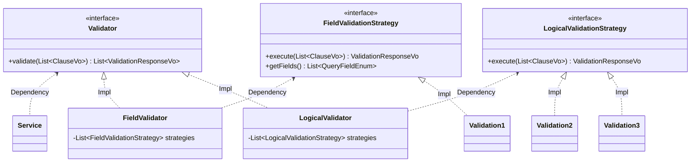

{: .no_toc }

  

    Table of contents
  

  {: .text-delta }
1. TOC
{:toc}

---

# **1월 첫째 주 회고**

## 2차 트레이닝 프로젝트

1차 트레이닝 프로젝트에서 생성한 Armeria + gRPC 템플릿 서버를 이용하여 **검색식 유효성 검증 서버**를 개발중이다.  
이번 2차 트레이닝 프로젝트에서 집중해야할 부분은 **검색식 유효성 검증 규칙을 확장하기 쉽게 개발**하는 것이다.  
이번 클래스 설계에서 어떤 부분에 집중하고 어떻게 설계하였는지 짚어보자  

1. **`Validator`의 인터페이스가 한 개의 `ValidationStrategy` 인터페이스를 관심에 둔다**가 핵심이다.
2. 지금은 `Validator` 인터페이스에 두 개의 구현체가 보인다
   - 현재 요구사항으로는 **필드연산자별 검증**하는 것과 **검색식을 모두 확인하면서 검증**하는 부분이였다
   - 목적별로 `Validator`의 구현체를 나누어 놓았다
3. `ValidationStrategy`의 구현체는 각각 1개, 2개로 보인다
   - 만약 현재 개발되어 있는 `Validator`에 해당하는 **검증기(`ValidationStrategy`) 구현체가 필요하다면 지금 추가할 검증기의 용도를 잘 생각하여 해당 `Validator`가 관심가지는 `ValidationStrategy`에 추가하면 된다.**
4. 확장 포인트는 두 곳이다.
   - 지금 구현된 `Validator` 2개 구현체의 용도보단 새로운 `Validator`가 필요하다면 **먼저 `Validator`를 구현하고 구현한 `Validator`가 관심가지는 `ValidationStrategy`를 추가하거나 구현하는 것이다.**
5. Service는 관심가지는 `Validator`를 주입받아 각 `Validator`과 반환하는 `List<응답객체>`를 받아 필터하여 사용하는 것이다
   - 필요한 `Validator`를 선택할 수 있는점이 좋다
6. 각 `Validator`는 스프링 빈으로 등록된 검증기(`ValidationStrategy`) 구현체들을 생성자로 주입받아(`List<구현체>`) 구현체들의 내부는 신경쓰지 않고 단일화 된 실행 메서드를 호출해주는 것 뿐이다. 

클래스 설계를 진지하게 임해본적이 처음이다.  
전회사에서는 계층형 아키텍처를 그냥 따라서 사용했었는데.. 지금은 유틸성 검증기들을 확장하기 쉽도록 집중했다.  
포인트는 결국 Interface로 **다형성**을 적용하여 클라이언트는 호출할 기능들의 내부 구현체를 신경쓸 필요가 없도록 한 것이다.  
(어떻게 보면 **전략 패턴**같다.)  
  
이제 검증기들을 구현하는것이 목표다.  

## [자바에서 코틀린으로](https://github.com/jdalma/java-to-kotlin) 읽기 모임 6주차 (11,12장)

1. 코틀린에서, 클래스에 `val`,`var`로 정의되는 변수를 프로퍼티라고 한다.
   - 코틀린의 프로퍼티는 자바에서는 멤버변수인 `field`와는 다르다
   - 프로퍼티는 자바의 `field + getter`,`setter` 메소드라고 볼 수 있다.
      - 자바에서는 자바빈즈
2. 코틀린에서는 `private`, `protected`이 아니면 자동으로 프로퍼티로 만들어진다.
3. `"객체는 공개된 필드를 포함할 수 있지만, 클라이언트가 필드를 읽기 위해 직접 메모리에 접근할 수는 없다. 클라이언트는 필드의 값에 접근하는 바이트코드 명령어를 통해서만 필드 상태에 접근할 수 있다."` 212p
4. `"클라이언트가 직접 필드를 변경하면 필드사이에 변해서는 안 되는 관계를 유지할 수 없다."` 212p
   - 공변성
   - `invariant` = 불변
5. 계산된 필드와 함수의 차이는 **인자를 절대 넘기지 않고 사이드 이펙트로 결과를 만든다**는 의미를 내포한다.
   - 명확한 의사표현
   - 맹기완님의 권장은 계산된 프로퍼티보단 함수를 만들어 써라고 하신다
   - 오현석님도 거의 사용하지 않지만 해당 필드가 `val`이고 필드가 변경될 여자기 없다면 계산 필드를 사용한다.
   - 하지만 호출할 때 마다 값이 바뀐다면 메서드로 분명하개 표현한다고 하신다
6. 확장된 프로퍼티는 `lazy`키워드를 사용할 수 있다
   - `lazy`는 무거운 객체다
7. **데이터 클래스에서 `var`프로퍼티를 허용하는 것은 코틀린 언어 설계의 실수다.**
8. `&&` , `||` 연산자 우선순위가 있다. `&&`가 빠르다
   - 연산자 우선순위가 있는지는 몰랐지만, 보기 좋게 괄호를 의식적으로 작성했었다
9. 코틀린 표준 라이브러리에는 자바 표준 라이브러리가 제공하는 클래스에 대한 연산자를 정의하는 확장함수가 많이 들어있다.
10. 최상위 함수보다는 `companion object` 내에 `static`메소드를 사용하는 이유가 클래스 내부의 `private`필드에도 접근할 수 있기 때문이다
11. `jar`를 난독화 할 수 있다.
12. `suspend` ❓
