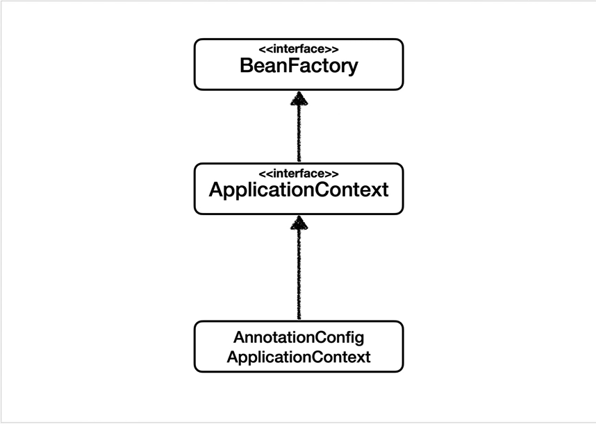
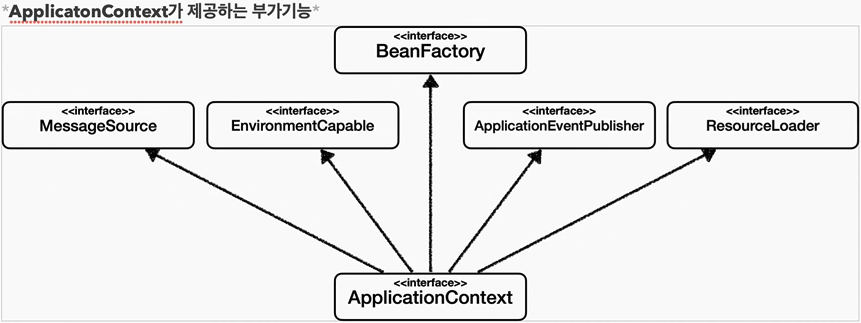

## Table of contents
{: .no_toc .text-delta }

1. TOC
{:toc}
---

### **BeanFactory**

-   **스프링 컨테이너 최상위 인터페이스다.**
-   스프링 빈을 관리하고 조회하는 역할을 담당한다.
-   **getBean()을 제공한다.**
-   **지금까지 우리가 사용했던 대부분의 기능은 BeanFactory가 제공하는 기능이다.**

### **ApplicationContext**

-   **BeanFactory기능을 모두 상속받아서 제공한다.**
-   빈을 관리하고 검색하는 기능을 BeanFactory가 제공해주는데 , 그러면 둘의 차이가 뭘까?
-   **애플리케이션을 개발할 때는 빈을 관리하고 조회하는 기능인 물론이고 , 수 많은 부가기능이 필요하다.**

-   **MessageSource를 활용한 국제화 기능**
    -   예를 들어 한국에서 들어오면 한국어로 , 영어권에서 들어오면 영어로 출력
-   **EnvironmentCapable**
    -   로컬 , 개발 , 운영등을 구분해서 처리
-   **ApplicationEventPublisher**
    -   이벤트를 발행하고 , 구독하는 모델을 편리하게 지원
-   **ResourceLoader**
    -   파일 , 클래스패스 , 외부 등에서 리소스를 편리하게 조회

### 📌 **정리**

-   ApplicationContext는 BeanFactory의 기능을 상속받는다.
-   ApplicationContext는 **"빈 관리기능 + 편리한 부가 기능"** 을 제공한다.
-   BeanFactory를 직접 사용할 일은 거의 없다. 부가기능이 포함된 ApplicationContext를 사용한다.
-   **BeanFactory나 ApplicationContext를 스프링 컨테이너라 한다.**
