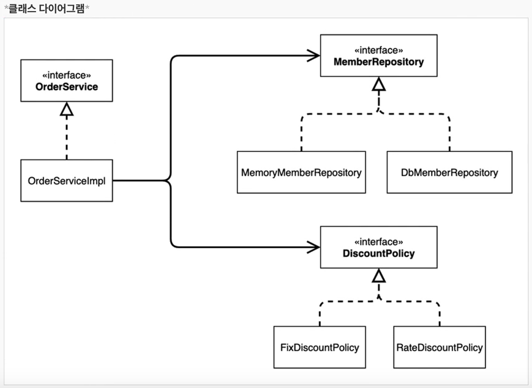
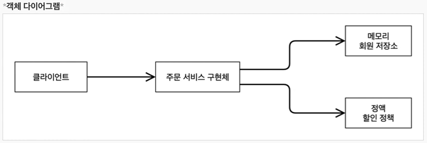

# IoC , DI 그리고 컨테이너
{: .no_toc }

## Table of contents
{: .no_toc .text-delta }

1. TOC
{:toc}

---
### **제어의 역전(IoC - Inversion Of Control)**

-   기존 프로그램은 클라이언트 구현 객체가 스스로 필요한 서버 구현 객체를 생성하고 , 연결하고 , 실행했다.
-   한마디로 구현 객체가 프로그램의 제어 흐름을 스스로 조종했다. 개발자 입장에서는 자연스러운 흐름이다.
-   **반면에 AppConfig가 등장한 이후에 구현 객체는 자신의 로직을 실행하는 역할만 담당한다.**
    -   프로그램의 제어흐름은 이제 AppConfig가 가져간다.
    -   예를 들어서 OrderServiceImpl은 필요한 인터페이스를 홀출하지만 어떤 구현 객체들이 실행 될지 모른다.
    -   프로그램의 제어 흐름에 대한 권한은 모두 AppConfig가 가지고 있다. 심지어 OrderServiceImpl도 AppConfig가 생성한다. 그리고 AppConfig는 OrderServiceImpl이 아닌 OrderService 인터페이스의 다른 구현 객체를 생성하고 실행할 수 도 있다.
-   이렇듯 **프로그램의 제어 흐름을 직접 제어하는 것이 아니라 외부에서 관리하는 것을 제어의 역전(IoC)이라 한다.**

-   **프레임워크 vs 라이브러리**
    -   프레임워크가 내가 작성한 코드를 제어하고 , 대신 실행하면 그것은 프레임워크가 맞다.(JUnit)
        -   @Test , @BeforeEach , @AfterEach .. 
    -   반면에 내가 작성한 코드가 직접 제어의 흐름을 담당한다면 그것은 프레임워크가 아니라 라이브러리 이다.

### **의존관게 주입(DI - Dependency Injection)**

  -   OrderServiceImpl은 DiscountPolicy 인터페이스에 의존한다. 실제 어떤 구현 객체가 사용될지는 모른다.
  -   의존관계는 **"정적인 클래스 의존 관계와 , 실행 시점에 결정되는 동적인 객체(인스턴스) 의존 관계"** 둘을 분리해서 생각 해야 한다.
  -   **정적인 클래스 의존관계**
      -   클래스가 사용하는 import 코드만 보고 의존관계를 쉽게 판단할 수 있다. 정적인 의존관계는 애플리케이션을 실행하지 않아도 분석할 수 있다. 클래스 다이어그램을 보자
      -   OrderServiceImpl은 MemberRepository , DisCountPolicy에 의존한다는 것을 알 수 있다.
      -   그런데 이러한 클래스 의존관계 만으로는 실제 어떤 객체가 OrderServiceImpl에 주입 될지 알 수 없다.

  -   **동적인 객체 인스턴스 의존 관계**
      -   애플리케이션 실행 시점에 실제 생성된 객체 인스턴스의 참조가 연결된 의존 관계다.
      -   애플리케이션 **"실행 시점(런타임)"** 에 외부에서 실제 구현 객체를 생성하고 클라이언트에 전달해서 클라이언트와 서버의 실제 의존관계가 연결 되는 것을 **의존관계 주입(DI)** 이라 한다.
      -   객체 인스턴스를 생성하고 , 그 참조값을 전달해서 연결된다.
      -   의존관계 주입을 사용하면 클라이언트 코드를 변경하지 않고 , 클라이언트가 호출하는 대상의 타입 인스턴스를 변경할 수 있다.
      -   **의존관계 주입을 사용하면 정적인 클래스 의존관계를 변경하지 않고 , 동적인 객체 인스턴스 의존관계를 쉽게 변경할 수 있다.**

### **IoC 컨테이너 , DI 컨테이너**

-   AppConfig처럼 객체를 생성하고 관리하면서 의존관계를 연결해 주는 것을 IoC 컨테이너 또는 **DI 컨테이너** 라고 한다.
-   의존관계 주입에 초점을 맞추어 최근에는 주로 **DI 컨테이너**라 한다.
-   또는 어셈블러 , 오브젝트 팩토리 등으로 불리기도 한다.
