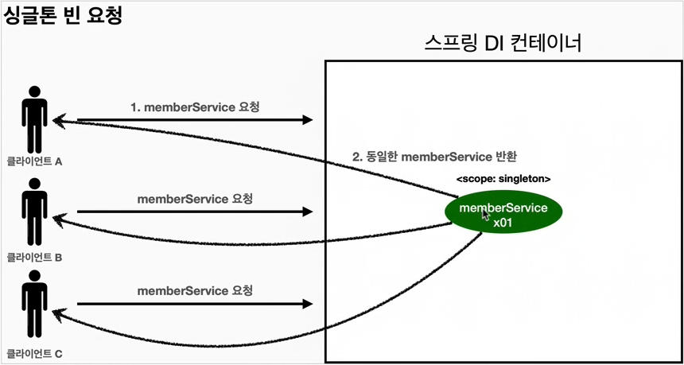
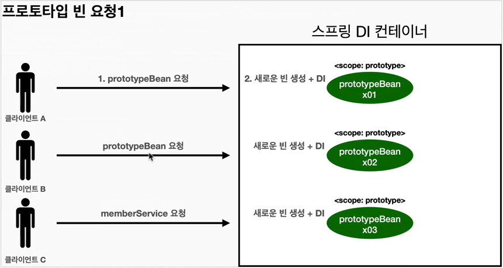
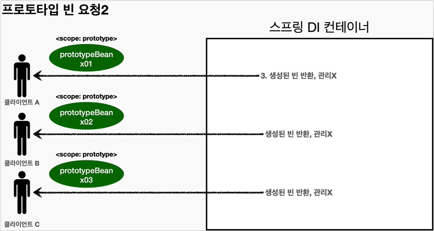
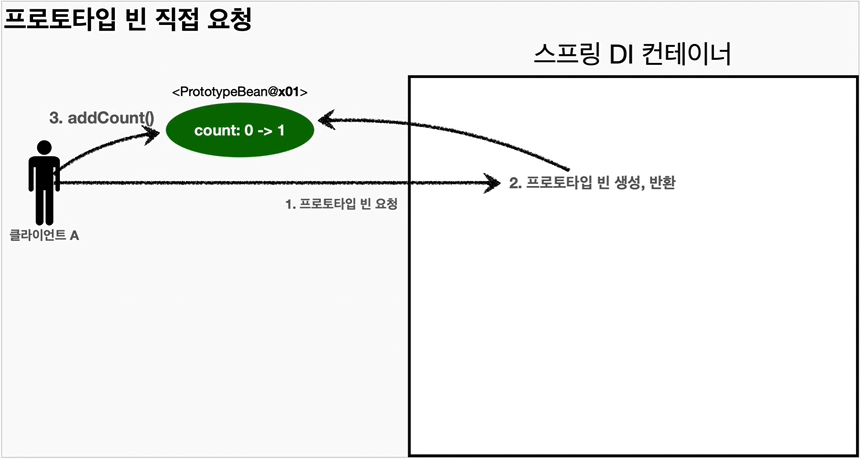
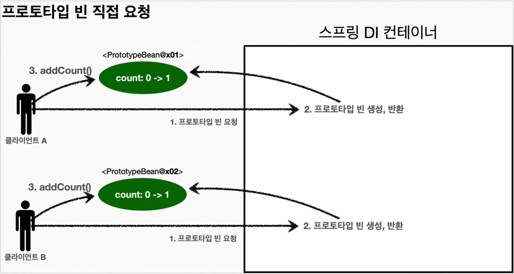
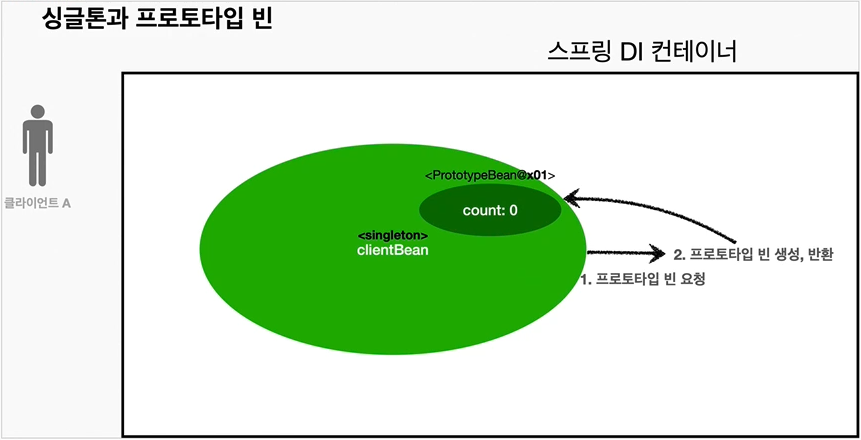
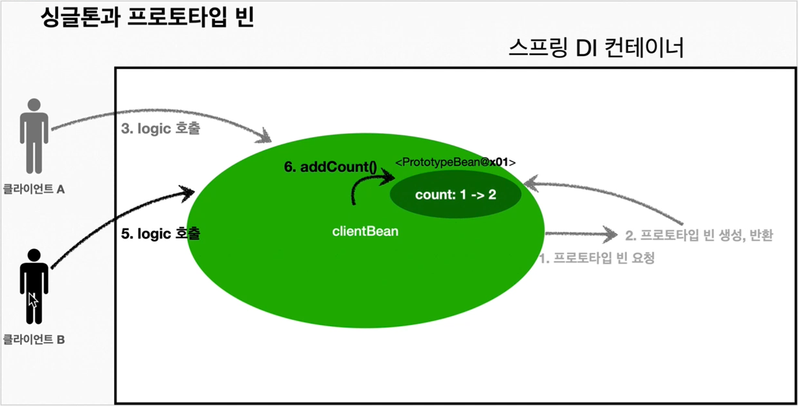
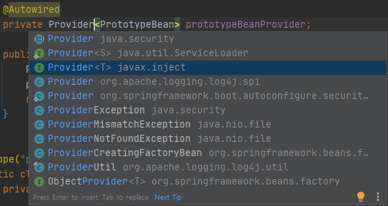

## Table of contents
{: .no_toc .text-delta }

1. TOC
{:toc}
---

## **빈 스코프란?**
**스프링 빈**이 스프링 컨테이너의 시작과 함께 생성되어 스프링 컨테이너가 종료될 때 까지 유지된다고 학습했다.

✅**이것은 스프링 빈이 기본적으로 싱글 톤 스코프로 생성되기 때문이다.**

✅**스코프는 번역 그대로 빈이 존재할 수 있는 범위를 뜻한다.**

- **싱글톤** : 기본 스코프 , **스프링 컨테이너의 시작과 종료까지 유지 되는 가장 넓은 범위의 스코프**이다.
- **프로토 타입** : 스프링 컨테이너는 **프로토 타입 빈의 생성과 의존관계 주입까지만 관여하고 더는 관리하지 않는 매우 짧은 범위의 스코프** 이다.

### 컴포넌트 스캔 자동 등록
```java
  @Scope("prototype")
  @Component
  public class FixDiscountPolicy implements DiscountPolicy{
  	...
  }
```

### 수동 등록 (`@Bean`)
```java
@Scope("prototype")
@Bean
public OrderService orderService(){
    return new OrderServiceImpl(memberRepository(), discountPolicy());
}
```

***

## **프로토 타입 스코프**
✅**싱글 톤 스코프의 빈을 스프링 컨테이너는 항상 같은 인스턴스의 스프링 빈을 반환한다.**

✅반면에 **프로토타입 스코프를 스프링 컨테이너에 조회하면 스프링 컨테이너는 항상 새로운 인스턴스를 생성해서 반환한다.**


### 싱글톤 빈 요청
{: .fh-default }

- 싱글 톤 스코프의 빈을 스프링 컨테이너에 요청 한다.
- 스프링 컨테이너는 본인이 관리하는 스프링 빈을 반환한다.
- 이후에 스프링 컨테이너에 같은 요청이 와도 같은 객체 인스턴스의 스프링 빈을 반환한다.

##### 테스트

<div class="code-example" markdown="1">
SingletonTest
</div>

```java
public class SingletonTest {

    @Test
    void singletonBeanFind(){
        AnnotationConfigApplicationContext ac = new AnnotationConfigApplicationContext(SingletonBean.class);

        SingletonBean singletonBean1 = ac.getBean(SingletonBean.class);
        SingletonBean singletonBean2 = ac.getBean(SingletonBean.class);

        System.out.println("singletonBean1 = " + singletonBean1);
        System.out.println("singletonBean2 = " + singletonBean2);
        Assertions.assertThat(singletonBean1).isSameAs(singletonBean2);

        ac.close();
//       출력
//       SingletonBean.init
//       singletonBean1 = hello.core.scope.SingletonTest$SingletonBean@7c9da249
//       singletonBean2 = hello.core.scope.SingletonTest$SingletonBean@7c9da249
//       SingletonBean.destory
    }

    @Scope("singleton") // default
    static class SingletonBean{

        @PostConstruct
        public void init(){
            System.out.println("SingletonBean.init");
        }

        @PreDestroy
        public void destory(){
            System.out.println("SingletonBean.destory");
        }
    }
}
```

### 프로토타입 빈 요청
{: .fh-default }

- 프로토타입 스코프의 빈을 스프링 컨테이너에 요청한다.
- **스프링 컨테이너는 이 시점에 프로토타입 빈을 생성하고 , 필요한 의존관계를 주입한다. (요청 시점에 생성한다.)**


- 스프링 컨테이너는 생성한 프로토타입 빈을 클라이언트에 반환한다.
- **이후에 스프링 컨테이너에 같은 요청이 오면 항상 새로운 프로토타입 빈을 생성해서 반환한다.**

##### 테스트
<div class="code-example" markdown="1">
PrototypeTest
</div>
```java
public class PrototypeTest {

    @Test
    void prototypeBeanFind(){
        AnnotationConfigApplicationContext ac =
                new AnnotationConfigApplicationContext(PrototypeBean.class);
        System.out.println("find prototypeBean1");
        PrototypeBean prototypeBean1 = ac.getBean(PrototypeBean.class);

        System.out.println("find prototypeBean2");
        PrototypeBean prototypeBean2 = ac.getBean(PrototypeBean.class);

        System.out.println("prototypeBean1 = " + prototypeBean1);
        System.out.println("prototypeBean2 = " + prototypeBean2);

        Assertions.assertThat(prototypeBean1).isNotSameAs(prototypeBean2);

        ac.close();
//        출력
//        find prototypeBean1
//        PrototypeBean.init
//        find prototypeBean2
//        PrototypeBean.init
//        prototypeBean1 = hello.core.scope.PrototypeTest$PrototypeBean@7c9da249
//        prototypeBean2 = hello.core.scope.PrototypeTest$PrototypeBean@7ea7bde1
    }

    @Scope("prototype")
    static class PrototypeBean{
        @PostConstruct
        public void init(){
            System.out.println("PrototypeBean.init");
        }

        @PreDestroy
        public void destory(){
            System.out.println("PrototypeBean.destory");
        }
    }
}
```

### 📌 정리
- **싱글톤 빈**은 **스프링 컨테이너 생성 시점에 초기화 메서드가 실행 되지만 , 프로타입 스코프 빈은 스프링 컨테이너에서 빈을 조회할 때 생성을 하고 초기화 메서드도 그 때 실행된다.**
- 프로토타입 빈을 2번 조회했으므로 완전히 다른 스프링 빈이 생성되고 , 초기화도 2번 실행된 것을 확인할 수 있다.
- 싱글톤 빈은 스프링 컨테이너가 관리하기 때문에 스프링 컨테이너가 종료될 때 빈의 종료 메소드가 실행 되지만
- **프로토타입 빈은 스프링 컨테이너가 생성과 의존관계 주입 그리고 초기화 까지만 관여하고 , 더는 관리하지 않는다.**
- 따라서 프로토타입 빈은 스프링 컨테이너가 종료될 때 `@PreDestroy`와 같은 종료 메소드가 전혀 실행 되지 않는다.

***

## **싱글톤 , 프로토타입 빈 함께 사용시 문제점과 문제 해결 방법**
스프링 컨테이너에 프로토타입 스코프의 빈을 요청하면 항상 새로운 객체 인스턴스를 생성해서 반환한다.

하지만 **싱글톤 빈과 함께 사용할 때는 의도한 대로 잘 동작하지 않으므로 주의해야 한다.**


### 프로토타입 빈 직접 요청
{: .fh-default }

- 클라이언트A는 스프링 컨테이너에 프로토타입 빈을 요청한다.
- 스프링 컨테이너는 프로토타입 빈을 새로 생성해서 반환`('x01')`한다. 해당 빈의 `count` 필드 값은 `0`이다.
- 클라이언트는 조회한 프로토타입 빈에 `addCount`를 호출하면서 `count`필드를 `+1` 한다.
- 결과적으로 프로토타입 빈 `('x01')`의 `count`는 `1`이 된다.


- 클라이언트B는 스프링 컨테이너에 프로토타입 빈을 요청한다.
- 스프링 컨테이너는 프로토타입 빈을 새로 생성해서 반환`('x02')`한다. 해당 빈의 `count` 필드 값은 `0`이다.
- 클라이언트는 조회한 프로토타입 빈에 `addCount()`를 호출하면서 `count` 필드를 `+1` 한다.
- 결과적으로 프로토타입 빈`('x02')`의 `count`는 `1`이 된다.


#####  테스트
```java
public class SingletonWithPrototypeTest1 {

    @Test
    void prototypeFind(){
        AnnotationConfigApplicationContext ac =
                new AnnotationConfigApplicationContext(PrototypeBean.class);

        PrototypeBean prototypeBean1 = ac.getBean(PrototypeBean.class);
        prototypeBean1.addCount();
        System.out.println("prototypeBean1 : " + prototypeBean1.getCount());
        Assertions.assertThat(prototypeBean1.getCount()).isEqualTo(1);

        PrototypeBean prototypeBean2 = ac.getBean(PrototypeBean.class);
        prototypeBean2.addCount();
        System.out.println("prototypeBean2 : " + prototypeBean2.getCount());
        Assertions.assertThat(prototypeBean2.getCount()).isEqualTo(1);

//        출력
//        PrototypeBean.init hello.core.scope.SingletonWithPrototypeTest1$PrototypeBean@5fb4aba9
//        prototypeBean1 : 1
//        PrototypeBean.init hello.core.scope.SingletonWithPrototypeTest1$PrototypeBean@2ed424ed
//        prototypeBean2 : 1
    }

    @Scope("prototype")
    static class PrototypeBean{
        private int count = 0;

        public void addCount(){
            count++;
        }

        public int getCount(){
            return count;
        }

        @PostConstruct
        public void init(){
            System.out.println("PrototypeBean.init " + this);
        }

        @PreDestroy
        public void destory(){
            System.out.println("PrototypeBean.destroy");
        }
    }
}
```

### 싱글톤 빈에서 프로토타입 빈 사용
{: .fh-default }

**이번에는 clientBean이라는 싱글톤 빈이 의존관계 주입을 통해서 프로토타입 빈을 주입받아서 사용하는 예를 보자**



- `clientBean`은 싱글톤 이므로 , 보통 스프링 컨테이너 생성 시점에 함께 생성되고 , 의존관계 주입도 발생한다.
- `clientBean`은 의존관계 자동 주입을 사용한다. 주입 시점에 스프링 컨테이너에 프로토타입 빈을 요청한다.
- 스프링 컨테이너는 프로토타입 빈을 생성해서 `clientBean`에 반환한다. 프로토타입 빈의 `count` 필드 값은 `0`이다.
- 이제 `clientBean`은 프로토타입 빈을 내부 필드에 보관한다. **(정확히는 참조값을 보관한다.)**


- 클라이언트A는 `clientBean`을 스프링 컨테이너에 요청해서 받는다. 싱글톤이므로 항상 같은 `clientBean`이 반환된다.
- 클라이언트A는 `clientBean.logic()` (addCount메소드 포함)을 호출한다.
- `clientBean`은 `prototypeBean`의 `addCount()`를 호출해서 프로토타입 빈의 `count`를 증가한다.
- `count`값이 `1`이 된다.


- 클라이언트B는 `clientBean`을 스프링 컨테이너에 요청해서 받는다. 싱글톤이므로 항상 같은 `clientBean`이 반환된다.
- `clientBean`이 내부에 가지고 있는 프로토타입 빈은 이미 과거에 주입이 끝난 빈이다. 주입 시점에 스프링 컨테이너에 요청해서 프로토타입 빈이 새로 생성이 된 것이지 , 사용 할 때마다 새로 생성되는 것이 아니다.
- 클라이언트B는 `clientBean.logic()` (addCount메소드 포함)을 호출한다.
- `clientBean`은 `prototypeBean`의 `addCount()`를 호출해서 프로토타입 빈의 `count`를 증가한다.
- 원래 `1`이였으므로 `2`가 된다.


##### 테스트
```java
public class SingletonWithPrototypeTest1 {

    @Test
    void singletonClientUsePrototype(){
        AnnotationConfigApplicationContext ac =
                new AnnotationConfigApplicationContext(ClientBean.class , PrototypeBean.class);

        ClientBean clientBean1 = ac.getBean(ClientBean.class);
        int count1 = clientBean1.logic();
        Assertions.assertThat(count1).isEqualTo(1);

        ClientBean clientBean2 = ac.getBean(ClientBean.class);
        int count2 = clientBean2.logic();
        Assertions.assertThat(count2).isEqualTo(2);

    }
    @Scope("singleton")
    static class ClientBean{
        private final PrototypeBean prototypeBean;

        // PrototypeBean 호출 시점이 ClientBean이 스프링 빈으로 등록 될 때 1번 만 호출
        // 결국 같은 PrototypeBean이 사용된다.
        public ClientBean(PrototypeBean prototypeBean) {
            this.prototypeBean = prototypeBean;
        }

        public int logic(){
            prototypeBean.addCount();
            return prototypeBean.getCount();
        }
    }

    @Scope("prototype")
    static class PrototypeBean{
        private int count = 0;

        public void addCount(){
            count++;
        }

        public int getCount(){
            return count;
        }

        @PostConstruct
        public void init(){
            System.out.println("PrototypeBean.init " + this);
        }

        @PreDestroy
        public void destory(){
            System.out.println("PrototypeBean.destroy");
        }
    }
}
```
- **스프링은 일반적으로 싱글톤 빈을 사용하므로 , 싱글톤 빈이 프로토타입 빈을 사용하게 된다.**
- 그런데 싱글톤 빈은 생성 시점에만 의존관계 주입을 받기 때문에 , **프로토타입 빈이 생성되기는 하지만 싱글톤 빈과 함께 계속 유지되는 것이 문제다.**
- 프로토타입 빈을 주입 시점에만 새로 생성하는게 아니라 , 사용할 때 마다 새로 생성해서 사용하는것을 원한다.


> ✋
> - 여러 빈에서 같은  프로토타입 빈을 주입 받으면 , **"주입 받는 시점에 각각 새로운 프로토타입 빈이 생성된다"**
> - 예를 들어
>    - clientA , clientB가 각각 의존관계 주입을 받으면 각각 다른 인스턴스의 프로토타입 빈을 주입 받는다.
>    - clientA -> prototypeBean@x01
clientB -> prototypeBean@x02
물론 사용할 때 마다 새로 생성되는 것은 아니다.

### 📌 문제 해결
싱글톤 빈과 프로토타입 빈을 함께 사용할 때 ,
**어떻게 하면 사용할 때 마다 항상 새로운 프로토타입 빈을 생성할 수 있을까?**

##### 스프링 컨테이너에 요청 (ObjectProvider , ObjectFactory)
{: .fh-default }

✅**가장 간단한 방법은 싱글톤 빈이 프로토타입을 사용할 때 마다 스프링 컨테이너에 새로 요청하는 것이다.**

- `ac.getBean()`을 통해서 항상 새로운 프로토타입 빈이 생성되는 것을 확인할 수 있다.
- **의존관계를 외부에서 주입(DI)받는게 아니라 이렇게 직접 필요한 의존관계를 찾는 것을 Dependency Lookup(DL)의존관계 조회(탐색) 이라 한다.**
- 그런데 이렇게 스프링의 애플리케이션 컨텍스트 전체를 주입 받게 되면 , 스프링 컨테이너에 종속적인 코드가 되고 ,단위 테스트도 어려워 진다.
- 지금 필요한 기능은 지정한 프로토타입 빈을 컨테이너 에서 대신 찾아주는 DL정도의 기능만 제공하는 무언가가 있으면 된다.

✅**ObjectProvider , ObjectFactory**
```java
@Scope("singleton")
static class ClientBean{
    @Autowired
    private ObjectProvider<PrototypeBean> prototypeBeanProvider;

    public int logic(){
        PrototypeBean prototypeBean = prototypeBeanProvider.getObject();
        prototypeBean.addCount();
        return prototypeBean.getCount();
    }
}

@Scope("singleton")
static class ClientBean{
    @Autowired
    private ObjectFactory<PrototypeBean> prototypeBeanProvider;

    public int logic(){
        PrototypeBean prototypeBean = prototypeBeanProvider.getObject();
        prototypeBean.addCount();
        return prototypeBean.getCount();
    }
}
```

**ObjectProvider**
- `prototypeBeanProvider.getObject()`는 `ac.getBean()` 처럼 **스프링 컨테이너를 통해 (제네릭에 정의된) `PrototypeBean`을 찾아 반환해준다. (DL)**
- 스프링이 제공하는 기능을 사용하지만 , 기능이 단순하므로 단위테스트를 만들거나 mock코드를 만들기는 훨씬 쉬워진다.
- **너무 무거운 `ac`를 새로 생성하는 것 보다 딱 필요한 DL정도의 기능만 제공한다.**

**ObjectFactory**
- 상속 , 옵션 , 스트림 처리의 편의 기능이 많다.
- 기능이 단순 , 별도의 라이브러리 필요 없고 , 스프링에 의존한다.
- `getObject()` 메소드 하나만 존재한다.


##### JSR-330 Provider (자바 표준)
{: .fh-default }

**마지막 방법은 javax.inject.Provider라는 JSR-330 자바 표준을 사용하는 방법이다.**

<div class="code-example" markdown="1">
Gradle추가
</div>
```
implementation 'javax.inject:javax.inject:1'
```
```java
@Scope("singleton")
static class ClientBean{
    @Autowired
    private Provider<PrototypeBean> prototypeBeanProvider;

    public int logic(){
        PrototypeBean prototypeBean = prototypeBeanProvider.get();
        prototypeBean.addCount();
        return prototypeBean.getCount();
    }
}
```


- `provider.get()`을 통해 항상 새로운 프로토타입 빈을 생성한다.
- `provider.get()`을 호출하면 내부에서는 스프링 컨테이너를 통해 해당 빈을 찾아서 반환한다.(DL)
- 기능이 단순하므로 단위테스트를 만들거나 mock코드를 만들기는 훨씬 쉬워진다.
- Provider는 지금 딱 필요한 DL정도의 기능만 제공한다.
- 자바 표준이므로 스프링이 아닌 다른 컨테이너에서도 사용할 수 있다.

* * *

### ❓ 프로토타입 빈을 언제 사용할까
- **매번 사용할 때 마다 의존관계 주입이 완료된 새로운 객체가 필요하면 사용하면 된다.**
- 그런데 실무에서 개발하다 보면 싱글톤 빈으로 대부분의 문제를 해결할 수 있기 때문에 프로토타입 빈을 직접 적으로 사용하는 경우는 매우 드물다.
- ObjectProvider는 DL을 위한 편의 기능을 많이 제공해주고 , 스프링 외에 별도의 의존관계 추가가 필요 없이 때문에 편리하다.
- 만약 코드를 스프링이 아닌 다른 컨테이너에서도 사용할 수 있어야 한다면 JSR-330 Provider를 사용해야 한다.
