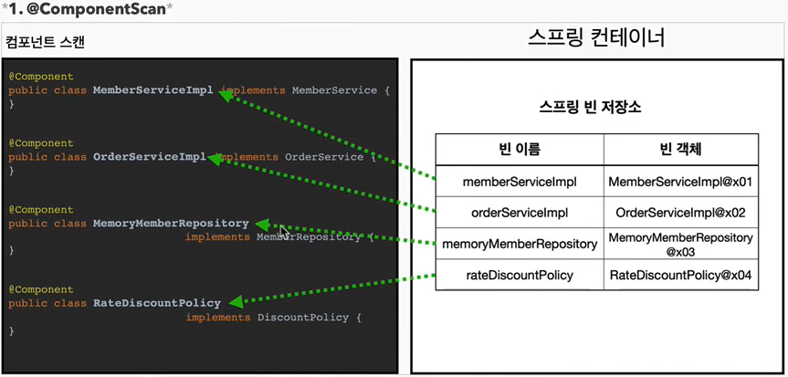
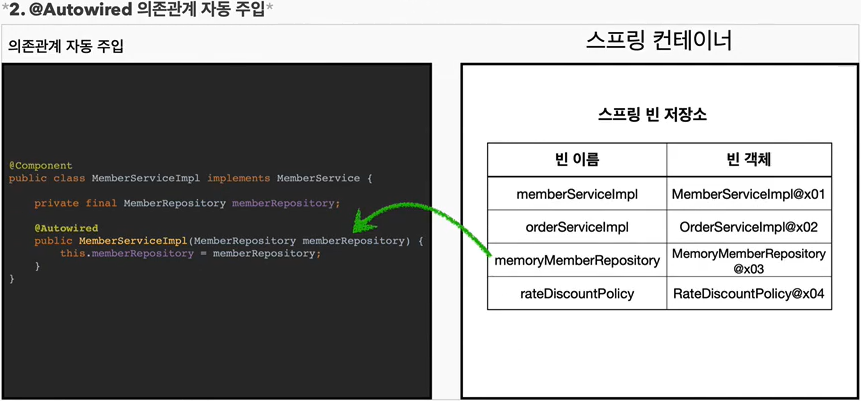
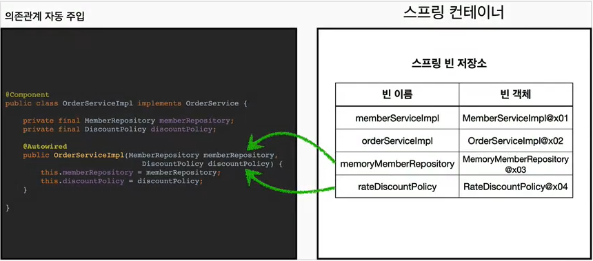
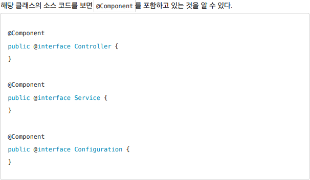

# 컴포넌트 스캔
{: .no_toc }

## Table of contents
{: .no_toc .text-delta }

1. TOC
{:toc}

---

## **컴포넌트 스캔과 의존관계 자동 주입**

### 컴포넌트 스캔
- 지금까지 스프링 빈을 등록할 때는 자바 코드의 `@Bean` 이나 XML의 `<bean>`등을 통해서 설정 정보에 직접 등록할 스프링 빈을 나열했다.
- 스프링 빈이 수십 , 수백개가 되면 일일이 등록하기도 귀찮고, 설정 정보도 커지고 , 누락하는 문제도 발생한다.
- 그래서 **스프링은 설정 정보가 없어도 자동으로 스프링 빈을 등록하는 컴포넌트 스캔이라는 기능을 제공한다.**
- 또 **의존관계도 자동으로 주입하는 @Autowired라는 기능**도 제공한다.

### AutoAppConfig.class
``` java
  @Configuration
  @ComponentScan(
      // @Component를 찾아 스프링 빈으로 등록해준다.
      // @Component 어노테이션을 찾을 때 제외할 어노테이션 (@Configuration)
      // (기존 AppConfig.java는 등록이 되면 안되기 때문에)
      excludeFilters = @ComponentScan.Filter(type = FilterType.ANNOTATION
              , classes = Configuration.class);
  )
  public class AutoAppConfig {

  }
```
✅컴포넌트 스캔을 사용하려면 먼저 `@ComponentScan`을 설정 정보에 붙여주면 된다.
{: .fs-3 }

✅기존의 AppConfig와는 다르게 `@Bean`으로 등록한 클래스가 하나도 없다.
{: .fs-3 }


✋
: >컴포넌트 스캔을 사용하면 **@Configuration**이 붙은 설정 정보도 자동으로 등록되기 때문에 AppConfig , TestConfig등 앞서 만들어 두었던 설정 정보도 함께 등록되고 , 실행 되어 버린다. 그래서 excludeFilters를 이용해서 설정 정보는 컴포넌트 스캔 대상에서 제외 했다.
보통 설정 정보를 컴포넌트 스캔 대상에서 제외하지는 않지만 , 기존 예제 코드를 최대한 남기고 유지하기 위해 작성했다.
(**@Configuration** 소스코드를 열어보면 **@Component** 애노테이션이 붙어있다.)

### OrderServiceImpl.java
```java
@Component
public class OrderServiceImpl implements OrderService{

    private final MemberRepository memberRepository;
    private final DiscountPolicy discountPolicy;

    @Autowired // ac.getBean(MemberRepository.class)
    public OrderServiceImpl(MemberRepository memberRepository, DiscountPolicy discountPolicy) {
        this.memberRepository = memberRepository;
        this.discountPolicy = discountPolicy;
    }

    @Override
    public Order createOrder(Long memberId, String itemName, int itemPrice) {
        Member member = memberRepository.findById(memberId);
        int discountPrice = discountPolicy.discount(member , itemPrice);

        return new Order(memberId , itemName , itemPrice , discountPrice);
    }

    //테스트
    public MemberRepository getMemberRepository() {
        return memberRepository;
    }
}
```
- **`@Component`는 스프링 빈으로 바로 등록이 되어버려 의존관계를 `@Autowired`를 추가하여 의존관계를 주입한다.**
- 이전에 AppConfig에서는 `@Bean`으로 직접 설정 정보를 작성했고 , 의존관계도 직접 작성했다.
- 이제는 이런 설정 정보 자체가 없기 때문에 , 의존관계 주입도 이 클래스 안에서 해결해야한다.

### AutoAppConfigTest
```java
public class AutoAppConfigTest {

    @Test
    void basicScan(){
        AnnotationConfigApplicationContext ac =
        		new AnnotationConfigApplicationContext(AutoAppConfig.class);

        MemberService memberService = ac.getBean(MemberService.class);
        Assertions.assertThat(memberService).isInstanceOf(MemberService.class);
    }
}
```

### ❓ 컴포넌트 스캔과 자동 의존관계 주입은 어떻게 동작할까


- `@ComponentScan`은 `@Component`가 붙은 **모든 클래스를 스프링 빈으로 등록한다.**
- 이때 스프링 빈의 기본 이름은 클래스명을 사용하되 맨 앞글자만 소문자를 사용한다.
  - **빈 이름 기본 전략** : MemberServiceImpl 클래스 -> memberServiceImpl
  - **빈 이름 직접 지정** : 만약 스프링 빈의 이름을 직접 지정하고 싶으면 `@Component("memberService2")`이름을 부여하면 된다


- 생성자에 `@Autowired`를 지정하면 , **스프링 컨테이너가 자동으로 해당 스프링 빈을 찾아서 주입한다.**
- 이때 기본 조회 전략은 타입이 같은 빈을 찾아서 주입한다.
  - getBean(MemberRepository.class)와 동일하다고 이해하면 된다.


- 생성자에 파라미터가 많아도 다 찾아서 자동으로 주입한다.

### ❓ 인터페이스의 구현체가 2개 이상일 때
`OrderService`에 `DiscountPolicy`(인터페이스)의 `RateDiscountPolicy` , `FixDiscountPolicy`(구현체) 둘 중 하나를 주입해줘야하는데 구현체 2개 다 `@Component`로 등록 하게 되면??
```scss
NoUniqueBeanDefinitionException: No qualifying bean of type 'hello.core.discount.DiscountPolicy'
available: expected single matching bean but found 2: fixDiscountPolicy,rateDiscountPolicy
```

***

## **탐색 위치와 기본 스캔 대상**

### 탐색할 패키지와 시작 위치 지정
- 모든 자바 클래스를 다 컴포넌트로 스캔 하면 시간이 오래 걸린다 (라이브러리 까지 뒤진다).
- 그래서 **꼭 필요한 위치부터 탐색하도록 시작 위치를 지정할 수 있다.**

### AutoAppConfig.class
```java
@Configuration
@ComponentScan(
    // @Component를 찾아 스프링 빈으로 등록해준다.

    // 기본 스캔 범위를 정할 수 있다.
    basePackages = "hello.core.member",

    // 기존 AppConfig.java는 등록이 되면 안되기 때문에
    // @Component 어노테이션을 찾을 때 제외할 어노테이션 (@Configuration)
    excludeFilters = @ComponentScan.Filter(type = FilterType.ANNOTATION
            , classes = Configuration.class)
)
public class AutoAppConfig {

}
```
- `basePackages` : 탐색할 패키지의 시작 위치를 지정한다. 이 패키지를 포함해서 하위 패키지를 모두 탐색한다.
- `basePackages = {"hello.core" , "hello.service"}` 이렇게 여러 시작 위치를 지정할 수도 있다.
- 만약 지정하지 않으면 `@ComponentScan`이 붙은 설정 정보 클래스의 패키지가 시작 위치가 된다

### 권장 방법
- 패키지 위치를 지정하지 않고 , 설정 정보 클래스의 위치를 프로젝트 최상단에 두는 것이다.
- 최근 스프링 부트도 이 방법을 기본으로 제공한다.
- 예를 들어서 프로젝트가 다음과 같이 구조가 되어 있으면
    - `com.hello`
      - `com.hello.service`
      - `com.hello.repository`
- `com.hello` ➜ 프로젝트 시작 루트 , 여기에 AppConfig같은 메인 설정 정보를 두고 `@ComponentScan` 애노테이션을 붙이고 , `basePackages` 지정은 생략한다.
- 이렇게 하면 **`com.hello`를 포함한 하위는 모두 자동으로 컴포넌트 스캔의 대상이 된다.**
- 그리고 프로젝트 메인 설정 정보는 프로젝트를 대표하는 정보이기 때문에 프로젝트 시작 루트 위치에 두는 것이 좋다.
- **참고**: 스프링 부트를 사용하면 스프링 부트의 대표 시작 정보인 `@SpringBootApplication`를 이 프로젝트 시작 루트 위치에 두는것이 관례이다. *(그리고 이 설정 안에 바로 `@ComponentScan`이 들어 있다!)*

```java
  @Target(ElementType.TYPE)
  @Retention(RetentionPolicy.RUNTIME)
  @Documented
  @Inherited
  @SpringBootConfiguration
  @EnableAutoConfiguration
  @ComponentScan(excludeFilters =
    { @Filter(type = FilterType.CUSTOM, classes = TypeExcludeFilter.class),
      @Filter(type = FilterType.CUSTOM, classes = AutoConfigurationExcludeFilter.class) })
  public @interface SpringBootApplication {
    ...
  }
```

### 📌 컴포넌트 스캔 기본 대상
**컴포넌트 스캔은 `@Component`뿐만 아니라 다음과 같은 내용도 추가로 대상에 포함한다.**
- `@Component`
  - 컴포넌트 스캔에서 사용
- `@Controller`
  - 스프링 MVC컨트롤러로 인식
- `@Service`
  - 스프링 비즈니스 로직에서 사용
  - 특별한 처리를 하진 않는다.
- `@Repository`
  - 스프링 데이터 접근 계층으로 인식
  - **데이터 계층의 예외를 스프링 예외로 변환해준다.**
- `@Configuration`
  - 스프링 설정 정보에서 사용
  - **스프링 빈이 싱글톤을 유지하도록 추가 처리를 한다.**



✋
: >**애노테이션에는 상속관계라는 것이 없다.**
그래서 이렇게 애노테이션이 특정 애노테이션을 들고 있는 것을 인식할 수 있는 것은 자바 언어가 지원하는 기능은 아니고 , 스프링이 지원하는 기능이다


***

## **필터**

### include,excludeFilters
- **includeFilters** : 컴포넌트 스캔 대상을 추가로 지정한다.
- **excludeFilters** : 컴포넌트 스캔에서 제외할 대상을 지정한다.


#### MyIncludeComponent , MyExcludeComponent (Annotation)
```java
@Target(ElementType.TYPE)
@Retention(RetentionPolicy.RUNTIME)
@Documented
public @interface MyIncludeComponent {
}


@Target(ElementType.TYPE)
@Retention(RetentionPolicy.RUNTIME)
@Documented
public @interface MyExcludeComponent {
}
```

#### BeanA , BeanB
```java
@MyIncludeComponent
public class BeanA {
}

@MyExcludeComponent
public class BeanB {
}
```

#### ComponentFilterAppConfigTest
```java
public class ComponentFilterAppConfigTest {

    @Test
    void filterScan(){
        AnnotationConfigApplicationContext ac =
                new AnnotationConfigApplicationContext(ComponentFilterAppConfig.class);
        BeanA beanA = ac.getBean("beanA", BeanA.class);
        Assertions.assertThat(beanA).isNotNull();

        org.junit.jupiter.api.Assertions.assertThrows(
                NoSuchBeanDefinitionException.class ,
                () -> ac.getBean("beanB" , BeanB.class));
    }

    @Configuration
    @ComponentScan(
            includeFilters = @ComponentScan.Filter(type = FilterType.ANNOTATION
                    , classes = MyIncludeComponent.class),
            excludeFilters = @ComponentScan.Filter(type = FilterType.ANNOTATION
                    , classes = MyExcludeComponent.class)
    )
    static class ComponentFilterAppConfig{

    }
}
```
- includeFilters에 MyIncludeComponent 애노테이션을 추가해서 BeanA가 스프링 빈에 등록된다.
- excludeFilters에 MyExcludeComponent 애노테이션을 추가해서 BeanB는 스프링 빈에 등록되지 않는다.

### 📌 FilterType  옵션
- `ANNOTATION` : 기본값 , 애노테이션을 인식해서 동작한다
  - 예) org.example.SomeAnnotation
- `ASSIGNABLE_TYPE` : 지정한 타입과 자식 타입을 인식해서 동작한다.
  - 예) org.example.SomeClass
- `ASPECTJ` : AspectJ 패턴 사용
  - 예) org.example..*Service+
- `REGEX` : 정규 표현식
  - 예) org\.example\.Default.*
- `CUSTOM` : TypeFilter라는 인터페이스를 구현해서 처리
  - 예) org.example.MyTypeFilter
> `@Component`면 충분하기 때문에 includeFilters를 사용할 일은 거의 없다.
excludeFilters는 여러가지 이유로 간혹 사용할 때가 있지만 많지는 않다.
특히 최근 스프링 부트는 컴포넌트 스캔을 기본으로 제공하는데 ,<strong>*개인적으로는 옵션을 변경하면서 사용하기 보다는 스프링의 기본 설정에 최대한 맞추어 사용하는 것을 권장한다.*</strong>

***

## **중복 등록과 충돌**

### ❓ 컴포넌트 스캔에서 같은 빈 이름을 등록하면 어떻게 될까?
**✅자동 빈 등록 vs 자동 빈 등록**
- 컴포넌트 스캔에 의해 자동으로 스프링 빈이 등록되는데 , 그 이름이 같은 경우 스프링은 오류를 발생 시킨다.
  - `ConflictingBeanDefinitionException` 예외 발생

**✅수동 빈 등록 vs 자동 빈 등록**
- 만약 수동 빈 등록과 자동 빈 등록에서 빈 이름이 충돌 되면 어떻게 될까?
- **이 경우 수동 빈 등록이 우선권을 가진다. (수동 빈이 자동 빈을 오버라이딩 해버린다)**
```
Overriding bean definition for bean 'memoryMemberRepository' with a different definition:
replacing [Generic bean: class [hello.core.member.MemoryMemberRepository];
scope=singleton; abstract=false; lazyInit=null; autowireMode=0; dependencyCheck=0;
autowireCandidate=true; primary=false; factoryBeanName=null; factoryMethodName=null;
initMethodName=null; destroyMethodName=null;
defined in file [C:\Users\pc\Desktop\study\core\out\production\classes\hello\core\member\MemoryMemberRepository.class]]
with [Root bean: class [null]; scope=; abstract=false; lazyInit=null; autowireMode=3;
dependencyCheck=0; autowireCandidate=true; primary=false; factoryBeanName=autoAppConfig;
factoryMethodName=memberRepository; initMethodName=null; destroyMethodName=(inferred);
defined in hello.core.AutoAppConfig]
```
- 물론 개발자가 의도적으로 이런 결과를 기대했다면 , 자동 보다는 수동이 우선권을 가지는 것이 좋다.
- 하지만 현실은 개발자가 의도적으로 설정해서 이런 결과가 만들어지기 보다는 여러 설정들이 꼬여서 이런 결과가 만들어지는 경우가 대부분이다.
- **"그러면 정말 잡기가 어려운 버그가 만들어진다. 항상 잡기 어려운 버그는 애매한 버그다"**
- 그래서 최근 스프링 부트에서는 수동 빈 등록과 자동 빈 등록이 충돌 나면 오류가 발생하도록 기본 값을 바꾸었다.
```
Consider renaming one of the beans or enabling overriding by setting
spring.main.allow-bean-definition-overriding=true
```
✋
: > `application.properties` ➜ `spring.main.allow-bean-definition-overriding=true` 추가하면 오버라이딩을 한다.
