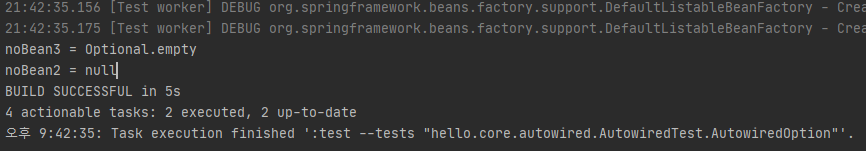
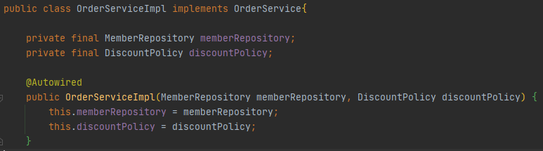

## Table of contents
{: .no_toc .text-delta }

1. TOC
{:toc}
---
## 📌 **다양한 의존관계 주입 방법**

### 의존관계 주입은 크게 4가지 방법이 있다.
- **생성자 주입**
- **수정자 주입(setter 주입)**
- **필드 주입**
- **일반 메서드 주입**

### 생성자 주입
- 이름 그대로 생성자를 통해서 의존 관계를 주입 받는 방법이다.
- 지금까지 우리가 진행했던 방식이 바로 생성자 주입이다.
- 특징
  - 생성자 호출 시점에 딱 1번만 호출 되는것이 보장 된다.
  - **"불변 , 필수"** 의존관계에 사용

```java
@Component
public class OrderServiceImpl implements OrderService{

    private final MemberRepository memberRepository;
    private final DiscountPolicy discountPolicy;

    @Autowired
    public OrderServiceImpl(MemberRepository memberRepository, DiscountPolicy discountPolicy) {
        this.memberRepository = memberRepository;
        this.discountPolicy = discountPolicy;
    }
    ...
```

> ✋ **생성자가 딱 1개만 있으면 `@Autowired`를 생략해도 자동 주입 된다.**
(스프링 빈에만 해당한다)

### 수정자 주입
```java
@Component
public class OrderServiceImpl implements OrderService{

    private MemberRepository memberRepository;
    private DiscountPolicy discountPolicy;

    @Autowired
    public void setMemberRepository(MemberRepository memberRepository) {
        this.memberRepository = memberRepository;
    }
    @Autowired
    public void setDiscountPolicy(DiscountPolicy discountPolicy) {
        this.discountPolicy = discountPolicy;
    }
    ...
```
> ✋ **`@Autowired`를 찾아 주입 하여 준다.**
(`@Autowired`가 없으면 들어오지 않는다.)
`@Autowired`의 기본 동작은 주입할 대상이 없으면 오류가 발생한다.
주입할 대상이 없어도 동작하게 하려면 `@Autowired(required = false)`로 지정하면 된다

### 필드 주입
- 이름 그대로 필드에 바로 주입하는 방법이다.
- 특징
  - 코드가 간결해서 많은 개발자들을 유혹하지만 외부에서 변경이 불가능해서 테스트하기 힘들다는 치명적인 단점이 있다.
  - DI프레임워크가 없으면 아무것도 할 수 없다.
    - 테스트 하기 위해서는 스프링 컨테이너를 같이 올려야 한다 또는 `@SpringBootTest`에서 테스트한다.
  - 애플리케이션의 실제 코드와 관계없는 테스트 코드
- 스프링 설정을 목적으로 하는 `@Configuration` 같은 곳에서만 특별한 용도로 사용

```java
@Component
public class OrderServiceImpl implements OrderService{

    @Autowired private MemberRepository memberRepository;
    @Autowired private DiscountPolicy discountPolicy;


    ...
    @Component
    public class OrderServiceImpl implements OrderService{

        @Autowired private MemberRepository memberRepository;
        @Autowired private DiscountPolicy discountPolicy;


        ...
```
> ✋ **권장되지 않는다.**


### 일반 메서드 주입
- 일반 메서드를 통해서 주입 받을 수 있다.
- 특징
  - 한번에 여러 필드를 주입 받을 수 있다.
  - 일반적으로 잘 사용하지 않는다.
    - (생성자 주입 또는 setter 메서드 주입으로 해결이 다 가능하기 때문에)

```java
@Component
public class OrderServiceImpl implements OrderService{

    private MemberRepository memberRepository;
    private DiscountPolicy discountPolicy;

    @Autowired
    public void init(MemberRepository memberRepository , DiscountPolicy discountPolicy){
        this.memberRepository = memberRepository;
        this.discountPolicy = discountPolicy;
    }

    ...
```
> ✋ 의존관계 자동 주입은 스프링 컨테이너가 관리하는 스프링 빈이어야 동작한다.
스프링 빈이 아닌 Member같은 클래스에서 `@Autowired` 코드를 적용해도 아무 기능도 하지 않는다.

- `MemberRepository`와 `DiscountPolicy`를 잘 보면 `final`이 있는것도 있고 , 없는것도 있다
- 그 이유는 **의존관계가 주입 되는 시점 차이** 때문이다.
- **생성자 주입은 구현체가 스프링 빈에 등록 되기전에 호출 되기 때문에 `final`이 가능 하지만 나머지 의존관계 주입은 구현체가 스프링 빈에 등록 되고 난 후 이기 때문에 `final`을 적용할 수 없다.**

***

## **자동 주입 대상을 옵션으로 처리하는 방법**

주입할 스프링 빈이 없어도 동작해야 할 때가 있다.
**그런데 `@Autowired`만 사용하면 `required` 옵션의 기본값이 `true`로 되어 있어서 자동 주입 대상이 없으면 오류가 발생한다.**

- `@Autowired(required=false)` : 자동 주입할 대상이 없으면 수정자 메서드 자체가 호출 안됨
- `org.springframework.lang.@Nullable` : 자동 주입할 대상이 없으면 null이 입력된다.
  - 스프링 전반적으로 지원된다
- `Optinal<>` : 자동 주입할 대상이 없으면 `Optinal.empty`가 입력된다.

### AutowiredTest.class
```java
public class AutowiredTest {

    @Test
    void AutowiredOption(){
        AnnotationConfigApplicationContext ac =
                          new AnnotationConfigApplicationContext(TestBean.class);
    }

    static class TestBean{

        @Autowired(required=false)
        public void setNoBean1(Member noBean1){
            // 예) 스프링 컨테이너에 관리되는 것이 없을 때
            // Member객체는 스프링 컨테이너에 관리되지 않는것이다.
            System.out.println("noBean1 = " + noBean1);
        }

        @Autowired
        public void setNoBean2(@Nullable Member noBean2){
            System.out.println("noBean2 = " + noBean2);
        }

        @Autowired
        public void setNoBean3(Optional<Member> noBean3){
            System.out.println("noBean3 = " + noBean3);
        }
    }
}
```


***

## 📌 **생성자 주입을 선택해야 하는 이유**
**과거에는 수정자 주입과 필드 주입을 많이 사용했지만 최근에는 스프링을 포함한 DI 프레임워크 대부분이 생성자 주입을 권장한다.**

### "불변"
- 대부분의 의존관계 주입은 한 번 일어나면 애플리케이션 종료 시점까지 의존관계를 변경할 일이 없다.
- 오히려 대부분의 의존관계는 애플리케이션 종료 전 까지 변하면 안된다. (불변 해야한다.)
- 수정자 주입을 사용하면 setXxx 메서드를 public으로 열어두어야한다.
- 누군가 실수로 변경할 수 도 있고 , 변경하면 안되는 메서드를 열어두는 것은 좋은 설계 방법이 아니다.
- 생성자 주입은 객체를 생성할 때 딱 1번만 호출되므로 이후에 호출되는 일이 없다. 따라서 불변하게 설계할 수 있다.

### "누락"
- 프레임 워크 없이 순수한 자바코드를 단위 테스트 하는 경우에
- 다음 과 같이 수정자 의존 관계인 경우

```java
@Component
public class OrderServiceImpl implements OrderService{
    private MemberRepository memberRepository;
    private DiscountPolicy discountPolicy;

    @Autowired
    public void setMemberRepository(MemberRepository memberRepository) {
        this.memberRepository = memberRepository;
    }

    @Autowired
    public void setDiscountPolicy(DiscountPolicy discountPolicy) {
        this.discountPolicy = discountPolicy;
    }
}
```
`@Autowired`가 프레임워크 안에서 동작할 때는 의존관계가 없으면 오류가 발생한다.(**스프링 컨테이너를 실행시켜야 의존관계 주입이 가능하다**)

### "final 키워드"
- 생성자 주입을 사용하면 필드 `final`키워드를 사용할 수 있다.
- 그래서 생성자에서 혹시라도 값이 설정되지 않았을 경우 오류를 컴파일 시점에서 막아준다.

<center><strong>수정자 주입</strong></center>


<center><strong>생성자 주입</strong></center>



### 📌 정리
- 생성자 주입 방식을 선택하는 이유는 여러가지가 있지만 , 프레임워크에 의존하지 않고 , 순수한 자바 언어의 특징을 잘 살리는 방법 이기도 하다.
- 기본으로 생성자 주입을 사용하고 , 필수 값이 아닌 경우에는 수정자 주입 방식을 옵션으로 부여하면 된다.
  - 생성자 주입과 수정자 주입을 동시에 사용할 수 있다.
- **항상 생성자 주입을 선택해라!** 그리고 가끔 옵션이 필요하면 수정자 주입을 선택해라. 필드 주입은 사용하지 않는게 좋다.

***

## **자동 , 수동 스프링 빈 등록의 올바른 실무 운영 기준**

### 편리한 자동 기능을 기본으로 사용하자
- 그러면 어떤 경우에 컴포넌트 스캔과 자동 주입을 사용하고 , 어떤 경우에 설정 정보를 통해서 수동으로 빈을 등록하고 , 의존관계도 수동으로 주입해야 할까?
- 결론부터 이야기하면 , 스프링이 나오고 시간이 갈 수록 점점 자동을 선호하는 추세다.
- 스프링은 `@Component`뿐만 아니라 `@Controller` , `@Service` , `@Repository`처럼 계층에 맞추어 일반적인 애플리케이션 로직을 자동으로 스캔할 수 있도록 지원한다.
- 거기에 더해서 최근 스프링 부트는 컴포넌트 스캔을 기본으로 사용하고 , 스프링 부트의 다양한 스프링 빈들도 조건이 맞으면 자동으로 등록하도록 설계 했다.
- 그리고 **결정적으로 자동 빈 등록을 사용해도 OCP , DIP를 지킬 수 있다.**

### ❓ 그러면 수동 빈 등록은 언제 사용하면 좋을까
- 애플리케이션은 크게 업무 로직과 기술 지원 로직으로 나눌 수 있다.
- **업무 로직 빈**
  - 웹을 지원하는 "Controller" , 핵심 비즈니스 로직이 있는 "Service" , 데이터 계층의 로직을 처리하는 "Repository"등이 모두 업무 로직이다. 보통 비즈니스 요구사항을 개발할 때 추가되거나 변경된다.
- **기술 지원 빈**
  - 기술적인 문제나 **공통 관심사 - AOP**를 처리할 때 주로 사용된다. 데이터베이스 연결이나, 공통 로그 처리 처럼 업무 로직을 지원하기 위한 하부 기술이나 공통 기술들이다.
- **업무 로직**은 숫자도 매우 많고 , 한 번 개발해야 하면 Controller , Service , Repository 처럼 어느정도 유사한 패턴이 있다.
  - **이런 경우 자동 기능을 적극 사용하는 것이 좋다.**
- **기술 지원 로직**은 업무 로직과 비교해서 그 수가 매우 적고 , 보통 애플리케이션 전반에 걸쳐서 광범위하게 영향을 미친다.
  - 업무로직은 문제가 발생 했을 때 어디가 문제인지 명확하게 잘 들어나지만
  - 기술 지원 로직은 적용이 잘 되고 있는지 아닌지 조차 파악하기 어려운 경우가 많다.
  - 그래서 이런 기술 지원 로직들은 가급적 수동 빈 등록을 사용해서 명확하게 들어내는 것이 좋다.

> ✋
> - 애플리케이션에 광범위하게 영향을 미치는 **기술 지원 로직**(객체)는  수동 빈으로 등록해서 딱! 설정 정보에 바로 나타나게 하는 것이 유지보수 하기 좋다.
> - <span style="color:red; font-weight:bold">스프링과 스프링 부트가 자동으로 등록하는 수 많은 빈들은 예외</span>
> - 이런 부분들은 스프링 자체를 잘 이해하고 스프링의 의도대로 잘 사용하는게 중요하다.
> - **스프링 부트의 경우 DataSource 같은 데이터베이스 연결에 사용하는 기술 지원 로직까지 내부에서 자동으로 등록하는데, 이런 부분은 매뉴얼을 잘 참고해서 스프링 부트가 의도한대로 편리하게 사용하면 된다.**
> - 스프링 부트가 아니라 **내가 직접 기술 지원 객체를 스프링 빈으로 등록한다면 수동으로 등록해서 명확하게 들어내는 것이 좋다.**

### 📌 정리
- **기술 지원 로직**(객체)는 한  눈에 딱 볼 수 있게 설정 파일을 따로 만들어 수동 빈 등록을 사용하자.
- 자동 빈 등록은 편리하고 직접 개발 하였으면 한 눈에 보이지만 , 인터페이스에 대한 구현체가 여러개이면 어떤 구현체가 주입되는지 확인할려면 코드를 직접 다 뒤져봐야 한다.
- 수동 빈 등록은 구현체가 여러 개 존재하고 , 클라이언트의 사용 구분 마다 구현체가 달라진다면 수동 빈 등록을 사용하는게 보기 편할 것 같다. (이렇게 하여도 구현체의 메소드는 직접 다 뒤져 봐야할 것 같다.)
