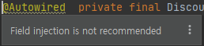

## Table of contents
{: .no_toc .text-delta }

1. TOC
{:toc}
---
## **다양한 의존관계 주입 방법**

### 의존관계 주입은 크게 4가지 방법이 있다.
- **생성자 주입**
- **수정자 주입(setter 주입)**
- **필드 주입**
- **일반 메서드 주입**

### 생성자 주입
- 이름 그대로 생성자를 통해서 의존 관계를 주입 받는 방법이다.
- 지금까지 우리가 진행했던 방식이 바로 생성자 주입이다.
- 특징
  - 생성자 호출 시점에 딱 1번만 호출 되는것이 보장 된다.
  - **"불변 , 필수"** 의존관계에 사용

```java
@Component
public class OrderServiceImpl implements OrderService{

    private final MemberRepository memberRepository;
    private final DiscountPolicy discountPolicy;

    @Autowired
    public OrderServiceImpl(MemberRepository memberRepository, DiscountPolicy discountPolicy) {
        this.memberRepository = memberRepository;
        this.discountPolicy = discountPolicy;
    }
    ...
```

> ✋ **생성자가 딱 1개만 있으면 `@Autowired`를 생략해도 자동 주입 된다.**
(스프링 빈에만 해당한다)

### 수정자 주입
```java
@Component
public class OrderServiceImpl implements OrderService{

    private MemberRepository memberRepository;
    private DiscountPolicy discountPolicy;

    @Autowired
    public void setMemberRepository(MemberRepository memberRepository) {
        this.memberRepository = memberRepository;
    }
    @Autowired
    public void setDiscountPolicy(DiscountPolicy discountPolicy) {
        this.discountPolicy = discountPolicy;
    }
    ...
```
> ✋ **`@Autowired`를 찾아 주입 하여 준다.**
(`@Autowired`가 없으면 들어오지 않는다.)
`@Autowired`의 기본 동작은 주입할 대상이 없으면 오류가 발생한다.
주입할 대상이 없어도 동작하게 하려면 `@Autowired(required = false)`로 지정하면 된다

### 필드 주입
- 이름 그대로 필드에 바로 주입하는 방법이다.
- 특징
  - 코드가 간결해서 많은 개발자들을 유혹하지만 외부에서 변경이 불가능해서 테스트하기 힘들다는 치명적인 단점이 있다.
  - DI프레임워크가 없으면 아무것도 할 수 없다.
    - 테스트 하기 위해서는 스프링 컨테이너를 같이 올려야 한다 또는 `@SpringBootTest`에서 테스트한다.
  - 애플리케이션의 실제 코드와 관계없는 테스트 코드
- 스프링 설정을 목적으로 하는 `@Configuration` 같은 곳에서만 특별한 용도로 사용

```java
@Component
public class OrderServiceImpl implements OrderService{

    @Autowired private MemberRepository memberRepository;
    @Autowired private DiscountPolicy discountPolicy;


    ...
    @Component
    public class OrderServiceImpl implements OrderService{

        @Autowired private MemberRepository memberRepository;
        @Autowired private DiscountPolicy discountPolicy;


        ...
```
> ✋ **권장되지 않는다.**



### 일반 메서드 주입
- 일반 메서드를 통해서 주입 받을 수 있다.
- 특징
  - 한번에 여러 필드를 주입 받을 수 있다.
  - 일반적으로 잘 사용하지 않는다.
    - (생성자 주입 또는 setter 메서드 주입으로 해결이 다 가능하기 때문에)

```java
@Component
public class OrderServiceImpl implements OrderService{

    private MemberRepository memberRepository;
    private DiscountPolicy discountPolicy;

    @Autowired
    public void init(MemberRepository memberRepository , DiscountPolicy discountPolicy){
        this.memberRepository = memberRepository;
        this.discountPolicy = discountPolicy;
    }

    ...
```
> ✋ 의존관계 자동 주입은 스프링 컨테이너가 관리하는 스프링 빈이어야 동작한다.
스프링 빈이 아닌 Member같은 클래스에서 `@Autowired` 코드를 적용해도 아무 기능도 하지 않는다.

- `MemberRepository`와 `DiscountPolicy`를 잘 보면 `final`이 있는것도 있고 , 없는것도 있다
- 그 이유는 **의존관계가 주입 되는 시점 차이** 때문이다.
- **생성자 주입은 구현체가 스프링 빈에 등록 되기전에 호출 되기 때문에 `final`이 가능 하지만 나머지 의존관계 주입은 구현체가 스프링 빈에 등록 되고 난 후 이기 때문에 `final`을 적용할 수 없다.**
