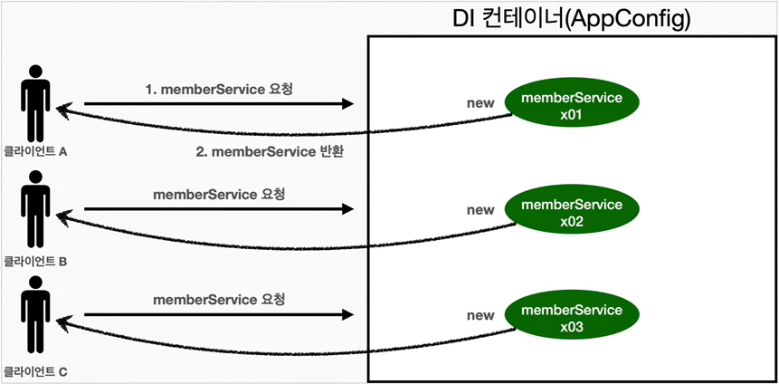
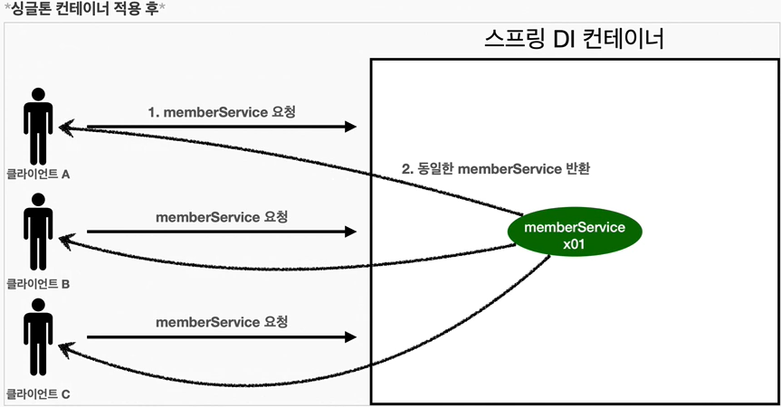
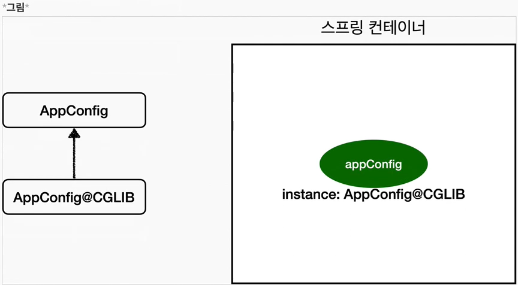

## Table of contents
{: .no_toc .text-delta }

1. TOC
{:toc}
---

## **웹 애플리케이션과 싱글톤 패턴**
### ❓ 왜 웹 어플리케이션에서는 싱글톤이 많이 쓰일까

**웹 어플리케이션은 보통 여러 고객이 동시에 요청을 한다.**


### SingletonTest
```java
public class SingletonTest {

    @Test
    @DisplayName("스프링 없는 순수한 DI 컨테이너")
    void pureContainer(){
        AppConfig appConfig = new AppConfig();

        //1. 조회 : 호출할 때 마다 객체를 생성
        MemberService memberService1 = appConfig.memberService();

        //2. 조회 : 호출할 때 마다 객체를 생성
        MemberService memberService2 = appConfig.memberService();

        //참조값이 다른 것을 확인
        System.out.println("memberService1 - " + memberService1);
        System.out.println("memberService2 - " + memberService2);
//        memberService1 - hello.core.member.MemberServiceImpl@48f2bd5b
//        memberService2 - hello.core.member.MemberServiceImpl@7b2bbc3

        // memberService1 != memberService2
        Assertions.assertThat(memberService1).isNotSameAs(memberService2);
    }
}
```
- 우리가 만들었던 스프링 없는 순수한 DI컨테이너인 AppConfig는 요청을 할 때 마다 객체를 새로 생성한다.
- 고객 트래픽이 초당 100이 나오면 초당 100개 객체가 생성되고 소멸된다
- 해결방안은 **해당 객체가 딱 1개만 생성되고 공유하도록 설계하면 된다.**

***

## **싱글톤 패턴**

- **클래스의 인스턴스가 딱 1개만 생성되는 것을 보장하는 디자인 패턴이다.**
- 그래서 객체 인스턴스를 2개 이상 생성하지 못하도록 막아야 한다.
- **private 생성자를 사용해서 외부에서 임의로 new 키워드를 사용하지 못하도록 막아야 한다.**

### SingletonService
```java
public class SingletonService {

    // 1. static영역에 객체를 딱 1개만 생성해둔다.
    private static final SingletonService instance = new SingletonService();

    // 2. public으로 열어서 객체 인스턴스가 필요하면 이 static메서드를 통해서만 조회하도록 허용한다.
    public static SingletonService getInstance(){
        return instance;
    }

    // 3. 생성자를 private로 선언하여 외부에서 new 키워드를 사용한 객체를 생성하지 못하도록 한다.
    private SingletonService(){
    }

    public void logic(){
        System.out.println("싱글톤 객체 로직 호출");
    }
}
```
- 싱글톤 패턴을 구현하는 방법은 여러가지가 있다. 여기서는 객체를 미리 생성해두는 가장 단순하고 안전한 방법을 선택했다.
- 싱글톤 패턴을 적용하면 고객의 요청이 올 때 마다 객체를 생성하는 것이 아니라 , 이미 만들어진  객체를 공유해서 효율적으로 사용할 수 있다.
- 하지만 **싱글톤 패턴은 다음과 같은 수 많은 문제점들을 가지고 있다.**

### SingletonServiceTest
```java
@Test
@DisplayName("싱글톤 패턴을 적용한 객체 사용")
void singletonServiceTest(){
    SingletonService singletonService1 = SingletonService.getInstance();
    SingletonService singletonService2 = SingletonService.getInstance();

    System.out.println("singletonService1 - " + singletonService1);
    System.out.println("singletonService2 - " + singletonService2);
//        singletonService1 - hello.core.singleton.SingletonService@7c7b252e
//        singletonService2 - hello.core.singleton.SingletonService@7c7b252e

    // isSameAs  : ==
    // isEqualTo : .equals()
    Assertions.assertThat(singletonService1).isSameAs(singletonService2);
}
```

### 🚨 싱글톤 문제점
1. 싱글톤 패턴을 구현하는 코드 자체가 많이 들어간다.
1. **의존관계상 클라이언트가 구체 클래스에 의존한다  -> DIP를 위반**
1. 클라이언트가 구체 클래스에 의존해서 OCP 원칙을 위반할 가능성이 높다.
테스트하기 어렵다.
1. 내부 속성을 변경하거나 초기화 하기 어렵다.
1. private 생성자로 자식 클래스를 만들기 어렵다.
1. 결론적으로 유연성이 떨어진다. (**안티패턴**으로 불리기도 한다.)

***

## **싱글톤 컨테이너**

### 📌 스프링 컨테이너는 싱글톤 패턴의 문제점을 해결한다.

- **스프링 컨테이너는 싱글톤 패턴의 문제점을 해결하면서 ,객체 인스턴스를 싱글톤(1개만 생성)으로 관리한다.**
- 스프링 컨테이너는 싱글톤 패턴을 적용하지 않아도 , 객체 인스턴스를 싱글톤으로 관리한다
  - 이전에 설명한 컨테이너 생성 과정을 자세히 보자 , 컨테이너는 객체를 하나만 생성해서 관리한다.
- **스프링 컨테이너는 싱글톤 컨테이너 역할을 한다.** 이렇게 싱글톤 객체를 생성하고 관리하는 기능을 **싱글톤 레지스트리**라 한다.
- 스프링 컨테이너의 이런 기능 덕분에 **싱글톤 패턴의 모든 단점을 해결하면서 싱글톤으로 유지할 수 있다.**
  - 싱글톤 패턴을 위한 지저분한 코드가 들어가지 않아도 된다.
  - DIP , OCP , 테스트 , private 생성자로 부터 자유롭게 싱글톤을 사용할 수 있다.

### AppConfig.class
```java
@Configuration      // 애플리케이션의 설정 정보
public class AppConfig {

    @Bean   // 스프링 컨테이너에 등록된다.
    public MemberRepository memberRepository() {
        return new MemoryMemberRepository();
    }

    @Bean
    public DiscountPolicy discountPolicy(){
        //return new FixDiscountPolicy();
        return new RateDiscountPolicy();
    }

    @Bean
    public MemberService memberService(){
        return new MemberServiceImpl(memberRepository());
    }

    @Bean
    public OrderService orderService(){
        return new OrderServiceImpl(memberRepository(), discountPolicy());
    }
}
```

### SpringContainerTest
```java
@Test
@DisplayName("스프링 컨테이너와 싱글톤")
void springContainer(){

    AnnotationConfigApplicationContext ac =
                    new AnnotationConfigApplicationContext(AppConfig.class);

    //1. 조회 : 호출할 때 마다 객체를 생성
    MemberService memberService1 = ac.getBean("memberService" , MemberService.class);

    //2. 조회 : 호출할 때 마다 객체를 생성
    MemberService memberService2 = ac.getBean("memberService" , MemberService.class);

    //참조값 확인
    System.out.println("memberService1 - " + memberService1);
    System.out.println("memberService2 - " + memberService2);
//        memberService1 - hello.core.member.MemberServiceImpl@66fdec9
//        memberService2 - hello.core.member.MemberServiceImpl@66fdec9

    // memberService1 == memberService2
    Assertions.assertThat(memberService1).isSameAs(memberService2);
}
```

### 📌 싱글톤 컨테이너 적용 후

- 스프링의 기본 빈 등록 방식은 싱글톤이지만 , 싱글톤 방식만 지원하는 것은 아니다. 요청할 때 마다 새로운 객체를 생성해서 반환하는 기능도 제공한다. [빈 스코프 참고]

***

## ❗ **싱글톤 방식의 주의점**
1. 싱글톤 패턴이든 , 스프링 같은 싱글톤 컨테이너를 사용하든 , **객체 인스턴스를 하나만 생성해서 공유하는 싱글톤 방식은 여러 클라이언트가 하나의 같은 객체 인스턴스를 공유하기 때문에** 싱글톤 객체는 상태를 유지(stateful)하게 설계하면 안된다.
1. **무상태(stateless)로 설계해야 한다.**
    - 특정 클라이언트에 의존적인 필드가 있으면 안된다.
    - 특정 클라이언트가 값을 변경할 수 있는 필드가 있으면 안된다.
    - 가급적 읽기만 가능해야 한다.
    - 필드 대신에 자바에서 공유되지 않는 , 지역변수 , 파라미터 , ThreadLocal등을 사용해야 한다.
1. 스프링 빈의 필드에 공유 값을 설정하면 정말 큰 장애가 발생할 수 있다.

### StatefulService
```java
public class StatefulService {

    private int price;  // 상태를 유지하는 필드

    public void order(String name , int price){
        System.out.println("name = " + name + " price = " + price);
        this.price = price;     // 여기가 문제!
    }

    public int getPrice(){
        return price;
    }
}
```

### StatefulServiceTest
```java
public class StatefulServiceTest {

    @Test
    void statefulServiceSingleton(){
        ApplicationContext ac = new AnnotationConfigApplicationContext(TestConfig.class);
        StatefulService statefulService1 = ac.getBean(StatefulService.class);
        StatefulService statefulService2 = ac.getBean(StatefulService.class);

        //Thread A : A사용자 10000원 주문
        statefulService1.order("userA" , 10000);
        //Thread B : B사용자 20000원 주문
        statefulService2.order("userB" , 20000);

        //Thread A : 사용자A 주문 금액 조회
        int price = statefulService1.getPrice();
        System.out.println("price = " + price);

        Assertions.assertThat(statefulService1.getPrice()).isEqualTo(20000);
    }

    static class TestConfig{
        @Bean
        public StatefulService statefulService(){
            return new StatefulService();
        }
    }
}
```
- 실제 쓰레드는 사용하지 않았다.
- StatefulService의 price필드는 공유되는 필드인데 , 특정 클라이언트가 값을 변경한다.
- **진짜 공유필드는 조심해야 한다! 무상태(stateless)로 설계해야 한다.**

***

## **@Configuration과 싱글톤**

### AppConfig.java
```java
@Configuration      // 애플리케이션의 설정 정보
public class AppConfig {

    @Bean   // 스프링 컨테이너에 등록된다.
    public MemberRepository memberRepository() {
        System.out.println("call AppConfig.memberRepository");
        return new MemoryMemberRepository();
    }

    @Bean
    public DiscountPolicy discountPolicy(){
        //return new FixDiscountPolicy();
        return new RateDiscountPolicy();
    }

    @Bean
    public MemberService memberService(){
        System.out.println("call AppConfig.memberService");
        return new MemberServiceImpl(memberRepository());
    }

    @Bean
    public OrderService orderService(){
        System.out.println("call AppConfig.orderService");
        return new OrderServiceImpl(memberRepository(), discountPolicy());
    }
}
```
✅**로직상으로는 call AppConfig.memberRepository 3번 호출 되어야 하지만 , 1번만 호출된다.**
- memberService빈을 만드는 코드를 보면 memberRepository()를 호출한다
  - 이 메서드를 호출하면 new MemoryMemberRepository()를 호출한다.
- orderService빈을 만드는 코드도 동일하게 memberRepository()를 호출한다.
  - 이 메서드를 호출하면 new MemoryMemberRepository()를 호출한다.

✅**결과적으로 각각 다른 2개의 MemoryMemberRepository()가 생성되면서 싱글톤이 깨지는 것 처럼 보인다. 스프링 컨테이너는 이 문제를 어떻게 해결할까?**

### @Configuration은 싱글톤을 위해 존재한다.
```java
// MemberServiceImpl , OrderServiceImpl 테스트 용도로
// 각각 주입 된 memberRepository를 반환 하는 메소드 추가
public MemberRepository getMemberRepository(){
    return memberRepository;
}
```
### 📌 ConfigurationSingletonTest
```java
public class ConfigurationSingletonTest {

    @Test
    void configurationTest(){
        AnnotationConfigApplicationContext ac =
                      new AnnotationConfigApplicationContext(AppConfig.class);

        MemberServiceImpl memberService = ac.getBean("memberService", MemberServiceImpl.class);
        OrderServiceImpl orderService = ac.getBean("orderService", OrderServiceImpl.class);

        MemberRepository memberRepository1 = memberService.getMemberRepository();
        MemberRepository memberRepository2 = orderService.getMemberRepository();
        MemberRepository memberRepository3 = ac.getBean("memberRepository", MemberRepository.class);

        System.out.println("memberService -> MemberRepository = " + memberRepository1);
        System.out.println("orderService -> MemberRepository = " + memberRepository2);
        System.out.println("memberRepository = " + memberRepository3);
//        memberService -> MemberRepository = hello.core.member.MemoryMemberRepository@37091312
//        orderService -> MemberRepository = hello.core.member.MemoryMemberRepository@37091312
//        memberRepository = hello.core.member.MemoryMemberRepository@37091312

        Assertions.assertThat(memberService.getMemberRepository()).isSameAs(memberRepository3);
        Assertions.assertThat(orderService.getMemberRepository()).isSameAs(memberRepository3);
    }
}
```
***

## **@Configuration과 바이트코드 조작의 마법**
- 스프링 컨테이너는 싱글톤 레지스트리다. 따라서 스프링 빈이 싱글톤이 되도록 보장해주어야 한다.
- 그런데 스프링이 자바 코드 까지 어떻게 하기는 어렵다. 그래서 **스프링은 클래스의 바이트코드를 조작하는 라이브러리를 사용한다.**

### AppConfig 스프링 빈을 조회해서 클래스 정보를 출력
```java
AnnotationConfigApplicationContext ac =
                    new AnnotationConfigApplicationContext(AppConfig.class);
        AppConfig bean = ac.getBean(AppConfig.class);
        System.out.println("appConfig = " + bean.getClass());
        //appConfig = class hello.core.AppConfig$$EnhancerBySpringCGLIB$$ba528fbb
```
- 순수한 클래스라면 class hello.core.AppConfig가 나와야 한다.
- 그런데 예상과는 다르게 클래스 명에 `$$EnhancerBySpringCGLIB$$`가 붙어있다.
- **이것은 내가 만든 클래스가 아니라 스프링이 CGLIB라는 바이트 코드 조작 라이브러리를 사용해서 AppConfig클래스를 상속받은 임의의 다른 클래스를 만들고 , 그 다른 클래스를 스프링 빈으로 등록한 것이다.**
- **AppConfig@CGLIB는 AppConfig의 자식 타입** 이므로 , AppConfig타입으로 조회할 수 있다.



### @Configuration을 적용하지 않고 , @Bean만 적용하면 어떻게 될까?
- **`@Configuration`를 붙이면 바이트코드를 조작하는 CGLIB기술을 사용해서 싱글톤을 보장**하지만 만약 **`@Bean`만 적용하면 스프링 빈으로 등록 되지만 객체가 반복 호출 되어 싱글톤이 깨져버린다.**

```
call AppConfig.memberRepository
call AppConfig.memberService
call AppConfig.memberRepository
call AppConfig.orderService
call AppConfig.memberRepository


memberService -> MemberRepository = hello.core.member.MemoryMemberRepository@51fadaff
orderService -> MemberRepository = hello.core.member.MemoryMemberRepository@401f7633
memberRepository = hello.core.member.MemoryMemberRepository@31ff43be
```
### 📌 스프링 설정 정보는 항상 @Configuration을 사용하자
