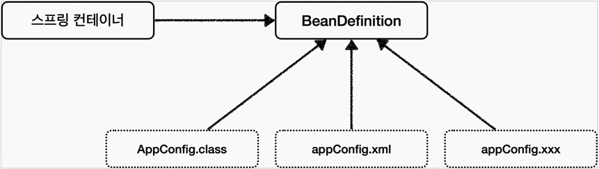
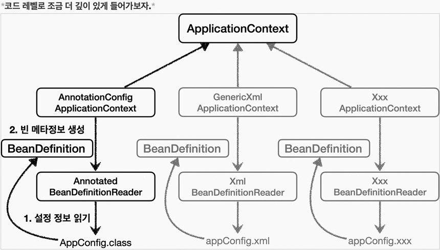

## Table of contents
{: .no_toc .text-delta }

1. TOC
{:toc}
---
## **BeanDefinition**
-   스프링은 어떻게 이런 다양한 설정 형식을 지원하는 것일까? **그 중심에는 BeanDefinition이라는 추상화가 있다**
-   쉽게 이야기해서 **역할과 구현을 개념적으로 나눈것** 이다.
    -   XML을 읽어서 BeanDefinition을 만들면 된다.
    -   자바 코드를 읽어서 BeanDefinition을 만들면 된다.
    -   스프링 컨테이너는 자바 코드인지 , XML인지 몰라도 된다. 오직 BeanDefinition만 알면 된다.
-   **BeanDefinition을 빈 설정 메타 정보라 한다.**
    -   `@Bean` , `<bean>` 당 각각 하나씩 메타정보가 생성된다
-   스프링 컨테이너는 이 메타정보를 기반으로 스프링 빈을 생성한다.



`AnnotationConfigApplicationContext는 AnnotatedBeanDefinitionReader를 사용해서 AppConfig를 사용해서 읽고 BeanDefinition을 생성한다.`

* * *
### **BeanDefinition 정보**

-   BeanClassName : 생성할 빈의 클래스 명 (자바 설정 처럼 팩토리 역할의 빈을 사용하면 없음)
-   factoryBeanName : 팩토리 역할의 빈을 사용할 경우 이름 (예 : **appConfig**)
-   factoryMethodName : 빈을 생성할 팩토리 메서드 지정 (예 : memberService)
-   Scope : 싱글톤 (기본값)
-   lazyInit : 스프링 컨테이너를 생성할 때 빈을 생성하는 것이 아니라 , 실제 빈을 사용할 때 까지 최대한 생성을 지연처리 하는지 여부
-   InitMethodName : 빈을 생성하고 , 의존관계를 적용한 뒤에 호출되는 초기화 메서드 명
-   DestoryMethodName : 빈의 생명주기가 끝나서 제거하기 직전에 호출되는 메서드 명
-   Constructor arguments , Properties : 의존관계 주입에서 사용한다 (자바 설정 처럼 팩토리 역할의 빈을 사용하면 없음)


### **BeanDefinitionTest**
```java
public class BeanDefinitionTest {

    AnnotationConfigApplicationContext ac = new AnnotationConfigApplicationContext(AppConfig .class);

    @Test
    @DisplayName("빈 설정 메타정보 확인")
    void findApplicationBean(){
        String[] definitionNames = ac.getBeanDefinitionNames();
        for (String definitionName : definitionNames) {
            BeanDefinition beanDefinition = ac.getBeanDefinition(definitionName);
            if(beanDefinition.getRole() == beanDefinition.ROLE_APPLICATION){
                System.out.println("beanDefinitionName = " + definitionName + "\n" +
                                   "beanDefinition : " + beanDefinition);
            }
        }
    }
}
```
### **출력**
```
beanDefinitionName = appConfig
beanDefinition :
Generic bean: class [hello.core.AppConfig$$EnhancerBySpringCGLIB$$36404936];
scope=singleton; abstract=false; lazyInit=null; autowireMode=0; dependencyCheck=0;
autowireCandidate=true; primary=false; factoryBeanName=null; factoryMethodName=null;
initMethodName=null; destroyMethodName=null

beanDefinitionName = memberRepository
beanDefinition : Root bean: class [null];
scope=; abstract=false; lazyInit=null; autowireMode=3; dependencyCheck=0;
autowireCandidate=true; primary=false; factoryBeanName=appConfig;
factoryMethodName=memberRepository; initMethodName=null; destroyMethodName=(inferred);
defined in hello.core.AppConfig

beanDefinitionName = discountPolicy
beanDefinition : Root bean: class [null];
scope=; abstract=false; lazyInit=null; autowireMode=3; dependencyCheck=0;
autowireCandidate=true; primary=false; factoryBeanName=appConfig;
factoryMethodName=discountPolicy; initMethodName=null; destroyMethodName=(inferred);
defined in hello.core.AppConfig

beanDefinitionName = memberService
beanDefinition : Root bean: class [null];
scope=; abstract=false; lazyInit=null; autowireMode=3; dependencyCheck=0;
autowireCandidate=true; primary=false; factoryBeanName=appConfig;
factoryMethodName=memberService; initMethodName=null; destroyMethodName=(inferred);
defined in hello.core.AppConfig

beanDefinitionName = orderService
beanDefinition : Root bean: class [null];
scope=; abstract=false; lazyInit=null; autowireMode=3; dependencyCheck=0;
autowireCandidate=true; primary=false; factoryBeanName=appConfig;
factoryMethodName=orderService; initMethodName=null; destroyMethodName=(inferred);
defined in hello.core.AppConfig
```

### 📌 **정리**

-   **BeanDefinition을 직접 생성해서 스프링 컨테이너에 등록할 수 도 있다. 하지만 실무에서 BeanDefinition을 직접 정의하거나 사용할 일은 거의 없다.**
-   BeanDefinition에 대해서는 너무 깊이 있게 이해하기 보다는 , **스프링이 다양한 형태의 설정 정보를 BeanDefinition으로 추상화 해서 사용하는 것 정도만 이해하면 된다.**
-   가끔 스프링 코드나 스프링 관련 오픈 소스의 코드를 볼 때 , BeanDefinition이라는 것이 보일 때가 있다. 이때 이러한 메커니즘을 떠올리면 된다.
