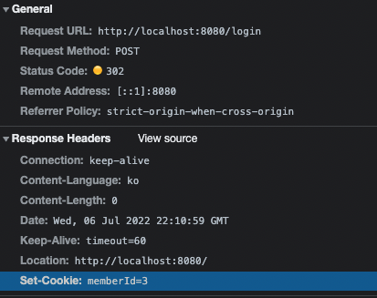
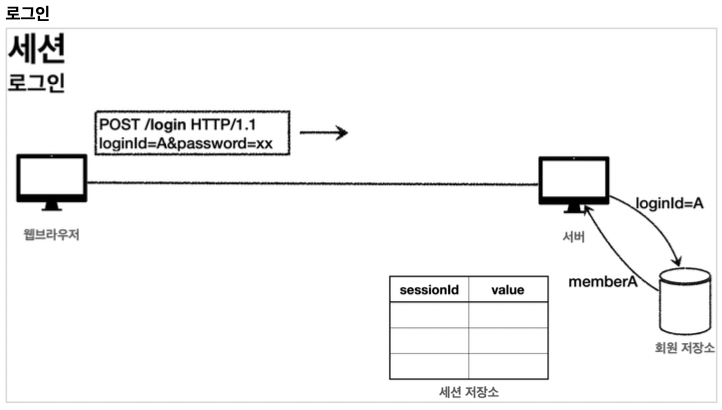
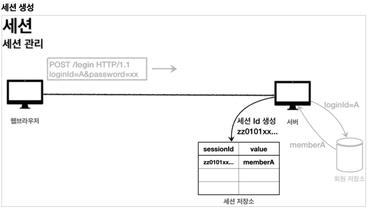
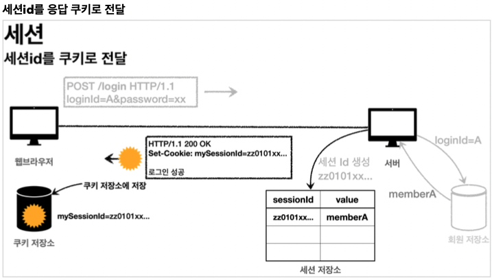
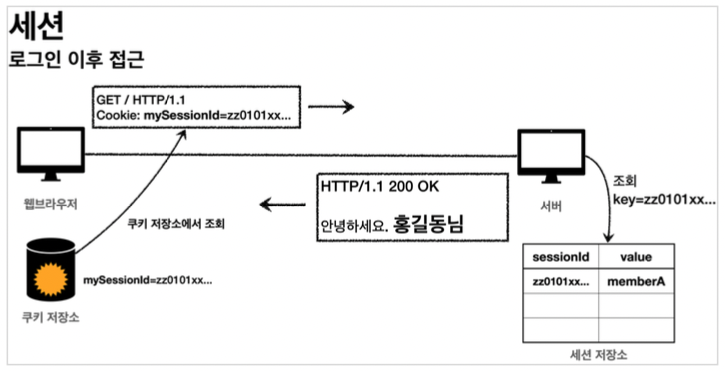
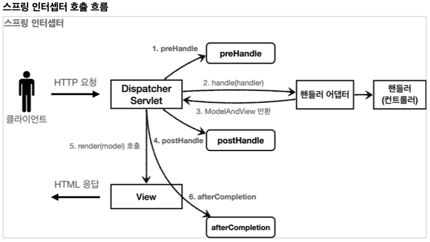
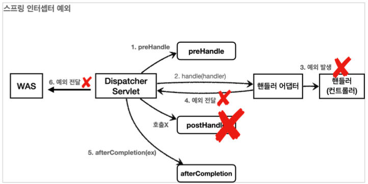

{: .no_toc }

<details open markdown="block">
  <summary>
    Table of contents
  </summary>
  {: .text-delta }
1. TOC
{:toc}
</details>

---


# 하이버네이트 Validator 관련 링크
## [공식 사이트](http://hibernate.org/validator/)
## [공식 메뉴얼](https://docs.jboss.org/hibernate/validator/6.2/reference/en-US/html_single/)
## [📌 검증 애노테이션 모음](https://docs.jboss.org/hibernate/validator/6.2/reference/en-US/html_single/#validator-defineconstraints-spec)

# 스프링 인터셉터
## [PathPattern 공식문서](https://docs.spring.io/spring-framework/docs/current/javadoc-api/org/springframework/web/util/pattern/PathPattern.html)

# **메세지 → 국제화**
- **HTTP `accept-language`**헤더 값을 사용하거나 , **사용자가 직접 언어를 선택하도록 하고 쿠키를 사용**해서 처리할 수 있다 
- **상품명**이라는 이름을 **상품이름**으로 바꿔야한다면??
- 하드코딩된 이름들을 직접 다 수정해줘야한다
- 이런 **다양한 메세지를 한 곳에서 관리하도록 하는 기능을 메세지 기능이라 한다**
- `국제화`는 메세지에서 한 발 더 나아가 각 나라별로 메세지를 관리하는 것이다
- **스프링은 기본적으로 메세지와 국제화 기능을 제공한다**


## [스프링 메세지 소스 설정](https://github.com/jdalma/spring-message/pull/1/commits/1632e0b96d67d4970fdf638713cd312a0d0cea51)

```java
@Bean
public MessageSource messageSource() {
    ResourceBundleMessageSource messageSource = new ResourceBundleMessageSource();
    messageSource.setBasenames("messages", "errors");
    messageSource.setDefaultEncoding("utf-8");
    return messageSource;
}
```

- **basenames** : 설정 파일의 이름을 지정한다
  - `messages` 로 지정하면 **messages.properties** 파일을 읽어서 사용한다
    - 추가로 국제화 기능을 적용하려면 **messages_en.properties** , **messages_ko.properties** 와 같이 파일명 마지막에 언어 정보를 주면된다
  - 만약 찾을 수 있는 국제화 파일이 없으면 **messages.properties (언어정보가 없는 파일명)**를 기본으로 사용한다
  - **파일의 위치**는 `/resources/messages.properties` 에 두면 된다
  - 여러 파일을 한번에 지정할 수 있다
  - 여기서는 messages , errors 둘을 지정했다. 
- **defaultEncoding** : 인코딩 정보를 지정한다 (`utf-8` 을 사용하면 된다)

<br>

- 스프링이 제공하는 *(interface)* `MessageSource`의 구현체인 `ResourceBundleMessageService`를 스프링 빈으로 등록하면 된다
  - *스프링 부트를 사용하면 자동으로 `MessageSource`를 빈으로 등록한다*
  - *스프링 부트의 기본 값 **application.properties** `spring.messages.basename=messages`*
- `MessageSource` 를 스프링 빈으로 등록하지 않고, 스프링 부트와 관련된 별도의 설정을 하지 않으면 **messages 라는 이름으로 기본 등록된다**
- 따라서 `messages_en.properties` , `messages_ko.properties` , `messages.properties` **파일만 등록하면 자동으로 인식된다**

```java
public interface MessageSource {
	@Nullable
	String getMessage(String code, @Nullable Object[] args, @Nullable String defaultMessage, Locale locale);

	String getMessage(String code, @Nullable Object[] args, Locale locale) throws NoSuchMessageException;

	String getMessage(MessageSourceResolvable resolvable, Locale locale) throws NoSuchMessageException;
}
```

```java
@SpringBootTest
public class MessageSourceTest {

    @Autowired
    MessageSource ms;

    @Test
    void 메세지(){
        // locale 정보가 없으니 `message.properties`를 참조한다
        String result = ms.getMessage("hello", null, null);
        Assertions.assertThat(result).isEqualTo("안녕");
    }

    @Test
    void 없는_메세지_예외(){
        // `message.properties`에 없는 메세지를 불러올 때 예외 테스트
        Assertions.assertThatThrownBy(() -> ms.getMessage("Exception Test" , null , null))
                    .isInstanceOf(NoSuchMessageException.class);
    }

    @Test
    void 기본_메세지(){
        String result = ms.getMessage("Exception Test" , null , "기본 메세지" , null);
        Assertions.assertThat(result).isEqualTo("기본 메세지");
    }

    @Test
    void 인자_메세지(){
        String message = ms.getMessage("hello.name", new Object[]{"Spring"}, null);
        Assertions.assertThat(message).isEqualTo("안녕 Spring");
    }

    @Test
    void 국제화_기본언어(){
        Assertions.assertThat(ms.getMessage("hello" , null , null)).isEqualTo("안녕");
        Assertions.assertThat(ms.getMessage("hello" , null , Locale.KOREA)).isEqualTo("안녕");
    }

    @Test
    void 국제화_영어(){
        Assertions.assertThat(ms.getMessage("hello" , null , Locale.ENGLISH)).isEqualTo("hello");
    }
}

```

## [타임리프로 스프링 메세지 적용](https://github.com/jdalma/spring-message/pull/1/commits/243710e69a462e73c556c557324c9e7a9acd5177)

- `#{label.item}`

```html
<h2 th:text="#{page.addItem}">상품 등록 폼</h2>
```

- 파라미터는 다음과 같이 사용할 수 있다

```html
hello.name=안녕 {0}
<p th:text="#{hello.name(${item.itemName})}"></p>
```

## [국제화 적용](https://github.com/jdalma/spring-message/pull/1/commits/c8052b4ff77a0c95fb933fecb13b6fb6346df242)
- `message_en.properties` 파일 추가
- 크롬 브라우저 ➔ 설정 ➔ 언어를 검색하고, 우선 순위를 변경하면 된다.
- **locale**정보를 알아야 선택할 수 있다 

### `LocaleResolver`

```java
public interface LocaleResolver {
    Locale resolveLocale(HttpServletRequest request);
    void setLocale(HttpServletRequest request, @Nullable HttpServletResponse response, @Nullable Locale locale);
}
```

- **LocaleResolver** `interface`
  - 스프링은 Locale 선택 방식을 변경할 수 있도록 LocaleResolver 라는 인터페이스를 제공하는데, 스프링 부트는 기본으로 `Accept-Language` 를 활용하는 **AcceptHeaderLocaleResolver** 를 사용한다
  - 만약 Locale 선택 방식을 변경하려면 LocaleResolver 의 구현체를 변경해서 **쿠키나 세션 기반의 Locale 선택 기능을 사용할 수 있다**
    - *예를 들어서 고객이 직접 Locale 을 선택하도록*
    - *관련해서 LocaleResolver 를 검색하면 수 많은 예제가 나오니 필요한 분들은 참고하자*

***

# **검증**

- **컨트롤러의 중요한 역할중 하나는 HTTP 요청이 정상인지 검증하는 것이다**

## [Version 1. 직접 검증을 구현](https://github.com/jdalma/spring-validation/pull/1/commits/b0bccd9a16fe7dfa280d9f99adf0105c4fa25791)

```java
// 검증 오류 결과를 보관
Map<String , String> errors = new HashMap<>();

// 검증 로직
if(!StringUtils.hasText(item.getItemName())){
    errors.put("itemName" , "상품 이름은 필수입니다.");
}
...

// 검증에 실패하면 다시 입력 폼으로
if(!errors.isEmpty()){
    log.info("errors = {}" , errors);
    model.addAttribute("errors" , errors);
    return "validation/v1/addForm";
}

// 성공 로직
...
```

- `${errors?.containsKey('key')}` , `${errors['key']}` , `th:class` 

```html
<form action="item.html" th:action th:object="${item}" method="post">
  <div th:if="${errors?.containsKey('globalError')}">
      <p class="field-error" th:text="${errors['globalError']}">전체 오류 메세지</p>
  </div>

  <div>
      <label for="itemName" th:text="#{label.item.itemName}">상품명</label>
      <input type="text"
              id="itemName"
              th:field="*{itemName}"
              class="form-control"
              th:class="${errors?.containsKey('itemName')} ? 'form-control field-error' : 'form-control'"
              placeholder="이름을 입력하세요">
      <div class="field-error" th:if="${errors?.containsKey('itemName')}" th:text="${errors['itemName']}">
          아이템 검증
      </div>
  </div>
  ...
```

- 직접 개발하면 아래와 같은 단점이 있다
  - **뷰 템플릿에서 중복 처리가 많다**
  - **타입 오류 처리가 안된다** 
    - `Item` 의 `price` , `quantity` 같은 숫자 필드는 **숫자 타입에 문자가 들어오면 오류가 발생한다** 
    - *그런데 이러한 오류는 스프링MVC에서 컨트롤러에 진입하기도 전에 예외가 발생하기 때문에, 컨트롤러가 호출되지도 않고,* 
    - *400 예외가 발생하면서 오류 페이지를 띄워준다*
  - 결국 문자는 바인딩이 불가능하므로 고객이 입력한 문자가 사라지게 되고, 고객은 본인이 어떤 내용을 입력해서 오류가 발생했는지 이해하기 어렵다

## [Version 2. **BindingResult**](https://github.com/jdalma/spring-validation/pull/1/commits/6fe09180d3f3c0ec9b450abddc2f74c450659b60) , [사용자 입력 값 유지](https://github.com/jdalma/spring-validation/pull/1/commits/1362e6094d9672de4531be2c22c1a7d776d19d53)

```java
  public interface BindingResult extends Errors
```

**스프링이 제공하는 검증 오류를 보관하는 객체이며 , `Model`에 자동 포함 된다**<br>
검증 오류가 발생하면 여기에 보관하면 된다<br>
`BindingResult` 가 있으면 **@ModelAttribute 에 데이터 바인딩 시 오류가 발생해도 컨트롤러가 호출된다!**<br>
- `BindingResult` 는 검증할 대상 바로 다음에 와야한다 
- `@ModelAttribute Item item` , 바로 다음에 `BindingResult` 가 와야 한다
<br>

**@ModelAttribute에 바인딩 시 타입 오류가 발생하면?**<br>
  - BindingResult 가 없으면 400 오류가 발생하면서 컨트롤러가 호출되지 않고, 오류 페이지로 이동한다
  - BindingResult 가 있으면 오류 정보( FieldError )를 BindingResult 에 담아서 컨트롤러를 정상 호출한다

<br>

`BindingResult`에 검증 오류를 적용하는 **3가지 방법**<br>
  1. `@ModelAttribute` 의 객체에 타입 오류 등으로 **바인딩이 실패하는 경우 스프링이 FieldError 생성해서 BindingResult 에 넣어준다**
  2. 개발자가 직접 넣어준다
  3. `Validator`사용 🚩

<br>

- **타임리프의 사용자 입력 값 유지**
  - `th:field="*{price}"`
  - 정상 상황에는 모델 객체의 값을 사용하지만, 오류가 발생하면 `FieldError` 에서 보관한 값을 사용해서 값을 출력한다
- **스프링의 바인딩 오류 처리**
  - 타입 오류로 바인딩에 실패하면 스프링은 `FieldError` 를 생성하면서 사용자가 입력한 값을 넣어둔다 
  - 그리고 **해당 오류를 BindingResult 에 담아서 컨트롤러를 호출한다** 
  - 따라서 타입 오류 같은 바인딩 실패시에도 사용자의 오류 메시지를 정상 출력할 수 있다

- `new FieldError( {objectName} , {field} , {defaultMessage} )`
  - **FieldError** 는 오류 발생시 사용자 입력 값을 저장하는 기능을 제공한다
  - **objectName** : `@ModelAttribute` 이름
  - **field** : 오류가 발생한 필드 이름
  - **defaultMessage** : 오류 기본 메시지
- `new ObjectError( {objectName} , {defaultMessage} )`
  - 특정 필드를 넘어서는 오류
  - **objectName** : `@ModelAttribute` 의 이름
  - **defaultMessage** : 오류 기본 메시지


```java
@PostMapping("/add")
    public String addItemV1(@ModelAttribute Item item, BindingResult bindingResult , RedirectAttributes redirectAttributes , Model model) {

        // 검증 로직
        if(!StringUtils.hasText(item.getItemName())){
            bindingResult.addError(new FieldError("item" , "itemName" , "상품 이름은 필수입니다."));
        }

        // 특정 필드가 아닌 복합 룰 검증
        if(item.getPrice() != null && item.getQuantity() != null){
            int resultPrice = item.getPrice() * item.getQuantity();
            if(resultPrice < 10000){
                bindingResult.addError(new ObjectError("item" , "가격 * 수량의 합 에러 : " + resultPrice));
            }
        }

        // 검증에 실패하면 다시 입력 폼으로
        if(bindingResult.hasErrors()){
            log.info("bindingResult = {}" , bindingResult);
            return "validation/v2/addForm";
        }

        // 성공 로직
        ...
    }
```

```html
<div th:if="${#fields.hasGlobalErrors()}">
  <p class="field-error" th:each="err : ${#fields.globalErrors()}" th:text="${err}">글로벌 오류 메세지</p>
</div>
<input type="text"
      id="itemName"
      th:field="*{itemName}" 
      class="form-control"
      th:errorClass="field-error"
      placeholder="이름을 입력하세요">
<div class="field-error" th:errors="*{itemName}"> <!-- new FieldError로 추가한 필드 이름 -->
  아이템 검증
</div>
```

- `th:field`에 **필드 이름이 이미 지정되어 있다** 
  - **BindingResult에 자신의 필드가 있다면 `field-error`를 클래스에 추가한다**

- 타임리프는 스프링의 **BindingResult** 를 활용해서 편리하게 검증 오류를 표현하는 기능을 제공한다
  1. `#fields`로 **BindingResult 가 제공하는 검증 오류에 접근할 수 있다**
  2. `th:errors` 해당 필드에 오류가 있는 경우에 태그를 출력한다 (*th:if 편의 버전*)
  3. `th:errorclass`는 `th:field` 에서 **지정한 필드에 오류가 있으면 class 정보를 추가한다**

## [Version 3. `FieldError()` , `ObjectError()`](https://github.com/jdalma/spring-validation/pull/1/commits/95f74ed200ae2a0b313f980f780980cc59d1d5ef)

```java
public FieldError(String objectName, String field, String defaultMessage);
public FieldError(String objectName, String field, @Nullable Object rejectedValue, boolean bindingFailure, @Nullable String[] codes, @Nullable Object[] arguments, @Nullable String defaultMessage)
```

- **objectName** : 오류가 발생한 객체 이름
- **field** : 오류 필드
- **rejectedValue** : 사용자가 입력한 값(거절된 값)
- **bindingFailure** : 타입 오류 같은 바인딩 실패인지, 검증 실패인지 구분 값 
- **codes** : 메시지 코드
  -  `required.item.itemName` 를 사용해서 메시지 코드를 지정한다 
  -  메시지 코드는 하나가 아니라 배열로 여러 값을 전달할 수 있는데, 순서대로 매칭해서 처음 매칭되는 메시지가 사용된다.
- **arguments** : 메시지에서 사용하는 인자
  - `Object[]{1000, 1000000}` 를 사용해서 코드의 {0} , {1} 로 치환할 값을 전달한다.
- **defaultMessage** : 기본 오류 메시지

<br>

**FieldError** , **ObjectError** 의 생성자는 `errorCode` , `arguments` 를 제공한다<br>
이것은 오류 발생시 오류 코드로 메시지를 찾기 위해 사용된다.

## [Version 4. `rejectValue()` , `reject()`](https://github.com/jdalma/spring-validation/pull/1/commits/b143213a6b571be979425bd3335b47b4d58f00a9)
- `FieldError` , `ObjectError`는 작성하기 너무 번거롭다
- 컨트롤러에서 **BindingResult 는 검증해야 할 객체인 target 바로 다음에 온다.**
  - 따라서 BindingResult 는 이미 본인이 검증해야 할 객체인 target 을 알고 있다.

```java
  log.info("object name = {}" , bindingResult.getObjectName());
  log.info("target name = {}" , bindingResult.getTarget());
  
  // object name = item
  // target name = Item(id=null, itemName=1, price=10000, quantity=2)
```

- `rejectValue()` , `reject()`

```java
void rejectValue(@Nullable String field, String errorCode, @Nullable Object[] errorArgs, @Nullable String defaultMessage);

void reject(String errorCode, @Nullable Object[] errorArgs, @Nullable String defaultMessage);
```

- **field** : 오류 필드명
- **errorCode** : 오류 코드(이 오류 코드는 메시지에 등록된 코드가 아니다. 뒤에서 설명할 messageResolver를 위한 오류 코드이다.)
- **errorArgs** : 오류 메시지에서 {0} 을 치환하기 위한 값 
- **defaultMessage** : 오류 메시지를 찾을 수 없을 때 사용하는 기본 메시지

```java
// 간단한 검증은 rejectIfEmptyOrWhitespace도 가능하다
ValidationUtils.rejectIfEmptyOrWhitespace(bindingResult , "itemName" , "required");

bindingResult.rejectValue("price", "range", new Object[]{1000, 1000000}, null)

bindingResult.reject("totalPriceMin" , new Object[]{10000 , resultPrice} , null);
```

## [Version 4-1. `rejectValue()` , `reject()` , error.properties → **MessageCodesResolver**](https://github.com/jdalma/spring-validation/pull/1/commits/a5ae6baf55dba90aaebe1b7fd37f3126d3ae07a8)
- 메세지를 범용적으로 사용하다가, 세밀하게 작성해야 하는 경우에는 세밀한 내용이 적용되도록 메시지에 단계를 두는 방법이 좋다

```
#Level1
required.item.itemName: 상품 이름은 필수 입니다. 

#Level2
required: 필수 값 입니다.
```

- **세밀한 메세지가 우선순위가 높으며 이런 우선순위에 따라 메세지를 반환하는 기능을 지원한다**
- **MessageCodesResolver** 인터페이스이고 `DefaultMessageCodesResolver` 는 기본 구현체이다

<br>

- `DefaultMessageCodesResolver`의 기본 메세지 생성 규칙
- **객체 오류**

```
객체 오류의 경우 다음 순서로 2가지 생성 
1.: code + "." + object name 
2.: code

예) 오류 코드: required, object name: item 

1.: required.item
2.: required
```

```
필드 오류의 경우 다음 순서로4가지 메시지 코드 생성
1.: code + "." + object name + "." + field
2.: code + "." + field
3.: code + "." + field type
4.: code

예) 오류 코드: typeMismatch, object name "user", field "age", field type: int 

1. "typeMismatch.user.age"
2. "typeMismatch.age"
3. "typeMismatch.int"
4. "typeMismatch"
```

- `rejectValue()` , `reject()` 는 내부에서 **MessageCodesResolver** 를 사용한다
- 여기에서 메시지 코드들을 생성한다
- `FieldError` , `ObjectError` 의 생성자를 보면, **오류 코드를 하나가 아니라 여러 오류 코드를 가질 수 있다**
- **MessageCodesResolver** 를 통해서 생성된 순서대로 오류 코드를 보관한다
- 이 부분을 BindingResult 의 로그를 통해서 확인해보자.
  - `codes [range.item.price, range.price, range.java.lang.Integer, range]`

<br>

✋ **오류 메시지 출력**<br>
타임리프 화면을 렌더링 할 때 `th:errors` 가 실행된다<br>
만약 이때 오류가 있다면 생성된 오류 메시지 코드를 순서대로 돌아가면서 메시지를 찾는다<br>
그리고 없으면 디폴트 메시지를 출력한다

<br>

<div class="code-example" markdown="1">
**errors.properties**
</div>

```
#==ObjectError==
#Level1
totalPriceMin.item=상품의 가격 * 수량의 합은 {0}원 이상이어야 합니다. 현재 값 = {1}

#Level2 - 생략
totalPriceMin=전체 가격은 {0}원 이상이어야 합니다. 현재 값 = {1}
range.price=가격은 {0} ~ {1} 까지 허용됩니다. (레벨2)

#==FieldError==
#Level1
required.item.itemName=상품 이름은 필수입니다.
range.item.price=가격은 {0} ~ {1} 까지 허용합니다.
max.item.quantity=수량은 최대 {0} 까지 허용합니다.

#Level2 - 생략

#Level3
required.java.lang.String = 필수 문자입니다.
required.java.lang.Integer = 필수 숫자입니다.
min.java.lang.String = {0} 이상의 문자를 입력해주세요.
min.java.lang.Integer = {0} 이상의 숫자를 입력해주세요.
range.java.lang.String = {0} ~ {1} 까지의 문자를 입력해주세요.
range.java.lang.Integer = {0} ~ {1} 까지의 숫자를 입력해주세요.
max.java.lang.String = {0} 까지의 문자를 허용합니다.
max.java.lang.Integer = {0} 까지의 숫자를 허용합니다.

#Level4
required = 필수 값 입니다.
min= {0} 이상이어야 합니다.
range= {0} ~ {1} 범위를 허용합니다. max= {0} 까지 허용합니다.
```

## [Version 5. 스프링이 직접 만든 오류 메세지 처리](https://github.com/jdalma/spring-validation/pull/1/commits/e8379c43ef39db024243eb1e6809e7ef3eed932c)
- 스프링은 타입 오류가 발생하면 `typeMismatch` 라는 오류 코드를 사용한다. 
- 이 오류 코드가 **MessageCodesResolver** 를 통하면서 **4가지 메시지 코드**가 생성된 것이다.

1. typeMismatch.item.price 
2. typeMismatch.price 
3. typeMismatch.java.lang.Integer 
4. typeMismatch

<br>

- 숫자 자료 필드에 문자열을 넣을 경우
- `errors.properties`에 메세지를 추가할 경우 코드 수정없이 메세지 적용이 가능하다

```
Field error in object 'item' on field 'price': rejected value [ㅁ]; codes [typeMismatch.item.price,typeMismatch.price,typeMismatch.java.lang.Integer,typeMismatch]; 
```

## [Version 6. **implements Validator**](https://github.com/jdalma/spring-validation/pull/1/commits/290b016aeba8be25fab82cdb9ca911951d4d6cd0)
- **복잡한 검증 로직을 별도로 분리**
- 스프링 **Validator**인터페이스를 구현하면 추가적인 도움을 받을 수 있다 (`WebDataBinder`)

### [WebDataBinder](https://github.com/jdalma/spring-validation/pull/1/commits/48932a2fd84645cd11cfeea712cda0f03034bb9b)
- **스프링의 파라미터 바인딩의 역할을 해주고 검증 기능도 내부에 포함된다**
- `@Validated` , `@Valid` 는 검증기를 실행하라는 애노테이션이다
- **이 애노테이션이 붙으면 앞서 WebDataBinder 에 등록한 검증기를 찾아서 실행한다.**
  - 그런데 여러 검증기를 등록한다면 그 중에 어떤 검증기가 실행되어야 할지 구분이 필요하다. 
  - 이때 `supports()` 가 사용된다.

```java
@InitBinder
// 컨트롤러의 메서드가 호출 될 때 마다 @Validated , @Valid 어노테이션이 붙은 객체는 해당 검증기를 거쳐간다
public void init(WebDataBinder dataBinder){
    log.info("init binder = {}" , dataBinder);
    dataBinder.addValidators(itemValidator);
}
```

- 위와 같이 **WebDataBinder**에 `Validator`를 추가하면 해당 컨트롤러에 검증을 자동으로 적용할 수 있다
- `Validator`를 직접 호출하는 부분이 사라지고 **검증 대상 앞에 `@Validated`를 붙여주면 된다**

<br>

일반적으로 컨트롤러를 만들 때 **하나의 컨트롤러는 하나의 모델 객체(Command 객체)를 사용하기 때문에 이렇게 사용해도 큰 이슈가 없습니다.**<br>

하지만 여러 모델 객체를 사용하고 싶으시면 다음과 같이 적용하시면 됩니다.<br>

```java
@InitBinder("targetObject")
public void initTargetObject(WebDataBinder webDataBinder) {
    log.info("webDataBinder={}, target={}", webDataBinder, webDataBinder.getTarget());
    webDataBinder.addValidators(/*TargetObject 관련 검증기*/);
}
```

```java
@InitBinder("sameObject")
public void initSameObject(WebDataBinder webDataBinder) {
    log.info("webDataBinder={}, target={}", webDataBinder, webDataBinder.getTarget());
    webDataBinder.addValidators(/*SameObject 관련 검증기*/);
}
```

`@InitBinder`에 지금처럼 **이름을 넣어주면 해당 모델 객체에만 영향을 줍니다.**<br>
**반면에 이름을 넣지 않으면 모든 모델 객체에 영향을 줍니다.**<br>

만약 `targetObject`는 검증기를 사용하고, `sameObject`는 검증기를 사용하고 싶지 않다면 다음과 같이 하나만 명식적으로 적용하면 됩니다.<br>

```java
@InitBinder("targetObject")
public void initTargetObject(WebDataBinder webDataBinder) {
    log.info("webDataBinder={}, target={}", webDataBinder, webDataBinder.getTarget());
    webDataBinder.addValidators(/*TargetObject 관련 검증기*/);
}
```

<br>

### WebDataBinder 글로벌 설정

```java
@SpringBootApplication
  public class ItemServiceApplication implements WebMvcConfigurer {
    public static void main(String[] args) {
        SpringApplication.run(ItemServiceApplication.class, args);
    }
    @Override
    public Validator getValidator() {
        return new ItemValidator();
    }
}
```

***

# **Bean Validation**

```
implementation 'org.springframework.boot:spring-boot-starter-validation
(jakarta.validation.api - 인터페이스)
(hibernate.validator - 구현체)
```

<br>

- **Bean Validation**은 특정한 구현체가 아니라 `Bean Validation 2.0(JSR-380)`이라는 기술 표준이다. 
  - *검증 애노테이션과 여러 인터페이스의 모음이다.*
  - *마치 JPA가 표준 기술이고 그 구현체로 하이버네이트가 있는 것과 같다.*
- **Bean Validation**을 구현한 기술중에 일반적으로 사용하는 구현체는 `하이버네이트 Validator`이다. 
  - *이름이 하이버네이트가 붙어서 그렇지 ORM과는 관련이 없다.*

## [순수 BeanValidation TestCode](https://github.com/jdalma/spring-validation/pull/1/commits/7c72fc0cda6a3a14eebb99b17353a572311722b5)

```java
@Data
public class Item {

    private Long id;

    @NotBlank
    private String itemName;

    @NotNull
    @Range(min = 1000 , max = 1000000)
    private Integer price;

    @NotNull
    @Max(9999)
    private Integer quantity;
  ...
```

```java
@Test
void beanValidation(){
    ValidatorFactory factory = Validation.buildDefaultValidatorFactory();
    Validator validator = factory.getValidator();

    Item item = new Item();
    item.setItemName(" ");
    item.setPrice(0);
    item.setQuantity(10000);

    Set<ConstraintViolation<Item>> violationSet = validator.validate(item);
    for(ConstraintViolation<Item> violation : violationSet){
        System.out.println("violation = " + violation);
    }

// 검증 대상( item )을 직접 검증기에 넣고 그 결과를 받는다. 
// Set 에는 ConstraintViolation 이라는 검증 오류가 담긴다. 
// 따라서 결과가 비어있으면 검증 오류가 없는 것이다.
}
```


## [스프링 MVC - Bean Validation](https://github.com/jdalma/spring-validation/pull/1/commits/683e66e89aa2c58c39802fde1310e09d65bf6335)
- 스프링 부트가 `spring-boot-starter-validation` 라이브러리를 넣으면 자동으로 **Bean Validator를 인지하고 스프링에 통합한다.**
- 스프링 부트는 자동으로 **글로벌 Validator로 등록**한다.
- **LocalValidatorFactoryBean 을 글로벌 Validator로 등록한다.** 
- 이 Validator는 `@NotNull` 같은 애노테이션을 보고 검증을 수행한다. 
- 이렇게 글로벌 Validator가 적용되어 있기 때문에, **@Valid , @Validated 만 적용하면 된다.**
  - *검증 오류가 발생하면 `FieldError` , `ObjectError` 를 생성해서 **BindingResult** 에 담아준다.*

<br>

1. `@ModelAttribute` 각각의 필드에 타입 변환 시도
   1. 성공하면 다음으로
   2. **실패하면 typeMismatch 로 `FieldError` 추가**
2. Validator 적용

<br>

**바인딩에 성공한 필드만 `Bean Validation` 적용**<br>
`BeanValidator`는 **바인딩에 실패한 필드는 BeanValidation을 적용하지 않는다.**<br>
*모델 객체에 바인딩 받는 값이 정상으로 들어와야 검증도 의미가 있다.*<br>
`@ModelAttribute` 각각의 **필드 타입 변환시도 변환에 성공한 필드만 BeanValidation 적용**<br>
예)
- itemName 에 문자 "A" 입력 → 타입 변환 성공 → itemName 필드에 BeanValidation 적용 
- price 에 문자 "A" 입력 → "A"를 숫자 타입 변환 시도 실패 → typeMismatch FieldError 추가
- price 필드는 BeanValidation 적용 X

### 에러 코드
- **오류 코드가 애노테이션 이름으로 등록된다.** *마치 typeMismatch 와 유사하다.*
- `NotBlank` 라는 오류 코드를 기반으로 `MessageCodesResolver` 를 통해 다양한 메시지 코드가 순서대로 생성된다.

```java
@NotBlank
NotBlank.item.itemName 
NotBlank.itemName 
NotBlank.java.lang.String 
NotBlank

@Range
Range.item.price 
Range.price 
Range.java.lang.Integer 
Range
```

```
Field error in object 'item' on field 'price': 
  rejected value [1]; 
  codes [Range.item.price , Range.price , Range.java.lang.Integer , Range]; 
  arguments [org.springframework.context.support.DefaultMessageSourceResolvable: 
  codes [item.price,price]; 
  arguments []; 
  default message [price],1000000,1000]; 
  default message [1000에서 1000000 사이여야 합니다]
```

### 오브젝트 오류 (`ObjectError`)

- FieldError가 아닌 해당 **오브젝트 관련 오류( ObjectError )는 어떻게 처리할 수 있을까?**
- 다음과 같이 `@ScriptAssert()` 를 사용하면 된다.

```java
@Data
@ScriptAssert(lang = "javascript" ,
        script = "_this.price * _this.quantity >= 10000",
        message = "총합이 10000원 넘게 해주세요.")
public class Item {

    private Long id;

    @NotBlank
    private String itemName;

    @NotNull
    @Range(min = 1000 , max = 1000000)
    private Integer price;

    @NotNull
    @Max(9999)
    private Integer quantity;
  ...
```

- **오브젝트 오류(글로벌 오류)의 경우 `@ScriptAssert` 을 억지로 사용하는 것 보다는 다음과 같이 오브젝트 오류 관련 부분만 직접 자바 코드로 작성하는 것을 권장한다.**

```java
  if (item.getPrice() != null && item.getQuantity() != null) {
      int resultPrice = item.getPrice() * item.getQuantity();
      if (resultPrice < 10000) {
          bindingResult.reject("totalPriceMin", new Object[]{10000,
                  resultPrice}, null);
      }
  }
```

### 신규와 수정의 충돌 (+ **groups** , **모델 분리**)

- **id** (신규 저장 후에 저장되는 컬럼이라면) 를 `@NotNull`로 검증한다면 **신규와 수정을 구분할 수 없다**

<br>

**해결방법**<br>

- [**groups**](https://github.com/jdalma/spring-validation/pull/1/commits/4009dbf3ba5c78aca88457778ec673796a9236d2) (복잡해서 , 실제로 잘 사용하지 않는다)

```java
@NotNull(groups = {SaveCheck.class , UpdateCheck.class})
@Max(value = 9999 , groups = {SaveCheck.class})
private Integer quantity;
```

<br>

- [**Form 전송 객체 분리**](https://github.com/jdalma/spring-validation/pull/1/commits/e0acf628719ef96afb132f181ce5a7eb7ce9e60e)
  - `Item`을 직접 사용하지 않고 `ItemSaveForm` , `ItemUpdateForm` 같은 폼 전송을 위한 별도의 모델 객체를 만들어서 사용한다
  - 복잡한 폼의 데이터를 컨트롤러까지 전달할 별도의 객체를 만들어서 전달한다

1. `HTML Form` ➔ `Item` ➔ `Controller` ➔ `Item` ➔ `Repository`
   - 장점 : `Item` 도메인 객체를 컨트롤러 , 리포지토리 까지 직접 전달해서 중간에 `Item`을 만드는 과정이 없어서 간단하다
   - 단점 : 간단한 경우에만 적용할 수 있고 , 수정 시 검증이 중복될 수 있다. `groups`를 사용해야 한다
2. `HTML Form` ➔ `ItemSaveForm` ➔ `Controller` ➔ `Item` 생성 ➔ `Repository`
   - 장점 : 전송하는 폼 데이터가 복잡해도 거기에 맞춘 별도의 폼 객체를 사용해서 데이터를 전달 받을 수 있다
     - **보통 등록과 수정용으로 별도의 폼 객체를 만들기 때문에 검증이 중복되지 않는다**
   - 단점 : 폼 데이터를 기반으로 컨트롤러에서 `Item`객체를 생성하는 변환 과정이 추가된다

```java
@PostMapping("/add")
public String addItem(@Validated @ModelAttribute("item") ItemSaveForm form, BindingResult bindingResult , RedirectAttributes redirectAttributes , Model model) {
  ...
}      


@PostMapping("/{itemId}/edit")
public String edit(@PathVariable Long itemId, @Validated @ModelAttribute("item") ItemUpdateForm form , BindingResult bindingResult) {
  ...
}
```

### HTTP 메세지 컨버터 (`@RequestBody`) 검증
- `@Valid` , `@Validated`는 **HttpMessageConverter**('@RequestBody')에도 적용할 수 있다

> ✋
> `@ModelAttribute`는 HTTP 요청 파라미터(URL , 쿼리스트링 , POST Form)을 다룰 때 사용한다
> 
> `@RequestBody`는 HTTP Body의 데이터를 객체로 변환할 때 사용한다 *주로 API JSON요청을 다룰 때 사용*

<br>

- **API의 경우 3가지 경우를 나누어 생각해야 한다.**
  1. 성공 요청: 성공
  2. 실패 요청: JSON을 객체로 생성하는 것 자체가 실패함 `컨트롤러 호출 조차 되지 않는다`
  3. 검증 오류 요청: JSON을 객체로 생성하는 것은 성공했고, 검증에서 실패함

<div class="code-example" markdown="1">
**JSON을 객체로 생성하는 것은 성공했고, 검증에서 실패함**<br>
`return bindingResult.getAllErrors();`
</div>

```json
[
    {
        "codes": [
            "Max.itemSaveForm.quantity",
            "Max.quantity",
            "Max.java.lang.Integer",
            "Max"
        ],
        "arguments": [
            {
                "codes": [
                    "itemSaveForm.quantity",
                    "quantity"
                ],
                "arguments": null,
                "defaultMessage": "quantity",
                "code": "quantity"
            },
            9999
        ],
        "defaultMessage": "9999 이하여야 합니다",
        "objectName": "itemSaveForm",
        "field": "quantity",
        "rejectedValue": 99999,
        "bindingFailure": false,
        "code": "Max"
    }
]
```


- **@ModelAttribute vs @RequestBody**
HTTP 요청 파리미터를 처리하는 `@ModelAttribute` 는 각각의 필드 단위로 세밀하게 적용된다.<br>
그래서 특정 필드에 타입이 맞지 않는 오류가 발생해도 나머지 필드는 정상 처리할 수 있었다.<br>
**HttpMessageConverter** 는 `@ModelAttribute` 와 다르게 **각각의 필드 단위로 적용되는 것이 아니라, 전체 객체 단위로 적용된다.**<br>
따라서 **메시지 컨버터의 작동이 성공해서 ItemSaveForm 객체를 만들어야 @Valid , @Validated 가 적용된다.**

- **@ModelAttribute 는 필드 단위로 정교하게 바인딩이 적용된다.**
  - 특정 필드가 바인딩 되지 않아도 나머지 필드는 정상 바인딩 되고, Validator를 사용한 검증도 적용할 수 있다.
- **@RequestBody 는 HttpMessageConverter 단계에서 JSON 데이터를 객체로 변경하지 못하면 이후 단계 자체가 진행되지 않고 예외가 발생한다.**
  - 컨트롤러도 호출되지 않고, Validator도 적용할 수 없다.

***

# 로그인 처리 - **쿠키**, **세션**

## [회원 개발](https://github.com/jdalma/spring-login/pull/1/commits/db7086b15c95d4764f4fafe1972de8700258c087)
## [로그인 개발](https://github.com/jdalma/spring-login/pull/1/commits/172bd844661a02c3b1dc52deac480f3026300806)
## [로그인 처리 (+ 쿠키)](https://github.com/jdalma/spring-login/pull/1/commits/878134696e69c223c7ed56922e940a7e992bb9a4)
- [네트워크 - 쿠키](https://jdalma.github.io/docs/network/http-header/#-http-%ED%97%A4%EB%8D%94---%EC%BF%A0%ED%82%A4)
- **서버에서 로그인에 성공하면 HTTP 응답에 쿠키를 담아서 브라우저에 전달**하자. 그러면 브라우저는 앞으로 해당 쿠키를 지속해서 보내준다.
- **쿠키에는 영속 쿠키와 세션 쿠키가 있다.**
  1. `영속 쿠키`: 만료 날짜를 입력하면 해당 날짜까지 유지
  2. `세션 쿠키`: 만료 날짜를 생략하면 브라우저 종료시 까지만 유지
- 브라우저 종료시 로그아웃이 되길 기대하므로, 우리에게 필요한 것은 **세션 쿠키**이다.

```java
  // 로그인 성공 - 만료 시간을 지정하지 않는 세션 쿠키 생성
  Cookie cookie = new Cookie("memberId" , String.valueOf(loginMember.getId()));
  response.addCookie(cookie);
```



### 쿠키와 보안 문제
- 쿠키 값은 임의로 변경할 수 있다.
- 클라이언트가 쿠키를 강제로 변경하면 다른 사용자가 된다.
- 실제 웹브라우저 개발자모드 Application Cookie 변경
  - `Cookie`: memberId=1 ➔ memberId=2 
  - (다른 사용자의 이름이 보임) 쿠키에 보관된 정보는 훔쳐갈 수 있다.
- 만약 쿠키에 개인정보나, 신용카드 정보가 있다면?
- 이 정보가 웹 브라우저에도 보관되고, 네트워크 요청마다 계속 클라이언트에서 서버로 전달된다. 
- 쿠키의 정보가 나의 로컬 PC가 털릴 수도 있고, 네트워크 전송 구간에서 털릴 수도 있다.

<br>

**대안**<br>
- 쿠키에 중요한 값을 노출하지 않고, **사용자 별로 예측 불가능한 임의의 토큰(랜덤 값)을 노출**하고, **서버에서 토큰과 사용자 id를 매핑해서 인식한다.** 
  - 그리고 서버에서 토큰을 관리한다.
- 토큰은 해커가 임의의 값을 넣어도 찾을 수 없도록 예상 불가능 해야 한다.
- 해커가 토큰을 털어가도 시간이 지나면 사용할 수 없도록 서버에서 해당 토큰의 만료시간을 짧게(예: 30분) 유지한다. 
- 또는 해킹이 의심되는 경우 서버에서 해당 토큰을 강제로 제거하면 된다.

## [로그인 처리 (+ 세션)](https://github.com/jdalma/spring-login/pull/1/commits/f0f8dcf12989f37c2d770d693c8504de19a1e82e)





- 세션 ID를 생성하는데, 추정 불가능해야 한다. 
- **UUID는 추정이 불가능하다.**
- **Cookie**: `mySessionId=zz0101xx-bab9-4b92-9b32-dadb280f4b61` 
- 생성된 세션 ID와 세션에 보관할 값( memberA )을 서버의 세션 저장소에 보관한다.



- 클라이언트와 서버는 **결국 쿠키로 연결이 되어야 한다.**
- 서버는 클라이언트에 `mySessionId` 라는 이름으로 세션ID 만 쿠키에 담아서 전달한다. 
- 클라이언트는 쿠키 저장소에 `mySessionId` 쿠키를 보관한다.
- 여기서 중요한 포인트는 **회원과 관련된 정보는 전혀 클라이언트에 전달하지 않는다는 것이다.** 
- 오직 추정 불가능한 세션 ID만 쿠키를 통해 클라이언트에 전달한다.



- 클라이언트는 요청시 항상 `mySessionId` 쿠키를 전달한다.
- 서버에서는 클라이언트가 전달한 `mySessionId` 쿠키 정보로 세션 저장소를 조회해서 로그인시 보관한 세션 정보를 사용한다.
- 세션을 사용해서 서버에서 중요한 정보를 관리하게 되었다. 
- 덕분에 다음과 같은 보안 문제들을 해결할 수 있다.
  1. 쿠키 값을 변조 가능 ➔ **예상 불가능한 복잡한 세션Id를 사용한다.**
  2. 쿠키에 보관하는 정보는 클라이언트 해킹시 털릴 가능성이 있다. ➔ **세션Id가 털려도 여기에는 중요한 정보가 없다.**
  3. 쿠키 탈취 후 사용 ➔ **해커가 토큰을 털어가도 시간이 지나면 사용할 수 없도록 서버에서 세션의 만료시간을 짧게(예: 30분) 유지한다.**
     - *또는 해킹이 의심되는 경우 서버에서 해당 세션을 강제로 제거하면 된다.*

### [세션 직접 관리 해보기 (+ 테스트 코드)](https://github.com/jdalma/spring-login/pull/1/commits/50eb2ca6f6c35e8d702b99b9cf0b95a1a3b2e1ee)

- **세션 생성**
  1. `sessionId` 생성
  2. **세션 저장소**에 `sessionId`와 보관할 값 저장
  3. `sessionId`로 응답 쿠키를 생성해서 클라이언트에 전달
- **세션 조회** : 클라이언트가 요청한 `sessionId` 쿠키의 값으로 **세션 저장소**에 저장된 정보 조회
- **세션 만료** : 클라이언트가 요청한 `sessionId` 쿠키의 값으로 **세션 저장소**에 저장된 `sessionId`
와 값 제거

<br>

세션은 **서버에서 데이터를 유지하는 방법일 뿐**이다<br>
서블릿이 공식 지원하는 세션도 위에서 만든 세션과 동작 방식이 거의 같다<br> 

## [로그인 처리 (+ 서블릿 `HTTPSession`)](https://github.com/jdalma/spring-login/pull/1/commits/11b1c655d1b358bea00b63fec5885ff684a7e6e5)
- 서블릿 세션을 위해 `HttpSession`이라는 기능이 제공된다

<br>

**HttpSession**<br>
- 서블릿을 통해 **Session**을 생성하면 아래와 같은 쿠키가 생성된다

```
Cookie : JSESSIONID={추정 불가능한 랜덤 값}
```

1. `request.getSession(true)` 
   - 세션이 있으면 기존 세션을 반환한다.
   - 세션이 없으면 새로운 세션을 생성해서 반환한다. 
2. `request.getSession(false)`
   - 세션이 있으면 기존 세션을 반환한다.
   - 세션이 없으면 새로운 세션을 생성하지 않는다. 
   - `null` 을 반환한다.
3. `request.getSession()`
   - 신규 세션을 생성하는 `request.getSession(true)` 와 동일하다.
4. `session.setAttribute(SessionConst.LOGIN_MEMBER, loginMember);`
   - 세션에 데이터를 보관하는 방법은 `request.setAttribute(..)` 와 비슷하다. 
   - 하나의 세션에 여러 값을 저장할 수 있다.

## [로그인 처리 (+ 서블릿 `HTTPSession` + `@SessionAttribute`)](https://github.com/jdalma/spring-login/pull/1/commits/789a1979f5b7cc208edc2b607676c4c32d14fac4)
- `@SessionAttribute`
  - 이 기능은 `Session`을 생성하지 않는다
  
```java
@GetMapping("/")
public String homeLoginV3Spring(@SessionAttribute(name = SessionConst.LOGIN_MEMBER , required = false) Member loginMember , Model model){
    if(loginMember == null){
        return "home";
    }

    model.addAttribute(loginMember);
    return "loginHome";
}
```

```
http://localhost:8080/;jsessionid=D5F0FEBFB0EA761BA2BEE357ACED6C01
```
**로그인 후에 왜 위에 `jsessionid`가 붙을까?**<br>
- 이것은 웹 브라우저가 쿠키를 지원하지 않을 때 쿠키 대신 URL을 통해서 세션을 유지하는 방법이다. 
- 이 방법을 사용하려면 URL에 이 값을 계속 포함해서 전달해야 한다
- 타임리프 같은 템플릿은 엔진을 통해서 링크를 걸면 `jsessionid` 를 URL에 자동으로 포함해준다. 
- 서버 입장에서 웹 브라우저가 쿠키를 지원하는지 하지 않는지 최초에는 판단하지 못하므로, 쿠키 값도 전달하고, URL에 `jsessionid` 도 함께 전달한다.
- URL 전달 방식을 끄고 항상 쿠키를 통해서만 세션을 유지하고 싶으면 아래의 옵션을 넣어주면 된다. 
- 이렇게 하면 URL에 `jsessionid` 가 노출되지 않는다.

<div class="code-example" markdown="1">
**application.properties**
</div>

```
server.servlet.session.tracking-modes=cookie
```

## [세션 타임아웃 설정](https://github.com/jdalma/spring-login/pull/1/commits/6693263f4c7f662f3f3451eb6a23aaa67cdcd0f2)

- 세션은 사용자가 로그아웃을 직접 호출해서 `session.invalidate()` 가 호출 되는 경우에 삭제된다. 
- 그런데 대부분의 사용자는 로그아웃을 선택하지 않고, 그냥 웹 브라우저를 종료한다. 
- 문제는 HTTP가 **비 연결성(ConnectionLess)**이므로 서버 입장에서는 해당 사용자가 웹 브라우저를 종료한 것인지 아닌지를 알 수 없다
- 무한정 보관한다면 아래와 같은 문제가 있다
  1. 세션과 관련된 `쿠키( JSESSIONID )`를 탈취 당했을 경우 오랜 시간이 지나도 해당 쿠키로 악의적인 요청을 할 수 있다.
  2. 세션은 기본적으로 메모리에 생성된다. 
  3. 메모리의 크기가 무한하지 않기 때문에 꼭 필요한 경우만 생성해서 사용해야 한다. 
  4. 10만명의 사용자가 로그인하면 10만개의 세션이 생성되는 것이다.


```java
  HttpSession session = request.getSession(false);
  if(session == null){
      return "세션이 없습니다.";
  }

  session.getAttributeNames()
          .asIterator()
          .forEachRemaining(name -> {
              log.info("session name = {} , value = {}" , name , session.getAttribute(name));
          });

  log.info("sessionId = {}" , session.getId());
  log.info("getMaxInactiveInterval = {}" , session.getMaxInactiveInterval());
  log.info("creationTime = {}" , new Date(session.getCreationTime()));
  log.info("lastAccessedTime = {}" , new Date(session.getLastAccessedTime()));
  log.info("isNew = {}" , session.isNew());
```

```
session name = loginMember , value = Member(id=3, loginId=test1, name=첫번째 사람, password=1234)
sessionId = 00D31517FC242EA8F7F993A76788FDD4
getMaxInactiveInterval = 1800
creationTime = Sat Jul 09 20:17:46 KST 2022
lastAccessedTime = Sat Jul 09 20:17:46 KST 2022
isNew = false
```

<br>

**세션의 종료 시점**
- 사용자가 서버에 최근에 요청한 시간을 기준으로 30분 정도를 유지해주는 것이다. 
- 이렇게 하면 사용자가 서비스를 사용하고 있으면, 세션의 생존 시간이 30분으로 계속 늘어나게 된다. 
- 따라서 30분 마다 로그인해야 하는 번거로움이 사라진다. 
- **`HttpSession` 은 이 방식을 사용한다.**
- `LastAccessedTime` 이후로 **timeout** 시간이 지나면, WAS가 내부에서 해당 세션을 제거한다.


<div class="code-example" markdown="1">
**application.properties**
</div>

```
server.servlet.session.timeout=60 (60초 , 기본은 1800초)
(해당 설정 시간은 분 단위로 설정해야 한다.)
(60초 미만이거나 , 61초 , 66초 같은 분에 떨어지지 않으면 안된다)
```

<br>

**특정 세션만 설정하기**

```java
session.setMaxInactiveInterval(1800); //1800초
```

***

# 로그인 처리 - **필터**

- **공통관심사항** `Cross-Cutting-Concern`
  - 로그인한 사용자만 들어가야할 화면들이 있다
  - 하지만 URL을 직접 호출하면 접근이 가능하다
  - 이런 경우 모든 경로에 로그인 여부를 체크하는 작업들이 필요하다
  - 해당 작업들을 추가했다고 해도 수정할 때도 모든 부분을 수정해야 하는 상황이 생긴다
  - 웹과 관련된 **공통 관심사**를 처리할 때는 HTTP의 헤더나 URL의 정보들이 필요한데 **서블릿 필터**나 **스프링 인터셉터**는 `HttpServletRequest`를 제공한다
-  실무에서 **HTTP 요청시 같은 요청의 로그에 모두 같은 식별자를 자동으로 남기는 방법은 `logback mdc`로 검색해보자.**
- 서블릿이 지원하는 수문장이다

<div class="code-example" markdown="1">
**필터 흐름**
</div>

```
HTTP 요청 ➔ WAS ➔ 필터 ➔ 서블릿 ➔ 컨트롤러
```

- 필터는 **서블릿이 호출되기 전에 호출**된다
- 필터는 특정 URL 패턴에 적용할 수 있다
  - `/*`이라고 하면 모든 요청을 필터가 다 받을 수 있다

<div class="code-example" markdown="1">
**필터 제한**
</div>

```
(로그인 사용자) HTTP 요청 ➔ WAS ➔ 필터 ➔ 디스패처 서블릿 ➔ 컨트롤러
(비로그인 사용자) HTTP 요청 ➔ WAS ➔ 필터(적절하지 않은 요청이라 판단되면 서블릿을 호출하지 않을 수 있다)
```

<div class="code-example" markdown="1">
**필터 체인**
</div>

```
HTTP 요청 ➔ WAS ➔ 필터1 ➔ 필터2 ➔ 필터3 ➔ 디스패처 서블릿 ➔ 컨트롤러
```

- 중간에 필터를 자유롭게 추가할 수 있다
  - *예) 로그를 남기는 필터를 먼저 적용하고 , 로그인 여부를 체크하는 필터를 만들 수 있다*

## [**서블릿 필터**를 사용하여 요청 로그 찍어보기](https://github.com/jdalma/spring-login/pull/1/commits/b35904f72eb32ffe3f223f39c0adc012eb25684e)

- 필터 인터페이스를 구현하고 등록하면 **서블릿 컨테이너가 필터를 싱글톤 객체로 생성하고, 관리한다.** 
- `init()` : 필터 초기화 메서드, 서블릿 컨테이너가 생성될 때 호출된다.
- `doFilter()` : 고객의 요청이 올 때 마다 해당 메서드가 호출된다. 필터의 로직을 구현하면 된다. 
- `destroy()` : 필터 종료 메서드, 서블릿 컨테이너가 종료될 때 호출된다.

> ✋ `@ServletComponentSacne` , `@WebFilter(filterName = "logFilter" , urlPatterns = "/*")`
> 
> 위의 어노테이션으로 필터 등록이 가능하지만 순서 조절이 안된다
> 
> `FilterRegistrationBean`을 사용하자

## [**서블릿 필터**를 사용하여 사용자 인증 처리 하기](https://github.com/jdalma/spring-login/pull/1/commits/de56288cd9aa2a5bdd542a7bf0c7c0f967b96e94)

1. `whitelist = {"/", "/members/add", "/login", "/logout","/css/*"};`
   - 인증 필터를 적용해도 홈, 회원가입, 로그인 화면, css 같은 리소스에는 접근할 수 있어야 한다. 
   - 이렇게 화이트 리스트 경로는 인증과 무관하게 항상 허용한다. 
   - 화이트 리스트를 제외한 나머지 모든 경로에는 인증 체크 로직을 적용한다.
2. `isIgnoreLoginCheckPath(requestURI)`
   - 화이트 리스트를 제외한 모든 경우에 인증 체크 로직을 적용한다. 
3. `httpResponse.sendRedirect("/login?redirectURL=" + requestURI);`
   - 미인증 사용자는 로그인 화면으로 리다이렉트 한다. 
   - 그런데 로그인 이후에 다시 홈으로 이동해버리면, 원하는 경로를 다시 찾아가야 하는 불편함이 있다. 
   - 이러한 기능을 위해 현재 요청한 경로인 **requestURI** 를 `/login` 에 **쿼리 파라미터로 함께 전달**한다. 
   - 물론 `/login` 컨트롤러에서 로그인 성공시 해당 경로로 이동하는 기능은 추가로 개발해야 한다.
4. **미인증 사용자 일 떄**
   - 이후 필터는 물론 서블릿, 컨트롤러가 더는 호출되지 않는다. 
   - 앞서 `redirect` 를 사용했기 때문에 `redirect` 가 응답으로 적용되고 요청이 끝난다.

> ✋ 필터에서 `chain.doFilter(request , response)`를 호출할 때 다른 객체로 바꿔 줄 수 있다 (*참고*)

***

# 로그인 처리 - **인터셉터** 📌
- 인터셉터는 스프링 MVC가 제공하는 기술이다
- 필터와 인터셉터는 적용되는 순서와 범위 그리고 사용방법이 다르다
  - **그리고 필터보다 더 편리하고 , 정교한 `다양한 기능을 지원`한다**
- **컨트롤러 호출 직전에 호출된다**
- **URL 패턴을 매우 정밀하게 설정할 수 있다**
- **인터셉터는 스프링 MVC 구조에 특화된 필터 기능을 제공한다고 이해하면 된다.** 
- 스프링 MVC를 사용하고, 특별히 필터를 꼭 사용해야 하는 상황이 아니라면 인터셉터를 사용하는 것이 더 편리하다.

<div class="code-example" markdown="1">
**인터셉터 흐름**
</div>

```
HTTP 요청 ➔ WAS ➔ 필터 ➔ 서블릿 ➔ 스프링 인터셉터 ➔ 컨트롤러
```

<div class="code-example" markdown="1">
**인터셉터 제한**
</div>

```
(로그인 사용자) HTTP 요청 ➔ WAS ➔ 필터 ➔ 서블릿 ➔ 스프링 인터셉터 ➔ 컨트롤러
(비로그인 사용자) HTTP 요청 ➔ WAS ➔ 필터 ➔ 서블릿 ➔ 스프링 인터셉터 (적절하지 않은 요청이면 컨트롤러를 호출하지 않을 수 있다)
```

<div class="code-example" markdown="1">
**인터셉터 체인**
</div>

```
HTTP 요청 ➔ WAS ➔ 필터 ➔ 서블릿 ➔ 스프링 인터셉터1 ➔ 스프링 인터셉터2 ➔ 컨트롤러
```

```java
public interface HandlerInterceptor {
	default boolean preHandle(HttpServletRequest request, HttpServletResponse response, Object handler)
			throws Exception {

		return true;
	}

	default void postHandle(HttpServletRequest request, HttpServletResponse response, Object handler,
			@Nullable ModelAndView modelAndView) throws Exception {
	}

	default void afterCompletion(HttpServletRequest request, HttpServletResponse response, Object handler,
			@Nullable Exception ex) throws Exception {
	}
}
```




- `preHandle` : 컨트롤러 호출 전 (핸들러 어댑터 호출 전에 호출)
  - 응답값이 `true`이면 다음으로 진행 , `false`이면 더는 진행하지 않는다
  - `false`인 경우 나머지 인터셉터는 물론이고 , 핸들러 어댑터도 호출되지 않는다
- `postHandle` : 컨트롤러 호출 후
- `afterCompletion` : 뷰가 렌더링 된 이후에 호출된다
- 어떤 컨트롤러 `handler`가 호출되는지 **호출 정보도 받을 수 있다.** 
- 어떤 `modelAndView` 가 반환되는지 **응답 정보도 받을 수 있다.**



- `postHandle` : 컨트롤러에서 예외가 발생하면 호출되지 않는다
- `afterCompletion` : 항상 호출된다. 
  - 이 경우 예외를 파라미터로 받아서 **어떤 에외가 발생했는지 확인할 수 있다**

<div class="code-example" markdown="1">
**인터셉터 등록**
</div>

```java
@Configuration
public class WebConfig implements WebMvcConfigurer {
    @Override
    public void addInterceptors(InterceptorRegistry registry) {
        registry.addInterceptor(new LogInterceptor())
                .order(1)
                .addPathPatterns("/**")
                .excludePathPatterns("/css/**" , "/*.ico" , "/error");
    }
}
```

- **WebMvcConfigurer** 가 제공하는 `addInterceptors()` 를 사용해서 인터셉터를 등록할 수 있다.
- `registry.addInterceptor(new LogInterceptor())` : 인터셉터를 등록한다.
- `order(1)` : 인터셉터의 호출 순서를 지정한다. 낮을 수록 먼저 호출된다.
- `addPathPatterns("/**")` : 인터셉터를 적용할 URL 패턴을 지정한다.
- `excludePathPatterns("/css/**", "/*.ico", "/error")` : 인터셉터에서 제외할 패턴을 지정한다.

## [**스프링 인터셉터**를 사용하여 요청 로그 찍어보기](https://github.com/jdalma/spring-login/pull/1/commits/6d648cd104a073cdff1f7d25d2af231c40e14c58)

- `request.setAttribute(LOG_ID, uuid)`
  - 서블릿 필터의 경우 지역변수로 해결이 가능하지만, 스프링 인터셉터는 호출 시점이 완전히 분리되어 있다. 
  - 따라서 `preHandle` 에서 **지정한 값**을 `postHandle` , `afterCompletion` 에서 함께 사용하려면 어딘가에 담아두어야 한다. 
  - `LogInterceptor` 도 **싱글톤 처럼 사용되기 때문에 맴버변수를 사용하면 위험**하다. 
  - 따라서 request 에 담아두어 `afterCompletion` 에서 `request.getAttribute(LOG_ID)` 로 찾아서 사용한다.

## [**스프링 인터셉터**를 사용하여 사용자 인증 처리하기](https://github.com/jdalma/spring-login/pull/1/commits/255269aef21cec6690cedf181666e2d25b7edcb7)

- 기본적으로 모든 경로에 해당 인터셉터를 적용하되 `( /** )`
  - 홈( `/` ), 
  - 회원가입( `/members/add` ), 
  - 로그인( `/login` ), 
  - 리소스 조회( `/css/**` ), 
  - 오류( `/error` )와 같은 부분은 로그인 체크 인터셉터를 적용하지 않는다. 

***

# [**ArgumentResolver 활용**](https://github.com/jdalma/spring-login/pull/1/commits/7c6146ff226e8f4afa91238b7edee0eda61484f0)
- 로그인 컨트롤러 파라미터의 Member부분을 더 편리하게 줄여보자

```java
public String homeLoginV3Spring(@SessionAttribute(name = SessionConst.LOGIN_MEMBER , required = false) Member loginMember , Model model){
  ...
}

// @Login 어노테이션 추가
// Member클래스에 @Login 어노테이션이 붙언 파라미터를 처리하는 ArgumentResolver추가

public String homeLoginV3ArgumentResolver(@Login Member loginMember , Model model){
  ...
}
```

***

# 서블릿 예외 처리
- 서블릿은 다음 2가지 방식으로 예외 처리를 지원한다
  1. **Exception**
  2. `response.sendError(HTTP 상태 코드 , 오류 메시지)`

- **자바 직접 실행**
  - 자바의 메인 메서드를 직접 실행하는 경우 `main`이라는 이름의 쓰레드가 시작된다
  - 실행 도중에 예외를 잡지 못하고 처음 실행한 `main()`메서드를 넘어서 예외가 던져지면 , 예외 정보를 남기고 해당 쓰레드는 종료된다
- **웹 어플리케이션**
  - 사용자 요청별로 쓰레드가 할당되고 , **서블릿 컨테이너 안에서 실행된다**
  - 애플리케이션에서 예외가 발생하는데 `try-catch`로 예외를 잡아서 처리하면 아무런 문제가 없다
  - 그런데 만약에 **애플리케이션에서 예외를 잡지 못하고** , **서블릿 밖으로 까지 예외가 전달되면 어떻게 동작할까?**

```
WAS (여기까지 전파) ← 필터 ← 서블릿 ← 컨트롤러 (예외 발생)
```

<br>

## WAS는 예외가 올라오면 어떻게 처리할까? (+ **Exception**)

```java
@Slf4j
@Controller
public class ServletExController {

    @GetMapping("/error-ex")
    public void errorEx(){
        throw new RuntimeException("예외 발생 !@#");
    }
}
```

```
HTTP Status 500 - Internal Server Error
```

- `Exception`의 경우 서버 내부에서 처리할 수 없는 오류가 발생한 것으로 생각해서 `HTTP 상태 코드 500`을 반환한다
  - *무조건 500이 발생한다*

## WAS는 예외가 올라오면 어떻게 처리할까? (+ `response.sendError(HTTP 상태 코드 , 오류 메시지)`)
- 오류가 발생했을 때 **HttpServletResponse** 가 제공하는 `sendError` 라는 메서드를 사용해도 된다. 
- 이것을 호출한다고 당장 예외가 발생하는 것은 아니지만, 서블릿 컨테이너에게 오류가 발생했다는 점을 전달할 수 있다.
- 이 메서드를 사용하면 **HTTP 상태 코드**와 **오류 메시지**도 추가할 수 있다.
  - *HTTP 상태 코드를 직접 전달 할 수 있다*
- `response.sendError(HTTP 상태 코드)` 
- `response.sendError(HTTP 상태 코드, 오류 메시지)`

```
WAS(sendError 호출 기록 확인) ← 필터 ← 서블릿 ← 인터셉터 ← 컨트롤러(response.sendError())
```

1. `response.sendError()` 를 호출하면 **response 내부에는 오류가 발생했다는 상태를 저장**해둔다. 
2. 서블릿 컨테이너는 고객에게 응답 전에 **response** 에 `sendError()` 가 **호출되었는지 확인**한다. 
3. 호출되었다면 **설정한 오류 코드에 맞추어 기본 오류 페이지를 보여준다.**

## [오류 화면 제공](https://github.com/jdalma/spring-exception/commit/403f94aab7dd5e4a73877e3857938d1ad583913e)
- 과거에는 `web.xml`이라는 파일에 다음과 같이 오류 화면을 등록했다

<div class="code-example" markdown="1">
**web.xml**
</div>

```xml
<web-app>
      <error-page>
        <error-code>404</error-code>
        <location>/error-page/404.html</location>
      </error-page>
      <error-page>
        <error-code>500</error-code>
        <location>/error-page/500.html</location>
      </error-page>
      <error-page>
        <exception-type>java.lang.RuntimeException</exception-type>
        <location>/error-page/500.html</location>
      </error-page>
</web-app>
```

지금은 **스프링 부트를 통해서 서블릿 컨테이너를 실행**하기 때문에, 스프링 부트가 제공하는 기능을 사용해서 서블릿 오류 페이지를 등록하면 된다.<br>

<div class="code-example" markdown="1">
**WebSeverCustomizer**
</div>

```java
@Component
public class WebSeverCustomizer implements WebServerFactoryCustomizer<ConfigurableServletWebServerFactory> {
    @Override
    public void customize(ConfigurableServletWebServerFactory factory) {
        ErrorPage errorPage404 = new ErrorPage(HttpStatus.NOT_FOUND, "/error-page/400");
        ErrorPage errorPage500 = new ErrorPage(HttpStatus.INTERNAL_SERVER_ERROR, "/error-page/500");
        ErrorPage errorPageEx = new ErrorPage(RuntimeException.class , "/error-page/500"); 

        factory.addErrorPages(errorPage404 , errorPage500 , errorPageEx);
    }
}
```

- WAS까지 오류가 올라오면 `/error-page/{code}`와 같은 형식으로 컨트롤러를 다시 호출한다
- `response.sendError(404)` : **errorPage404** 호출 
- `response.sendError(500)` : **errorPage500** 호출 
- `RuntimeException` 또는 `그 자식 타입의 예외` : **errorPageEx** 호출
  - *500 예외가 서버 내부에서 발생한 오류라는 뜻을 포함하고 있기 때문에 여기서는 예외가 발생한 경우도 500 오류 화면으로 처리했다.*

### 오류 페이지 작동 원리
- 서블릿은 **Exception** (예외)가 발생해서 서블릿 밖으로 전달되거나 또는 `response.sendError()`가 호출되었을 때 **설정된 오류 페이지를 찾는다**


<div class="code-example" markdown="1">
**Exception 발생 흐름**
</div>

```
WAS(여기까지 전파) ← 필터 ← 서블릿 ← 인터셉터 ← 컨트롤러(예외발생)
```

<div class="code-example" markdown="1">
**`sendError()` 흐름**
</div>

```
WAS(sendError 호출 기록 확인) ← 필터 ← 서블릿 ← 인터셉터 ← 컨트롤러(response.sendError())
```

<br>

- WAS는 **오류 페이지 정보를 확인**한다
- 해당 오류 페이지가 지정이 되어 있다면 , 해당 오류 페이지를 출력하기 위해 **해당 경로에 맞는 URL을 재요청한다**
  - *이때 오류 페이지 경로로 필터, 서블릿, 인터셉터, 컨트롤러가 모두 다시 호출된다.*

<div class="code-example" markdown="1">
**오류 페이지 요청 흐름**
</div>

```
WAS `/error-page/500` 다시 요청 → 필터 → 서블릿 → 인터셉터 → 컨트롤러( {/error-page/500} ) → View
```

- **중요한 점은 웹 브라우저(클라이언트)는 서버 내부에서 이런 일이 일어나는지 전혀 모른다는 점이다.** 
- **오직 서버 내부에서 오류 페이지를 찾기 위해 추가적인 호출을 한다.**


### [오류가 나면 `request`에 **ERROR**정보가 담긴다](https://github.com/jdalma/spring-exception/commit/9ad1ceb1065f24b96e3446c83bc5b72d8c05c2ee)

- WAS는 오류 페이지를 단순히 다시 요청만 하는 것이 아니라, 오류 정보를 `request` 의 `attribute` 에 추가해서 넘겨준다.
- 필요하면 오류 페이지에서 이렇게 전달된 오류 정보를 사용할 수 있다.


<div class="code-example" markdown="1">
**런타임 예외 정보**
</div>

```
ERROR_EXCEPTION = {}

java.lang.RuntimeException: 예외 발생 !@#
	at hello.exception.servlet.ServletExController.errorEx(ServletExController.java:18) ~[main/:na]
  ...
	at java.base/java.lang.Thread.run(Thread.java:829) ~[na:na]

ERROR_EXCEPTION_TYPE = class java.lang.RuntimeException
ERROR_MESSAGE = Request processing failed; nested exception is java.lang.RuntimeException: 예외 발생 !@#
ERROR_REQUEST_URI = /error-ex
ERROR_SERVLET_NAME = dispatcherServlet
ERROR_STATUS_CODE = 500
dispatchType = ERROR
```

<div class="code-example" markdown="1">
**404 , 500 정보**
</div>

```
ERROR_EXCEPTION = null
ERROR_EXCEPTION_TYPE = null
ERROR_MESSAGE = 404 오류!!!
ERROR_REQUEST_URI = /error-404
ERROR_SERVLET_NAME = dispatcherServlet
ERROR_STATUS_CODE = 404
dispatchType = ERROR


ERROR_EXCEPTION = null
ERROR_EXCEPTION_TYPE = null
ERROR_MESSAGE = 
ERROR_REQUEST_URI = /error-500
ERROR_SERVLET_NAME = dispatcherServlet
ERROR_STATUS_CODE = 500
dispatchType = ERROR
```
