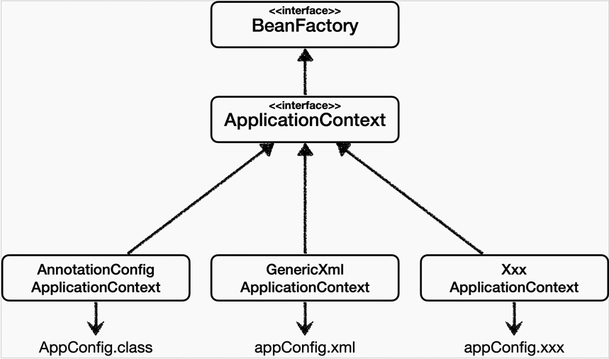

## Table of contents
{: .no_toc .text-delta }

1. TOC
{:toc}
---

## ✔**스프링 컨테이너는 다양한 형식의 설정 정보를 받아드릴 수 잇게 유연하게 설계되어 있다.**
(자바 코드 , XML , Groovy 등등)


### **애노테이션 기반 자바 코드 설정 사용**

-   지금까지 했던 것이다.
-   new AnnotationConfigApplicationContext(AppConfig.class)
-   **AnnotationConfigApplicationContext** 클래스를 사용하면서 자바 코드로된 설정 정보를 넘기면 된다.

### **XML 설정 사용**

-   최근에는 스프링 부트를 많이 사용하면서 XML기반의 설정은 잘 사용하지 않는다.
-   **XML을 사용하면 컴파일 없이 빈 설정 정보를 변경할 수 있는 장점도 있으므로 한번 쯤 배워두는것도 괜찮다.**
-   GenericXmlApplicationContext를 사용하면서 xml설정 파일을 넘기면 된다.

* * *

### **appConfig.xml**(Resources ➜ appConfig.xml 생성)
```xml
<?xml version="1.0" encoding="UTF-8"?>
<beans xmlns="http://www.springframework.org/schema/beans"
       xmlns:xsi="http://www.w3.org/2001/XMLSchema-instance"
       xsi:schemaLocation="http://www.springframework.org/schema/beans http://www.springframework.org/schema/beans/spring-beans.xsd">

    <bean id="memberRepository" class="hello.core.member.MemoryMemberRepository"/>
    <bean id="discountPolicy" class="hello.core.discount.RateDiscountPolicy"/>

    <bean id="memberService" class="hello.core.member.MemberServiceImpl">
        <constructor-arg name="memberRepository" ref="memberRepository"/>
    </bean>

    <bean id="orderService" class="hello.core.order.OrderServiceImpl">
        <constructor-arg name="memberRepository" ref="memberRepository"/>
        <constructor-arg name="discountPolicy" ref="discountPolicy"/>
    </bean>

</beans>
```
- xml기반의 appConfig.xml 스프링 설정과 자바 코드로 된 AppConfig.java와 비교해보면 거의 비슷하다는것을 알 수 있다.
- 필요하면 [스프링 공식 레퍼런스 문서](https://spring.io/projects/spring-framework)를 확인하자.

### **XmlAppContext**
```java
public class XmlAppContext{

    @Test
    void xmlAppContext(){
        GenericXmlApplicationContext ac = new GenericXmlApplicationContext("appConfig.xml");
        MemberService memberService = ac.getBean("memberService", MemberService.class);
        Assertions.assertThat(memberService).isInstanceOf(MemberService.class);
    }
}
```
