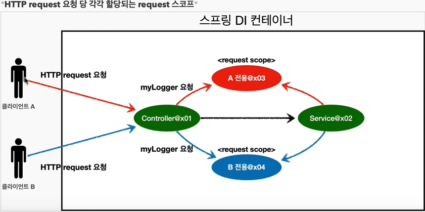
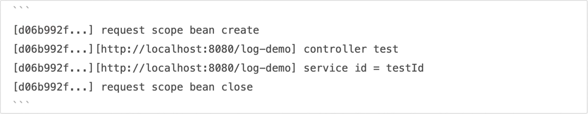
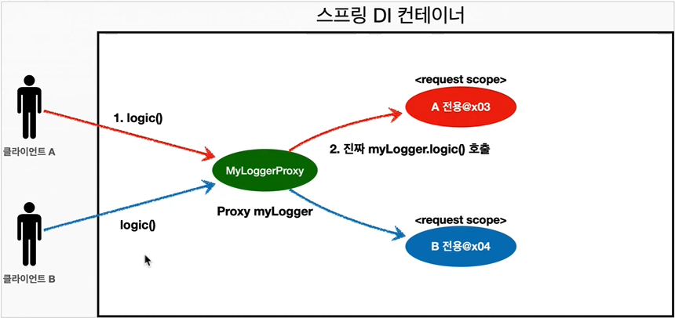

## Table of contents
{: .no_toc .text-delta }

1. TOC
{:toc}
---
**싱글톤 빈**은 스프링 컨테이너의 시작과 끝까지 함께하는 매우 긴 스코프 이고 ,
**프로토타입 빈**은 생성과 함께 의존관계 주입 , 그리고 초기화까지만 진행하는 특별한 스코프이다.

## **웹 스코프**


- **웹 환경에서만 동작한다.**
- **프로토타입과 다르게 스프링이 해당 스코프의 종료시점까지 관리한다. 따라서 종료메서드가 호출된다.**


### 웹 스코프 종류
- `request` : (각각의) HTTP 요청 하나가 들어오고 나갈 때 까지 유지되는 스코프 , 각각의 HTTP 요청 마다 별도의 빈 인스턴스가 생성되고 관리된다.
- `session` : HTTP Session과 동일한 생명 주기를 가지는 스코프
- `application` : 서블릿 컨텍스트(ServletContext)와 동일한 생명 주기를 가지는 스코프
- `websocket` : 웹 소켓과 동일한 생명 주기를 가지는 스코프

> ✋ 여기서는 `request` 스코프를 예제로 설명한다.
> 나머지는 범위만 다르지 동작 방식은 비슷하다.



### `request` 스코프 예제 만들기
<div class="code-example" markdown="1">
build.gradle
</div>
```
implementation 'org.springframework.boot:spring-boot-starter-web'
```
> ✋
> - `spring-boot-starter-web`을 추가하면 내장 톰캣 서버를 활용해서 웹 서버와 스프링을 함께 실행 시킨다.
> - 스프링 부트는 웹 라이브러리가 없으면 우리가 지금까지 학습한 `AnnotationConfigApplicationContext`를 기반으로 애플리케이션을 구동한다.
> - 웹 라이브러리가 추가되면 웹과 관련된 추가 설정과 환경들이 필요하므로`AnnotationConfigServletWebServerApplicationContext`를 기반으로 애플리케이션을 구동한다.

**동시에 여러 HTTP 요청이 오면 정확이 어떤 요청이 남긴 로그인지 구분하기 어렵다.**
{: .fh-default }
이럴때 사용하기 딱 좋은것이 바로 `request` 스코프 이다.


- **기대하는 공통 포맷 : [UUID][requestURL]{message}**
- UUID를 사용해서 HTTP요청을 구분하자.
- requestURL 정보도 추가로 넣어서 어떤 URL을 요청해서 남은 로그인지 확인하자.
<div class="code-example" markdown="1">
MyLogger
</div>
```java
@Component
@Scope(value="request")
public class MyLogger {
    private String uuid;
    private String requestURL;

    public void setRequestURL(String requestURL) {
        this.requestURL = requestURL;
    }

    public void log(String message){
        System.out.println("[" + uuid + "][" + requestURL + "] " + message );
    }

    @PostConstruct
    public void init(){
        uuid = UUID.randomUUID().toString();
        System.out.println("[" + uuid + "] request scope bean create :" + this);
    }

    @PreDestroy
    // HTTP REQUEST가 빠져 나갈 때 소멸된다.
    public void close(){
        System.out.println("[" + uuid + "] request scope bean close :" + this);
    }
}
```
- **로그를 출력하기 위한 클래스이다.**
- `@Scope(value = "request")`를 사용해서 `request`스코프로 지정했다.
- 이 빈은 HTTP요청 당 하나씩 생성되고 , HTTP요청이 끝나는 시점에 소멸된다.
- 이 빈이 생성되는 시점에 자동으로 `@PostConstruct`초기화 메서드를 사용해 uuid를 생성하고 저장해둔다.
- 이 빈은 HTTP요청 당 하나씩 생성되므로 , uuid를 지정해두면 다른 HTTP요청과 구분할 수 있다.
- 이 빈이 소멸되는 시점에 `@PreDestroy`를 사용해서 종료 메시지를 남긴다.
- requestURL은 이 빈이 생성되는 시정에 알 수  없으므로 , 외부에서 setter로 입력 받는다.


<div class="code-example" markdown="1">
LogDemoController
</div>
```java
@Controller
@RequiredArgsConstructor
public class LogDemoController {
    private final LogDemoService logDemoService;
    private final MyLogger myLogger;

    @RequestMapping("log-demo")
    @ResponseBody	// 앞단 페이지가 없으므로 단순 문자열 RETURN
    public String logDemo(HttpServletRequest request){
        String requestUrl = request.getRequestURL().toString();
        myLogger.setRequestURL(requestUrl);

        myLogger.log("controller test");

        logDemoService.logic("testId");

        return "OK";
    }
}
```
✅**requestURL을 MyLogger에 저장하는 부분은 컨트롤러 보다는 공통 처리가 가능한 스프링 인터셉터나 서블릿 필터 같은 곳을 활용하는 것이 좋다.**


<div class="code-example" markdown="1">
LogDemoService
</div>
```java
@Service
@RequiredArgsConstructor
public class LogDemoService {
    private final MyLogger myLogger;

    public void logic(String id){
        myLogger.log("service id = " + id);
    }
}
```
- request scope를 사용하지 않고 파라미터로 이 모든 정보를 서비스 계층에 넘긴다면 파라미터가 많아서 지저분해진다.
- 더 문제는 requestURL 같은 웹과 관련된 정보가 웹과 관련없는 서비스 계층까지 넘어가게 된다. **웹과 관련된 부분은 컨트롤러까지만 사용해야 한다.**
- **서비스 계층은 웹 기술에 종속되지 않고 , 가급적 순수하게 유지하는 것이 유지보수 관점에서 좋다.**
- request scope의 `MyLogger` 덕분에 이런 부분을 파라미터로 넘기지 않고 , `MyLogger`의 멤버변수에 저장해서 코드와 계층을 깔끔하게 유지 할 수 있다.

> ✋ **현재 상태로 실행시 MyLogger의 Scope가 Request이기 때문에 에러가 난다.**
Request는 Http에서 요청이 들어와야 생기는 것이고 , 스프링 컨테이너가 등록될 때는 찾을 수 없기 때문이다.


##### 스코프와 Provider 적용
<div class="code-example" markdown="1">
LogDemoController
</div>
```java
@Controller
@RequiredArgsConstructor
public class LogDemoController {
    private final LogDemoService logDemoService;
    private final ObjectProvider<MyLogger> myLoggerProvider;

    @RequestMapping("log-demo")
    @ResponseBody
    public String logDemo(HttpServletRequest request){
        MyLogger myLogger = myLoggerProvider.getObject();
        String requestUrl = request.getRequestURL().toString();
        myLogger.setRequestURL(requestUrl);

        myLogger.log("controller test");

        logDemoService.logic("testId");

        return "OK";
    }
}
```
<div class="code-example" markdown="1">
LogDemoService
</div>
```java
@Service
@RequiredArgsConstructor
public class LogDemoService {
    private final ObjectProvider<MyLogger> myLoggerProvider;

    public void logic(String id){
        MyLogger myLogger = myLoggerProvider.getObject();
        myLogger.log("service id = " + id);
    }
}
```
<div class="code-example" markdown="1">
출력
</div>
```
[d69b91f4-3aa9-4063-a749-6df391e68288] request scope bean create :hello.core.common.MyLogger@39e92fb
[d69b91f4-3aa9-4063-a749-6df391e68288][http://localhost:8080/log-demo] controller test
[d69b91f4-3aa9-4063-a749-6df391e68288][http://localhost:8080/log-demo] service id = testId
[d69b91f4-3aa9-4063-a749-6df391e68288] request scope bean close :hello.core.common.MyLogger@39e92fb
[eb9b4986-f858-4f0a-bb54-555e6bc6b48f] request scope bean create :hello.core.common.MyLogger@4783f1f6
[eb9b4986-f858-4f0a-bb54-555e6bc6b48f][http://localhost:8080/log-demo] controller test
[eb9b4986-f858-4f0a-bb54-555e6bc6b48f][http://localhost:8080/log-demo] service id = testId
[eb9b4986-f858-4f0a-bb54-555e6bc6b48f] request scope bean close :hello.core.common.MyLogger@4783f1f6
[d6db25d5-e7fd-4248-9524-726e29d631d7] request scope bean create :hello.core.common.MyLogger@1204206e
[d6db25d5-e7fd-4248-9524-726e29d631d7][http://localhost:8080/log-demo] controller test
[d6db25d5-e7fd-4248-9524-726e29d631d7][http://localhost:8080/log-demo] service id = testId
[d6db25d5-e7fd-4248-9524-726e29d631d7] request scope bean close :hello.core.common.MyLogger@1204206e
[ba0654ac-ab3e-4648-9da1-725ca959f878] request scope bean create :hello.core.common.MyLogger@3c949420
[ba0654ac-ab3e-4648-9da1-725ca959f878][http://localhost:8080/log-demo] controller test
[ba0654ac-ab3e-4648-9da1-725ca959f878][http://localhost:8080/log-demo] service id = testId
[ba0654ac-ab3e-4648-9da1-725ca959f878] request scope bean close :hello.core.common.MyLogger@3c949420
```
- `ObjectProvider` 덕분에 `ObjectProvider.getObject()`를 호출하는 시점까지 `request scope` **"빈의 생성을 지연할 수 있다."**
- **`ObjectProvider.getObject()`를 호출하는 시점에는 HTTP 요청이 진행중이므로 request scope 빈의 생성이 정상 처리 된다.**
- `ObjectProvider.getObject()`를 `LogDemoController` , `LogDemoService`에서 각각 한 번씩 따로 호출 해도 같은 HTTP 요청이면 같은 스프링이 반환된다.

> ✋ **자바 웹 서버는 고객의 HTTP 요청마다 별도의 쓰레드를 할당합니다. 자바에서는 ThreadLocal이라는 객체가 있는데, 이 객체를 내부에서 사용해서 쓰레드를 구분할 수 있습니다.(id 값 대신 쓰레드 id로 구분합니다.)**


##### 스코프와 프록시 적용
<div class="code-example" markdown="1">
MyLogger
</div>
```java
@Component
@Scope(value = "request" , proxyMode = ScopedProxyMode.TARGET_CLASS)
public class MyLogger {
    private String uuid;
    private String requestURL;

    public void setRequestURL(String requestURL) {
        this.requestURL = requestURL;
    }

    public void log(String message){
        System.out.println("[" + uuid + "][" + requestURL + "] " + message );
    }

    @PostConstruct
    public void init(){
        uuid = UUID.randomUUID().toString();
        System.out.println("[" + uuid + "] request scope bean create :" + this);
    }

    @PreDestroy
    // HTTP REQUEST가 빠져 나갈 때 소멸된다.
    public void close(){
        System.out.println("[" + uuid + "] request scope bean close :" + this);
    }
}
```
<div class="code-example" markdown="1">
LogDemoController
</div>
```java
@Controller
@RequiredArgsConstructor
public class LogDemoController {
    private final LogDemoService logDemoService;
    private final MyLogger myLogger;

    @RequestMapping("log-demo")
    @ResponseBody
    public String logDemo(HttpServletRequest request){
        String requestUrl = request.getRequestURL().toString();
        myLogger.setRequestURL(requestUrl);

        myLogger.log("controller test");

        logDemoService.logic("testId");

        return "OK";
    }
}
```
<div class="code-example" markdown="1">
LogDemoService
</div>
```java
@Service
@RequiredArgsConstructor
public class LogDemoService {
    private final MyLogger myLogger;

    public void logic(String id){
        myLogger.log("service id = " + id);
    }
}
```
###### 핵심
```java
@Component
@Scope(value = "request" , proxyMode = ScopedProxyMode.TARGET_CLASS)
public class MyLogger {
	...
}
```
- **`@Scope(value = "request" , proxyMode = ScopedProxyMode.TARGET_CLASS)`**
  - 적용 대상이 인터페이스가 아닌 클래스면 TARGET_CLASS를 선택
  - 적용 대상이 인터페이스면 INTERFACES 선택
- **이렇게 하면 MyLogger의 가짜 프록시 클래스를 만들어 두고 HTTP request와 상관 없이 가짜 프록시 클래스를 다른 빈에 미리 주입해 둘 수 있다.**

```
myLoggerclass hello.core.common.MyLogger$$EnhancerBySpringCGLIB$$d86074d7
```
- **CGLIB라는 라이브러리로 내 클래스를 상속 받은 가짜 프록시 객체를 만들어서 주입한다.**
- ✅ **`@Scope의 proxyMode = ScopedProxyMode.TARGET_CLASS`를 성정하면 스프링 컨테이너는 CGLIB라는 바이트 코드를 조작하는 라이브러리를 사용해서 , MyLogger를 상속 받은 가짜 프록시 객체를 생성한다.**
- 스프링 컨테이너에 "myLogger"라는 이름으로 진짜 대신에 이 가짜 프록시 객체를 등록한다.
- `ac.getBean("myLogger" , MyLogger.class)`로 조회해도 프록시 객체가 조회되는 것을 확인할 수 있다.
- 그래서 **의존관계 주입도 이 가짜 프록시 객체가 주입된다.**


- **가짜 프록시 객체는 요청이 오면 그 때 내부에서 진짜 빈을 요청하는 위임 로직이 들어 있다.**
- 클라이언트가 `myLogger.logic()`을 호출하면 사실은 가짜 프록시 객체의 메서드를 호출한 것이다.
  - (가짜 프록시 객체는 내부에 진짜 `myLogger`를 찾는 방법을 알고 있다.)
- 가짜 프록시 객체는 request 스코프의 진짜 `myLogger.logic()`을 호출한다.
- 가짜 프록시 객체는 원본 클래스를 상속 받아서 만들어졌기 때문에 이 객체를 사용하는 클라이언트 입장에서는 사실 원본인지 아닌지도 모르게 , 동일하게 사용할 수 있다.**(다형성)**

### 📌 정리
- 프록시 객체 덕분에 클라이언트는 마치 싱글톤 빈을 사용하듯이 편리하게 request scope를 사용할 수 있다.
- **사실 Provider를 사용하든 , 프록시를 사용하든 핵심 아이디어는 진짜 객체 조회를 꼭 필요한 시점까지 지연처리 한다는 점이다.**
- 단지 애노테이션 설정 변경만으로 원본 객체를 프록시 객체로 대체할 수 있다.
- **이것이 바로 다형성과 DI컨테이너가 가진 큰 강점이다.**
- 꼭 웹 스코프가 아니어도 프록시는 사용할 수 있다.
