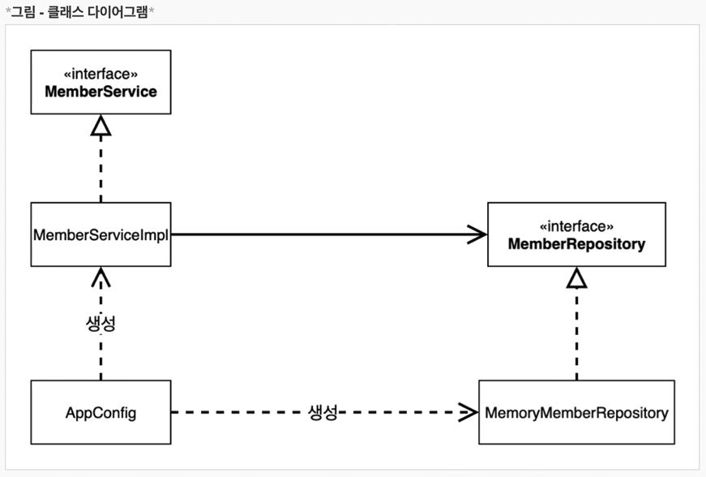
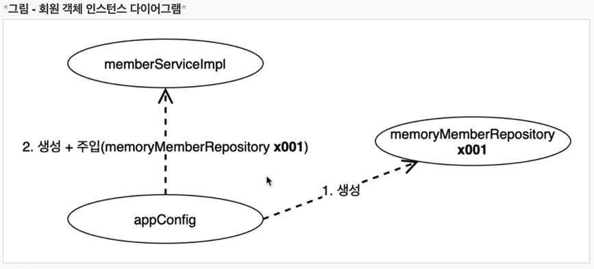
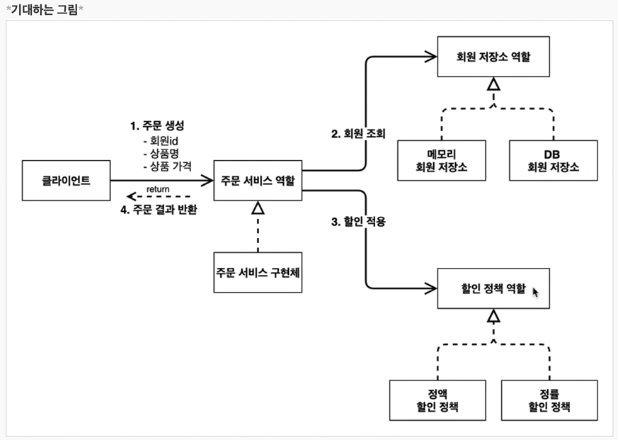
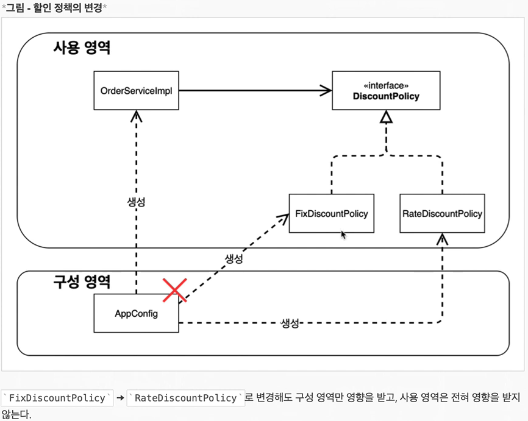

# 관심사의 분리
{: .no_toc }

## Table of contents
{: .no_toc .text-delta }

1. TOC
{:toc}

---
## **AppConfig 등장**

애플리케이션의 전체 동작 방식을 구성(Config)하기 위해 , **구현객체를 생성**하고 , **연결**하는 책임을 가지는 별도의 설정 클래스를 만들자

```java
package hello.core;

import hello.core.discount.FixDiscountPolicy;
import hello.core.member.MemberService;
import hello.core.member.MemberServiceImpl;
import hello.core.member.MemoryMemberRepository;
import hello.core.order.OrderService;
import hello.core.order.OrderServiceImpl;

public class AppConfig {

    public MemberService memberService(){
        return new MemberServiceImpl(new MemoryMemberRepository());
    }

    public OrderService orderService(){
        return new OrderServiceImpl(
          new MemoryMemberRepository(),
          new FixDiscountPolicy());
    }
}
```

### **MemberServiceImpl**
  ```java
  package hello.core.member;

public class MemberServiceImpl implements MemberService{

    private final MemberRepository memberRepository;

    public MemberServiceImpl(MemberRepository memberRepository) {	// 생성자 주입으로 변경
        this.memberRepository = memberRepository;
    }

    @Override
    public void join(Member member) {
        memberRepository.save(member);
    }

    @Override
    public Member findMember(Long memberId) {
        return memberRepository.findById(memberId);
    }
}
  ```
### **OrderServiceImpl**
  ```java
  package hello.core.order;

import hello.core.discount.DiscountPolicy;
import hello.core.member.Member;
import hello.core.member.MemberRepository;

public class OrderServiceImpl implements OrderService{

    private final MemberRepository memberRepository;
    private final DiscountPolicy discountPolicy;

	//생성자 주입으로 변경
    public OrderServiceImpl(MemberRepository memberRepository, DiscountPolicy discountPolicy) {
        this.memberRepository = memberRepository;
        this.discountPolicy = discountPolicy;
    }

    @Override
    public Order createOrder(Long memberId, String itemName, int itemPrice) {
        Member member = memberRepository.findById(memberId);
        int discountPrice = discountPolicy.discount(member , itemPrice);

        return new Order(memberId , itemName , itemPrice , discountPrice);
    }
}
```

### 📌**AppConfig**
- AppConfig는 애플리케이션의 실제 동작에 필요한 <span style="color:red; font-weight:bold">구현 객체를 생성</span>한다.
  - **MemberServiceImpl**
  - **MemoryMemberServiceImpl**
  - **OrderServiceImpl**
  - **FixDiscountImpl**
- AppConfig는 생성한 객체 인스턴스의 참조(레퍼런스)를 <span style="color:red; font-weight:bold">생성자를 통해서 주입(연결)</span>해준다.
  - **MemberServiceImpl ➜ MemoryMemberRepository**
  - **OrderServiceImpl ➜ MemoryMemberRepository , FixDiscountPolicy**
- 설계 변경으로 MemberServiceImpl은 MemoryMemberRepository를 의존하지 않는다.
- 단지 MemberRepository인터페이스만 의존한다.
- MemberServiceImpl입장에서 생성자를 통해 어떤 구현 객체가 들어올지(주입될지)는 알 수 없다.
- MemberServiceImpl의 생성자를 통해서 어떤 구현 객체를 주입할지는 오직 외부 (**AppConfig**)에서 결정된다.
- MemberServiceImpl은 이제부터 <span style="color:red; font-weight:bold">의존관계에 대한 고민은 외부</span>에 맡기고 <span style="color:red; font-weight:bold">실행에만 집중</span>하면 된다.

- 객체의 생성과 연결은 AppConfig가 담당한다.
- **DIP 완성** : MemberServiceImpl은 MemberRepository인 추상에만 의존하면 된다. 이제 구체 클래스를 몰라도 된다.
- **관심사의 분리** : 객체를 생성하고 연결하는 역할과 실행하는 역할이 명확히 분리 되었다.

- appConfig객체는 memoryMemberRepository 객체를 생성하고 그 참조값을 memberServiceImpl을 생성하면서 생성자로 전달한다.
- 클라이언트인 MemberServiceImpl입장에서 보면 의존관계를 마치 외부에서 주입해주는 것 같다고 해서
- **DI(Dependency Injection) 우리말로 의존관계 주입 또는 의존성 주입이라 한다.**

* * *

## **AppConfig 리팩토링**
현재 AppConfig를 보면 **중복**이 있고 , **역할**에 따른 **구현**이 잘 안보인다.


### **AppConfig 수정 전**
```java
public class AppConfig {

    public MemberService memberService(){
        return new MemberServiceImpl(new MemoryMemberRepository());
    }

    public OrderService orderService(){
        return new OrderServiceImpl(
            new MemoryMemberRepository(),
            new FixDiscountPolicy());
    }
}
```

### **AppConfig 수정 후**
```java
public class AppConfig {

    // 객체 생성을 메소드 처리
    private MemberRepository memberRepository() {
        return new MemoryMemberRepository();
        // 새로운 구현체를 주입 하고 싶다면 new 객체를 수정하면 된다.
    }

    // 객체 생성을 메소드 처리
    public DiscountPolicy discountPolicy(){
        return new FixDiscountPolicy();
        // 새로운 구현체를 주입 하고 싶다면 new 객체를 수정하면 된다.
    }

    public MemberService memberService(){
        return new MemberServiceImpl(memberRepository());
    }

    public OrderService orderService(){
        return new OrderServiceImpl(memberRepository(), discountPolicy());
    }
}
```
- new MemoryMemberRepository() 중복이 제거 되었다. **이제 MemoryMemberRepository를 다른 구현체로 변경할 때 한 부분만 변경하면 된다.**
- **AppConfig**를 보면 역할과 구현 클래스가 한 눈에 들어온다. 애플리케이션 전체 구성이 어떻게 되어 있는지 빠르게 파악할 수 있다.


### **새로운 구조와 할인 정책 적용**

**AppConfig의 등장으로 애플리케이션이 크게 사용영역과 , 객체를 생성하고 구성(Configuration)하는 영역으로 분리 되었다.**

-   FixDiscountPolicy -> RateDiscountPolicy 객체로 변경했다.
-   **사용 영역의 어떤 코드도 변경할 필요가 없다.**
-   새로운 할인 정책 개발 적용 시 DIP 위반 , 이 를 해결하고자 AppConfig 등장
-   관심사의 분리
    -   AppConfig는 애플리케이션의 전체 동작 방식 구성(Config)하기 위해 , "**구현 객체를 생성**"하고 "**연결**"하는 책임
    -   이제부터 클라이언트 객체는 자신의 역할을 실행하는 것만 집중 , 권한이 줄어듬(책임이 명확해짐)
-   AppConfig 리팩토링
    -   구성 정보에서 역할과 구현을 명확하게 분리
    -   중복 제거
-   새로운 구조와 할인 정책 적용
    -   AppConfig의 등장으로 애플리케이션이 크게 "**사용 영역**"과 , 객체를 생성하고 "**구성(Configuration)하는 영역**" 으로 분리

* * *
## 📌**객체 지향 설계의 5가지 원칙이 어떻게 적용 되었는지?**
여기서 3가지 SRP , DIP , OCP 적용

###  **SRP - 단일 책임 원칙**

-   **한 클래스는 하나의 책임만 가져야 한다.**
-   클라이언트 객체는 직접 구현 객체를 생성하고 , 연결하고 , 실행하는 다양한 책임을 가지고 있음
-   SRP 단일 책임 원칙을 따르면서 관심사를 분리함
    -   **구현 객체를 생성하고 연결하는 책임은 AppConfig가 담당**
    -   **클라이언트 객체는 실행하는 책임만 담당**

###  **DIP - 의존관계 역전 원칙**

-   **프로그래머는 "추상화에 의존해야지 , 구체화에 의존하면 안된다." 의존성 주입은 이 원칙을 따르는 방법 중 하나다.**
-   새로운 할인 정책을 개발하고 , 적용하려고 하니 클라이언트 코드도 함께 변경해야 했다. 왜냐하면 기존 클라이언트 코드는  DIP를 지키며 추상화 인터페이스에 의존하는 것 같았지만 , (FixDiscountPolicy) 구체화 구현 클래스에도 함께 의존 했다.
-   AppConfig가 FixDiscountPolicy 객체 인스턴스를 클라이언트 코드 대신 생성해서 클라이언트 코드에 의존관계를 주입했다. 이렇게 해서 DIP 원칙을 따르면서 문제도 해결했다.

### **OCP - 개방,폐쇄 원칙**

-   **소프트웨어 요소는 확장에는 열려 있으나 변경에는 닫혀 있어야 한다.**
-   다형성 사용하고 클라이언트가 DIP를 지킴
-   애플리케이션을 사용 영역과 구성 영역으로 나눔
-   AppConfig(구성 영역)에서의 수정만으로 가능하다.
-   "**소프트웨어 요소를 새롭게 확장해도 사용 영역의 변경은 닫혀 있다.**"
