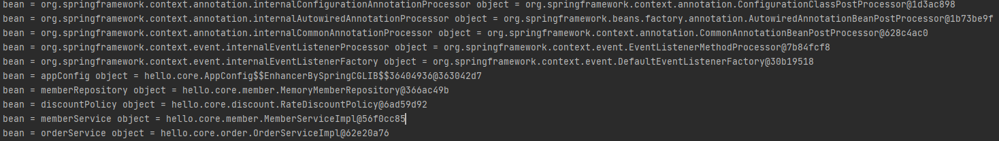
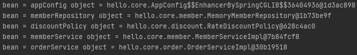
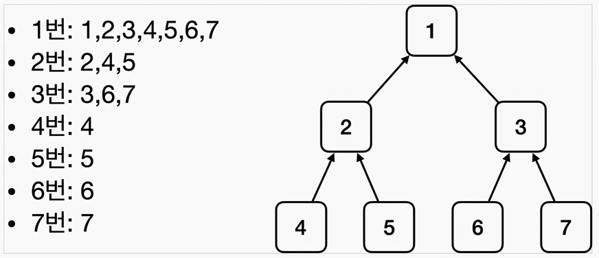
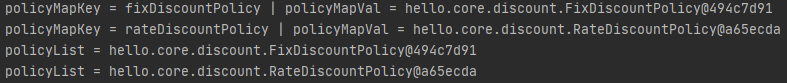

## **빈 출력 해보기**
```java
public class applicationContextInfoTest {

    AnnotationConfigApplicationContext ac =
              new AnnotationConfigApplicationContext(AppConfig.class);

    @Test
    @DisplayName("모든 빈 출력하기")
    void finaAllBean(){
        String[] beanDefinitionNames = ac.getBeanDefinitionNames();
        for (String beanDefinitionName : beanDefinitionNames) {
            Object bean = ac.getBean(beanDefinitionName);
            System.out.println("bean = " + beanDefinitionName + " object = " + bean);
        }
    }

    @Test
    @DisplayName("애플리케이션 빈 출력하기")   // 내가 등록한 빈만 출력하기
    void finaApplicationBean(){
        String[] beanDefinitionNames = ac.getBeanDefinitionNames();
        for (String beanDefinitionName : beanDefinitionNames) {
            BeanDefinition beanDefinition = ac.getBeanDefinition(beanDefinitionName);
            //  ROLE_APPLICATION : 직접 등록한 애플리케이션 빈
            //  ROLE_INFRASTRUCTURE : 스프링이 내부에서 사용하는 빈
            if(beanDefinition.getRole() == BeanDefinition.ROLE_INFRASTRUCTURE){
                Object bean = ac.getBean(beanDefinitionName);
                System.out.println("bean = " + beanDefinitionName + " object = " + bean);
            }
        }
    }
}
```
<center> <strong>모든 빈 출력하기</strong> </center>


<center> <strong>직접 등록한 애플리케이션 빈</strong> </center>



* * *
### ✔ **스프링 빈 조회 - 기본**
- 스프링 컨테이너에서 스프링 빈을 찾는 가장 기본적인 조회 방법
  - **ac.getBean(빈 이름 , 타입)**
  - **ac.getBean(타입)**
  - 조회 대상 스프링 빈이 없으면 예외 발생
    - **NoSuchBeanDefinitionException** : No Bean name 'xxxxx' available

```java
class ApplicationContextBeanBasicFindTest {

    AnnotationConfigApplicationContext ac = new AnnotationConfigApplicationContext(AppConfig.class);

    @Test
    @DisplayName("빈 이름으로 조회")
    void 빈_이름으로_조회(){
        MemberService memberService = ac.getBean("memberService", MemberService.class);

        // getBean으로 찾아온 MemberService와 실제 객체가 연결된 구현체(MemberServiceImpl)과 동일한지
        Assertions.assertThat(memberService).isInstanceOf(MemberServiceImpl.class);
    }

    @Test
    @DisplayName("이름없이 타입으로만 조회")
    void 이름없이_타입으로만_조회(){
        MemberService memberService = ac.getBean(MemberService.class);

        // getBean으로 찾아온 MemberService와 실제 객체가 연결된 구현체(MemberServiceImpl)과 동일한지
        Assertions.assertThat(memberService).isInstanceOf(MemberServiceImpl.class);
    }

    @Test
    @DisplayName("구현체 타입으로 조회")
    void 구현체_타입으로_조회(){
        MemberServiceImpl memberService = ac.getBean("memberService", MemberServiceImpl.class);

        Assertions.assertThat(memberService).isInstanceOf(MemberServiceImpl.class);
    }

    @Test
    @DisplayName("빈 이름으로 조회(예외)")
    void 빈_이름으로_조회_예외(){
        // ac.getBean 실행 시 예외가 터져야 테스트 정상 완료
        org.junit.jupiter.api.Assertions.assertThrows(NoSuchBeanDefinitionException.class
                , () -> ac.getBean("xxxx" ,MemberService.class));
    }
}
```
* * *
### ✔ **스프링 빈 조회 - 동일한 타입이 둘 이상**
```
org.springframework.beans.factory.NoUniqueBeanDefinitionException:
No qualifying bean of type 'hello.core.member.MemberRepository' available:
expected single matching bean but found 2: memberRepository1,memberRepository2
```
- **타입으로 조회시 같은 타입의 스프링 빈이 둘 이상이면 오류가 발생한다.** 이때는 빈 이름을 지정하자.
- **ac.getBeansOfType()**을 사용하면 해당 타입의 모든 빈을 조회할 수 있다.

```java
public class ApplicationContextSameBeanFindTest {

    AnnotationConfigApplicationContext ac = new AnnotationConfigApplicationContext(SameBeanConfig.class);

    @Configuration
    static class SameBeanConfig {
        @Bean
        public MemberRepository memberRepository1() {
            return new MemoryMemberRepository();
        }

        @Bean
        public MemberRepository memberRepository2() {
            return new MemoryMemberRepository();
        }
    }

    @Test
    @DisplayName("타입으로 조회시 같은 타입이 둘 이상 있으면 , 중복 오류가 발생한다.")
    void 같은_타입_둘_이상_조회() {
        Assertions.assertThrows(NoUniqueBeanDefinitionException.class
                , () -> ac.getBean(MemberRepository.class));
    }

    @Test
    @DisplayName("타입으로 조회시 같은 타입이 둘 이상 있으면 , 빈 이름을 지정하면 된다.")
    void 빈_이름_조회() {
        MemberRepository memberRepository = ac.getBean("memberRepository1", MemberRepository.class);
        org.assertj.core.api.Assertions.assertThat(memberRepository).isInstanceOf(MemberRepository.class);
    }

    @Test
    @DisplayName("특정 타입을 모두 조회하기")
    //Ctrl + Shift + Enter - 코드 컴플리션
    void 빈_타입_조회(){
        Map<String, MemberRepository> beansOfType = ac.getBeansOfType(MemberRepository.class);
        for (String key : beansOfType.keySet()) {
            System.out.println("key = " + key + " value = " + beansOfType.get(key));
        }
        System.out.println("beansOfType = " + beansOfType);
        org.assertj.core.api.Assertions.assertThat(beansOfType.size()).isEqualTo(2);
    }
//    key = memberRepository1 value = hello.core.member.MemoryMemberRepository@550a1967
//    key = memberRepository2 value = hello.core.member.MemoryMemberRepository@2a640157
//    beansOfType = {memberRepository1=hello.core.member.MemoryMemberRepository@550a1967, memberRepository2=hello.core.member.MemoryMemberRepository@2a640157}
}
```
* * *
### ✔ **스프링 빈 조회 - 상속관계**
- 부모 타입으로 조회하면 , 자식 타입도 함게 조회한다.
- **그래서 모든 자바 객체의 최고 부모인 Object타입으로 조회하면 , 모든 스프링 빈을 조회한다.**


```java
public class ApplicationContextExtendsFindTest {

    AnnotationConfigApplicationContext ac = new AnnotationConfigApplicationContext(TestConfig.class);

    @Configuration
    static class TestConfig{
        @Bean
        public DiscountPolicy rateDiscountPolicy(){
            return new RateDiscountPolicy();
        }
        @Bean
        public DiscountPolicy fixDiscountPolicy(){
            return new FixDiscountPolicy();
        }
    }

    @Test
    @DisplayName("부모 타입으로 조회시 , 자식이 둘 이상 있으면 , 중복 오류가 발생한다.")
    void 부모_타입_조회(){
        Assertions.assertThrows(NoUniqueBeanDefinitionException.class
                , () -> ac.getBean(DiscountPolicy.class));
    }

    @Test
    @DisplayName("부모 타입으로 조회시 , 자식이 둘 이상 있으면 , 빈 이름을 지정하면 된다..")
    void 부모_타입_조회_빈_이름_지정(){
        DiscountPolicy rateDiscountPolicy = ac.getBean("rateDiscountPolicy", DiscountPolicy.class);
        org.assertj.core.api.Assertions.assertThat(rateDiscountPolicy).isInstanceOf(RateDiscountPolicy.class);
    }

    @Test
    @DisplayName("특정 하위 타입으로 조회")
    void 특정_하위_타입_조회(){
        RateDiscountPolicy rateDiscountPolicy = ac.getBean(RateDiscountPolicy.class);
        org.assertj.core.api.Assertions.assertThat(rateDiscountPolicy).isInstanceOf(RateDiscountPolicy.class);
    }

    @Test
    @DisplayName("부모 타입으로 모두 조회")
    void 부모_타입_모두_조회(){
        Map<String, DiscountPolicy> beansOfType = ac.getBeansOfType(DiscountPolicy.class);
        org.assertj.core.api.Assertions.assertThat(beansOfType.size()).isEqualTo(2);
        for (String key : beansOfType.keySet()) {
            System.out.println("key = " + key + " value = " + beansOfType.get(key));
        }
//        key = rateDiscountPolicy value = hello.core.discount.RateDiscountPolicy@58ffcbd7
//        key = fixDiscountPolicy value = hello.core.discount.FixDiscountPolicy@555cf22
    }

    @Test
    @DisplayName("Object 타입으로 모두 조회")
    void Object_타입(){
        Map<String, Object> beansOfType = ac.getBeansOfType(Object.class);
        for (String key : beansOfType.keySet()) {
            System.out.println("key = " + key + " value = " + beansOfType.get(key));
        }
        // 스프링에 등록된 모든 빈 출력
    }
}
```
* * *
### ✔ **조회한 빈이 모두 필요할 때 List , Map**
의도적으로 정말 해당 타입의 스프링 빈이 다 필요한 경우도 있다.
: 할인 서비스를 제공하는데 , 클라이언트가 할인의 종류 (rate,fix)를 선택할 수 있다고 가정해보자.스프링을 사용하면 소위 말하는 전략 패턴을 매우 간단하게 구현할 수 있다.

인터페이스 - **DiscountPolicy**
구현체 - **FixDiscountPolicy**(VIP는 1000원 고정 할인) , **RateDiscountPolicy** (VIP는 금액의 10% 할인)

### **FixDiscountPolicy**
```java
@Component
public class FixDiscountPolicy implements DiscountPolicy{
    private int discountFixAmount = 1000; // 1000원 할인

    @Override
    public int discount(Member member, int price) {
        if(member.getGrade() == Grade.VIP){ // enum타입은 == 을 쓰는게 맞다.
            return discountFixAmount;
        }
        else{
            return 0;
        }
    }
}
```
### **RateDiscountPolicy**
```java
@Component
@MainDiscountPolicy
public class RateDiscountPolicy implements DiscountPolicy{

    private int discountPercent = 10;

    @Override
    public int discount(Member member, int price) {
        if(member.getGrade() == Grade.VIP){
            return price * discountPercent / 100;
        }
        else{
            return 0;
        }
    }
}
```
```java
public class AllBeanTest {

    @Test
    void findAllBean(){
        AnnotationConfigApplicationContext ac =
                new AnnotationConfigApplicationContext(AutoAppConfig.class,DiscountService.class);

        DiscountService discountService = ac.getBean(DiscountService.class);
        Member member = new Member(1L, "userA", Grade.VIP);
        int fixDiscountPrice = discountService.discount(member , 10000 , "fixDiscountPolicy");
        int rateDiscountPrice = discountService.discount(member , 20000 , "rateDiscountPolicy");

        Assertions.assertThat(discountService).isInstanceOf(DiscountService.class);
        Assertions.assertThat(fixDiscountPrice).isEqualTo(1000);
        Assertions.assertThat(rateDiscountPrice).isEqualTo(2000);
    }

    static class DiscountService{
        private final Map<String,DiscountPolicy> policyMap;
        private final List<DiscountPolicy> policyList;

        @Autowired
        public DiscountService(Map<String, DiscountPolicy> policyMap, List<DiscountPolicy> policyList) {
            this.policyMap = policyMap;
            this.policyList = policyList;
            for (String policyMapKey : policyMap.keySet()) {
                System.out.println("policyMapKey = " + policyMapKey +
                        " | policyMapVal = " + policyMap.get(policyMapKey));
            }
            for (DiscountPolicy discountPolicy : policyList) {
                System.out.println("policyList = " + discountPolicy);
            }
        }


        public int discount(Member member, int price, String discountCode) {
            DiscountPolicy discountPolicy = policyMap.get(discountCode);
            return discountPolicy.discount(member , price);
        }
    }
}
```

- 스프링 컨테이너에 DiscountPolicy타입을 검색해 현재 구현체 2개가 스프링 빈으로 등록되어 있다.

### 📌**로직 분석**
- **DiscountService**의 생성자가 `policyMap`과 `policyList`를 스프링 컨테이너에서 가져온다.
- 스프링 컨테이너가 **DiscountPolicy**의 자식들을 검색하여 자바 컬렉션에 한하여 데이터 타입을 보고 자동으로 넣어준다.
- 테스트 코드는 **RateDiscountPolicy**와 **FixDiscountPolicy** 각각 만들어 `discount메소드`를 호출한다.
- `discount메소드`는 **member객체**와 **가격** 그리고 **빈으로 등록된 할인 정책 클래스 이름 (문자열)** 을 받게된다.
- 빈으로 등록된 할인 정책 클래스 이름을 사용하여 생성자에서 받아놓은 `policyMap`에서 해당하는 빈을 가져와 그 빈의 `discount 메소드`를 사용하게 된다.
- (RateDiscountPolicy와 FixDiscountPolicy의 클래스 안에도 discount메소드가 정의 되어 있다.)
