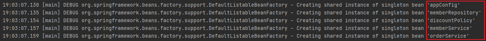
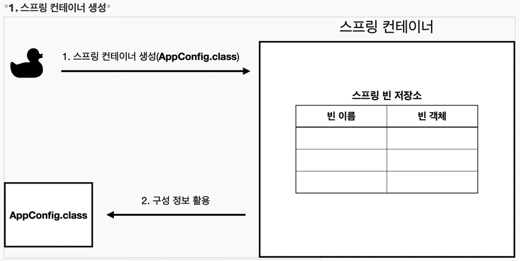
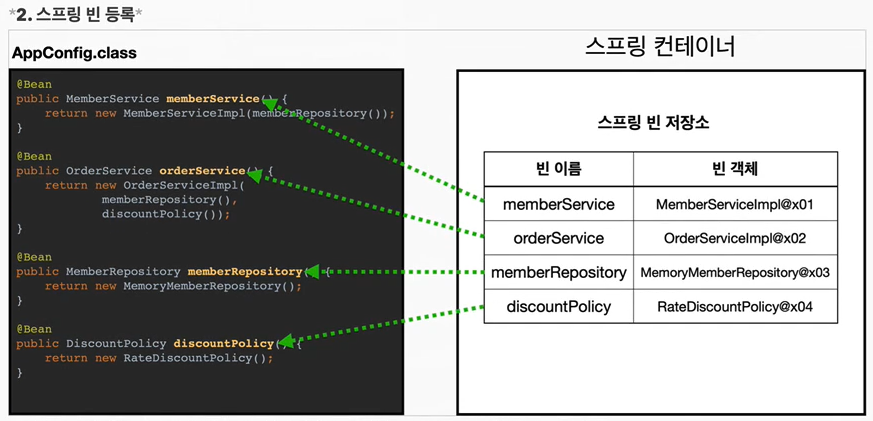
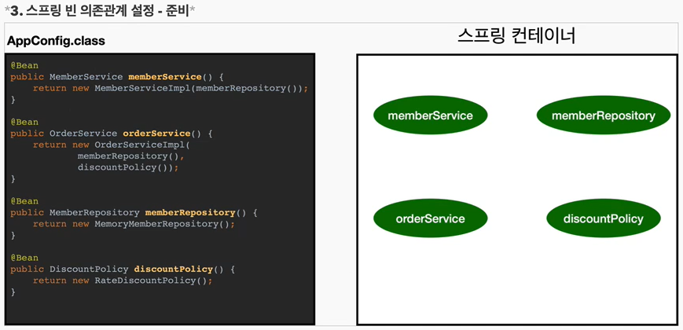
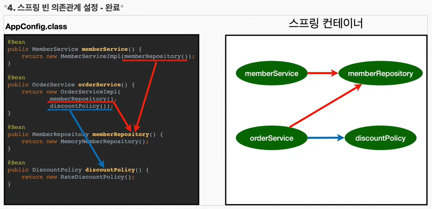

# 스프링 컨테이너와 빈
{: .no_toc }

## Table of contents
{: .no_toc .text-delta }

1. TOC
{:toc}

---

(스프링 핵심 원리 이해까지만 순수 자바로 진행한다)

**이제 스프링을 사용해보자.**

### **AppConfig**
```java
@Configuration      // 애플리케이션의 설정 정보
public class AppConfig {

    @Bean   // 스프링 컨테이너에 등록된다.
    public MemberRepository memberRepository() {
        // 새로운 구현체를 주입 하고 싶다면 new 객체를 수정하면 된다.
        return new MemoryMemberRepository();
    }

    @Bean
    public DiscountPolicy discountPolicy(){
        // 새로운 구현체를 주입 하고 싶다면 new 객체를 수정하면 된다.
        //return new FixDiscountPolicy();
        return new RateDiscountPolicy();
    }

    @Bean
    public MemberService memberService(){
        return new MemberServiceImpl(memberRepository());
    }

    @Bean
    public OrderService orderService(){
        return new OrderServiceImpl(memberRepository(), discountPolicy());
    }
}
```

### **MemberApp**
```java
// 순수 자바 코드로 테스트
public class MemberApp {
    public static void main(String[] args) {
//        AppConfig appConfig = new AppConfig();
//        MemberService memberService = appConfig.memberService();

        // AppConfig에 있는 설정 정보를 스프링 컨테이너에 넣어 직접 관리해준다.
        ApplicationContext applicationContext =
                          new AnnotationConfigApplicationContext(AppConfig.class);

        // applicationContext에서 AppConfig에서 bean으로 등록한 클래스를 가져온다.
        MemberService memberService =
                        applicationContext.getBean("memberService", MemberService.class);

        // Ctrl + Alt + V - 반환 되는 값에 맞는 인스턴스를 자동 기입
        Member member = new Member(1L, "memberA", Grade.VIP);
        memberService.join(member);

        Member findMember = memberService.findMember(1L);
        System.out.println("new Member =" + member.getName());
        System.out.println("find Member =" + findMember.getName());
    }
}
```

###  📌**스프링 컨테이너**

-   ApplicationContext를 **스프링 컨테이너**라 한다.
-   기존에는 개발자가 AppConfig를 사용해서 직접 객체를 생성하고 DI를 했지만 , 이제부터는 스프링 컨테이너를 통해서 사용한다.
-   스프링 컨테이너는 @Configuration이 붙은 AppConfig를 설정(구성) 정보로 사용한다. 여기서 @Bean이라 적힌 메서드를 모두 호출해서 반환된 객체를 **스프링 컨테이너에 등록**한다. 이렇게 스프링 컨테이너에 등록된 객체를 **스프링 빈**이라 한다.
-   스프링 빈은 @Bean이 붙은 메서드의 명을 스프링 빈의 이름으로 사용한다.
    -   @Bean(name=" ") 변경이 가능하긴 하다
-   스프링 빈은 applicationContext.getBean() 메서드를 사용해서 찾을 수 있다.
-   이제부터는 스프링 컨테이너에 객체를 스프링 빈으로 등록하고 , 스프링 컨테이너에서 스프링 빈을 찾아 사용하도록 변경되었다.
-   코드가 약간 더 복잡해진 것 같은데 , **스프링 컨테이너를 사용하면 어떤 장점이 있을까?**

* * *

### 📌**스프링 컨테이너가 생성 되는 과정을 알아보자**
```java
ApplicationContext applicationContext =
                  new AnnotationConfigApplicationContext(AppConfig.class);
```
-   ApplicationContext를 스프링 컨테이너라 한다.
-   ApplicationContext는 **인터페이스** 이다.
-   스프링 컨테이너는 XML기반으로 만들 수 있고 , 애노테이션 기반의 자바 설정 클래스로 만들 수 있다.
-   직전에 AppConfig를 사용했던 방식이 애노테이션 기반의 자바 설정 클래스로 스프링 컨테이너를 만든 것이다.

> 더 정확히는 스프링 컨테이너를 부를 때 **BeanFactory , ApplicationContext**로 구분해서 이야기한다.
> BeanFactory를 직접 사용하는 경우는 거의 없으므로 **일반적으로 ApplicationContext를 스프링 컨테이너라 한다.**



- new AnnotationConfigApplicationContext(AppConfig.class)
- 스프링 컨테이너를 생성할 때는 구성 정보를 지정해주어야 한다.
- 여기서는 AppConfig를 구성 정보로 지정했다.


- 스프링 컨테이너는 파라미터로 넘어온 설정 클래스 정보를 사용해서 스프링 빈을 등록한다.
주의 : **빈 이름은 항상 다른이름을 부여** 해야한다. 같은 이름을 부여하면 , 다른 빈이 무시 되거나 , 기존 빈을 덮어버리거나 설정에 따라 오류가 발생한다.



- 스프링 컨테이너는 **설정 정보를 참고해서 의존관계를 주입(DI)** 한다.
- 단순히 자바 코드를 호출하는 것 같지만 , 차이가 있다. 이 차이는 뒤에 싱글톤 컨테이너에서 설명한다.
- **스프링은 빈을 생성하고 , 의존관계를 주입하는 단계가 나누어져 있다.** 그런데 이렇게 자바 코드로 스프링 빈을 등록하면 생성자를 호출하면서 의존관계 주입도 한번에 처리된다.
- 여기서는 이해를 돕기위해 개념적으로 나누어 설명했다. **자세한 내용은 의존관계 자동 주입에서 다시 설명하겠다.**
