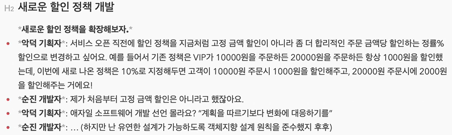
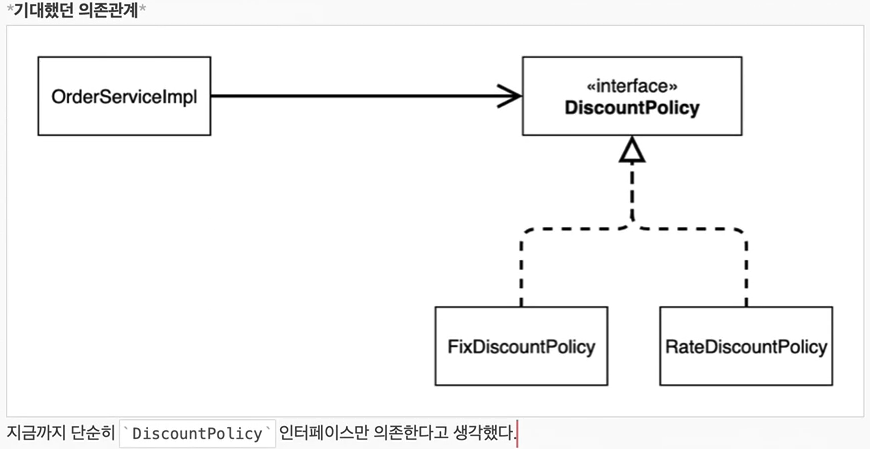
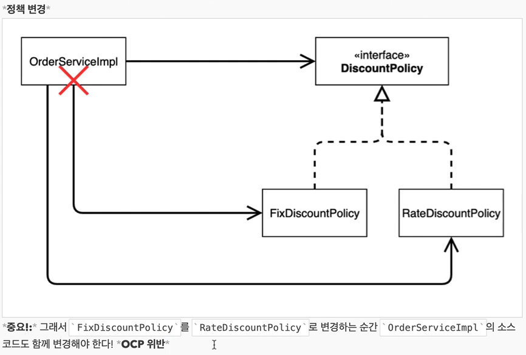

## Table of contents
{: .no_toc .text-delta }

1. TOC
{:toc}
---
### **DiscountPolicy**
```java
package hello.core.discount;

import hello.core.member.Member;

public interface DiscountPolicy {
    /**
     * @return 할인 대상 금액
     */
    int discount(Member member , int price);

}
```

### **FixDiscountPolicy**
```java
package hello.core.discount;

import hello.core.member.Grade;
import hello.core.member.Member;

public class FixDiscountPolicy implements DiscountPolicy{
    private int discountFixAmount = 1000; // 1000원 할인

    @Override
    public int discount(Member member, int price) {
        if(member.getGrade() == Grade.VIP){ // enum타입은 == 을 쓰는게 맞다.
            return discountFixAmount;
        }
        else{
            return 0;
        }
    }
}
```

### **Order**
```java
public class Order {

    private Long memberId;
    private String itemName;
    private int itemPrice;
    private int discountPrice;

    public Order(Long memberId, String itemName, int itemPrice, int discountPrice) {
        this.memberId = memberId;
        this.itemName = itemName;
        this.itemPrice = itemPrice;
        this.discountPrice = discountPrice;
    }

    public int calculatePrice(){
        return itemPrice - discountPrice;
    }

    public Long getMemberId() {
        return memberId;
    }

    public void setMemberId(Long memberId) {
        this.memberId = memberId;
    }

    public String getItemName() {
        return itemName;
    }

    public void setItemName(String itemName) {
        this.itemName = itemName;
    }

    public int getItemPrice() {
        return itemPrice;
    }

    public void setItemPrice(int itemPrice) {
        this.itemPrice = itemPrice;
    }

    public int getDiscountPrice() {
        return discountPrice;
    }

    public void setDiscountPrice(int discountPrice) {
        this.discountPrice = discountPrice;
    }

    @Override
    public String toString() {
        return "order{" +
                "memberId=" + memberId +
                ", itemName='" + itemName + '\'' +
                ", itemPrice=" + itemPrice +
                ", discountPrice=" + discountPrice +
                '}';
    }
}
```

### **OrderService , Impl**
```java
public interface OrderService {
    Order createOrder(Long memberId , String itemName , int itemPrice);
}

public class OrderServiceImpl implements OrderService{

    private final MemberRepository memberRepository = new MemoryMemberRepository();
    private final DiscountPolicy discountPolicy = new FixDiscountPolicy();

    @Override
    public Order createOrder(Long memberId, String itemName, int itemPrice) {
        Member member = memberRepository.findById(memberId);
        int discountPrice = discountPolicy.discount(member , itemPrice);

        return new Order(memberId , itemName , itemPrice , discountPrice);
    }
}
```

### **OrderApp (순수 자바 코드로 테스트)**
```java
public class OrderApp {

    public static void main(String[] args) {
        MemberService memberService = new MemberServiceImpl();
        OrderService orderService = new OrderServiceImpl();

        Long memberId = 1L;
        Member member = new Member(1L , "memberA" , Grade.VIP);
        memberService.join(member);

        Order itemA = orderService.createOrder(memberId, "itemA", 10000);
        System.out.println("Order =" + itemA.toString());
        System.out.println("Order =" + itemA.calculatePrice());
    }
}
```

### **OrderServiceTest**
```java
public class OrderServiceTest {

    MemberService memberService = new MemberServiceImpl();
    OrderService orderService = new OrderServiceImpl();

    @Test
    void 주문_생성(){
        Long memberId = 1L;
        Member member = new Member(memberId , "memberA" , Grade.VIP);
        memberService.join(member);

        Order order = orderService.createOrder(memberId , "itemA" , 10000);
        Assertions.assertThat(order.getDiscountPrice()).isEqualTo(1000);
    }
}
```
* * *

## 🚨**새로운 할인 정책 개발 및 적용과 문제점**



### **RateDiscountPolicy**
```java
package hello.core.discount;

import hello.core.member.Grade;
import hello.core.member.Member;

public class RateDiscountPolicy implements DiscountPolicy{

    private int discountPercent = 10;

    @Override
    public int discount(Member member, int price) {
        if(member.getGrade() == Grade.VIP){
            return price * discountPercent / 100;
        }
        else{
            return 0;
        }
    }
}
```
### **RateDiscountPolicyTest**
```java
package hello.core.discount;

import hello.core.member.Grade;
import hello.core.member.Member;
import org.assertj.core.api.Assertions;
import org.junit.jupiter.api.DisplayName;
import org.junit.jupiter.api.Test;

import static org.assertj.core.api.Assertions.*;
import static org.junit.jupiter.api.Assertions.*;

class RateDiscountPolicyTest {

    RateDiscountPolicy rateDiscountPolicy = new RateDiscountPolicy();

    @Test
    @DisplayName("VIP는 10% 할인이 적용되어야 한다.")
    void VIP_할인_성공() {
        //given
        Member member = new Member(1L, "memberVIP", Grade.VIP);

        //when
        int discount = rateDiscountPolicy.discount(member , 10000);

        //then
        assertThat(discount).isEqualTo(1000);
    }

    @Test
    @DisplayName("VIP가 아니면 할인이 적용되지 않아야 한다.")
    void VIP_할인_실패(){
        //given
        Member member = new Member(1L, "memberBASIC", Grade.BASIC);

        //when
        int discount = rateDiscountPolicy.discount(member , 10000);

        //then
        assertThat(discount).isEqualTo(0);
    }
}
```

### 🚨**문제점**
클라이언트인 **OrderServiceImpl** 코드를 고쳐야 한다.
```java
package hello.core.order;

import hello.core.discount.DiscountPolicy;
import hello.core.discount.FixDiscountPolicy;
import hello.core.discount.RateDiscountPolicy;
import hello.core.member.Member;
import hello.core.member.MemberRepository;
import hello.core.member.MemoryMemberRepository;

public class OrderServiceImpl implements OrderService{

    private final MemberRepository memberRepository = new MemoryMemberRepository();
//    private final DiscountPolicy discountPolicy = new FixDiscountPolicy(); // 변경 전
    private final DiscountPolicy discountPolicy = new RateDiscountPolicy();  // 변경 후

    @Override
    public Order createOrder(Long memberId, String itemName, int itemPrice) {
        Member member = memberRepository.findById(memberId);
        int discountPrice = discountPolicy.discount(member , itemPrice);

        return new Order(memberId , itemName , itemPrice , discountPrice);
    }
}
```
- 역할과 구현을 충실하게 분리 했다.
- 다형성도 활용하고 , 인터페이스와 구현 객체를 분리했다.
- **OCP** , **DIP** 같은 객체지향 설계 원칙을 충실히 준수 했다.
  - <span style="color:red; font-weight:bold">그렇게 보이지만 사실은 아니다.</span>
  - **DIP** : 주문 서비스 클라이언트(**OrderServiceImpl**)는 **DiscountPolicy**에 의존하면서 **DIP**를 지킨 것 같지만 클래스 의존관계를 분석해보면
    - **추상(인터페이스)** 뿐만 아니라 **구체(구현)클래스**에도 의존하고 있다.
    - **추상(인터페이스)** 의존 : DiscountPolicy
    - **구체(구현) 클래스** : FixDiscountPolicy , RateDiscountPolicy
- **OCP** : 코드를 변경하지 않고 확장해야 하는데 **지금 코드는 기능을 확장해서 변경하면 클라이언트 코드에 영향을 준다.** 따라서 OCP를 위반한다.




## 📌**어떻게 문제를 해결할 수 있을까?**
 **DIP를 위반하지 않도록 인터페이스에만 의존하도록 의존관계를 변경하면 된다.**

### **OrderServiceImpl**
```java
package hello.core.order;

import hello.core.discount.DiscountPolicy;
import hello.core.member.Member;
import hello.core.member.MemberRepository;
import hello.core.member.MemoryMemberRepository;

public class OrderServiceImpl implements OrderService{

    private final MemberRepository memberRepository = new MemoryMemberRepository();
    private DiscountPolicy discountPolicy;	// 변경 후

    @Override
    public Order createOrder(Long memberId, String itemName, int itemPrice) {
        Member member = memberRepository.findById(memberId);
        int discountPrice = discountPolicy.discount(member , itemPrice);

        return new Order(memberId , itemName , itemPrice , discountPrice);
    }
}
```
- 인터페이스에만 의존하도록 코드를 변경했다.
- 하지만 실제 구현체가 없어 NPE가 발생한다.
- **해결방안 [관심사의 분리]()**
  - 이 문제를 해결하려면 누군가가 클라이언트인 OrderServiceImpl에 **DiscountPolicy**의 <span style="color:red; font-weight:bold">구현 객체를 대신 생성하고 주입 해주어야 한다.</span>
