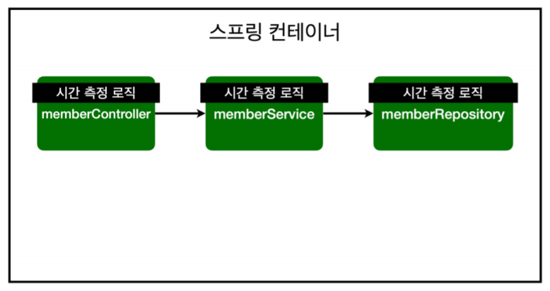
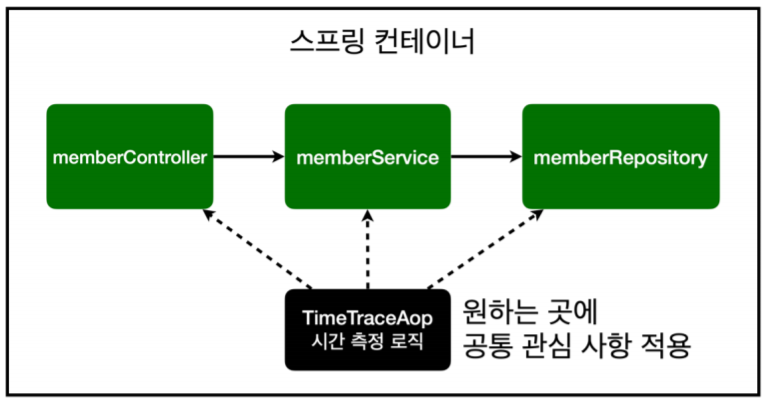
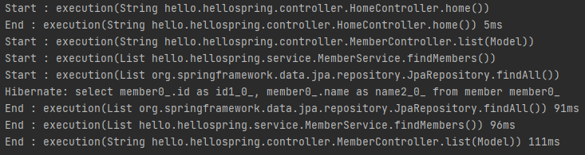
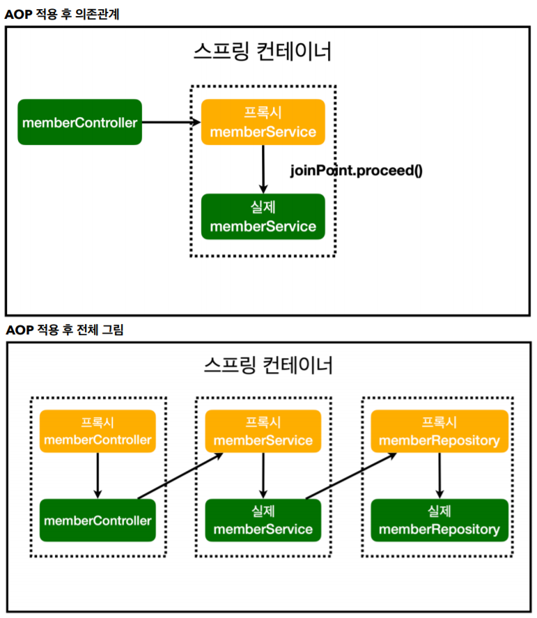
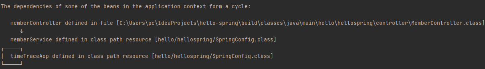

# AOP
{: .no_toc }

## Table of contents
{: .no_toc .text-delta }

1. TOC
{:toc}

---

-   **모든 메소드의 호출 시간을 측정하고 싶다면?**
-   **공통 관심 사항(Cross-Cutting Concern) vs 핵심 관심 사항(Core Concern)**


```java
public Long join(Member member){
    long start = System.currentTimeMillis();
    try{
        // 같은 이름이 있는 중복 회원은 안된다.
        validateDuplicateMember(member);

        memberRepository.save(member);
        return member.getId();
    }
    finally{
        long finish = System.currentTimeMillis();
        long timeMs = finish - start;
        System.out.println("join = " + timeMs + "ms");
    }
}
```
🚨 **문제**
-   회원가입 , 회원 조회에 시간을 측정하는 기능은 핵싱 관심 사항이 아니다.
-   시간을 측정하는 로직은 공통 관심 사항이다.
-   시간을 측정하는 로직과 핵심 비즈니스의 로직이 섞여서 유지보수가 어렵다.
-   시간을 측정하는 로직을 별도의 공통 로직으로 만들기 매우 어렵다.
-   시간을 측정하는 로직을 변경할 때 모든 로직을 찾아가면서 변경해야 한다.

### AOP 적용
-   **AOP : Aspect Oriented Programming**
-   공통 관심 사항(Cross-Cutting Concern) vs 핵심 관심 사항(Core Concern) 분리



**시간 측정 AOP등록**
- 정형화 되지 않고 특수한 기능들은 컴포넌트 스캔보다 직접 자바 빈으로 등록

### SpringConfig
```java
@Configuration
public class SpringConfig {

    private final MemberRepository memberRepository;

    @Autowired
    public SpringConfig(MemberRepository memberRepository){
        this.memberRepository = memberRepository;
    }

    @Bean
    public MemberService memberService(){
        return new MemberService(memberRepository);
    }

    @Bean
    public TimeTraceAop timeTraceAop(){
        return new TimeTraceAop();
    }
//    @Bean
//    public MemberRepository memberRepository(){

//        return new MemoryMemberRepository();
//        return new JdbcMemberRepository(dataSource);
//        return new JdbcTemplateMemberRepository(dataSource);
//        return new JpaMemberRepository(em);
//        return
//    }
}
```
### TimeTraceAop
```java
@Aspect
//@Component
public class TimeTraceAop {

    @Around("execution(* hello.hellospring..*(..)) && !target(hello.hellospring.SpringConfig)")
    // 공통 관심 사항을 어디에 적용 할지 ( 패키지명 + 클래스명 + 파라미터 타입 등등)
    // -> 현재 패키지 하위에는 다 적용
    public Object execute(ProceedingJoinPoint joinPoint) throws Throwable{
        long start = System.currentTimeMillis();
        System.out.println("Start : " + joinPoint.toString());	//메소드 명
        try{
            return joinPoint.proceed();
        }
        finally {
            long finish = System.currentTimeMillis();
            long timeMs = finish - start;
            System.out.println("End : " + joinPoint.toString() + " " + timeMs + "ms");
        }
    }
}
```


✅스프링 컨테이너는 AOP가 있으면 가짜 스프링 빈(프록시)을 생성 하여 실제 스프링 빈을 호출 하기 전 프록시를 호출한다.
{: .fs-3 }


### 📌순환참조 문제
- TimeTraceAop의 AOP 대상을 지정하는 @Around 코드를 보시면,
- SpringConfig의 timeTraceAop() 메서드도 AOP로 처리하게 됩니다. 그런데 이게 바로 자기 자신인 TimeTraceAop를 생성하는 코드인 것이지요.
- **그래서 순환참조 문제가 발생**합니다. 반면에 컴포넌트 스캔을 사용할 때는 AOP의 대상이 되는 이런 코드 자체가 없기 때문에 문제가 발생하지 않았습니다.
- 그러면 **AOP 설정 클래스를 빈으로 직접 등록할 때는 어떻게 문제를 해결하면 될까요? 바로 위와 같이 AOP 대상에서 SpringConfig를 빼주면 됩니다.**
