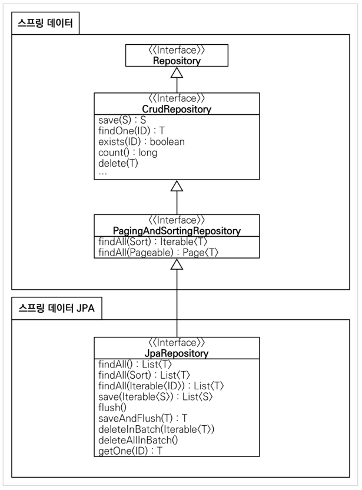

# Spring Data JPA
{: .no_toc }

## Table of contents
{: .no_toc .text-delta }

1. TOC
{:toc}

---
## **Spring Data JPA**
- <span style="color:red; font-weight:bold">주의! Spring Data JPA</span>는 JPA를 편리하게 사용하도록 도와주는 기술이다.
- 따라서 JPA를 먼저 학습한 후에 **Spring Data JPA**를 학습해야 한다
-   스프링 부트와 JPA만 사용해도 개발 생산성이 정말 많이 증가하고 , 개발해야할 코드도 확연히 줄어든다.
-   여기에 **Spring Data JPA**를 사용하면 , 기존의 한계를 넘어 마치 마법처럼 , 리포지토리에 구현 클래스 없이 인터페이스만으로 개발을 완료할 수 있다.
-   그리고 반복 개발해온 기본 CRUD 기능도 **Spring Data JPA**가 모두 제공한다.
-   따라서 개발자는 핵심 비즈니스 로직을 개발하는데 집중할 수 있다.
-   실무에서 관계형 데이터베이스를 사용한다면 **Spring Data JPA**는 선택이 아니라 필수이다.

### **SpringDataJpaMemberRepository**
```java
package hello.hellospring.repository;

import hello.hellospring.domain.Member;
import org.springframework.data.jpa.repository.JpaRepository;

import java.util.Optional;

public interface SpringDataJpaMemberRepository extends JpaRepository<Member, Long> , MemberRepository{

    @Override
    Optional<Member> findByName(String name);

    @Override
    Optional<Member> findById(Long aLong);
}

```
✅Spring Data JPA에서 제공하는 Repository를 구현하고 있으면 Spring Data JPA가 **자동으로 구현체를 등록 해준다.**
{: .fs-3 }


### **SpringConfig**
```java
package hello.hellospring;

import hello.hellospring.repository.*;
import hello.hellospring.service.MemberService;
import org.springframework.beans.factory.annotation.Autowired;
import org.springframework.context.annotation.Bean;
import org.springframework.context.annotation.Configuration;

import javax.persistence.EntityManager;
import javax.sql.DataSource;
import javax.swing.*;

@Configuration
public class SpringConfig {

    private final MemberRepository memberRepository;

    @Autowired
    public SpringConfig(MemberRepository memberRepository){
        this.memberRepository = memberRepository;
    }

    @Bean
    public MemberService memberService(){
        return new MemberService(memberRepository);
    }

//    @Bean
//    public MemberRepository memberRepository(){

//        return new MemoryMemberRepository();
//        return new JdbcMemberRepository(dataSource);
//        return new JdbcTemplateMemberRepository(dataSource);
//        return new JpaMemberRepository(em);
//        return
//    }
}
```


### **Spring Data JPA 제공 기능**
- 인터페이스를 통한 기본적인 CRUD
- findByName() , findById() 처럼 메서드 이름 만으로 조회 기능 제공
- 페이징 기능 자동 제공

### **참고**
- 실무에서는 JPA와 스프링 데이터 JPA를 기본으로 사용하고, 복잡한 동적 쿼리는 Querydsl이라는 라이브러리를 사용하면 된다.
- Querydsl을 사용하면 쿼리도 자바 코드로 안전하게 작성할 수 있고, 동적 쿼리도 편리하게 작성할 수 있다.
- 이 조합으로 해결하기 어려운 쿼리는 JPA가 제공하는 네이티브 쿼리를 사용하거나, 앞서 학습한 스프링 JdbcTemplate를 사용하면 된다.
