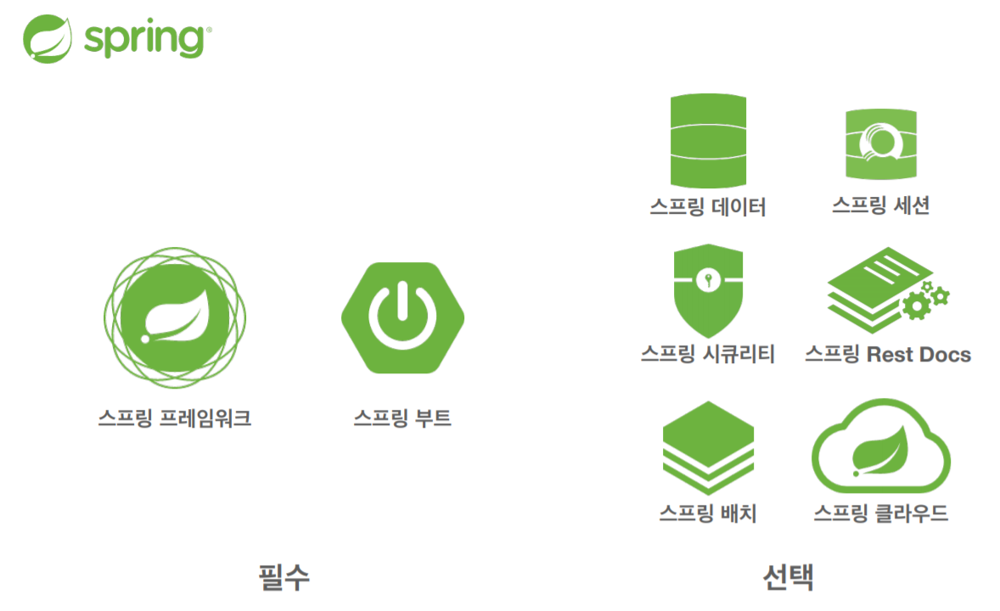
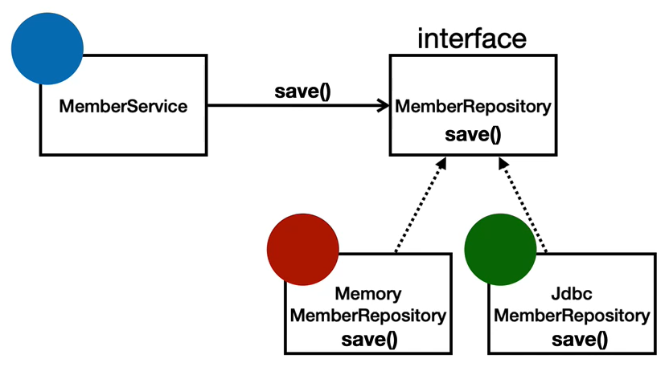

## Table of contents
{: .no_toc .text-delta }

1. TOC
{:toc}
---
## **스프링 이란?** [Github](https://github.com/jdalma/hello-spring)

### **스프링 프레임워크**

-   **핵심 기술** : 스프링 DI 컨테이너 , AOP , 이벤트 , 기타
-   **웹 기술** : 스프링 MVC , 스프링 WebFlux
-   **데이터 접근 기술** : 트랜잭션 , JDBC , ORM지원 , XML지원
-   기술 통합 : 캐시 , 이메일 , 원격접근 , 스케쥴링
-   테스트 : 스프링 기반 테스트 지원
-   언어 : 코틀린 , 그루비
-   최근에는 스프링 부트를 통해서 스프링 프레임워크의 기술들을 편리하게 사용

### **스프링 부트**

-   **스프링을 편리하게 사용할 수 있도록 지원 , 최근에는 기본으로 사용**
-   단독으로 실행할 수 있는 스프링 애플리케이션을 쉽게 생성
-   Tomcat 같은 웹 서버를 내장해서 별도의 웹 서버를 설치하지 않아도 됨
-   손쉬운 빌드 구성을 위한 starter 종속성 제공
-   스프링과 3rd parth(외부) 라이브러리 자동 구성
    -   버전별 관리를 스프링 부트가 알아서 해줌
-   메트릭 , 상태 확인 , 외부 구성 같은 프로덕션 준비 기능 제공
-   관례에 의한 간결한 설정을 사용

### **스프링의 핵심 개념 , 컨셉**

-   스프링은 자바 언어 기반의 프레임워크
-   자바 언어의 가장 큰 특징 - **객체 지향 언어**
-   스프링은 객체 지향 언어가 가진 강력한 특징을 살려내는 프레임워크
-   스프링은 **좋은 객체 지향 애플리케이션**을 개발할 수 있게 도와주는 프레임워크

### **✅ 좋은 객체 지향 프로그래밍?**

-   <strong>"객체"</strong>들의 모임 , 각각의 객체는 메세지를 주고받고 , 데이터를 처리 할 수 있다.
-   유연하고 변경이 용이 -> 컴포넌트를 쉽고 유연하게 변경하면서 개발할 수 있는 방법

### **✅ 다형성**

-   역할과 구현을 분리
-   역할 : 인터페이스(안정적으로 잘 설계하는 것이 중요)
-   구현 : 인터페이스를 구현한 클래스 , 구현 객체
-   객체를 설계할 때 **역할**과 **구현**을 명확히 분리
-   객체 설계시 역할(인터페이스)을 먼저 부여하고 , 그 역할을 수행하는 구현 객체 만들기
-   **클라이언트를 변경하지 않고 , 서버의 구현 기능을 유연하게 변경할 수 있다.**
-   **스프링에서 이야기하는 제어의 역전(IoC), 의존관계 주입(DI)은 다형성을 활용해서 역할과 구현을 편리하게 다룰 수 있도록 지원한다.**

## **스프링 입문 - 코드로 배우는 스프링 부트, 웹 MVC, DB 접근 기술 - 인프런**

스프링 입문자가 예제를 만들어가면서 <strong>`스프링 웹 애플리케이션 개발 전반`</strong>을 빠르게 학습할 수 있습니다.
초급 프레임워크 및 라이브러리 웹 개발 서버 개발 Back-End Java Spring MVC Spring Boot 온라인

### [www.inflearn.com](https://www.inflearn.com/course/%EC%8A%A4%ED%94%84%EB%A7%81-%EC%9E%85%EB%AC%B8-%EC%8A%A4%ED%94%84%EB%A7%81%EB%B6%80%ED%8A%B8/dashboard)
