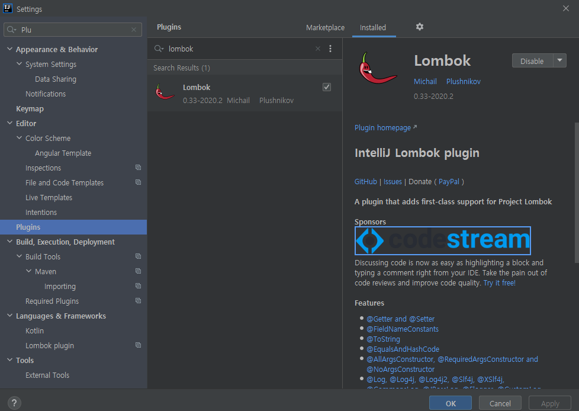
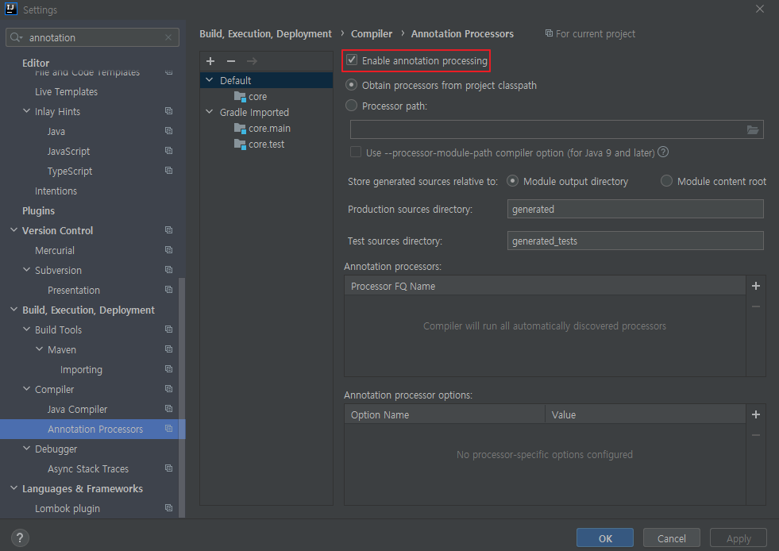

## Table of contents
{: .no_toc .text-delta }

1. TOC
{:toc}
---

## **설정**

**build.gradle**
{: .fh-default .fs-4 }

```java
plugins {
	id 'org.springframework.boot' version '2.3.7.RELEASE'
	id 'io.spring.dependency-management' version '1.0.10.RELEASE'
	id 'java'
}

group = 'hello'
version = '0.0.1-SNAPSHOT'
sourceCompatibility = '11'

//lombok 설정 추가 시작
configurations {
	compileOnly{
		extendsFrom annotationProcessor
	}
}
//lombok 설정 추가 끝

repositories {
	mavenCentral()
}

dependencies {
	implementation 'org.springframework.boot:spring-boot-starter'
	//lombok 라이브러리 추가 시작
	compileOnly 'org.projectlombok:lombok'
	annotationProcessor 'org.projectlombok:lombok'
	testCompileOnly 'org.projectlombok:lombok'
	testAnnotationProcessor 'org.projectlombok:lombok'
	//lombok 라이브러리 추가 끝
	testImplementation('org.springframework.boot:spring-boot-starter-test') {
		exclude group: 'org.junit.vintage', module: 'junit-vintage-engine'
	}
}

test {
	useJUnitPlatform()
}

```

> **플러그인 추가 (File -> Settings -> Plugin)**


> **Annotation Processing 활성화 (File -> Settings -> Annotation Processors)**


## **예제**

```java
@Getter
@Setter
@ToString
@NoArgsConstructor	// 인자 없는 생성자
public class HelloLombok {
    private String name;

    private int age;

    @ToString.Exclude	// toString 메소드에서 제외
    private String address;

    public static void main(String[] args) {
       HelloLombok helloLombok1 = new HelloLombok();
       helloLombok1.setName("test1");
       helloLombok1.setAge(99);
       helloLombok1.setAddress("seoul");
       System.out.println(helloLombok1.toString());

       // HelloLombok(name=test1, age=99)
    }
}
```

```java
@ToString
@AllArgsConstructor
public class HelloLombok {
    @ToString.Exclude
    private String name;

    private int age;

    private String address;

    public static void main(String[] args) {
       HelloLombok helloLombok1 = new HelloLombok("test2" , 88 , "busan");
       System.out.println(helloLombok1.toString());
       // HelloLombok(age=88, address=busan)
    }
}
```

```java
@Component
@RequiredArgsConstructor   // final로 선언된 필드를 모아 생성자를 만들어준다.
public class OrderServiceImpl implements OrderService{

    private final MemberRepository memberRepository;
    private final DiscountPolicy discountPolicy;

//    @Autowired
//    public OrderServiceImpl(MemberRepository memberRepository, DiscountPolicy discountPolicy) {
//        this.memberRepository = memberRepository;
//        this.discountPolicy = discountPolicy;
//    }
}
```


> ✋
> -   **`@NonNull`**
>      -   null 체크 구문을 생성해준다. (null 일시 NPE 예외)
> -   **`@Getter` , `@Setter`**
>      -   메소드 접근 지정자 변경 - `@Setter(AccessLevel.PACKAGE)`
> -   **`@Data`**
>      -   `@ToString` , `@EqualsAndHashCode` , `@Getter`  , `@Setter` , `@RequiredArgsConstructor` 모두 적용
> -   **`@Builder`**
>      -   Builder Pattern을 생성해준다

## **읽어보기**

[실무에서 Lombok 사용법](https://cheese10yun.github.io/lombok/)
