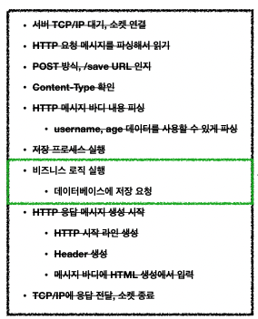
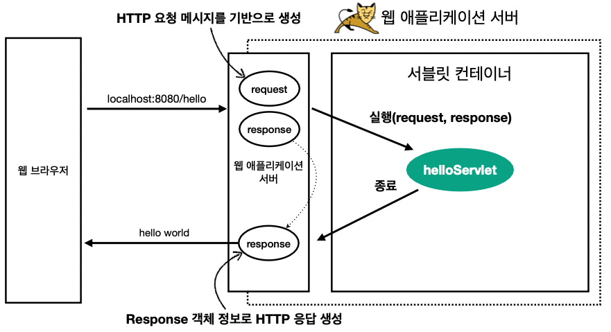
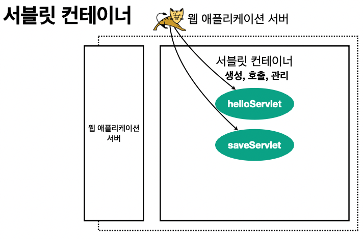
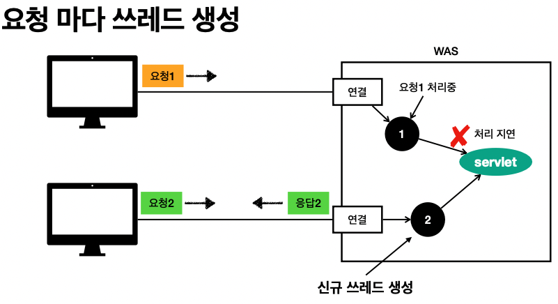

## Table of contents
{: .no_toc .text-delta }

1. TOC
{:toc}

---

# **Servlet**

- [Spring MVC 강의](https://www.inflearn.com/course/%EC%8A%A4%ED%94%84%EB%A7%81-mvc-1/dashboard)를 보다가 서블릿을 확실히 이해하고자 정리한다.
- `Http` 요청과 응답을 개발자가 어떻게 편하게 구현할까가 포인트




- **서블릿을 지원하는 WAS를 사용하면 위 이미지의 검은 실선의 작업들을 서블릿이 직접 수행 해준다고한다.**
- **Servlet**으로 구현한 [코드](https://github.com/jdalma/Project/blob/master/TEAM_Model2_JSP/src/com/ode/member/MemberController.java)를 확인해보자
- ~~프로젝트를 진행하면서 서블릿을 사용하였지만 확실한 개념은 없었다..~~

```java
@WebServlet("/member/*")
public class MemberController extends HttpServlet {
	
	MemberVO memberVO;
	MemberService memberService;
	HttpSession session;
	String totalEmail;
	public MemberController(){
		memberService = new MemberService();
	}


	@Override
	protected void doGet(HttpServletRequest request, HttpServletResponse response) 
			throws ServletException, IOException {
		doHandle(request,response);
	}
	
	@Override
	protected void doPost(HttpServletRequest request, HttpServletResponse response) 
			throws ServletException, IOException {
		doHandle(request,response);
	}
    ...
```

> - `HttpServletRequest`, `HttpServletResponse`를 사용할 때 가장 중요한 점은 이 객체들이 **HTTP 요청 메시지**, **HTTP 응답 메시지**를 편리하게 사용하도록 도와주는 객체라는 점이다. 
> - 따라서 이 기능에 대해서 깊이있는 이해를 하려면 **HTTP 스펙이 제공하는 요청, 응답 메시지 자체를 이해해야 한다.**



1. **WAS**는 **HTTP 요청 메세지를 기반으로** `Request`와 `Response` 객체를 새로 만들어 서블릿 객체를 호출한다.
1. `/member/*` 해당 패턴과 같다면 서블릿 코드가 실행된다.
1. **WAS**는 `Response`에 담겨있는 내용으로 **HTTP 응답 정보를 생성한다.**

## **Request** `Header` , `Cookie` , `Content` 꺼내보기 

```
--- REQUEST-LINE - start ---
request.getMethod() = GET
request.getProtocal() = HTTP/1.1
request.getScheme() = http
request.getRequestURL() = http://localhost:8080/request-header
request.getRequestURI() = /request-header
request.getQueryString() = username=test
request.isSecure() = false
--- REQUEST-LINE - end ---

--- Headers - start ---
host: host
connection: connection
sec-ch-ua: sec-ch-ua
sec-ch-ua-mobile: sec-ch-ua-mobile
sec-ch-ua-platform: sec-ch-ua-platform
upgrade-insecure-requests: upgrade-insecure-requests
user-agent: user-agent
accept: accept
sec-fetch-site: sec-fetch-site
sec-fetch-mode: sec-fetch-mode
sec-fetch-user: sec-fetch-user
sec-fetch-dest: sec-fetch-dest
accept-encoding: accept-encoding
accept-language: accept-language
cookie: cookie
--- Headers - end ---

--- Header 편의 조회 start ---
[Host 편의 조회]
request.getServerName() = localhost
request.getServerPort() = 8080

[Accept-Language 편의 조회]
locale = ko_KR
locale = ko
locale = en_US
locale = en
request.getLocale() = ko_KR

[cookie 편의 조회]
_ga: GA1.1.474794587.1646384192
_ga_G0S23DCS1G: GS1.1.1646437723.2.0.1646437723.0

[Content 편의 조회]
request.getContentType() = null
request.getContentLength() = -1
request.getCharacterEncoding() = UTF-8
--- Header 편의 조회 end ---

--- 기타 조회 start ---
[Remote 정보]
request.getRemoteHost() = 0:0:0:0:0:0:0:1
request.getRemoteAddr() = 0:0:0:0:0:0:0:1
request.getRemotePort() = 63665

[Local 정보]
request.getLocalName() = localhost
request.getLocalAddr() = 0:0:0:0:0:0:0:1
request.getLocalPort() = 8080
--- 기타 조회 end ---
```

## **Request 와 Response는 실제로 어떻게 객체로 만들어질까??** 🚩

# **Servlet Container**



- **Servlet Container**가 `/member/*` 해당 **Servlet**을 호출하여 주고 객체의 생명주기를 담당한다. **(싱글톤으로 관리)**
- 톰캣처럼 서블릿을 지원하는 **WAS**를 **Servlet Container**라고 한다.
- JSP도 서블릿으로 변환되어서 사용한다. ❓
- **동시 요청을 위한 멀티 쓰레드 처리를 지원한다.** 📌

# **Multi Thread**

- **서블릿 객체를 누가 호출하지?** ➔ 쓰레드 



- **장점**
  - 동시 요청을 처리 가능
  - 리소스가 허용될 때 까지 처리가능
  - 하나의 쓰레드가 지연되어도 , 나머지 쓰레드는 정상 동작한다.
- **단점**
  - 쓰레드는 생성 비용은 매우 비싸다.
  - 쓰레드는 컨텍스트 스위칭 비용이 발생한다.
  - 쓰레드 생성에 제한이 없어 , CPU 또는 메모리 임계점을 넘을수도 있다.


## **Thread Pool**
- 쓰레드가 필요하면 이미 생성되어 있는 쓰레드를 꺼내어 사용 후 반납
- 초과 시 **대기 또는 거절**할 수 있다.
  - 톰캣은 최대 200개 기본 설정
- 쓰레드가 미리 생성되어 있고 , 쓰레드를 생성하고 종료하는 비용이 절약되고 , 응답시간이 빠르다.
- **WAS**의 주요 튜닝 포인트는 최대 쓰레드 수이다.
  - 적정 숫자는 로직의 복잡도 , CPU , 메모리 , IO 리소스 상황에 따라 모두 다름
  - 성능 테스트 툴 : 아파치 ab , Jmeter , **nGrinder**

## **[RequestContextHolder , Child Thread도 똑같은 RequestContextHolder 가져오기](https://gompangs.tistory.com/entry/Spring-RequestContextHolder)**
## **[Spring RequestContextHolder - 어디서든 HttpServletReqeust 사용하기](http://dveamer.github.io/backend/SpringRequestContextHolder.html)**
