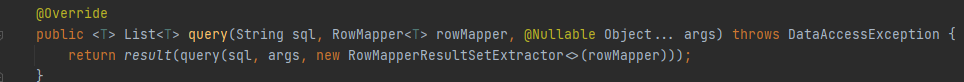

스프링 JdbcTemplate과 MyBatis같은 라이브러리는 JDBC API에서 본 반복 코드를 대부분 제거해준다.하지만 SQL은 직접 작성해야한다
{: .label .blue-label}

### JdbcTemplateMemberRepository
```java
public class JdbcTemplateMemberRepository implements MemberRepository {

    private final JdbcTemplate jdbcTemplate;

    // @Autowired 생성자가 한개라면 생략 가능
    public JdbcTemplateMemberRepository(DataSource dataSource) {
        this.jdbcTemplate = new JdbcTemplate(dataSource);
    }

    @Override
    public Member save(Member member) {
        SimpleJdbcInsert jdbcInsert = new SimpleJdbcInsert(jdbcTemplate);
        jdbcInsert.withTableName("member").usingGeneratedKeyColumns("id");

        Map<String, Object> parameters = new HashMap<>();
        parameters.put("name", member.getName());

        Number key = jdbcInsert.executeAndReturnKey(new MapSqlParameterSource(parameters));
        member.setId(key.longValue());
        return member;
    }


    @Override
    public Optional<Member> findById(Long id) {
        List<Member> result = jdbcTemplate.query("select * from member where id = ?" , memberRowMapper() , id);
        return result.stream().findAny();
    }

    @Override
    public Optional<Member> findByName(String name) {
        List<Member> result = jdbcTemplate.query("select * from member where name = ?" , memberRowMapper() , name);
        return result.stream().findAny();
    }

    @Override
    public List<Member> findAll() {
        return jdbcTemplate.query("select * from member" , memberRowMapper());
    }

    private RowMapper<Member> memberRowMapper(){
        return (rs, rowNum) -> {
            Member member = new Member();
            member.setId(rs.getLong("id"));
            member.setName(rs.getString("name"));
            return member;
        };
    }
}
```

✅ **query메소드**
- query() 메소드는 파라미터의 sql을 실행하고, **결과로 나온 ResultSet을 RowMapper가 JAVA의 객체로 변환한다.** 그리고 sql 파라미터가 **인덱스 기반 파라미터를 가진 쿼리**(preparedStatement의 물음인 경우) 각 파라미터의 값을 args로 지정한다.

**람다 적용**
```java
//람다 변경 전
	return new RowMapper<Member>() {
            @Override
            public Member mapRow(ResultSet rs, int rowNum) throws SQLException {
                Member member = new Member();
                member.setId(rs.getLong("id"));
                member.setName(rs.getString("name"));
                return member;
            }
        };

//람다 변경 후
	return (rs, rowNum) -> {
            Member member = new Member();
            member.setId(rs.getLong("id"));
            member.setName(rs.getString("name"));
            return member;
        };

```
✅**SimpleJdbcTemplate 클래스는 JdbcTemplate 과 NamedParameterJdbcTemplate 을 합쳐 놓은 템플릿 클래스**
이름 기반의 파라미터 설정과 인덱스 기반의 파라미터 설정을 모두 지원한다.
이름 기반의 파라미터를 설정할 때에는 Map과 SqlParameterSource 두 가지 방법을 모두 사용할 수 있다.
