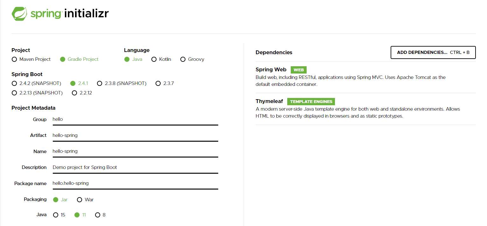
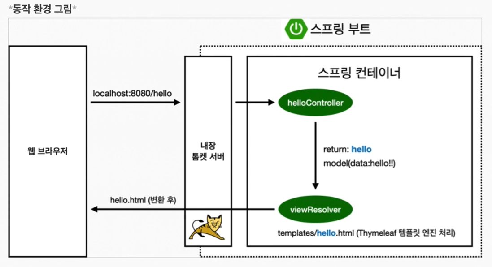
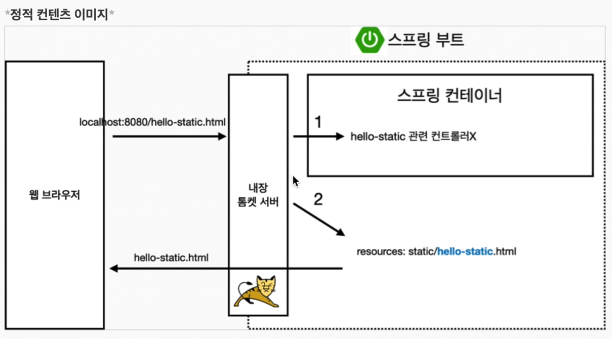
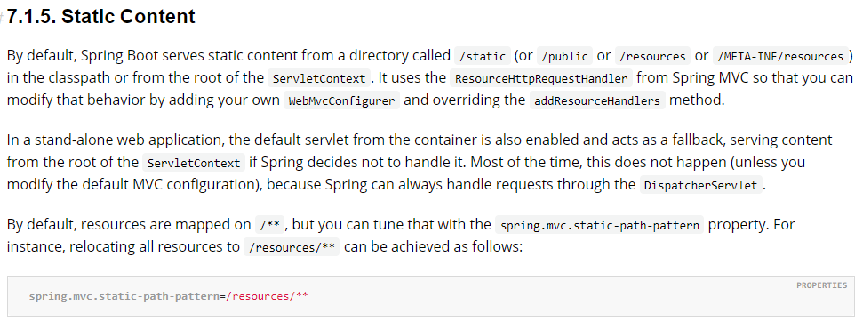
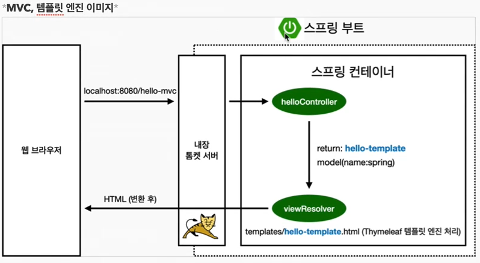

### Gradle은 의존관계가 있는 라이브러리를 함께 다운로드 한다.
-   **`spring-boot-starter-web`**
    -   spring-boot-starter-tomcat:톰캣
    -   spring-webmvc:스프링 웹 MVC
-   **`spring-boot-starter-thymeleaf`**:타임리프 템플릿 엔진(View)
    -   spring-boot-starter(공통): 스프링부트 + 스프링코어 + 로깅
    -   spring-boot
    -   spring-core
-   **`spring-boot-starter-logging`**
    -   logback , SLF4J 많이쓰임
### 테스트 라이브러리
-   **`spring-boot-starter-test`**
    -   junit : 테스트 프레임워크
    -   mockito : 목 라이브러리
    -   assertj : 테스트 코드를 좀 더 편하게 작성하게 도와주는 라이브러리
    -   spring-test : 스프링 통합 테스트 지원




```java
@Controller
public class HelloController{
    @GetMapping("hello")
    public String hello(Model model){
        model.addAttribute("data" , "hello");
        return "hello";
    }
}
```

```html
<!DOCTYPE HTML>
<html xmlns:th="http://wwww.thymeleaf.org">
<head>
    <title>hello</title>
    <meta http-equiv="Content-Type" content="text/html; charset=UTF-8">
</head>
<body>
    <p th:text="'안녕하세요.' + ${data}">안녕하세요. 손님</p>
</body>
</html>
```
---
## 정적 컨텐츠



[참고](https://docs.spring.io/spring-boot/docs/2.3.7.RELEASE/reference/html/spring-boot-features.html#boot-features-spring-mvc-static-content)

## MVC와 템플릿 엔진


## API 방식
<center></center>

## **`@ResponseBody`**

-   View를 반환하는 것이 아닌 데이터(JSON) 그 자체를 반환한다.
-   HTTP의 BODY에 문자 내용을 직접 반환
-   viewResolver 대신에 **`HttpMessageConverter`**가 동작
-   기본 문자 처리 : **`StringHttpMessageConverter`**
-   기본 객체 처리 : **`MappingJackson2HttpMessageConverter`**
-   (객체 -> JSON으로 변환 대표적인 라이브러리 Jackson)
-   byte 처리 등등 기타 여러 HttpMessageConvert가 Default

>클라이언트의 HTTP Accept 헤더 와 서버의 컨트롤러 반환 타입 정보 둘을 조합해서 'HTTPMessageConvert'가 선택된다.