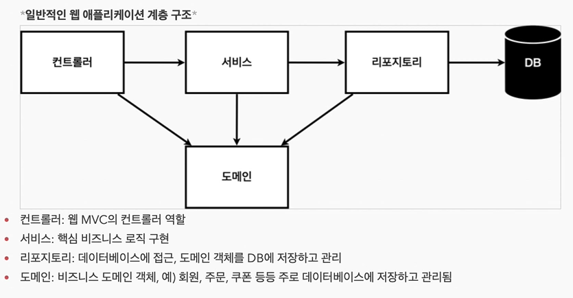
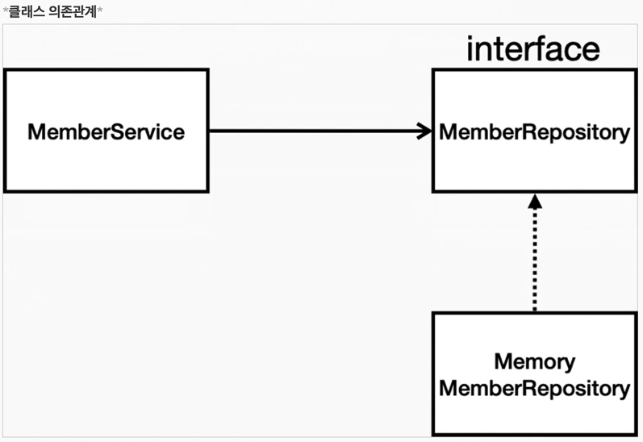
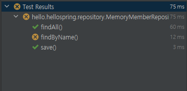
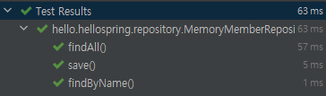
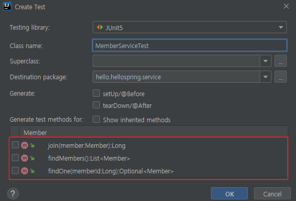
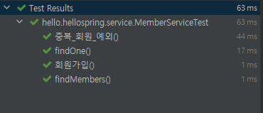

#### 데이터 : `회원ID , 이름`
#### 기능 : `회원등록 , 조회`





## Repository 개발

### MemberRepository.java - interface

```java
package hello.hellospring.repository;


import hello.hellospring.domain.Member;

import java.util.List;
import java.util.Optional;

public interface MemberRepository {
    Member save(Member member);
    Optional<Member> findById(Long id);
    Optional<Member> findByName(String name);
    List<Member> findAll();
}
```

### MemoryMemberRepository.java - impl

```java
package hello.hellospring.repository;

import hello.hellospring.domain.Member;

import java.util.*;

public class MemoryMemberRepository implements MemberRepository{

    private static Map<Long , Member> store = new HashMap<>();
    private static long sequence = 0L;

    @Override
    public Member save(Member member) {
        member.setId(++sequence);
        store.put(member.getId() , member);
        return member;
    }

    @Override
    public Optional<Member> findById(Long id) {
        return Optional.ofNullable(store.get(id));
    }

    @Override
    public Optional<Member> findByName(String name) {
        return store.values().stream()
                .filter(member -> member.getName().equals(name))
                .findAny();
    }

    @Override
    public List<Member> findAll() {
        return new ArrayList<>(store.values());
    }

    public void clearStore(){
        store.clear();
    }
}
```
---
**테스트 케이스**
>개발한 기능을 실행해서 테스트 할 때 자바의 main 메서드를 통해서 실행하거나 ,
>웹 어플리케이션의 컨트롤러를 통해서 해당 기능을 실행한다.
>이러한 방법은 준비하고 실행하는데 오래 걸리고 , 반복 실행하기 어렵고 여러 테스트를 한번에 실행하기 어렵다는 단점이 있다.
>자바는 Junit이라는 프레임워크로 테스트를 실행해서 이러한 문제를 해결한다.

```java
package hello.hellospring.repository;


import hello.hellospring.domain.Member;
import org.junit.jupiter.api.AfterEach;
import org.junit.jupiter.api.Test;
import org.assertj.core.api.Assertions;

import java.util.List;

import static org.junit.jupiter.api.Assertions.*;


class MemoryMemberRepositoryTest {
    MemoryMemberRepository repository = new MemoryMemberRepository();

    @AfterEach
    public void afterEach(){
        repository.clearStore();
    }

    @Test
    public void save(){
        Member member = new Member();
        member.setName("spring");

        repository.save(member);

        Member result = repository.findById(member.getId()).get();
        assertEquals(member , result);
//        assertThat(member).isEqualTo(result);
    }

    @Test
    public void findByName(){
        Member member1 = new Member();
        member1.setName("spring1");
        repository.save(member1);

        Member member2 = new Member();
        member2.setName("spring2");
        repository.save(member2);

        Member result = repository.findByName("spring2").get();

        Assertions.assertThat(result).isEqualTo(member2);
    }

    @Test
    public void findAll(){
        Member member1 = new Member();
        member1.setName("spring1");
        repository.save(member1);

        Member member2 = new Member();
        member2.setName("spring2");
        repository.save(member2);

        List<Member> result = repository.findAll();

        Assertions.assertThat(result.size()).isEqualTo(2);
    }
}
```
- `@Test` : 테스트의 대상으로 인식한다.
- `@AfterEach` : 테스트가 끝날때 마다 호출된다.


**AfterEach미작성 시**
: 
: findByName테스트가 실패한다.
: 테스트의 실행순서는 보장이 되지않고 , 각 테스트들은 순서에 의존 되어서는 안된다.

**AfterEach 작성 후**
: 

* * *

## Service 개발
### MemberService.java

```java
package hello.hellospring.service;

import hello.hellospring.domain.Member;
import hello.hellospring.repository.MemberRepository;
import hello.hellospring.repository.MemoryMemberRepository;

import java.util.List;
import java.util.Optional;

public class MemberService {
    private final MemberRepository memberRepository;

    public MemberService(MemberRepository memberRepository) {
        this.memberRepository = memberRepository;
    }

    public Long join(Member member){
        // 같은 이름이 있는 중복 회원은 안된다.
        validateDuplicateMember(member);

        memberRepository.save(member);
        return member.getId();
    }

    private void validateDuplicateMember(Member member) {
        memberRepository.findByName(member.getName())
                .ifPresent( m -> {
                    throw new IllegalStateException("이미 존재하는 회원입니다.");
                });
    }

    public List<Member> findMembers(){
        return memberRepository.findAll();
    }

    public Optional<Member> findOne(Long memberId){
        return memberRepository.findById(memberId);
    }
}
```
* * *

**테스트코드 생성(Ctrl+Shift+T)**
: 

#### MemberServiceTest.Java
```java
package hello.hellospring.service;

import hello.hellospring.domain.Member;
import hello.hellospring.repository.MemberRepository;
import hello.hellospring.repository.MemoryMemberRepository;
import org.assertj.core.api.Assertions;
import org.junit.jupiter.api.AfterEach;
import org.junit.jupiter.api.BeforeEach;
import org.junit.jupiter.api.Test;
import org.mockito.internal.matchers.Null;

import static org.junit.jupiter.api.Assertions.*;

class MemberServiceTest {

    MemoryMemberRepository memberRepository;
    MemberService memberService;

    @BeforeEach
    public void beforeEach(){
        memberRepository = new MemoryMemberRepository();
        memberService = new MemberService(memberRepository);
    }

    @AfterEach
    public void afterEach(){
        memberRepository.clearStore();
    }

    @Test
    void 회원가입() {
        //given
        Member member = new Member();
        member.setName("hello");

        //when
        Long saveId = memberService.join(member);

        //then
        Member findMember = memberService.findOne(saveId).get();
        Assertions.assertThat(member.getName()).isEqualTo(findMember.getName());
    }

    @Test
    void 중복_회원_예외(){
        //given
        Member member1 = new Member();
        member1.setName("spring");

        Member member2 = new Member();
        member2.setName("spring");

        //when
        memberService.join(member1);
        IllegalStateException e = assertThrows(IllegalStateException.class , () -> memberService.join(member2));

        Assertions.assertThat(e.getMessage()).isEqualTo("이미 존재하는 회원입니다.");

//        memberService.join(member1);
//        try{
//            memberService.join(member2);
//            fail();
//        }
//        catch(IllegalStateException e){
//            Assertions.assertThat(e.getMessage()).isEqualTo("이미 존재하는 회원입니다.");
//        }

        //then

    }

    @Test
    void findMembers() {
    }

    @Test
    void findOne() {
    }
}
```


**테스트**
: 
: **테스트 코드는 실제 프로젝트 빌드 코드와 무관하기 때문에 테스트 이름을 직관적이게 한글로도 가능하다.**
: `@BeforeEach`  테스트 코드가 실행 되기 전 실행된다.
: `중복_회원_예외()`
  - assertThrows
  - IllegalStateException e = assertThrows(IllegalStateException.class , () -> memberService.join(member2));
    - memberService.join(member2) 메소드를 실행 하였을 때 IllegalStateException 이라는 예외가 발생 하는지
  - Assertions.assertThat(e.getMessage()).isEqualTo("이미 존재하는 회원입니다.");
    - 발생 한다면 IllegalStateException e 의 메세지와 memberService.join()에서 반환 되는 예외 메세지와 같은지 비교한다
