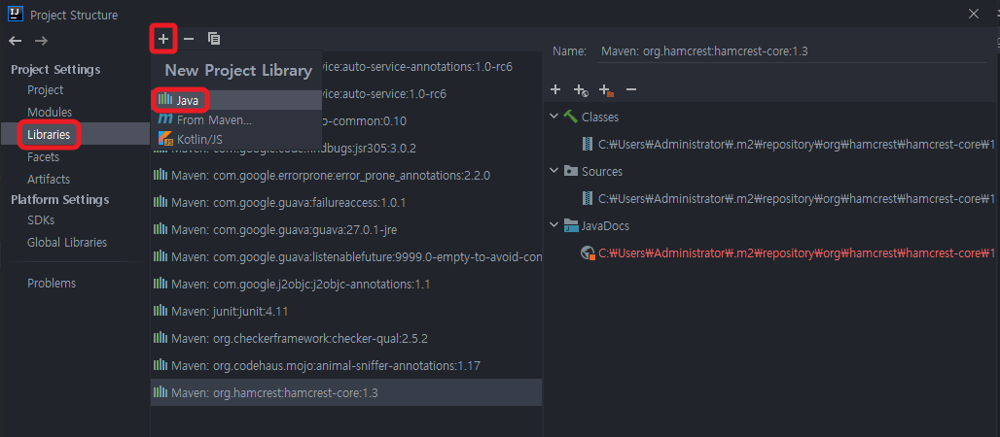
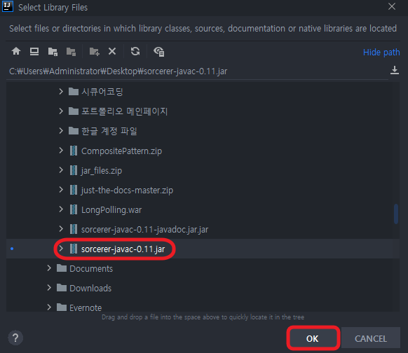
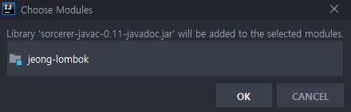
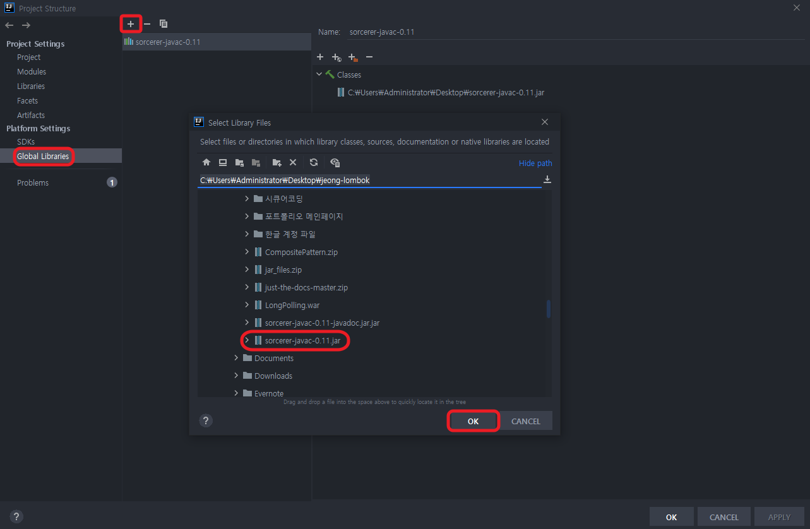
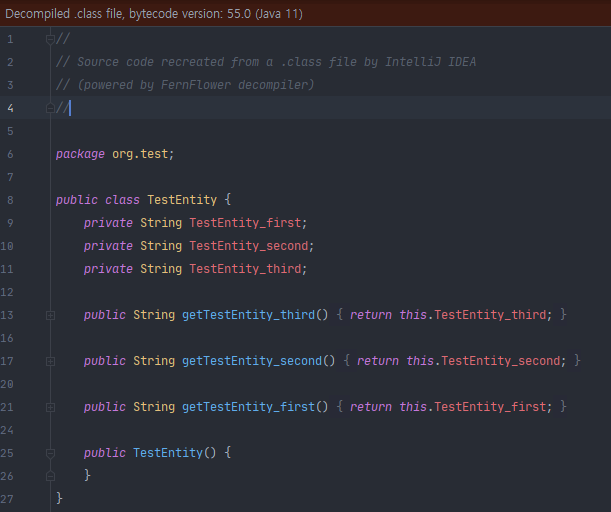
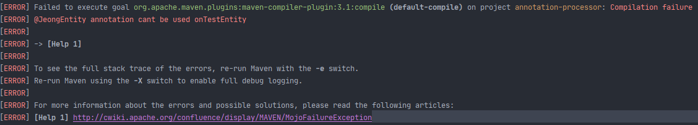
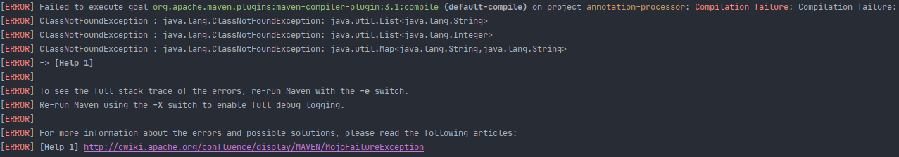

## Table of contents
{: .no_toc .text-delta }

1. TOC
{:toc}

---

# ✋**Java11 com.sun import 문제**
- [JDK 9 이상 내부 API의 javac를 사용하지 못하는 이유](https://jeongcode.github.io/docs/exception/Java/#jdk-comsun-import-%EB%AC%B8%EC%A0%9C)
- `com.sun.*` JDK 9 이상 부터 모듈 기능이 추가 되면서 내부 라이브러리를 보호하게 되었다고한다. 메이븐 추가 설정 시 내부 라이브러리를 사용할 수 있지만 권장하지는 않는다고 한다.
- 이러한 이유로 외부 라이브러리 [javac.jar](https://jar-download.com/artifacts/org.kohsuke.sorcerer/sorcerer-javac/0.11/source-code)를 추가하여 아래의 방법을 사용해보았지만
- `package com.sun.tools.javac.util is declared in module jdk.compiler, which does not export it to the unnamed module` 예외는 계속 발생하였다.

## 외부 라이브러리 등록
1. Project Structure - (Shift + Ctrl + Alt + S)
- 
1. 원하는 .jar 선택
- 
1. 프로젝트 선택
- 

> 🚨 **Global Libraries설정**
> - 

## maven 의존성 추가
```html
<dependency>
  <groupId>org.kohsuke.sorcerer</groupId>
  <artifactId>sorcerer-javac</artifactId>
  <version>0.11</version>
</dependency>
```

## 정리
- **확실한 원인은 모르지만 당장은** <span style="color:red; font-weight:bold">JDK 8 버전으로 진행</span>
> Java 9에서 소개 된 Jigsaw 이전에 maven은 javac클래스를 참조하는 프로젝트를 빌드하기 위해 컴파일 타임 에 클래스 경로에 jar를 전달해야합니다
> **Maven jdk.tools 래퍼 의존성 추가 [출처](https://github.com/olivergondza/maven-jdk-tools-wrapper)**
> ```html
> <dependency>
> <groupId>com.github.olivergondza</groupId>
>  <artifactId>maven-jdk-tools-wrapper</artifactId>
> <version>0.1</version>
> </dependency>
> ```

# **Jeong-Lombok** [Github](https://github.com/jeongcode/jeong-lombok)
- 롬복은 내부 컴파일러 `com.sun.*`를 사용하여 추상구문트리를 직접 수정한다.
- **[JavaPoet](https://www.baeldung.com/java-poet)** 을 사용하여 클래스에서만 사용되는 `@JeongPoetGetter`를 만들어 보자
- **JavaPoet , AnnotationProcessor , Reflection , 자바컴파일러** 의 이해를 위한 프로젝트이다.
- 먼저 예시인 `@JeongGetter`를 통해 AST를 직접 조작하는 코드를 보자
- JDK 8 , IntelliJ 2020.2.4

📌 **[Lombok은 어떻게 동작하는걸까? (AnnotationProcessor에 대해)](https://jeongcode.github.io/docs/java/Annotation%20Processor/)**
{: .fh-default .fs-4 }

📌 **[Java 컴파일러](https://jeongcode.github.io/docs/java/javac-principle/)**
{: .fh-default .fs-4 }

## **`com.sun.*` 사용 예시**

### **`@JeongGetter`**

📌 **[Getter 참고](https://catch-me-java.tistory.com/49)**
{: .fh-default .fs-4 }
- [juejin.cn](https://juejin.cn/post/6844904082084233223#heading-1)

- com.sun.* 사용

```java
@AutoService(Processor.class)
@SupportedAnnotationTypes("org.example.JeongGetter")
@SupportedSourceVersion(SourceVersion.RELEASE_8)
public class GetterProcessor extends AbstractProcessor {

    private Messager messager;
    private ProcessingEnvironment processingEnvironment;
    private Trees trees;
    private TreeMaker treeMaker;
    private Names names;
    private Context context;

    @Override
    public synchronized void init(ProcessingEnvironment processingEnv) {
        super.init(processingEnv);
        JavacProcessingEnvironment javacProcessingEnvironment = (JavacProcessingEnvironment) processingEnv;
        this.processingEnvironment = processingEnv;
        this.messager = processingEnv.getMessager();
        this.trees = Trees.instance(processingEnv);
        this.context = javacProcessingEnvironment.getContext();
        this.treeMaker = TreeMaker.instance(context);
        this.names = Names.instance(context);
    }

    @Override
    public boolean process(Set<? extends TypeElement> annotations, RoundEnvironment roundEnv) {
        System.out.println("call process =" + annotations);
        TreePathScanner<Object, CompilationUnitTree> scanner = new TreePathScanner<Object, CompilationUnitTree>(){
            @Override
            public Trees visitClass(ClassTree classTree, CompilationUnitTree unitTree){
                JCTree.JCCompilationUnit compilationUnit = (JCTree.JCCompilationUnit) unitTree;
                if (compilationUnit.sourcefile.getKind() == JavaFileObject.Kind.SOURCE){
                    compilationUnit.accept(new TreeTranslator() {
                        @Override
                        public void visitClassDef(JCTree.JCClassDecl jcClassDecl) {
                            super.visitClassDef(jcClassDecl);
                            List<JCTree> fields = jcClassDecl.getMembers();
                            System.out.println("class name = " + jcClassDecl.getSimpleName());
                            for(JCTree field : fields){
                                System.out.println("class field = " + field);
                                if (field instanceof JCTree.JCVariableDecl){
                                    List<JCTree.JCMethodDecl> getters = createGetter((JCTree.JCVariableDecl) field);
                                    for(JCTree.JCMethodDecl getter : getters){
                                        jcClassDecl.defs = jcClassDecl.defs.prepend(getter);
                                    }
                                }
                            }
                        }
                    });
                }
                return trees;
            }
        };

        for (final Element element : roundEnv.getElementsAnnotatedWith(JeongGetter.class)) {
            System.out.println("call process - getPath() element = " + element);
            if(element.getKind() != ElementKind.CLASS){
                processingEnv.getMessager().printMessage(Diagnostic.Kind.ERROR, "@JeongGetter annotation cant be used on" + element.getSimpleName());
            }else{
                processingEnv.getMessager().printMessage(Diagnostic.Kind.NOTE, "@JeongGetter annotation Processing " + element.getSimpleName());
                final TreePath path = trees.getPath(element);
                scanner.scan(path, path.getCompilationUnit());
            }
        }
        return true;
    }

    public List<JCTree.JCMethodDecl> createGetter(JCTree.JCVariableDecl var){
        String str = var.name.toString();
        String upperVar = str.substring(0,1).toUpperCase()+str.substring(1,var.name.length());
        System.out.println(str + " Create Getter");
        return List.of(
                // treeMaker.Modifiers -> syntax tree node 에 접근하여 수정 및 삽입하는 역할
                treeMaker.MethodDef(
                        treeMaker.Modifiers(1), // public
                        names.fromString("get".concat(upperVar)), // 메서드 명
                        (JCTree.JCExpression) var.getType(), // return type
                        List.nil(),
                        List.nil(),
                        List.nil(),
                        treeMaker.Block(1, List.of(treeMaker.Return((treeMaker.Ident(var.getName()))))),
                        null));
    }
}
```

```
call process =[org.example.JeongGetter]
call process - getPath() element = org.example.TestEntity
class name = TestEntity
class field =
public <init>() {
    super();
}
class field = private String TestEntity_first
TestEntity_first Create Getter
class field = private String TestEntity_second
TestEntity_second Create Getter
class field = private String TestEntity_third
TestEntity_third Create Getter
call process - getPath() element = org.example.TestEntity2
class name = TestEntity2
class field =
public <init>() {
    super();
}
class field = private String TestEntity2_first
TestEntity2_first Create Getter
call process =[]
```
- 
- 해당 target의 디컴파일된 코드를 보면 `@Retention`에 의해 `@JeongGetter`는 포함되어 있지 않고 필드들의 getter메소드를 볼 수 있다.
- 공개된 API가 아닌 컴파일러의 내부 클래스를 사용하여 AST를 수정한 것이다.
- 특히 이클립스의 경우엔 java agent를 사용하여 컴파일러 클래스까지 조작하여 사용한다. 해당 클래스들 역시 공개된 API가 아니다보니 버전 호환성에 문제가 생길 수 있고 언제라도 그런 문제가 발생해도 이상하지 않다.
- **JavaPoet으로는 클래스를 생성하고 코드를 생성할 순 있지만 , 컴파일 시점 특정 코드를 수정하고 삽입할 수는 없다.**


***

## **JavaPoet 사용**
```html
<dependency>
   <groupId>com.squareup</groupId>
   <artifactId>javapoet</artifactId>
   <version>1.11.1</version>
</dependency>
```

### **`@JeongPoetGetter`**
- **클래스에만 허용 하며 해당 엔티티를 상속받는다.**
- 클래스가 아닌 곳에 작성 시 컴파일 에러
- 
- 제네릭 포함 시 `return` 클래스 에러
```java
protected List<String> tStringList;
protected List<Integer> tIntList;
protected Map<String,String> tMap;
```
- 
